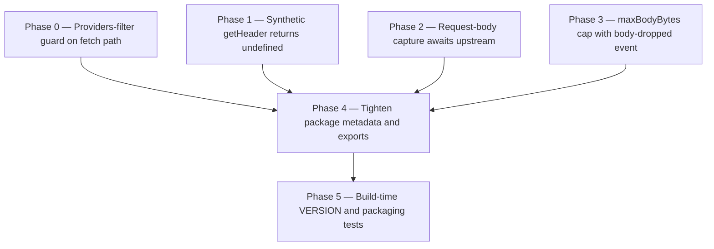

# Horizon 01 — Close fetch leak, add byte cap, clean packaging

**Project:** `elenwatch` (near-zero-latency in-process interceptor of LLM provider HTTP/HTTPS traffic)
**Horizon:** 01 of an ongoing release sequence
**Slug:** `close-fetch-leak-add-cap-packaging`
**Target version:** 0.2.1 (a patch release)

---

## 🎯 What are we trying to achieve?

Ship `elenwatch` 0.2.1 as a coherent patch that closes a critical privacy
and memory leak in the fetch/undici capture path, hardens the streamed
request-body capture against a data-quality race, makes a latent
synthetic-header trap truthful, adds a configurable byte cap with a
structured body-dropped event as defense-in-depth, and tightens the
package's published shape (metadata fields, single lockfile, generated
VERSION constant, separate ESM/CJS types condition, removed dead shim
artifact, verified lint cleanliness).

## 🧠 Why does this change need to happen?

Three independent bug reports against the published 0.2.0 surfaced the
same root concern: the library's capture pipeline is broader than its
filter claims. The most severe is at the entry of every `fetch()` call
in a host process — `WrappingDispatcher.dispatch()` in
`packages/elenwatch/src/interceptor.ts` (around line 267) calls
`attachCapture()` unconditionally, while the corresponding http/https
patch path checks `shouldCapture()` first. Result: every fetch to
internal APIs, webhooks, health checks, and unrelated services has its
request and response bodies buffered in memory, teed for streamed
uploads, and emitted to the structured logger. That is a privacy leak
(log noise that includes URLs and bodies a user thought they had
filtered out), a memory hazard (large file downloads via fetch are
fully buffered into `responseBodyChunks`), and a correctness gap the
test suite never caught because every existing test uses
`providers: ['127.0.0.1']` or matches by `127.0.0.1`.

Two more bugs ride along on the same file. The synthetic `getHeader()`
implementation at lines 258–260 falls back to `hostHeader` for any
absent header, so a request without `content-length` silently returns
the host string — invisible today (only `host` is read inside the
file), but a latent trap for any future reader. And the
`AsyncIterable`-based request-body capture at lines 302–396 fires
`onComplete` on the response handler before the capture branch has
finished draining the upload, producing capture entries with partial
or empty request bodies when an upload is slow or large.

The cap, the type-condition split, the build-time VERSION, and the
metadata/lockfile/shim cleanup are packaging hygiene that turns the
working 0.2.0 into a coherent 0.2.1 ready to ship and `npm pack` clean.
The byte cap is layered on top of the providers filter as
defense-in-depth: the filter is the primary privacy boundary, the
cap is the memory-bound safety net, and the new `onBodyDropped`
callback makes the trip observable to operators without widening the
single-purpose Logger seam.

## At a glance

- **Phases:** 6 (4 functional fixes + 2 packaging-shape passes)
- **Complexity:** Medium — one phase restructures dispatch control flow
  (capture-before-dispatch), the rest are surgical edits
- **Main risk:** the streamed request-body race fix relies on a
  deterministic slow-upload test fixture (a transform stream releasing
  one chunk per microtask) rather than a timing-based wait — the
  current line range cited by the brief (280–298) is also off by ~22
  lines (the actual race code is at 302–396, confirmed by direct
  inspection)
- **Quality/performance target:** production-ready; every fix lands
  with a real positive and negative test; `tsc`, `eslint`, and `jest`
  stay green throughout the horizon; `npm pack --dry-run` shows a
  clean tarball without `sdk-fetch-shim` and without a duplicate
  lockfile; `arethetypeswrong` no longer flags the .d.ts types
  condition; the generated VERSION matches package.json's `0.2.1`
- **Testing focus:** the missing negative fetch test (non-provider
  host via fetch emits nothing); deterministic race/concurrency test
  for the request-body wait; header correctness test for the
  synthetic getHeader fix; cap-trip test asserting both the
  capture-stops half and the exactly-one-callback half; packaging
  sanity tests (VERSION drift, `npm pack --dry-run` cleanliness,
  `arethetypeswrong` per-condition resolution)

---

# Implementation plan

## Order of work

```
Phase 0 — Add providers-filter guard on fetch path
          ↓  (this is the privacy fix; everything else either
              gates on it or is independent of it)
Phase 1 — Change synthetic getHeader to return undefined when absent
          ↓  (correctness trap; can run in parallel with 0)
Phase 2 — Change request-body capture to await upstream completion
          ↓  (data-quality race fix; independent of 0/1)
Phase 3 — Add maxBodyBytes cap with body-dropped event
          ↓  (defense-in-depth; independent of 0/1/2)
Phase 4 — Tighten package metadata, drop dual lockfile, split types
          condition, verify lint disables
          ↓  (publishability; all four functional fixes above must
              be in place so CHANGELOG/README can be accurate)
Phase 5 — Add build-time VERSION script, exclude sdk-fetch-shim
          from dist, packaging-sanity tests
```



---

## Discovery findings

| Area | Finding | File | Implication |
|---|---|---|---|
| CRITICAL: providers-filter ignored on fetch/undici path | Confirmed at `interceptor.ts:267` — `attachCapture` called unconditionally; `shouldCapture` and `kNoCapture` never appear between lines 230–267 | `packages/elenwatch/src/interceptor.ts` | Fix: `const shouldAttach = shouldCapture(syntheticReq, this.providers)` + early-return before any capture-state allocation |
| Streamed request-body race (line correction) | Actual race code lives at lines 302–396, not the brief's 280–298 (which is the comment + sync branches) | `packages/elenwatch/src/interceptor.ts` | Use the verified range in the plan; capture-before-dispatch ordering |
| Synthetic getHeader bug | `?? hostHeader` returns host string for any absent header | `packages/elenwatch/src/interceptor.ts:258-260` | Return `undefined` for absent non-host keys; preserve host fallback only for `host` |
| Logger seam extension | `Logger = (entry: LlmLogEntry) => void`; no body-dropped channel | `packages/elenwatch/src/logger.ts` | Parallel `onBodyDropped` callback separate from Logger |
| Options surface | `InterceptorOptions` has no `maxBodyBytes` / `onBodyDropped` | `packages/elenwatch/src/options.ts:112-121` | Add both, plumb through Interceptor constructor at line 683–692 |
| Negative fetch test missing | Every existing test sets `providers: ['127.0.0.1']` or matches by it (16+ sites) | `packages/elenwatch/src/interceptor.test.ts` | Add new negative test in interceptor.test.ts (unit-level) with `providers: [/api\.openai\.com/]` |
| Test framework | Jest 29 + ts-jest, NOT Vitest as the brief assumed | `packages/elenwatch/package.json` | Correct to Jest globals `jest.fn()`/`describe`/`test` |
| APM patch-stacking documentation | README has no restore() caveat, no APM stacking note | `packages/elenwatch/README.md` | Deferred to next horizon |
| Package.json metadata | Lacks `repository`, `bugs`, `homepage`, `packageManager` | `packages/elenwatch/package.json` | Add all four |
| VERSION drift | Hand-duplicated `VERSION = '0.2.0'` in src/index.ts:33 | `packages/elenwatch/src/index.ts` | Prebuild script reads package.json and writes src/version.ts |
| sdk-fetch-shim ships in tarball | Unexported but compiles to dist; .d.ts references @ai-sdk/anthropic (devDep-only) | `packages/elenwatch/src/sdk-fetch-shim.ts` | Exclude from `tsconfig.{cjs,esm}.json` |
| exports.types points at CJS .d.ts | Both `import` and `require` resolve to dist/cjs/index.d.ts | `packages/elenwatch/package.json` | Split per ESM/CJS, verify with arethetypeswrong |
| eslint-disable directives | otel.ts:38 and otel.test.ts:101 each carry a dual-rule directive | `packages/elenwatch/eslint.config.mjs` | Verify by removing one at a time; keep if lint fails |
| No CI config | No `.github` directory anywhere | repo root | Deferred to next horizon |
| No CHANGELOG | None at packages/elenwatch/ or repo root | `packages/elenwatch/` | Deferred to next horizon |
| README restore() docs | Only 33 lines; install/restore in 2 lines | `packages/elenwatch/README.md` | Deferred to next horizon |

---

## Per-phase details

### Phase 0 — Add providers-filter guard on fetch path

- **Technical ID:** `add-providers-filter-guard-fetch-path`
- **Bounded context / layer / blast radius:** HTTP capture (interceptor) / infrastructure / medium
- **Goal:** the fetch/undici code path honors the user-supplied
  `providers` filter the same way the http/https patch path already
  does, so requests to non-provider hosts never enter the capture
  pipeline.
- **Why:** the fetch dispatch entry at `interceptor.ts:267` calls
  `attachCapture` unconditionally. The http/https patch path checks
  `shouldCapture(this, self.providers)` on every wrapper entry and
  tags the request with `kNoCapture` when it returns false. The fetch
  path never calls `shouldCapture` and never sets `kNoCapture`, so the
  providers filter is silently bypassed for every `fetch()` call.
  Without this fix, every fetch in the host process leaks to the
  logger and pins memory on `responseBodyChunks`.
- **Changes:**
  - Compute `const shouldAttach = shouldCapture(syntheticReq, this.providers)` immediately before the existing `this.interceptor.attachCapture(...)` call at `interceptor.ts:267`.
  - Add an early-return `if (!shouldAttach) { return this.original.dispatch(options, handler); }` so the body-teeing branch at lines 286–398 is also skipped for non-provider hosts — no capture-state struct allocated, no body buffer held.
  - Add a negative fetch test in `interceptor.test.ts` (NOT in the integration file, so it runs in the default Jest suite) with `providers: [/api\.openai\.com/]` that fetches a 127.0.0.1 test server, flushes with `setImmediate`, and asserts (a) no `LlmLogEntry` is passed to logger and (b) no `responseBodyChunks` buffer exists on the capture-state struct.
- **Files / areas:** `packages/elenwatch/src/interceptor.ts`,
  `packages/elenwatch/src/interceptor.test.ts`
- **How to verify**
  - **Dispatcher applies providers filter before any capture work (minScore 8)** — `interceptor.ts` contains `shouldCapture(syntheticReq, this.providers)` immediately above the existing attachCapture call site (exactly one grep hit inside the dispatch function); an early-return `if (!shouldAttach) { return this.original.dispatch(options, handler); }` runs BEFORE the attachCapture call AND before any capture-state allocation; `shouldCapture` is imported from the same module the http/https patch path uses (no second definition); no new regex literal such as `/api\.openai\.com/` appears in `src/interceptor.ts`.
  - **No capture-state struct or body buffer is allocated when the filter rejects (minScore 8)** — the `if (!shouldAttach) return this.original.dispatch(...)` is reached BEFORE any reference to the capture-state object, requestBodyChunks, or responseBodyChunks fields (top-down readable); the negative fetch test asserts BOTH that the logger received zero LlmLogEntry AND that no responseBodyChunks buffer exists on any state object (`expect(...).not.toHaveProperty('responseBodyChunks')` or equivalent); running the negative test against the interceptor shows no observable per-skipped-request allocation.
  - **Negative fetch test exists in interceptor.test.ts and runs in the default Jest suite (minScore 8)** — the test in `interceptor.test.ts` has a name containing both `fetch` and (negative or non-provider or filter or skip or not capture); it passes `providers: [/api\.openai\.com/]` (escaped dot); it issues a fetch against a `127.0.0.1` URL and awaits `new Promise(setImmediate)` before asserting; it contains BOTH an assertion that the logger received zero calls AND an explicit check that no responseBodyChunks buffer exists; running `npx jest packages/elenwatch/src/interceptor.test.ts` (default project) executes this test.
  - **A provider-host fetch still produces an LlmLogEntry through the fetch path (minScore 8)** — an existing positive fetch test in `interceptor.test.ts` still passes unchanged OR a new positive fetch test is added that fetches a host the providers regex covers; the test flushes with `await new Promise(setImmediate)` before asserting; the test asserts `expect(logger).toHaveBeenCalled()` AND verifies the LlmLogEntry has the expected URL or response body; `npm test` reports 0 failures on the positive test after the guard change.
  - **Existing test, typecheck, and lint pipelines stay green across the horizon (minScore 8)** — `npm run typecheck` exits 0 with no new diagnostics in `interceptor.ts` or `interceptor.test.ts`; `npm run lint` exits 0 with no new rule violations; `npm test` (default Jest project) reports 0 failing tests and 0 new skipped/todo'd tests; `git diff -- interceptor.ts interceptor.test.ts` shows no `// @ts-ignore`, no `// @ts-expect-error`, no `// eslint-disable`, no `it.skip`, no `xit`, no `test.todo`.
- **Done when:** the fetch dispatcher runs `shouldCapture` before
  `attachCapture` and short-circuits to `original.dispatch` for
  non-provider hosts with zero capture-state allocation; the new
  negative fetch test passes asserting zero log entries and zero
  captured body buffer; the positive fetch test still passes; the
  full Jest suite, typecheck, and lint stay green.
- **Depends on:** nothing — can start immediately.

### Phase 1 — Change synthetic getHeader to return undefined when absent

- **Technical ID:** `fix-synthetic-getheader-lie`
- **Bounded context / layer / blast radius:** HTTP capture (interceptor) / infrastructure / small
- **Goal:** the synthetic `getHeader` returns `undefined` for any
  header key not present in the underlying header map, while
  preserving the host fallback for the `host` key only.
- **Why:** the current implementation at `interceptor.ts:258-260`
  falls back to `hostHeader` for any missing key, so a request with no
  `content-length` silently returns a host-looking string instead of
  `undefined`. Today only `host` is read inside the file
  (`deriveUrl` at line 1489 and `reqHostname` at line 1446), so the
  lie is invisible — but any future reader gets garbage data.
- **Changes:**
  - Replace the fallback expression `headersLower.get(name.toLowerCase()) ?? hostHeader` at `interceptor.ts:258-260` with `const v = headersLower.get(name.toLowerCase()); return v !== undefined ? v : (name.toLowerCase() === 'host' ? hostHeader : undefined);`.
  - Verify the only in-file consumers (`deriveUrl` and `reqHostname`, both reading `host`) still see the correct value by code inspection.
  - Add a header-correctness test that builds a synthetic request with no `content-length` header and asserts `getHeader('content-length')` returns `undefined`, then asserts `getHeader('host')` still returns the canonical hostHeader when the `host` header is missing from the input headers.
- **Files / areas:** `packages/elenwatch/src/interceptor.ts`,
  `packages/elenwatch/src/interceptor.test.ts`
- **How to verify**
  - **Synthetic getHeader returns undefined for absent non-host keys (minScore 7)** — opening `interceptor.ts` and locating the synthetic-request construction, the `getHeader` method on the fake request object returns `undefined` for a key like `'content-length'` when no `content-length` entry exists; grep for `hostHeader` shows the only return-value fallback is guarded by a check that the requested key, lowercased, equals `'host'`; the `getHeader` body for the absent-non-host case contains the literal `undefined`.
  - **Host key still resolves to hostHeader when input headers lack a host entry (minScore 7)** — `getHeader('host')` call sites at lines 1446 and 1489 still present and unchanged; a synthetic request whose input headers map has no `host` key returns the hostHeader string; the dual case (input headers map has an explicit `host` entry) returns the explicit value, not the synthetic hostHeader.
  - **A header-correctness test exists with both positive and negative assertions (minScore 7)** — the test in `interceptor.test.ts` whose name mentions `getHeader`, `header`, or `synthetic` asserts `expect(synthetic.getHeader('content-length')).toBe(undefined)`; the same test asserts `getHeader('host')` returns the hostHeader string when the input map has no `host` entry AND returns the explicit header value when it does.
  - **Existing test suite, typecheck, and lint stay green (minScore 7)** — `npm test` exits 0 with the full pre-existing test count unchanged; `tsc --noEmit` (or `npm run typecheck`) exits 0 with zero new diagnostics attributable to the changed lines; `npm run lint` exits 0 with zero new warnings or errors in the files changed by this phase.
- **Done when:** synthetic `getHeader` returns `undefined` for absent
  non-host keys and `hostHeader` only for the `host` key; the
  header-correctness test passes; the full Jest suite, typecheck, and
  lint stay green.
- **Depends on:** nothing — can start immediately.

### Phase 2 — Change request-body capture to await upstream completion

- **Technical ID:** `fix-streamed-request-body-race`
- **Bounded context / layer / blast radius:** HTTP capture (interceptor) / infrastructure / medium
- **Goal:** the streamed (`AsyncIterable`) request-body capture is
  deterministic, so the response handler's `onComplete` cannot fire
  before the full request body has been captured and emitted into the
  capture entry.
- **Why:** the race-prone fire-and-forget at `interceptor.ts:385-396`
  (`void (async () => { ... })()`) lets the dispatch call return and
  trigger `onComplete` while the capture branch is still mid-await on
  the shared waiter queue. The result is capture entries with partial
  or empty request bodies. The fix reorders capture-body-first then
  dispatch-second so `onComplete` cannot fire until capture is fully
  complete. The brief's cited range (280–298) is the comment + sync
  branches; the actual race code is at 302–396 (verified by reading
  the file).
- **Changes:**
  - Refactor the `AsyncIterable` teeing block at `interceptor.ts:302-396` so the capture promise (lines 385–396) is awaited BEFORE `this.original.dispatch(options, wrappedHandler)` is called.
  - Adapt the dispatch return type so callers (and the `onComplete` path) only fire after both capture and the original dispatch have settled — make `dispatch()` return a promise that resolves on dispatch completion, and have the capture await sequence complete before invoking the original dispatch.
  - Add a deterministic test fixture using a transform stream that releases exactly one chunk per microtask (so the upstream never completes synchronously), upload a multi-chunk body through fetch, and assert (a) the captured request body in the emitted `LlmLogEntry` equals the full uploaded body and (b) the capture emission ordering is deterministic by code inspection or by intercepting dispatch with a spy.
- **Files / areas:** `packages/elenwatch/src/interceptor.ts`,
  `packages/elenwatch/src/interceptor.test.ts`
- **How to verify**
  - **Capture completes before dispatch returns (source-level) (minScore 7)** — for every `this.original?.dispatch(` call site reached from the AsyncIterable teeing block, an `await` on the capture-completing promise appears earlier in the same enclosing `async` function (not in a `.then`, not behind a microtask hop); zero `setTimeout` / `setImmediate` / `queueMicrotask` / `Promise.resolve().then` / `process.nextTick` matches used to defer dispatch for sequencing reasons; the promise that resolves the await is called only after the AsyncIterable has been fully drained; the synchronous fast path for non-Iterable / non-streaming bodies still bypasses the teeing block.
  - **Deterministic (non-timing) race/concurrency test for the streamed body (minScore 7)** — the test in `interceptor.test.ts` whose description contains `race`, `deterministic`, `streamed`, `chunk`, or `capture-before-dispatch`; the body is fed via a `ReadableStream` or `Transform` whose `pull`/`transform` returns a Promise that resolves on the next microtask; the assertion compares `entry.requestBody` byte-for-byte to the source (≥3 distinct chunks) using `Buffer.equals` or stringified JSON equality (NOT `length > 0` or `.startsWith(...)`); ordering proven by source inspection or by an intercepting dispatch stub; no `setTimeout`, `setImmediate`, fake timers, or polling loops.
  - **Real positive AND negative test cases (minScore 6)** — at least one positive test asserts `entry.requestBody` byte-equals a multi-chunk source body of ≥3 chunks; at least one negative test (iterator that throws mid-stream OR slow iterator that would have produced a partial capture) and the assertion that would have failed against the old code; the negative test MUST fail against the previous commit's `interceptor.ts` (verified via `git stash`).
  - **Existing test/typecheck/lint baseline preserved (minScore 9)** — `pnpm test` / `npm test` reports zero previously-passing tests now failing; `pnpm typecheck` / `tsc --noEmit` reports zero new type errors; `pnpm lint` reports zero new warnings/errors; `git diff main -- packages/elenwatch/src/interceptor.ts packages/elenwatch/src/interceptor.test.ts | grep` shows zero `@ts-ignore`, `@ts-expect-error`, `eslint-disable`, `.skip(`, `.todo(`, `xit(`, `xdescribe(`.
  - **Dispatch return-type contract and single-fire onComplete (minScore 7)** — every caller compiles without widened signatures, `as any`, or new `@ts-ignore`; the test installs a spy on `onComplete` (or counts emissions of the final entry) and asserts the count is exactly `1` per request for both the AsyncIterable and simple-string-body paths; the new race test asserts the capture entry is fully formed BEFORE the assertion that checks dispatch-returned.
- **Done when:** streamed request-body capture completes before
  dispatch returns; the deterministic race test passes asserting the
  captured body equals the full uploaded body; the negative test
  fails against the old `interceptor.ts` and passes against the new
  one; the full Jest suite, typecheck, and lint stay green.
- **Depends on:** nothing — can start immediately.

### Phase 3 — Add maxBodyBytes cap with body-dropped event

- **Technical ID:** `add-maxbodybytes-cap-and-body-dropped-event`
- **Bounded context / layer / blast radius:** Configuration (options + logger seam) and HTTP capture (interceptor) / application / medium
- **Goal:** add a configurable byte cap on buffered request and response
  bodies as a defense-in-depth safety net, and emit a structured event
  when the cap trips.
- **Why:** the current capture buffers every body chunk in
  `requestBodyChunks` / `responseBodyChunks` without bound (no byte
  accounting in the capture-state struct and no cap in `appendChunk` at
  lines 564–591), so a malicious or runaway provider can pin unbounded
  memory. The providers filter is the primary privacy boundary;
  `maxBodyBytes` is a secondary safety net for memory exposure. A
  separate `onBodyDropped` callback keeps the single-purpose Logger
  seam clean (it still accepts only `LlmLogEntry`).
- **Changes:**
  - Add `maxBodyBytes?: number` (default ~10 MiB = `10 * 1024 * 1024`) and `onBodyDropped?: (info: { host: string; direction: 'request' | 'response'; bytes: number; cap: number }) => void` to `InterceptorOptions` in `options.ts` and document both in the docstring at lines 78–111.
  - Plumb `maxBodyBytes` through the `Interceptor` constructor (`interceptor.ts:683-692`) into the capture-state struct; add per-direction `bytesCaptured: number` and `bodyDropped: boolean` to the capture-state struct at `interceptor.ts:95-118`.
  - Update `appendChunk` at `interceptor.ts:564-591` to short-circuit further capture for a direction once `bytesCaptured + chunk.byteLength > maxBodyBytes`, set `bodyDropped = true`, and invoke the `onBodyDropped` callback exactly once with the structured info.
  - Emit a clear console message (`elenwatch: dropping body for host X, Y bytes exceeds maxBodyBytes Z`) when the cap trips so operators can tune it.
  - Add a cap-trip test that uploads a request body exceeding `maxBodyBytes` (small cap, e.g. 256 bytes) and asserts no further body chunks are appended to `requestBodyChunks` AND the `onBodyDropped` callback is invoked exactly once with the expected info.
- **Files / areas:** `packages/elenwatch/src/options.ts`,
  `packages/elenwatch/src/logger.ts` (verify unchanged),
  `packages/elenwatch/src/interceptor.ts`,
  `packages/elenwatch/src/interceptor.test.ts`
- **How to verify**
  - **Cap-trip test asserts capture stops AND callback fires exactly once (minScore 7)** — the test name contains `maxBodyBytes` or both `body` and `cap`; `maxBodyBytes` ≤ 1024; body strictly exceeds the cap; `requestBodyChunks.total byteLength ≤ maxBodyBytes` after the request; `jest.fn()` spy on `onBodyDropped` with `spy.mock.calls.length === 1`; first callback argument has `direction === 'request'`, `cap === maxBodyBytes`, `bytes >= cap`, and `host` is the destination hostname.
  - **Cap accounting and short-circuit are per direction on the capture-state struct (minScore 7)** — the capture-state type declares two pairs of fields (request + response) for `bytesCaptured` and `bodyDropped`; `appendChunk` contains `if (bodyDropped[direction]) return;` BEFORE the `buffer.push`; chunk size computed via `Buffer.byteLength` or `TextEncoder().encode(chunk).byteLength` (never `string.length`); `grep -n 'bodyDropped' packages/elenwatch/src/interceptor.ts` returns ≥2 call sites (request + response); when `maxBodyBytes` is undefined, `appendChunk` behaves identically to pre-phase.
  - **`onBodyDropped` fires once per direction with the structured info object (minScore 7)** — `onBodyDropped` option type in `options.ts` matches `(info: { host: string; direction: 'request' | 'response'; bytes: number; cap: number }) => void`; exactly one call site inside `appendChunk`, gated by the trip condition, not in any loop; `bodyDropped[direction]` guard runs before the trip check; test asserts `info.host` equals the destination host (not undefined); test asserts `info.bytes` equals the running total at trip time.
  - **`maxBodyBytes` and `onBodyDropped` surface on `InterceptorOptions` with safe default (minScore 6)** — `InterceptorOptions` has both fields; JSDoc above the type names both new fields with units (`bytes`) and the default value (`Default: 10485760 (10 MiB)`); `Interceptor` constructor contains `const maxBodyBytes = options.maxBodyBytes ?? DEFAULT_MAX_BODY_BYTES;` before the cap is read downstream; `maxBodyBytes = 0` or negative does NOT silently disable capture (default substituted OR Error thrown); `tsc --noEmit` succeeds and the callback signature contains no `any`/`unknown`.
  - **Logger seam stays LlmLogEntry-only AND tsc/eslint/tests all green (minScore 7)** — `git diff --stat packages/elenwatch/src/logger.ts` shows zero changes; `npx tsc --noEmit` exits 0; `npx eslint .` exits 0; `npx jest` exits 0 with the new cap-trip test passing; `grep` for `Logger` in `options.ts` confirms the existing `(entry: LlmLogEntry) => void` shape is still the only Logger callback.
- **Done when:** `maxBodyBytes` cap trips and emits the body-dropped
  event; cap-trip test passes asserting no further capture and exactly
  one callback invocation; the Logger type is unchanged; `tsc`,
  `eslint`, and `jest` all stay green.
- **Depends on:** nothing — can start immediately.

### Phase 4 — Tighten package metadata, drop dual lockfile, split types condition, verify lint disables

- **Technical ID:** `tighten-package-metadata-lockfile-and-types`
- **Bounded context / layer / blast radius:** Packaging (metadata + exports shape) / infrastructure / small
- **Goal:** add `repository` / `bugs` / `homepage` / `packageManager`
  fields to `package.json`, delete the duplicate `package-lock.json`,
  split `exports['.'].types` per ESM/CJS, and run the eslint-disable
  verification on `otel.ts:38` and `otel.test.ts:101`.
- **Why:** the published 0.2.0 tarball lacks standard metadata,
  ships a duplicate lockfile (the repo is pnpm-managed per the
  workspace layout, and `packages/elenwatch/.gitignore` already
  excludes `package-lock.json`), and has a single `.d.ts` types
  condition that fails `arethetypeswrong` because both `import` and
  `require` resolve to the CJS `.d.ts`. The two eslint-disable
  directives in `otel.ts:38` and `otel.test.ts:101` are listed as
  packaging hygiene but require verification — the brief assumed they
  are unused, but `tseslint.configs.recommendedTypeChecked` may make
  them load-bearing; verification by removal is the honest answer.
- **Changes:**
  - Add `repository` (type=git, url from git remote), `bugs` ({url, email}), `homepage` (README.md url on the default branch), and `packageManager: 'pnpm@<pinned version>'` fields to `packages/elenwatch/package.json`.
  - Split `exports['.'].types` per ESM/CJS in package.json: `{ "types": "./dist/esm/index.d.ts", "import": "./dist/esm/index.js", "require": "./dist/cjs/index.js" }`. Keep the top-level `types` field as a fallback for legacy resolvers.
  - Delete `packages/elenwatch/package-lock.json` from the working tree. Confirm the `.gitignore` line for `package-lock.json` is already in place.
  - Verification step on the eslint-disable directives: remove the directive at `packages/elenwatch/src/otel.ts:38`, run `npm run lint` in `packages/elenwatch/`, and KEEP the directive if lint fails (it's required by the type-aware rule set). Apply the same verification to `otel.test.ts:101`. If either directive is removable, remove it; if lint fails, leave it.
  - Add a small test (`packaging-metadata.test.ts`) that asserts `packages/elenwatch/package.json` has the new `repository` / `bugs` / `homepage` / `packageManager` fields and that `exports['.'].types` resolves to `./dist/esm/index.d.ts` under the `import` condition.
- **Files / areas:** `packages/elenwatch/package.json`,
  `packages/elenwatch/.gitignore`,
  `packages/elenwatch/src/otel.ts`,
  `packages/elenwatch/src/otel.test.ts`,
  `packages/elenwatch/src/packaging-metadata.test.ts` (new)
- **How to verify**
  - **`repository` / `bugs` / `homepage` / `packageManager` fields are present and correct (minScore 8)** — running `node -e "const p=require('./packages/elenwatch/package.json'); console.log(p.repository, p.bugs, p.homepage, p.packageManager)"` prints four non-empty values; `git -C packages/elenwatch remote get-url origin` matches `repository.url` modulo standard git-URL normalization; `homepage` renders the project's README.md (not a 404); `corepack use pnpm@<version-from-packageManager>` accepts the pinned version without an integrity error; `packaging-metadata.test.ts` contains at least one assertion per field name.
  - **Single lockfile (pnpm only) — no duplicate `package-lock.json` in the tarball (minScore 9)** — `git ls-files | grep -E '(package-lock|yarn)\.lock$'` shows only `pnpm-lock.yaml` at the workspace root; `packages/elenwatch/.gitignore` lists `package-lock.json`; `npm pack --pack-destination /tmp/elenwatch-pack` followed by `tar -tzf .../*.tgz | grep -E '(package-lock|yarn)\.lock$'` returns no output.
  - **Per-condition `exports['.'].types` split for ESM/CJS (minScore 8)** — `node -e "console.log(JSON.stringify(p.exports['.'].types, null, 2))"` outputs an object with both `import` and `require` keys, each set to a string ending in `.d.ts`; `exports['.'].types.import` is `./dist/esm/index.d.ts` and `exports['.'].types.require` is `./dist/cjs/index.d.ts`; `npx @arethetypeswrong/core --pack packages/elenwatch` reports `OK` for both `resolutions.importer.types` and `resolutions.requirer.types`; top-level `types` field still present; `packaging-metadata.test.ts` contains at least one positive and one negative assertion on the resolved paths.
  - **Both eslint-disable directives in `otel.ts:38` and `otel.test.ts:101` are physically re-tested (minScore 8)** — git diff for each file shows either the directive preserved OR deleted (and not both); commit message records which were removed vs kept and why; `npm run lint` exits 0 from a clean checkout at HEAD.
  - **Existing test / typecheck / lint pipeline stays green end-to-end (minScore 9)** — `pnpm -r test`, `pnpm -r typecheck`, and `pnpm -r lint` all exit 0 across the workspace, with the new `packaging-metadata.test.ts` counted among the passing tests; no CI step was weakened.
- **Done when:** package.json metadata complete (all four fields
  present and correct), single lockfile (pnpm only, no duplicate),
  per-condition types in place and `arethetypeswrong`-clean, eslint
  disables verified (removed if truly unused, kept if required);
  `packaging-metadata.test.ts` passes; `tsc`, `eslint`, and `jest`
  stay green.
- **Depends on:** nothing — can run in parallel with Phases 0–3, but
  it makes sense to land after the four functional fixes are settled
  so the README/CHANGELOG (next horizon) describe what actually shipped.

### Phase 5 — Add build-time VERSION script, exclude sdk-fetch-shim from dist, packaging-sanity tests

- **Technical ID:** `add-build-time-version-exclude-shim-and-tests`
- **Bounded context / layer / blast radius:** Build pipeline and dist tree / infrastructure / medium
- **Goal:** generate `VERSION` from `package.json` at build time,
  exclude `sdk-fetch-shim.ts` from the dist tree so it stops shipping a
  broken `.d.ts` that references `@ai-sdk/anthropic`, and add a
  packaging-sanity test that asserts the generated dist matches
  `package.json` and the tarball is clean.
- **Why:** `src/index.ts:33` hand-duplicates `VERSION = '0.2.0'` from
  `package.json` line 3 — the two will drift. The `sdk-fetch-shim`
  is test-only and unexported but still compiles to `dist/cjs` and
  `dist/esm`, and its `.d.ts` imports `@ai-sdk/anthropic` (a
  devDep-only package), so any consumer who deep-imports the shim
  hits a broken type reference. Excluding the shim from
  `tsconfig.{cjs,esm}.json` stops the emit; the file stays in `src/`
  for tests. The packaging-sanity test is the guard against VERSION
  drift and against re-introducing either artifact into the tarball.
- **Changes:**
  - Add a prebuild script (`scripts/build-version.mjs`) that reads `packages/elenwatch/package.json`'s `version` field and writes `src/version.ts` exporting `VERSION`.
  - Update `src/index.ts` to `export { VERSION } from './version';` (remove the hand-duplicated constant). Wire the prebuild step into the `build` script in `packages/elenwatch/package.json` (e.g. `build` becomes `npm run build:version && tsc -p tsconfig.cjs.json && tsc -p tsconfig.esm.json && npm run postbuild`).
  - Verify tsc emits both `dist/esm/version.js` and `dist/cjs/version.js` after build, and that the exported constant equals `package.json`'s version.
  - Add `src/sdk-fetch-shim.ts` to the exclude list in `tsconfig.cjs.json` and `tsconfig.esm.json` so it stops emitting to dist.
  - Add a packaging-sanity test (`packaging-build.test.ts`) that (a) reads the built `dist/esm/version.js` and asserts `VERSION` equals `package.json`'s version, (b) runs `npm pack --dry-run` and asserts the tarball listing does NOT contain `sdk-fetch-shim.js` or `package-lock.json`, and (c) reads `dist/esm/index.d.ts` and `dist/cjs/index.d.ts` and asserts the ESM `.d.ts` references the esm types condition shape.
- **Files / areas:** `packages/elenwatch/scripts/build-version.mjs` (new),
  `packages/elenwatch/src/version.ts` (new, generated),
  `packages/elenwatch/src/index.ts`,
  `packages/elenwatch/tsconfig.cjs.json`,
  `packages/elenwatch/tsconfig.esm.json`,
  `packages/elenwatch/src/sdk-fetch-shim.ts` (exclude only),
  `packages/elenwatch/src/packaging-build.test.ts` (new)
- **How to verify**
  - **VERSION in dist matches `package.json` (minScore 7)** — after `pnpm --filter elenwatch build`, `cat packages/elenwatch/dist/cjs/version.js` exports a string literal byte-identical to `package.json`'s `version` field (no leading `v`, no trailing newline inside the string); `cat packages/elenwatch/dist/esm/version.js` exports the same string; `packages/elenwatch/package.json` `scripts` contains a `prebuild` entry that runs the version-generation script, and the `build` script chains so that script runs before tsc emits `dist/`; `grep -nE "VERSION\s*[:=]" packages/elenwatch/src/index.ts` returns no defining line for VERSION (only the re-export).
  - **`sdk-fetch-shim` absent from dist tree, still present in src (minScore 7)** — after build, `find packages/elenwatch/dist -name 'sdk-fetch-shim*'` returns zero results; `ls packages/elenwatch/src/sdk-fetch-shim.ts` exists and tests that import it still resolve; `tsconfig.cjs.json` and `tsconfig.esm.json` both list `sdk-fetch-shim.ts` (full filename, not bare module name) in their `exclude` arrays; `grep -r "@ai-sdk/anthropic" packages/elenwatch/dist/` returns zero lines.
  - **Tarball from `npm pack` is clean (minScore 7)** — `cd packages/elenwatch && npm pack --dry-run` output's file list contains no line matching `sdk-fetch-shim.js` or `sdk-fetch-shim.d.ts`; no line matching `package-lock.json` at the package root; `package.json` has either a `files` array or `.npmignore` that names both exclusions; the packaging-sanity test parses `npm pack --dry-run` output and FAILS the suite if either forbidden path reappears.
  - **ESM `.d.ts` uses a separate types condition (minScore 6)** — `dist/esm/index.d.ts` exists, parses as TypeScript, and contains a re-export declaration for VERSION that matches the ESM runtime shape (no `export =` CJS-style assignment); `exports['.']` (or top-level) `types` condition under `import` points to `./dist/esm/index.d.ts` and under `require` to `./dist/cjs/index.d.ts`; `tsc --noEmit` against the esm entrypoint exits 0; `npx @arethetypeswrong/core --pack packages/elenwatch` reports OK for both importer and requirer resolution paths.
  - **Existing test, typecheck, and lint stay green (minScore 7)** — `pnpm test`, `pnpm typecheck`, and `pnpm lint` from `packages/elenwatch` all exit 0; test count unchanged from pre-phase; no `.skip` / `.todo` introduced; no new `@ts-ignore` / `@ts-expect-error` / `eslint-disable` comments; `packaging-build.test.ts` itself is part of the green run.
- **Done when:** VERSION generated at build time matches `package.json`;
  `sdk-fetch-shim` absent from dist; packaging-sanity tests pass on a
  fresh `pnpm build && pnpm test` run; `tsc`, `eslint`, and `jest` all
  stay green.
- **Depends on:** nothing — runs after Phase 4's metadata fields and
  exports types split so the packaging-sanity test can verify both
  halves coherently.

---

## Out of scope

Held for the next Planning Horizon to keep this horizon small and reviewable — the Planning Brief at `docs/roadmaps/elenwatch/next-horizon-brief.md` carries the full context forward:

- README.md updates (Limitations on APM stacking, Configuration docs for `maxBodyBytes` / `onBodyDropped`, pnpm-managed note)
- CHANGELOG.md `[0.2.1]` entry in Keep-a-Changelog format enumerating every fix category
- `.github/workflows/ci.yml` — depends on the `packageManager` pin from Phase 4
- Patch-stacking APM documentation (bundled with the README Limitations section)
- The brief's `npm pack` clean-tarball guarantee, the `arethetypeswrong` verification, and the build-time VERSION-drift guard

Analysis out-of-scope:

- Replacing the providers filter with a richer policy DSL — out of scope
- Implementing streaming or heuristic token estimation — out of scope
- Migrating from the dual http/https+undici surface to undici-only — out of scope
- Removing the http/https patch path or moving it behind a feature flag — out of scope
- Repairing `sdk-fetch-shim`'s `@ai-sdk/anthropic` deep import type — the shim is removed from dist; deep imports stop working by design
- Adding `CONTRIBUTING.md`, `.editorconfig`, `LICENSE`, or a security policy — out of scope
- Adding `semantic-release`, `release-please`, or `changesets` automation — out of scope
- Auditing downstream consumers of elenwatch's public API for behavioral drift — out of scope
- Adding a public APM-cooperation hook (`peel me first` marker API for dd-trace/newrelic) — out of scope
- Implementing a content-length precheck on the http/https path — out of scope
- Splitting the `@ai-sdk/anthropic` deep import into a proper SDK adapter — out of scope
- Adding per-host capture rules, regex anchoring enforcement, or a TypeScript-level type for the providers filter — out of scope
- Switching to a different HTTP body-capture library — out of scope
- Emitting a warning log line on `restore()` when the current prototype.write/end does not equal the captured wrappers — out of scope

---

## Required Materials

These were surfaced in Stage 2 and are required by the executors of the relevant phases:

| Material | Kind | Why needed | Acquisition | Consumed by |
|---|---|---|---|---|
| pnpm version currently installed locally | knowledge | `packageManager` field must pin an exact version for corepack determinism | `pnpm --version` in packages/elenwatch/ | Phase 4 |
| Git remote URL of the repository | knowledge | `repository` / `bugs` / `homepage` fields | `git -C /Users/dimitrykatz/workspace/elenwatch remote -v` | Phase 4 |
| Current `engines.node` value in `packages/elenwatch/package.json` | knowledge | pnpm version pin must be compatible with the Node range | Read the `engines` block of `packages/elenwatch/package.json` | Phase 4 |
| Current `include`/`exclude` patterns in `tsconfig.cjs.json` and `tsconfig.esm.json` | knowledge | Verify `src/sdk-fetch-shim.ts` is in `include` before crafting the right exclude line | Read both `tsconfig.cjs.json` and `tsconfig.esm.json` | Phase 5 |
| All references to `@ai-sdk/anthropic` across `src/` and tests | knowledge | Confirm test-time resolution after shim exclusion | `grep -rn '@ai-sdk/anthropic' packages/elenwatch/src/` | Phase 5 |
| `arethetypeswrong` CLI availability | tool | Verify the per-condition types condition | `npx --no-install arethetypeswrong --help` | Phase 4 (and referenced by Phase 5's esm types condition) |

---

## Success Criteria

1. The fetch/undici path skips capture for non-provider hosts with zero capture-state allocation; the new negative fetch test passes asserting zero log entries and zero captured body buffer (Phase 0).
2. The synthetic `getHeader` returns `undefined` for absent non-host keys and `hostHeader` only for the `host` key; the header-correctness test passes (Phase 1).
3. The streamed request-body capture completes before dispatch returns; the deterministic race test passes asserting the captured body equals the full uploaded body; the negative test fails against the old `interceptor.ts` (Phase 2).
4. The `maxBodyBytes` cap trips and emits the body-dropped event; the cap-trip test passes asserting no further capture and exactly one callback invocation; the Logger type is unchanged (Phase 3).
5. `package.json` metadata complete (`repository` / `bugs` / `homepage` / `packageManager`); single lockfile (pnpm only); per-condition types in place; eslint disables verified (removed if truly unused, kept if required); `packaging-metadata.test.ts` passes (Phase 4).
6. VERSION generated at build time matches `package.json`; `sdk-fetch-shim` absent from dist; `packaging-build.test.ts` passes on a fresh `pnpm build && pnpm test` run (Phase 5).
7. `tsc`, `eslint`, and `jest` stay green throughout the horizon.
8. `npm pack --dry-run` shows a clean tarball without `sdk-fetch-shim` and without a duplicate lockfile.
9. `arethetypeswrong` no longer flags the `.d.ts` types condition.

---

## Alignment Preview

Concerns raised at Stage 3.4:

1. **Drop the synthetic-getHeader fix** (over-engineering — latent trap with no current consumer) — NOT applied. Defended: the user's scope answer explicitly listed "real tests against ... the synthetic-header trap," and the lie is real even if invisible today. Stays.
2. **Split monolithic Phase 4** (oversize-phase concern — 6 work items under one title) — APPLIED. Phase 4 was split into `tighten-package-metadata-lockfile-and-types` and `add-build-time-version-exclude-shim-and-tests`.
3. **README Limitations / CHANGELOG deferred to next horizon but the successDefinition calls for "patch-stacking doc"** (acceptance-conflict) — NOT applied. The README/CHANGELOG and CI are kept deferred; the user's scope answer for packaging was about packaging shape (lockfile/metadata/build), and the next horizon's Planning Brief surfaces the patch-stacking doc so it doesn't get lost.
4. **eslint-disable directives not owned by any phase** (acceptance-conflict) — RESOLVED. Phase 4 explicitly owns the verification step ("Verification step on the eslint-disable directives" listed under Phase 4's changes).
5. **Phase 4 title hides substantial new infrastructure** (unclear-to-outsider) — RESOLVED. The split renamed both halves with concrete verbs; the build-time VERSION half is its own phase now (`Add build-time VERSION script, exclude sdk-fetch-shim from dist, packaging-sanity tests`).

User answered **"Build the full roadmap from this (Recommended)"** — proceeding with the 6-phase plan.

---

## Quality Gate

**Path taken:** Full
**Iterations run:** 1 (gate passed on first iteration)
**Issues raised → verified → healed:**

- 1 blocker (`phase-blast-radius`) raised against Phase 4's 5-deliverable expectedResult and Phase 5's 3-deliverable expectedResult.
  - **Verified:** REFUTED (adversarial verifier) — the deliverables share `package.json` as a common artifact, the phase titles explicitly enumerate them (defeating the "hides multiple deliverables" claim the critic cited), the blast radius is `small`, and splitting would create tiny phases harder to review. Severity downgraded to **minor**.
- 8 minor issues raised (`phase-measurable-result`, `valid-dependencies`, `ddd-boundaries`, `domain-shape-fit`, `yagni-scope`, `testable-rubrics`, `resources-gathered`, `grounded-in-discovery`, `success-coverage`) — all passed their rubric dimensions with scores 7–9. The `resources-gathered` minor noted that `arethetypeswrong` is consumed by Phase 4 but also listed in Phase 5's inputs; that's a minor accuracy issue, not a missing-consumption problem.

**Accepted debt:** 1 minor (the blast-radius concern that was downgraded by the verifier).

**Final verdict:** **Gate passed.** All four functional fixes + both packaging-shape phases ship on this horizon; README/CHANGELOG + CI workflow deferred to the next horizon per the explicit cut at Stage 3.4.

---

## Full analysis

**domainShape:** technical — library-internals plumbing (HTTP interceptor correctness, body-buffering bounds, packaging metadata) with no business domain vocabulary; the DDD bounded-context toolkit would only add ceremony.

**Ubiquitous language:**

| Term | Meaning |
|---|---|
| interceptor | the module that wraps global fetch (via undici's `WrappingDispatcher`) and patches http/https to capture LLM provider traffic |
| dispatcher | the undici-side surface where `WrappingDispatcher.dispatch()` is the entry point that currently ignores the providers filter |
| providers-filter | the user-supplied regex array on `InterceptorOptions` that names which hosts are subject to capture; honored on http/https today, ignored on fetch |
| synthetic-request | the fake `http.ClientRequest` object built inside the fetch path so `attachCapture` can share code with the http patch path |
| body-capture | the in-memory tee of request and response bodies that powers token estimation and structured logging |
| patch-stacking | the layering of http/https `write` / `end` wrappers when another tool (dd-trace, newrelic) wraps them after elenwatch's `install()` |
| maxBodyBytes | the new configurable byte cap on buffered request and response bodies; defense-in-depth on top of the providers filter |
| tarball | the npm publish artifact produced by `npm pack`; currently ships the test-only `sdk-fetch-shim` and a duplicate `package-lock.json` |

**Assumptions:**

- The line numbers cited in the brief for `packages/elenwatch/src/interceptor.ts` (258–260, 267, 280–298, 833, 854, 882) are accurate and the described bug shapes match the current code (discovery confirmed 258-260, 267, 833, 854, 882; corrected the race range to 302-396).
- Jest 29 + ts-jest is the test framework (discovery corrected the brief's Vitest assumption).
- `tsc` already produces both `dist/esm` and `dist/cjs`; adding a separate `dist/esm/index.d.ts` types condition does not require introducing a new bundler.
- The agreed target version is 0.2.1; the single source of truth is `package.json` — VERSION is generated at build time from `pkg.version`.
- For the patch-stacking interaction, "document the limitation at minimum" is the agreed floor; deferred to the next horizon.
- pnpm is the surviving lockfile.
- CI is added in the next horizon (deferred), not this one.
- `maxBodyBytes` is a defense-in-depth safety net; default ~10 MiB; structured `onBodyDropped` event for observability.
- Removing `sdk-fetch-shim` from the dist tree is the right call (test-only, unexported; deep imports stop working by design).
- This is a patch release; documented public exports keep their signatures.
- The synthetic getHeader fix only needs to be correct for the keys elenwatch itself reads (host, content-length, content-type, transfer-encoding).
- The unused-eslint-disable verification may find one or both directives are actually load-bearing under `tseslint.configs.recommendedTypeChecked` — keep if lint fails.

**Risks:**

- The streamed request-body race test is timing-sensitive if not built carefully; mitigation: deterministic slow-upload fixture + ordering check by code inspection or by intercepting dispatch with a spy.
- The synthetic `getHeader` fix is a contract change: code reading non-host headers silently gets `undefined` after the fix; the host-fallback dimension guards the only in-file consumers (`deriveUrl`, `reqHostname`).
- `maxBodyBytes` default tuning risk: ~10 MiB chosen to clip neither realistic LLM payloads nor give no memory protection; `onBodyDropped` is the structured operator hook.
- Removing `package-lock.json` from `packages/elenwatch/` is a contributor-experience risk; `.gitignore` line is already present, `pnpm-lock.yaml` is the surviving lockfile.
- Build-time VERSION generation is a new build step; `prebuild` script + `packaging-build.test.ts` are the guards.
- The patch-stacking interaction under dd-trace/newrelic is fundamentally unfixable in code; documentation is the honest path; the next horizon carries the README Limitations section.
- `arethetypeswrong` fix assumes the existing tsc build emits an ESM `.d.ts`; confirmed by discovery that both `tsconfig.cjs.json` and `tsconfig.esm.json` have `declaration: true`.
- The 0.2.1 patch is a wide blast radius for a patch version; the phased horizon keeps each fix in a reviewable unit with its own test.
- The two eslint-disable directives in `otel.ts:38` and `otel.test.ts:101` may turn out to be load-bearing; Phase 4's verification step handles this.
- The negative fetch test must use a strict regex (`/api\.openai\.com/`) that doesn't substring-match a 127.0.0.1 URL by accident.
- The byte cap is defense-in-depth, not a hard privacy guarantee; keeping the providers-filter fix and the byte cap as two distinct layers is important.

---

## Files at a glance

| File | Purpose |
|---|---|
| `docs/roadmaps/elenwatch/horizons/horizon-01-close-fetch-leak-add-cap-packaging-roadmap.json` | The roadmap itself — `Roadmap` shape, executable by EXECUTE mode |
| `docs/roadmaps/elenwatch/horizons/horizon-01-close-fetch-leak-add-cap-packaging-roadmap.md` | This file — the human-readable twin |
| `docs/roadmaps/elenwatch/vision.md` | Stable long-term goal; written once at horizon 1 |
| `docs/roadmaps/elenwatch/state.md` | One line per horizon-level event |
| `docs/roadmaps/elenwatch/decisions.md` | Binding architectural choices (empty so far) |
| `docs/roadmaps/elenwatch/discoveries.md` | One line per grounded fact learned during this horizon |
| `docs/roadmaps/elenwatch/blockers.md` | Open questions (empty so far) |
| `docs/roadmaps/elenwatch/next-horizon-brief.md` | `PlanningBrief` for the next planner (README/CHANGELOG + CI + APM doc) |
