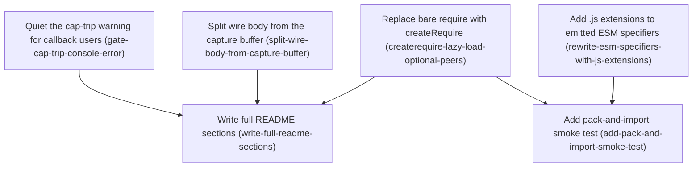

# Horizon 2 — Fix streamed-body corruption, the ESM build, and the package docs

Project: **elenwatch** · Horizon 2 of N · Domain shape: **technical** (library-internals
plumbing — no business domain) · Path: **full** · Gate: **passed, 0 blockers / 0 majors,
1 minor fixed mechanically**

---

## 🎯 What are we trying to achieve?

An external reviewer looked at the `elenwatch` npm package just before publishing and found
it "not production-ready yet": two blocking bugs and five smaller gaps. This horizon fixes
all of them so the already-working 0.2.1 can actually be published.

**Done means:** a streamed request body that is bigger than the logging size-cap still
reaches the server intact; the package works when imported as an ES module (today it silently
half-breaks); `npm run lint` is green; there is a real test that installs the packed tarball
and loads it; and the package README actually documents how the package behaves.

## 🧠 Why does this change need to happen?

- **Data corruption (blocker 1).** `elenwatch` copies outgoing request bodies so it can log
  them, and truncates that copy at a configurable byte limit (`maxBodyBytes`, default 10 MiB).
  For *streamed* request bodies the code reuses the same truncated copy as the body it sends
  to the server — so once the limit trips, the real provider request is silently cut short.
  Reproduced: a 5000-byte streamed body with a 1024-byte cap → the server got 0 bytes. The
  package's own documentation promises "only the capture-side buffer is truncated"; this
  breaks that promise.
- **Broken ESM build (blocker 2).** The package ships in two formats, CommonJS and ESM. The
  ESM copy doesn't load at all under Node: its compiled files use `import './interceptor'`
  with no `.js` extension (Node's ESM loader rejects that), and two `require(...)` calls at
  the top of the code throw "require is not defined" in ESM — which the surrounding
  `try/catch` swallows, so ESM users silently lose all fetch capture and the OpenTelemetry
  logger. The build's "ESM verified" check never actually loads the ESM entry point.
- **Five smaller gaps:** one lint error (a red CI gate), an un-silenceable `console.error` on
  every cap trip, no `prepublishOnly` guard against publishing a stale build, a 31-line README
  that documents one option out of ten, and aggressive redaction matching that isn't
  documented.

## At a glance

| | |
|---|---|
| **Phases** | 6 |
| **Complexity** | Medium — small blast radius per phase, but the ESM fix spans the interceptor, the build script, and packaging, and two phases have subtle ordering/idempotency invariants to preserve |
| **Main risk** | The blocker-1 fix must not regress the horizon-1 "capture drained before dispatch" race fix or the drain-error path; and `createRequire(import.meta.url)` does not compile under the CommonJS build config, so the exact mechanism is an execution decision |
| **Quality/performance target** | The review's "Fix:" prescriptions are authoritative; ship as 0.2.1 with no public API change |
| **Testing focus** | Byte-identical wire delivery under a tripped cap; the ESM+CJS pack-and-import smoke test; `console.error` spy assertions for both callback states; idempotent postbuild rewrite |

---

## Order of work

1. **Split wire body from the capture buffer** — nothing depends on it; can start immediately.
2. **Replace bare require with createRequire for optional peers** — independent; can start immediately.
3. **Add .js extensions to emitted ESM import specifiers** — independent; can start immediately.
   → *after 2 and 3:* the ESM build is actually loadable, so —
4. **Add pack-and-import smoke test** — needs the createRequire fix (2) and the specifier
   rewrite (3) in place, because it proves both.
5. **Quiet the cap-trip warning for callback users** — independent; can start immediately.
   → *after 1, 2, 5:* the real post-fix behavior is settled, so —
6. **Write full README sections** — needs the streamed-body caveat (1), the undici-optional
   caveat (2), and the "stderr silenced when a callback is set" line (5) to document real behavior.

---

## Phase 1 — Split wire body from the capture buffer

Technical ID: `split-wire-body-from-capture-buffer` · subsystem: WrappingDispatcher (streamed-request-body branch) · layer: infrastructure · blast radius: small

**Goal** — In `WrappingDispatcher`'s streamed-request-body branch, accumulate the bytes sent
upstream in an array **separate** from the size-capped capture buffer, so a body larger than
`maxBodyBytes` reaches the server byte-identical while only the logged copy truncates. Ends
with a passing regression test (5000-byte body / 1024-byte cap, server-side full-body
assertion) and `npm run lint` green.

**Why** — `elenwatch` intercepts outgoing request bodies to log them. For a streamed body the
current code drains chunks into one array, feeds each chunk to `appendChunk` (which stops
appending once the cap trips), then hands that same array to the real server via
`options.body = Buffer.concat(chunks)`. When the cap trips, the server gets the truncated
buffer. The bytes kept for logging and the bytes put on the wire must be tracked
independently.

**Changes**
- In the `Symbol.asyncIterator` branch of the drain IIFE (`interceptor.ts` ~414-427), add a
  full untruncated `wireChunks: Buffer[]` that every iterated chunk is pushed to
  unconditionally, with no cap check on that path.
- Keep feeding the capture side through `appendChunk(..., reqCapCtx)` so only
  `state.requestBodyChunks` truncates and `bodyDropped` / `onBodyDropped` still fire.
- Set `options.body = Buffer.concat(wireChunks)` — never the capped array — right before
  `this.original.dispatch(options, wrappedHandler)`.
- Preserve the horizon-1 capture-before-dispatch ordering (drain fully, set
  `capturedEnd`/`finished`, then dispatch in the same async frame, no timer/microtask hop)
  and the drain-error path (`catch → finalize capture → handler.onError?.(e) →
  syntheticReq.emit('error', e)`).
- Add the regression test (5000-byte body, `maxBodyBytes: 1024`, local HTTP server, assert
  server received all 5000 bytes byte-identical and captured body ≤ 1024; add a
  non-cap-multiple and/or binary payload case).
- Delete the unused `rejectedWith` variable near `interceptor.test.ts:1846` (the single lint
  error carried through all of horizon 1).

**Files / areas** — `packages/elenwatch/src/interceptor.ts`, `packages/elenwatch/src/interceptor.test.ts`

**How to verify**
- *Wire body byte-identical under cap* — separate ungated `wireChunks`; `options.body` from
  `Buffer.concat(wireChunks)`, never the capture array; regression test asserts server-side
  length 5000 and content match plus captured body ≤ 1024; a non-ASCII / non-cap-multiple case.
- *Capture-side cap semantics preserved* — each chunk still through `appendChunk`; over-cap
  case fires `onBodyDropped` once with request-direction info; under-cap case does not.
- *Capture-before-dispatch ordering intact* — no scheduling primitive between capture
  finalization and `this.original.dispatch`; horizon-1 race test still green.
- *Drain-error path preserved* — `catch` still `finalize → onError → emit('error')` in order;
  no dispatch of a partial body on a mid-stream throw; error propagated once.
- *Lint clean and scoped diff* — `npm run lint` exits 0; `rejectedWith` deleted (not
  underscore-prefixed); `git diff --stat` touches only the two files.

**Done when** — the regression test passes proving full byte-identical wire delivery with a
truncated capture under `maxBodyBytes=1024`, `npm run lint` exits 0, and every check above
passes its bar.

**Depends on** — nothing — can start immediately.

**Rollback** — revert the `interceptor.ts` diff; the extra wire array is additive, no
persisted state.

Reference — full rubric

5 dimensions: `wire-body-byte-identical-under-cap` (minScore 7), `capture-side-cap-semantics-preserved`
(7), `capture-before-dispatch-ordering-preserved` (7), `drain-error-path-preserved` (6),
`lint-clean-and-scoped-diff` (7). Healer hint: if a correctness property is untested, add a
dimension asserting the dispatched wire body is byte-for-byte identical to the concatenated
source under a tripped cap (distinct accumulator, non-ASCII and non-cap-multiple payloads),
and verify the horizon-1 same-async-frame ordering and the drain-error path survive the split.

---

## Phase 2 — Replace bare require with createRequire for optional peers

Technical ID: `createrequire-lazy-load-optional-peers` · subsystem: optional-peer lazy-load (createRequire) · layer: infrastructure · blast radius: small

**Goal** — Load the optional `undici` and `@opentelemetry/api` peers via a
`createRequire`-built `require` so fetch capture and the OpenTelemetry logger work when
`elenwatch` is imported as an ES module, instead of being silently swallowed by the
surrounding `try/catch`.

**Why** — The library lazily loads two optional deps with a bare `require(...)` in a
`try/catch`. In a native ES module there is no `require`, so the call throws, the catch reads
it as "peer not installed", and both features do nothing even when the peer is present.
`createRequire` from `node:module` builds a working `require`. **Because `import.meta` is
invalid under `tsconfig.cjs.json` (module: commonjs), the exact mechanism is an execution
decision** — an ESM-only shim module, a `.cts`/`.mts` split, or keeping the bare `require`
for the CJS emit only — and must compile and run under *both* emitted formats.

**Changes**
- Replace `require('undici')` at `interceptor.ts:87-98` and `require('@opentelemetry/api')` at
  `otel.ts:36-44` with a `require` obtained from `createRequire` (`node:module`).
- Pick a build-tolerant mechanism (see Why); verify with `tsc -p tsconfig.cjs.json --noEmit`
  **and** `tsc -p tsconfig.esm.json --noEmit`.
- Narrow the `catch` so only module-not-found (`MODULE_NOT_FOUND` / `ERR_MODULE_NOT_FOUND`)
  is treated as "peer absent"; a genuine load error is not swallowed.
- Keep the peer-absent behavior: handle stays `undefined`, `install()`/`restore()`/
  `otelSpanLogger` stay inert, horizon-1 "peer absent → skip" tests pass unchanged.
- Remove or retarget any now-unused `eslint-disable` for `no-require-imports` so
  `npm run lint --report-unused-disable-directives` stays green.

**Files / areas** — `packages/elenwatch/src/interceptor.ts`, `packages/elenwatch/src/otel.ts`

**How to verify**
- *createRequire works in both emits* — `createRequire` from `node:module`; both `tsc`
  projects exit 0; no `import.meta` in `dist/cjs`; both built entrypoints load `undici`.
- *Present peer actually loads under ESM* — an automated check loads the built ESM output as
  a real module with `undici` installed and captures a fetch request.
- *Genuinely absent peer still inert* — peer-absent test files unmodified; catch narrowed to
  module-not-found codes; `install()`/`restore()` don't throw without the peer.
- *Lint green, stale directives cleaned* — `eslint --report-unused-disable-directives` exits
  0; no broad new file-level disable.
- *No behavior drift on the error path* — full suite pass/skip counts match baseline; no new
  stderr on the peer-absent path; `createRequire` built once.

**Done when** — `undici` and `@opentelemetry/api` load through a `createRequire`-built
`require` under both emits, peer-absent tests are still green, `npm run lint` exits 0, and
every check above passes.

**Depends on** — nothing — can start immediately.

**Rollback** — revert to the bare `require` calls; no external effect.

Reference — full rubric

5 dimensions: `createrequire-both-emits` (7), `esm-consumer-resolves-peer` (7),
`peer-absent-still-inert` (7), `lint-green-directives-updated` (8), `no-behavior-drift-on-error-path`
(7). Healer hint: keep `import.meta` out of any file `tsconfig.cjs.json` compiles, apply the
identical change to both files, narrow the catch to module-not-found codes, verify with both
`tsc` projects plus a load of both built entrypoints, drop any now-unused `eslint-disable`.

---

## Phase 3 — Add .js extensions to emitted ESM import specifiers

Technical ID: `rewrite-esm-specifiers-with-js-extensions` · subsystem: dual build (CJS/ESM) postbuild step · layer: cross-cutting · blast radius: small

**Goal** — Extend `scripts/postbuild.mjs` to append `.js` to every relative import/export
specifier in the emitted `dist/esm` `.js` **and** `.d.ts` files, harden its verifier to fail
the build if any extensionless relative specifier remains, and add a `prepublishOnly` script.

**Why** — TypeScript emits `from './interceptor'` with no extension. Node's ESM loader and a
strict `nodenext` typecheck both reject that, so the published ESM build and its types fail
for ESM consumers. Adding extensions in the *source* breaks the ts-jest test runner (no
`moduleNameMapper`, `moduleResolution: node`), so the safe fix is a post-build rewrite of the
emitted ESM output only. `dist/esm` is currently flat (no subdirectories).

**Changes**
- In `postbuild.mjs`, after the format markers, walk `dist/esm` recursively and rewrite
  extensionless relative specifiers (`./x`, `../x`) in every `.js` and `.d.ts` to end in
  `.js`; a specifier that resolves to a directory with an `index.js` maps to `<spec>/index.js`
  (decided by inspecting the emitted filesystem).
- Handle static `import … from`, `export … from`, `export * from`, `export { x } from`, and
  dynamic `import('…')`; skip bare-package specifiers and already-extensioned ones; don't
  touch non-specifier string literals.
- Make the rewrite idempotent (two runs → byte-identical, never `.js.js`).
- Harden `checkTree` to scan `.js` **and** `.d.ts` and exit non-zero (failing `npm run build`)
  on any remaining extensionless relative specifier.
- Add `"prepublishOnly": "npm run build && npm test"` as a single line; `dist/cjs` output must
  be byte-identical to a build without the rewrite pass.

**Files / areas** — `packages/elenwatch/scripts/postbuild.mjs`, `packages/elenwatch/package.json`

**How to verify**
- *Rewrite completeness* — after build, no extensionless relative specifier in any `dist/esm`
  `.js` or `.d.ts`; covers `export *`, `export { } from`, dynamic `import()`; `import()` of
  `dist/esm/index.js` resolves every hop; nodenext typecheck of `dist/esm/*.d.ts` is clean.
- *No false positives* — bare specifiers (`undici`, `node:module`) untouched; no `.js.js`;
  a diff with/without the pass changes only import/export/`import()` lines.
- *Directory-target mapping* — file targets → `<name>.js`; explicit code + a fixture test for
  the directory → `/index.js` case even though `dist/esm` is flat today.
- *Idempotency and failing verifier* — double-run hashes match; reintroducing a bad specifier
  makes `npm run build` fail naming it; verifier scans `.d.ts` too.
- *CJS untouched + prepublishOnly* — `diff -r` of `dist/cjs` with/without the pass is
  identical; `npm pkg get scripts.prepublishOnly` is exactly `npm run build && npm test`;
  package.json diff is one line.

**Done when** — `postbuild.mjs` rewrites all `dist/esm` `.js` + `.d.ts` relative specifiers
idempotently, the verifier fails the build on any remaining extensionless specifier, `dist/cjs`
is untouched, `package.json` has the `prepublishOnly`, and every check passes.

**Depends on** — nothing — can start immediately.

**Rollback** — remove the rewrite pass and the `prepublishOnly` line; `dist` is regenerated
on every build.

Reference — full rubric

5 dimensions: `esm-specifier-rewrite-completeness` (7), `selective-rewrite-no-false-positives`
(7), `directory-target-index-mapping` (6), `idempotency-and-failing-verifier` (7),
`cjs-untouched-and-prepublishonly` (7). Healer hint: key the rewrite strictly on `./`/`../`
specifiers in real import/export/dynamic-import positions, resolve against the actual
`dist/esm` filesystem, make it a no-op on a second run, harden the verifier across `.js` and
`.d.ts`, touch `package.json` only for the one `prepublishOnly` line.

---

## Phase 4 — Add pack-and-import smoke test for the published tarball

Technical ID: `add-pack-and-import-smoke-test` · subsystem: pack-and-import smoke test · layer: cross-cutting · blast radius: small

**Goal** — Add a test that runs `npm pack`, installs the tarball into a fresh temp directory,
then loads it as both an ESM `import()` and a CJS `require()` in separate `node` child
processes — failing on any ESM regression from phases 2–3 and skipping cleanly when `npm` is
unavailable.

**Why** — The existing build tests inspect files in the workspace, not the artifact users
download. A test that packs the tarball, installs it clean, and loads it both ways is the only
check that catches a broken ESM specifier or a require-in-ESM failure before publish. The
build's current "ESM verified" step is a regex on `index.js` only.

**Changes**
- Follow `src/packaging-build.test.ts`: `npm pack` into a temp dir, capture the `.tgz`,
  `npm install <tarball>` into a fresh `mkdtemp` package.
- Spawn a `--input-type=module` child doing `import('elenwatch')` that routes any rejection to
  `process.exit(1)` and otherwise exits 0 only if `typeof m.Interceptor === 'function' &&
  typeof m.VERSION === 'string'`; assert exit 0, surface stderr on failure.
- Spawn a separate CJS child doing `require('elenwatch')` with the same assertions; assert
  exit 0.
- Explicit timeout on every pack/install/child call; finite per-test timeout ≥ 60s;
  `maxBuffer` on children.
- Probe `npm --version`; on failure `test.skip` / `describe.skip` (not `return`), mirroring
  the undici-peer skip idiom; clean every temp dir + `.tgz` in `afterAll`; name the file
  `*.smoke.test.ts` so `npm test` collects it.

**Files / areas** — `packages/elenwatch/src/pack-and-import.smoke.test.ts`

**How to verify**
- *Loads from the packed tarball* — real `npm pack` (not `--dry-run`) + install into an
  out-of-tree `mkdtemp`; children load the bare `'elenwatch'` specifier; breaking a `dist/esm`
  specifier turns the test red.
- *Dual ESM + CJS children* — two separate `node` processes; each asserts `Interceptor` is a
  function and `VERSION` a string via exit code; parent asserts both exit 0.
- *ESM failure not swallowed* — no bare `.catch(() => process.exit(0))`; awaited; injected
  syntax break makes the ESM child exit non-zero.
- *Skips when npm unavailable* — probes `npm`; calls the runner's skip API; run with `npm`
  shadowed reports skipped and overall exit 0.
- *Temp cleanup + timeouts* — `afterAll` `fs.rm` for every temp path + the `.tgz`; explicit
  timeouts everywhere; pack once per file.
- *Wired into the gate* — filename matches the jest `testRegex`; runs under plain `npm test`
  (and transitively `prepublishOnly`).

**Done when** — the `*.smoke.test.ts` packs, installs the real tarball, and loads `elenwatch`
as both ESM and CJS in separate children — green after phases 2–3, red on regression, skipped
without `npm`, temp dirs cleaned.

**Depends on** — `createrequire-lazy-load-optional-peers`, `rewrite-esm-specifiers-with-js-extensions`
(the test proves both).

**Rollback** — delete the test file; no runtime or packaging effect.

Reference — full rubric

6 dimensions: `installs-from-packed-tarball` (6), `dual-esm-cjs-child-processes` (7),
`esm-failure-not-swallowed` (7), `skip-when-npm-unavailable` (6), `temp-dir-cleanup-and-timeout`
(6), `wired-into-verify-gate` (6). Healer hint: `npm pack` then `npm install` the real `.tgz`
into a fresh `mkdtemp`, load the bare `'elenwatch'` specifier in two separate `node` children
(one `--input-type=module import()`, one CJS `require()`), each asserting exit 0 with
`Interceptor` a function and `VERSION` a string, ESM rejection → `process.exit(1)`, explicit
timeouts, `test.skip` when npm is absent, `afterAll` cleanup, a collected filename.

---

## Phase 5 — Quiet the cap-trip warning for callback users

Technical ID: `gate-cap-trip-console-error` · subsystem: appendChunk / cap context · layer: infrastructure · blast radius: small

**Goal** — In `appendChunk`'s cap-trip path, emit the body-dropped `console.error` warning
only when no `onBodyDropped` callback was configured.

**Why** — When a body exceeds the size cap, the library both fires the caller's optional
`onBodyDropped` callback and writes a line to stderr. A caller who supplied the callback has
taken ownership of that signal, so the extra stderr write is just noise. There is a single
`console.error` site (`interceptor.ts:623`) shared by both request and response directions.

**Changes**
- Wrap the `console.error(...)` at `interceptor.ts:623` in `if (capCtx.onDropped ===
  undefined)`.
- Leave `capCtx.onDropped?.(info)` and the `bodyDropped` flip unconditional and in place.
- Add `jest.spyOn(console, 'error')` tests (restored in `afterEach`): trip with a callback →
  callback fired once, spy not called; trip without → spy called with the expected message.

**Files / areas** — `packages/elenwatch/src/interceptor.ts`, `packages/elenwatch/src/interceptor.test.ts`

**How to verify**
- *Log guard on callback absence* — condition is `onDropped === undefined` (not negated);
  message/level unchanged for the no-callback case; zero stderr for the callback case; no
  cap-trip `console.error` left outside the guard.
- *Callback still unconditional* — `onDropped(info)` and the `bodyDropped` flip outside the
  guard; `git diff` shows fire-once logic untouched.
- *Both directions covered* — one shared guarded site; runtime check for an over-cap response
  body with a callback → no stderr.
- *Tests assert both states with a spy* — spy restored via `mockRestore`; both states and
  ideally both directions asserted.
- *Change scope contained* — diff only in the cap-trip branch + tests; no new public option;
  no change to `BodyDroppedInfo` or the cap math.

**Done when** — a passing test shows the cap-trip `console.error` is suppressed when
`onBodyDropped` is set (callback still fired) and still emitted when it is not, for both
directions.

**Depends on** — nothing — can start immediately.

**Rollback** — remove the `if` guard.

Reference — full rubric

5 dimensions: `log-guard-on-callback-absence` (7), `callback-still-unconditional` (7),
`both-directions-covered` (7), `tests-assert-both-states-with-spy` (7), `change-scope-contained`
(6). Healer hint: wrap only the `console.error` in `if (capCtx.onDropped === undefined)` at
the single shared site, leave `onDropped(info)` and the flip unconditional, add spy tests for
both states/directions with a guaranteed `mockRestore`.

---

## Phase 6 — Write full README sections

Technical ID: `write-full-readme-sections` · subsystem: package documentation · layer: interface · blast radius: small

**Goal** — Replace the 31-line `packages/elenwatch/README.md` with complete Installation,
Configuration, Limitations, and API sections documenting the real post-fix behavior.

**Why** — The current package README documents one option out of ten. Users need to know
payload capture is off by default, that redaction matches its needles as case-insensitive
*substrings* and can over-redact, how the size cap and its callback behave, that global fetch
capture needs the optional `undici` peer, that `requestTransform` only sees the HTTP path,
that streamed request bodies are buffered (not truly streamed) though delivered in full, and
that only one interceptor can run per process.

**Changes**
- **Installation:** `npm install elenwatch`; `undici` is an *optional* peer for global fetch
  capture (silently skipped if absent); the OpenTelemetry packages are optional peers for
  `otelSpanLogger`.
- **Configuration:** `capturePayloads` (default `false`); `maxBodyBytes` (default 10 MiB =
  `10 * 1024 * 1024`, per-direction) and `onBodyDropped` (`BodyDroppedInfo = { host,
  direction, bytes, cap }`, fires at most once per `(host, direction)`, stderr fallback
  silenced when the callback is set); redaction with an explicit warning that needles match
  as case-insensitive **substrings** and can over-redact (e.g. any key containing `address`).
  Include a copy-pasteable options reference.
- **Limitations:** `requestTransform` is HTTP/HTTPS-path only, **not** applied to global fetch
  request bodies (captured but never transformed), asymmetric with `responseTransform`;
  streamed request bodies are fully buffered before dispatch though delivered byte-for-byte
  even over `maxBodyBytes`; one interceptor per process — `install()` patches
  `http.ClientRequest.prototype` and the global undici dispatcher.
- **API:** the `Interceptor` class with `.install()` / `.restore()`, the `Logger` type,
  `otelSpanLogger`, `VERSION`, `InterceptorOptions` — matching the real named exports in
  `src/index.ts` (no default export, no free `install`/`restore`); at least one runnable
  example.

**Files / areas** — `packages/elenwatch/README.md`

**How to verify**
- *Four sections present* — Installation / Configuration / Limitations / API headings, each
  substantive; README ≥ 120 lines, no TODO/TBD.
- *Configuration accuracy* — `capturePayloads` default `false`; `maxBodyBytes` default exactly
  "10 MiB (10 * 1024 * 1024 bytes)" and per-direction; `BodyDroppedInfo` all four fields
  named correctly; stderr-silenced-when-callback line present; redaction stated as
  case-insensitive substring matching with an over-redaction example; options reference table.
- *Limitations coverage* — `requestTransform` HTTP-only asymmetry; buffered-but-delivered-in-full;
  one-interceptor-per-process; no contradiction elsewhere.
- *Installation optional peers* — base install command; `undici` optional + silent-skip
  consequence; OTEL packages optional.
- *API matches real exports* — `Interceptor` class with `.install()`/`.restore()`, not free
  functions; every `import { … } from 'elenwatch'` uses a real export; one runnable example;
  no default import.
- *Snippet validity* — every fenced block language-tagged and parses; option values respect
  documented types; `onBodyDropped` example uses the real field names; no invented CLI.

**Done when** — the README has all four populated sections covering the seven documentation
points, every code snippet is valid, and every documented symbol is a real export.

**Depends on** — `split-wire-body-from-capture-buffer` (streamed-body caveat),
`createrequire-lazy-load-optional-peers` (undici-optional caveat), `gate-cap-trip-console-error`
(stderr-silenced line).

**Rollback** — restore the previous `README.md` from git.

Reference — full rubric

6 dimensions: `four-sections-present` (7), `configuration-accuracy` (8), `limitations-coverage`
(8), `installation-optional-peers` (7), `api-matches-real-exports` (8), `snippet-validity` (7).
Healer hint: ground every claim in `src/options.ts` docstrings and `src/index.ts`; correct
wrong defaults; restate redaction as case-insensitive substring matching with an over-redaction
warning; replace any free `install()`/`restore()` with `new Interceptor(...).install()/.restore()`;
add the undici-optional caveat; spell out the `requestTransform`-HTTP-only asymmetry and
buffered-but-delivered-in-full.

---

## Discovery Findings

| Area | Finding | File | Implication |
|---|---|---|---|
| WrappingDispatcher streamed branch | The asyncIterator branch drains into a local `chunks` array, feeds it to `appendChunk`, then `options.body = Buffer.concat(chunks)` and dispatches; drain-error path finalizes capture then `onError` + `emit('error')` | `src/interceptor.ts` ~398-441 | The wire body reuses the cap-gated array → both capture and wire truncate on cap trip. Need a separate ungated wire array; preserve horizon-1 ordering + the drain-error path |
| appendChunk / console.error | `appendChunk` is a free function; on `nextBytes > cap` it sets `bodyDropped`, clamps bytes, `console.error` at line 623 (the only one in the file), then `onDropped?.(info)`, then returns without pushing | `src/interceptor.ts` ~560-636 | Separate ungated wire array for blocker 1; gating the single line 623 on `capCtx.onDropped === undefined` covers both directions |
| Lazy require under ESM | `interceptor.ts:87-98` and `otel.ts:36-44` both do `try { x = require('…') } catch { x = undefined }`; `undici` + `@opentelemetry/api` are optional peers *and* devDependencies | `src/otel.ts` | Bare `require()` throws "require is not defined" under ESM and the catch swallows it → ESM consumers silently lose all fetch capture + the OTEL logger even when peers are installed. `import.meta.url` is invalid under `tsconfig.cjs.json` |
| Build / module resolution | `tsconfig.esm.json` = module esnext / moduleResolution bundler → extensionless specifiers in `dist/esm` `.js` and `.d.ts`; `dist/esm` is flat; no `prepublishOnly`; `exports['.'].types` already split per condition (horizon 1) | `package.json` | Node's ESM loader + a nodenext typecheck reject the extensionless `dist/esm` specifiers; rewrite emitted `.js` + `.d.ts` in postbuild; leave `dist/cjs` + source alone |
| postbuild verifier | `checkTree` only asserts `index.*.js` contains a line starting `import`/`export`; every other file unchecked | `scripts/postbuild.mjs` | The "ESM tree verified" claim is a regex on `index.js` only; postbuild is where the specifier rewrite + a hardened verifier belong |
| Jest config | No `moduleNameMapper`; ts-jest with `tsconfig.json` (moduleResolution node); `testRegex` collects `*.test.ts` | `package.json` | `.js` extensions in *source* would break ts-jest resolution → the dist-rewrite approach is safer; a new `*.smoke.test.ts` is auto-collected by `npm test` |
| Unused test variable | `let rejectedWith: unknown = undefined;` assigned in a `catch` but never read; only assertion is `expect(rejected).toBe(true)` | `src/interceptor.test.ts` ~1846 | Trivial one-line-pair deletion; the single remaining lint error from horizon 1 |
| README + options docstrings | Package README is 31 lines (only `logger:`); redaction matches ~70 needles as case-insensitive substrings; `maxBodyBytes` default 10 MiB per-direction; `requestTransform` docstring overclaims — only wired on the http write/end path; `responseTransform` has zero invocation sites; `index.ts` exports the `Interceptor` class (no free `install`/`restore`) | `src/options.ts` | README API section documents the `Interceptor` class; Configuration states substring matching + over-redaction risk; Limitations states `requestTransform` is http-only |
| Established test patterns | `startServer()` helper; fetch suites use `itIfUd = udPeer ? test : test.skip`; horizon-1 race test builds a 3-chunk `ReadableStream`; `packaging-build.test.ts` relies on the pretest build and runs `execFileSync('npm', ['pack', …])` | `src/interceptor.test.ts` | The smoke test follows `packaging-build.test.ts`; the streamed-body regression test follows `itIfUd` + `startServer` + `ReadableStream` with a server-side full-body assertion |

## Out of Scope

- **CI (`.github/workflows`)** — user deferred to horizon 3.
- **CHANGELOG.md** — user deferred to horizon 3.
- **npm publish / release automation** beyond `prepublishOnly` — no publish secrets exist.
- **True-streaming rewrite of the request-body branch** — the review accepts the buffering
  tradeoff and asks only for a README caveat.
- **Narrowing the redaction needle list** — the review asks only to document the aggressive
  matching.
- **README sections beyond the four** (examples, troubleshooting, tutorial, contributing).
- **The "install elenwatch last" APM hook and richer `restore()` diagnostics** — held.
- **Public API changes / a version bump past 0.2.1** — the vision requires API stability
  across patch versions.
- **A structured/typed-event redesign of `onBodyDropped` or the `Logger` seam** — YAGNI, API
  frozen for 0.2.1.
- **`arethetypeswrong` / tarball-cleanliness** — landed in horizon 1.
- **LICENSE copyright holder / author-email typo / stale "horizon 3/4" labels in
  `src/options.ts`** — optional housekeeping noted for horizon 3.

## Required Materials

None — this is a code-local fix in an existing repository.

## Success Criteria

1. A streamed fetch request body larger than `maxBodyBytes` is delivered to the wire in full
   and byte-identical while only the capture-side buffer truncates (blocker 1), proven by a
   5000-byte / 1024-byte-cap regression test with a server-side assertion.
2. `import('elenwatch')` against the packed tarball succeeds under Node ESM, `undici`
   fetch-capture and the OTEL logger are functional in an ESM consumer, and `dist/esm/*.d.ts`
   typecheck cleanly under `moduleResolution: nodenext` (blocker 2).
3. A pack-and-import smoke test runs under `npm test` and would fail on any of the ESM
   regressions.
4. `npm run lint` exits 0.
5. The cap-trip `console.error` is suppressed when `onBodyDropped` is provided and still
   emitted when it is not, for both directions.
6. `package.json` has `"prepublishOnly": "npm run build && npm test"`.
7. The package README has full Installation / Configuration / Limitations / API sections
   covering `capturePayloads` default `false`, redaction's case-insensitive substring needles,
   `maxBodyBytes`/`onBodyDropped`, the `undici` optional-peer requirement, `requestTransform`
   being http-path-only, the streamed-request-body buffering caveat, and the
   one-interceptor-per-process model.
8. `npm test` and `npm run build` pass green with the new regression tests for blockers 1 and 2.

## Alignment Preview

Two concerns were raised at the Stage 3.4 preview, both handled:

1. *acceptance-conflict* — the README was initially deferred to horizon 3 while the user had
   explicitly asked for full README sections this horizon and the horizon's own success
   definition requires them. **Resolved:** phase 6 was folded back in.
2. *reliability* — the pack-and-import smoke test running `npm pack` + `npm install` inside
   the normal test run could be slow or fail offline. **Resolved:** phase 4 skips (not fails)
   when `npm` is unavailable, matching the existing undici-peer skip idiom.

The user accepted the revised 6-phase plan on the first checkpoint (no redirect rounds).

## Quality Gate

- **Path:** full. **Discovery:** ran (existing system). **Stage 3.4:** blocking preview shown;
  user accepted first time; 0 redirects.
- **Phase cap:** Stage 3 returned 6 phases; all 6 kept (README re-added after the Stage 3.4
  acceptance-conflict concern); 6 ≤ hard ceiling 7.
- **Stage 5:** one critic pass. `pass: true`. Issues raised → 10 (one per rubric dimension).
  Failing dimensions: 1 (`valid-dependencies`, `pass: false`, score 7 < minScore 8),
  severity **minor**. No blockers, no majors → no adversarial verification, no healer
  iteration needed.
- **Accepted debt / mechanical fixes:** the minor `valid-dependencies` finding was fixed
  mechanically — the non-load-bearing `rewrite-esm-specifiers-with-js-extensions` dependency
  and its input reference were removed from phase 6. The critic's optional nits
  (phase 2 lightly bundling `prepublishOnly`; duplicated per-phase restatements in
  `successCriteria`) were also applied: the `successCriteria` list was trimmed to the eight
  objective-level entries. `prepublishOnly` stays in phase 3 (passed at score 7).
- **Final verdict:** gate passed, 0 surviving blockers/majors, 0 accepted minor debt.

## Full analysis

**domainShape:** `technical` — the task is entirely library-internals plumbing (HTTP
interceptor buffer handling, dual-format module resolution, lazy native-require loading, lint
and package metadata, user docs) with no business entities, rules, or workflows. Confirmed at
the gate (`domain-shape-fit` scored 10).

**Ubiquitous / subsystem language**

| Term | Meaning |
|---|---|
| WrappingDispatcher | The undici `Dispatcher` subclass whose `dispatch()` intercepts global fetch traffic; host of the streamed-request-body branch |
| capture buffer vs wire body | Two now-distinct byte arrays: the capture buffer truncates at `maxBodyBytes` for logging; the wire body carries the full bytes to the server |
| appendChunk / cap context | The helper that accumulates body chunks and, given a byte-cap context, stops appending and flips `bodyDropped` once a direction's byte counter would exceed the cap |
| maxBodyBytes / onBodyDropped | The configurable per-direction capture byte bound and the structured callback fired (with `BodyDroppedInfo`) when it trips |
| dual build (CJS/ESM) | `dist/cjs` and `dist/esm` trees emitted by `tsconfig.cjs.json` and `tsconfig.esm.json`, with `postbuild.mjs` writing per-tree `package.json` type markers |
| extensionless specifier | A relative import like `from './interceptor'` that Node's ESM resolver rejects; must carry `.js` in both emitted `.js` and `.d.ts` |
| createRequire lazy load | Loading optional native peers via `createRequire` so resolution works in both CJS and ESM instead of a bare `require()` that throws under ESM |
| pack-and-import smoke test | A verifier that runs `npm pack`, installs the tarball into a temp dir, and loads `elenwatch` as both an ESM module and a CJS module |
| one-interceptor-per-process | `elenwatch` patches `http.ClientRequest.prototype` and the global undici dispatcher process-wide |

**Assumptions**

- The repo's real gates are `npm run build`, `npm run lint`, `npm test` (jest 29 + ts-jest).
- `.js` extensions in *source* would break ts-jest resolution → the ESM fix rewrites emitted
  `dist/esm` in postbuild.
- `createRequire` replaces the bare `require(...)`; the exact build-tolerant mechanism is
  chosen at execution, with the pack-and-import smoke test as the acceptance check.
- The public API surface stays stable; ship as 0.2.1 with no version bump.
- The streamed-request-body branch keeps buffering; only a README caveat is required.
- README wording is mirrored from `src/options.ts` docstrings and `src/index.ts` exports.
- The smoke test runs in the existing jest tooling and skips cleanly when `npm` is
  unavailable.

**Risks**

- The `.js`-in-source path could regress the CJS build or ts-jest resolution — mitigated by
  the postbuild-only rewrite.
- `createRequire`-based lazy loading may change the timing / failure mode of the undici/otel
  `try/catch`, altering the horizon-1 "peer absent → skip" behavior.
- `import.meta.url` does not compile under `tsconfig.cjs.json`; a naive
  `createRequire(import.meta.url)` in source fails the CJS build. **(main risk)**
- The blocker-1 fix must preserve the horizon-1 streamed-request-body race fix and the
  drain-error path.
- A naive smoke test that installs from the workspace rather than the packed tarball passes
  while the real published artifact stays broken.
- `dist/esm` `.d.ts` extension rewriting can desync from the `.js` rewriting.
- `console.error` gating could suppress the operator signal when `onBodyDropped` is set but
  throws.
