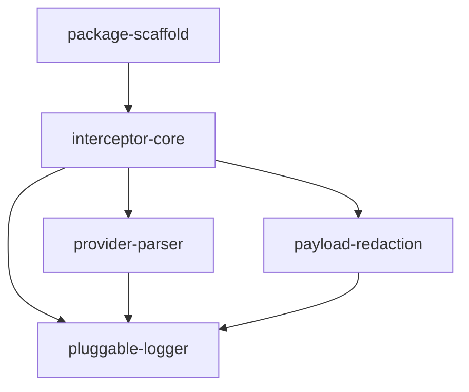

# Horizon 1 — llm-http-proxy roadmap (human-readable twin)

## Task & Analysis

**Task:** Turn the existing in-repo NestJS LLM HTTP interceptor module (src/llm-http-logging/) into a standalone, publishable, production-grade npm package: near-zero latency interception of in-process LLM provider HTTP/HTTPS traffic, pluggable logger/provider (incl. OTEL), request/response transformers, data redaction, extension seams for streaming/TLS/retries/WebSockets/auth/proxy. Prompts can contain PII, customer data, passwords, financial data, source code, medical information, internal documents — sensitive data must be protected (redacted, not logged raw by default).

**Objective:** Turn the existing in-repo NestJS LLM HTTP interceptor module (src/llm-http-logging/) into a standalone, publishable, production-grade npm package that intercepts in-process LLM provider HTTP/HTTPS traffic with near-zero latency overhead and pluggable loggers/providers (incl. OTEL), request/response transformers, and data redaction.

**Success definition (horizon-0 scoped):** A standalone package directory with its own package.json that builds to a publishable dist (no hard NestJS/reflect-metadata runtime dependency; thin optional Nest adapter may exist), whose singleton-safe http/https patch reproduces today's capability (model extraction, token estimation, url, caller trace per log entry) with all gates green (`npm run build`, `npm run lint`, `npm test`). Latency: a benchmark proves buffered (non-streaming) interception overhead stays within an explicit budget (e.g. <1ms p50 / <2% p99 added latency) and no work beyond body capture happens on the request path. Extension interfaces exist and are demonstrated: pluggable logger + per-provider parser with a default console logger and an OTEL span exporter that activates only when optional @opentelemetry/* peer deps are installed. Input/output transformers run in the enforced order — request transformed before send, response transformed before return to caller — with tests proving both ordering and that mutated bodies reach the wire/caller intact. Redaction: default config logs NO raw bodies; configured sensitive fields (PII/password/financial keys) are masked; a test asserts no raw sensitive value appears in any emitted log entry or span, including error paths. Horizon scoping (named, not silently trimmed): the paragraphs above state the FULL objective's success bars. This horizon (horizon-0) keeps five phases (package-scaffold, interceptor-core, provider-parser, payload-redaction, pluggable-logger) and defers three of the full-objective success bars to the next horizon: the latency-budget benchmark (Latency paragraph), the enforced-order input/output transformer pipeline, and the OTEL span exporter demo. Those deferrals are recorded in the deferred list, whose entries are explicitly marked as full-objective success bars, and horizon-0's successCriteria certify ONLY the kept-phase subset, NOT this full successDefinition: completing horizon-0 does not mean the latency benchmark, transformers, or OTEL exporter are proven, and the deferred entries remain the success bars to be verified in the next horizon.

**Domain shape:** `technical` — The objective is about machinery — patching http/https, buffering payloads, transforming bodies, redacting fields, emitting spans — not about any business entities, rules, or workflows a domain expert would recognize; it is library/tooling engineering.

**Ubiquitous language:**

| term | meaning |
|---|---|
| interceptor | the component that taps in-process http/https requests to LLM providers |
| provider | an LLM vendor (OpenAI, Anthropic, etc.) whose API the interceptor recognizes |
| transformer | a pluggable function that rewrites a request or response payload before it proceeds |
| redaction | masking sensitive values (PII, secrets, financial data) so they never appear in emitted logs/spans |
| span | the OTEL telemetry unit emitted per intercepted call when the optional telemetry exporter is enabled |
| payload | the raw request or response body being captured, transformed, or logged |
| latency overhead | the added time an intercepted call pays versus an untouched call |
| log entry | the structured record emitted per call by the pluggable logger |

**Assumptions:**
- Requirement 4's 'can be extended to manage' means the package ships extension points (pluggable hooks/interfaces) for streaming, TLS, provider-specific APIs, retries, WebSockets, auth, proxy, deployment complexity — not built-in implementations of all of them; built-in support covers buffered HTTP/HTTPS in this horizon.
- The package is developed in-repo (e.g. under packages/) and 'external' means publishable/distributable; actual registry publication and a CI release pipeline are deferred.
- The existing src/llm-http-logging module in this app will be migrated to consume the new package to prove it works, but nothing else in the app is rewritten.
- OTEL SDKs are optional peerDependencies; the package must build, install, and function with zero OTEL/observability deps present.
- The default rough token heuristic (chars/4, usage-token extraction) is retained as the pluggable default; exact provider tokenizers are out of scope.
- Latency budget is defined for the buffered, non-streaming path; streaming (SSE) interception unavoidably costs more and is budgeted separately.
- Node.js >=18 (native streams/AsyncLocalStorage) is assumed as the runtime baseline.

**Risks:**
- The latency-budget vs. body-capture conflict is real and structural: capturing full request bodies and reconstructing response bodies requires buffering, which directly contradicts 'as close to 0 latency as possible' — worst on streaming/SSE where buffering delays the first token; the plan must budget this explicitly rather than silently promising both.
- Monkey-patching http/https module functions is process-global: multiple package instances, double-patching, or coexisting APM agents (Datadog/NewRelic) can clobber each other; needs singleton guards and a defensive design.
- Transformers that mutate bodies risk breaking protocol correctness — stale Content-Length/chunked encoding, wrong data handed back to the caller, or a transformed response never reaching streaming consumers — which can corrupt provider calls and app behavior.
- Redaction is easy to bypass: raw values can leak through error paths, headers, metadata/caller trace, or third-party loggers that don't honor the masking config; must be tested on every emission path, not just the happy path.
- Packaging pitfalls: a hidden NestJS/runtime dependency, a broken dual ESM/CJS build, or missing .d.ts files makes the package unusable for non-Nest consumers despite the 'external package' requirement.
- OTEL version skew or inadvertently hard-bundling heavy telemetry deps would violate the near-zero-latency and lean-package goals.
- Over-building extension points for problems in requirement 4 that no consumer exercises (YAGNI gate 3) inflates the package without a second implementation justifying each interface.
- Benchmarking real provider calls is flaky; latency claims must be reproducible against fixtures, or the success bar cannot be checked.

## Discovery Findings

| area | finding | file | implication |
|---|---|---|---|
| module inventory | src/llm-http-logging/ contains exactly two files (~265 LOC total): llm-http-interceptor.service.ts (216 lines) and llm-http-logging.module.ts (49 lines). The service monkey-patches http.request/https.request in OnModuleInit, wraps req.write/req.end to capture request body, listens on res 'data'/'end' for response body, and emits via a console.log default logger. It already implements the four capabilities named in the success definition: model extraction (requestJson.model/model_name), token estimation (chars/4 heuristic + usage.completion_tokens/output_tokens extraction), url (req.protocol/host/path), caller trace (Error().stack walk). | /Users/dimitrykatz/workspace/elenwatch/src/llm-http-logging/llm-http-interceptor.service.ts | The package extraction is a rewrite of a small, self-contained component — not a refactor of a large surface. The four existing capabilities map 1:1 to the per-provider parser extension point; nothing beyond them exists to preserve. |
| public API contract | Existing exported contract is LlmHttpLoggingOptions{providers?: (string|RegExp)[] with defaults api.openai.com/api.anthropic.com/api.cohere.ai/api.mistral.ai, logger?: (entry: LlmLogEntry)=>void, tokenCounter?: {estimateInputTokens?, extractOutputTokens?}} and LlmLogEntry{timestamp: Date, model, inputTokens, outputTokens, callerTrace, url}. Registered via LlmHttpLoggingModule.register(options) static DynamicModule factory. | /Users/dimitrykatz/workspace/elenwatch/src/llm-http-logging/llm-http-logging.module.ts | These option/entry shapes are the existing logical API to carry into the standalone package (retrofitted with transformers/redaction/provider/logger interfaces). The 'provider' concept in the task maps naturally onto today's hardcoded provider list + tokenCounter; there is no separate per-provider parser type today — it must be designed, not migrated. |
| NestJS coupling | The module has hard runtime dependencies on @nestjs/common (@Injectable, OnModuleInit, @Module, DynamicModule, Provider) and is consumed only in src/app.module.ts via LlmHttpLoggingModule.register({providers:['api.openai.com','api.anthropic.com'], logger:...}). The app is a stock Nest scaffold (Hello World controller) otherwise untouched by LLM concerns. | /Users/dimitrykatz/workspace/elenwatch/src/app.module.ts | The Nest adapter to be severed is exactly: decorators on the service, the DynamicModule factory, and the app.module.ts import site. Plan should include a thin optional Nest wrapper (as the analysis assumes) and migrate app.module.ts to consume the new package to prove it — this is the only consumer in the repo. |
| packaging/architecture realities | No packages/ (or any) monorepo layout exists; no lockfile present; repo build is nest build (tsc) emitting CommonJS (module: commonjs, target: ES2023) into ./dist with declaration:true; jest config lives in package.json (rootDir src, .spec.ts regex, ts-jest); lint is ESLint 9 flat config (eslint.config.mjs, typescript-eslint recommendedTypeChecked + prettier); tsconfig.build.json excludes **/*spec.ts. Root package.json is private:true — not publishable as-is. | /Users/dimitrykatz/workspace/elenwatch/package.json | The assumption 'developed in-repo (e.g. under packages/)' requires creating a new packages/<name>/ directory from scratch: its own package.json (name/version does not exist yet), its own dual ESM/CJS tsconfig, its own jest/eslint/benchmark configs — the root Nest-centric tsconfig and jest config are not reusable for a publishable lib. Also no lockfile: plan's dependency-acquisition steps must generate one. |
| existing gaps (purely additive) | Grep confirms zero occurrences of @opentelemetry/*, AsyncLocalStorage, streams/SSE handling, redaction, or transformer concepts anywhere in the repo. The service's req 'error' handler is empty (errors are swallowed), there is no unit/e2e spec for the module (only app.controller.spec.ts), no benchmark infra, and no README. | /Users/dimitrykatz/workspace/elenwatch/src/llm-http-logging/llm-http-interceptor.service.ts | OTEL exporter, redaction, transformers, streaming/TLS/retries/WebSocket/auth/proxy seams, and benchmark fixtures are all greenfield — nothing to reconcile against, but the empty error handler means the 'no raw sensitive value on error paths' redaction test has no existing coverage to extend and today's error behavior silently loses data (a behavior regression risk when adding error-path logging). |
| latency-relevant implementation detail | Current interception performs NO work on the request path that blocks the caller: buffering happens in the wrapped write/end/response-data callbacks after originalRequest is invoked; request is issued first, then interceptRequest wires listeners. Model/token extraction runs only at response 'end'. (Latent bug: url built from req.protocol which ClientRequest does not set — url host is undefined downstream; and no Content-Length accounting when mutating bodies.) | /Users/dimitrykatz/workspace/elenwatch/src/llm-http-logging/llm-http-interceptor.service.ts | The near-zero-latency success bar is already structurally met by today's design (deferred off-path work), so the plan's benchmark gates can target preserving that ordering. But transformer support that mutates bodies will introduce the structural risk the analysis flags (stale Content-Length), and the existing url extraction bug should be fixed in the rewrite. |

## Out of Scope / Deferred

- otel-span-exporter — OTEL span exporter activated only when optional @opentelemetry/* peer deps are present — FULL-OBJECTIVE SUCCESS BAR ('an OTEL span exporter demo that activates only when optional @opentelemetry/* peer deps are installed') deferred to the NEXT horizon: it remains a named success bar of the full objective and horizon-0's successCriteria explicitly do NOT claim it. Deferral reason: fails YAGNI gate 2 (needs the log-entry/emission contract stabilized in pluggable-logger; peer-dep packaging is its own concern and no span consumer exists yet).
- transformer-pipeline — request/response transformers in enforced order with Content-Length accounting — FULL-OBJECTIVE SUCCESS BAR ('input/output transformers run in the enforced order — request transformed before send, response transformed before return to caller — with tests proving both ordering and that mutated bodies reach the wire/caller intact') deferred to the NEXT horizon: it remains a named success bar of the full objective and horizon-0's successCriteria explicitly do NOT claim it. Deferral reason: fails YAGNI gate 2 (needs redaction stable first so rewriting runs inside the protected pipeline; mutating bodies introduces the stale Content-Length risk discovery flagged).
- latency-benchmark — fixture-based latency-overhead benchmark vs. an explicit budget — FULL-OBJECTIVE SUCCESS BAR ('a benchmark proves buffered (non-streaming) interception overhead stays within an explicit budget (e.g. <1ms p50 / <2% p99 added latency) and no work beyond body capture happens on the request path') deferred to the NEXT horizon: it remains a named success bar of the full objective and horizon-0's successCriteria explicitly do NOT certify near-zero latency as proven. Deferral reason: fails YAGNI gate 2 (budget sign-off is a required material; this horizon already preserves the off-request-path ordering structurally, the benchmark proves the numbers next horizon).
- nest-adapter-and-migration — thin optional Nest wrapper (DynamicModule regenerating LlmHttpLoggingModule.register) + app.module.ts migrated to consume the package — deferred: fails YAGNI gate 2 (proof-by-consumption needs the package's public API final; the only consumer is the untouched stock Nest app).
- publish-verification — npm pack + publish --dry-run, clean non-Nest consumer sandbox, Node 18/20/22 build/test matrix — deferred: fails YAGNI gate 2 (needs the package content finalized; consumes the multi-node-runtime, registry-auth, and consumer-sandbox materials).
- extension-seams — streaming/SSE, TLS, retries, WebSockets, auth-token injection, proxy seams — deferred: fails YAGNI gate 3 (speculative interfaces with no second implementation on the horizon; the analysis assumption covers them as extension points, not shipped features).
- package-documentation — README with quickstart and redaction/logger config reference — deferred: fails YAGNI gate 2 (needs the public API and wiring stable).

## Required Materials

| name | kind | why | acquisition |
|---|---|---|---|
| Package identity and licensing decision (name, version, license) | knowledge | The root package.json is private:true / UNLICENSED and no name/version exists for the new package; a publishable artifact needs a chosen npm name (must not collide on the registry), a starting version, a license expression, and repo/bugs/homepage metadata. None of this can be derived from the repo — it is a maintainer decision the work cannot proceed without. | Decide with the maintainer (e.g. version 0.1.0, MIT or Apache-2.0); verify the name is available via `npm view <name>` against registry.npmjs.org. |
| Explicit latency budget and benchmark methodology approval | knowledge | The success bar requires an explicit budget, but the analysis only gives an example ('e.g. <1ms p50 / <2% p99'); the concrete numbers, the reference hardware, and the measurement method (fixture-based, cold vs warm, iterations) must be fixed before the benchmark gate and its fixture harness can be authored reproducibly — without it the gate cannot be checked (flagged risk). | Maintainer/engineering sign-off on a written budget and methodology; the benchmark fixtures themselves are synthesized in-repo, not externally sourced. |
| Multi-Node-major test runtime set (Node 18/20/22 LTS) | tool | Baseline is Node >=18, but the interceptor rewrites http/https module internals (req.write/req.end, response 'data'/'end') and ships a dual ESM/CJS build; production-grade support must be verified on the shipping LTS majors actually targeted, since internal stream/Response/AsyncLocalStorage behavior differs across majors. Without these runtimes the claimed support matrix cannot be validated. | Run the build/test/lint gates on each target major via a version manager (nvm/FNM) or Docker images node:18/20/22-alpine. |
| npm registry authentication for publish dry-run verification | credential | "Publishable" is a success gate; validating it properly requires `npm publish --dry-run` / pack metadata checks against the real registry (name collision, files list, publishConfig, peerDep resolution) and a clean tarball install, which need an authenticated npm account rather than only offline `npm pack`. | Ensure the executor's npm CLI passes `npm whoami` (login or NODE_AUTH_TOKEN); no actual publication is performed. |
| Clean non-Nest consumer sandbox | tool | The package must prove it has no hard NestJS/reflect-metadata runtime dependency and installs/loads fine in a plain Node project with zero OTEL deps present — the in-repo migration (app.module.ts) cannot prove this because the app itself carries Nest. A throwaway consumer environment is required to smoke-test the packed tarball (require + import, both ESM and CJS entries, optional peer deps absent). | Scaffold a minimal Node >=18 project outside the repo (or a temp dir) and `npm install` the local tarball produced by `npm pack`; discard after the smoke check. |

## Phases

### 0. Standalone package scaffold: publishable dual CJS/ESM build (`package-scaffold`)

- **Goal:** Stand up a new packages/<name>/ directory with its own package.json (name/version/license from the package-identity decision), a dual CJS/ESM tsconfig emitting .d.ts declarations, jest and eslint configs, and a build script chain so the interceptor package has a buildable, lintable, testable foundation independent of the root Nest scaffold, including a generated lockfile.
- **Bounded context / subsystem:** package packaging | **Layer:** cross-cutting | **Blast radius:** small
- **Inputs:** package identity decision (name, version, license) — required material; discovery findings: no packages/ monorepo layout exists; root package.json is private:true with no lockfile; root tsconfig/jest are Nest-centric and not reusable; root package.json / tsconfig.build.json / eslint.config.mjs / jest config as reference conventions; analysis objective: a standalone, publishable npm package with no hard NestJS runtime dependency
- **Expected result:** packages/<name>/ directory whose npm run build emits a dual CJS/ESM dist with .d.ts declarations and whose npm run lint and npm test pass on the empty package, with a lockfile generated
- **Depends on:** —
- **Compensation:** Delete the packages/<name>/ directory and any root workspace references — nothing outside it depends on it yet.
- **Healer hint:** Most likely failure: build, lint, and test pass only because Node resolution finds `@nestjs/*` in the ambient root `node_modules` — rename root `node_modules` to `node_modules.bak`, re-run `npm run build && npm test` until they pass off the package's own lockfile, then declare whatever surfaced as missing in the package's own `devDependencies` and regenerate `package-lock.json`.

**Rubric:**
| dimension | rule | min |
|---|---|---|
| `dual-cjs-esm-runtime-resolution` Dual CJS/ESM runtime resolution | The built package must be loadable by both `require()` and `import()` from a plain Node consumer, via a correct `exports` condition map wiring each module-system condition to a real dist artifact it can actually execute. | 9 |
| `type-declarations-emitted` Complete type declarations in dist | The build must emit a `.d.ts` declaration for every entry point, reachable through `types`/`exports`, such that a fresh strict TS consumer compiles with no missing-module or implicit-`any` errors. | 7 |
| `publishable-manifest` Publishable package manifest | The manifest must carry the decided non-placeholder `name`, `version`, and `license`, be non-private, and restrict the tarball to published artifacts, so `npm pack --dry-run` output is exactly what would ship to the registry. | 7 |
| `standalone-from-root-scaffold` No coupling to the root Nest scaffold | The package must build, lint, and test using only its own configs and its own dependency tree — no source import escaping `packages/<name>/` and no hard `@nestjs/*` runtime dependency — so a green pass does not silently depend on the ambient root workspace `node_modules`. | 8 |
| `repeatable-clean-build` Idempotent, deterministic build | The build script chain must be safe to re-run and reproducible: cleaning then rebuilding always succeeds, repeated builds from the same source produce an identical dist, and the build writes nothing outside the package directory. | 6 |
| `rollback-safe-scaffold` Rollback-safe: root workspace untouched | The phase must leave every tracked root file unmodified and introduce only the new `packages/<name>/` tree, so the documented compensation (delete the directory) restores the repo to its exact prior state. | 6 |

### 1. Interceptor core: singleton-safe http/https payload capture with off-request-path emission (`interceptor-core`)

- **Goal:** Port the de-Nested interceptor into the package: a singleton-guarded http/https patch that taps provider traffic, captures request/response payloads with no blocking work on the request path (preserving today's latency-overhead ordering), derives a correct url (fixing the req.protocol bug) and caller trace, replaces the empty error handler with an error-path emission record, and emits log entries that by default contain no raw payload.
- **Bounded context / subsystem:** interceptor core | **Layer:** infrastructure | **Blast radius:** medium
- **Inputs:** package-scaffold deliverable (buildable packages/<name>/ skeleton); src/llm-http-logging/llm-http-interceptor.service.ts (port source: patch, wrapped write/end capture, response data/end listeners, four capabilities); discovery findings: deferred off-request-path capture ordering, req.protocol url bug, empty error handler (errors swallowed); src/llm-http-logging/llm-http-logging.module.ts (public options/entry contract to carry over)
- **Expected result:** src/interceptor.ts — the Nest-free Interceptor class with a singleton guard and restore() hook, off-request-path payload capture, fixed url derivation, caller-trace extraction, error-path emission, and an options seam whose default emission produces log entries free of raw payloads — exported as the package entry, with unit tests proving double-patch safety and that no capture work runs before the original request is issued
- **Depends on:** package-scaffold
- **Compensation:** The singleton's restore() reinstates the original http.request/https.request; invoking it and deleting the module files undoes the process-global patch.
- **Healer hint:** Most likely failure is the port reintroducing synchronous payload work on the request path (the ordering test fails because capture runs before the original request issues) or a double-install stacking wrappers, so fix fastest by making the ordering and restore()-identity tests the first things you run after porting, then moving all serialization/queueing into the response listeners and a deferred callback.

**Rubric:**
| dimension | rule | min |
|---|---|---|
| `singleton-guard` Singleton install & restore safety | The interceptor must be installable only once process-wide: repeated install() calls and multiple Interceptor instances are no-ops (never stacking wrappers), and restore() must reinstate the exact original http.request/https.request references, making double-patch and rollback provably safe. | 9 |
| `off-request-path-capture` Off-request-path capture ordering | No capture, transformation, serialization, or emission work may run on the synchronous request path; the original request write/end must be issued before any payload work in the same tick, and response payload assembly must happen via async data/end listeners so today's latency-overhead ordering is preserved. | 9 |
| `url-derivation` Correct derived URL (req.protocol bug fixed) | The url derived for each intercepted call must be correct in scheme, host, and path, and must never rely on the broken req.protocol property; scheme must come from the patched entry point or TLS/socket detection. | 8 |
| `error-emission` Error-path emission (no swallowed errors) | A request that emits an 'error' event must produce an emission record carrying the error, replacing the old empty handler; errors must be captured into a log entry-shaped record and still propagate to the original caller's own error listeners. | 8 |
| `default-redaction` No raw payload in default emissions | With default options, emitted log entries must carry no raw request/response payload — sensitive literals in bodies (API keys, PII) must never appear in default-option output, on the success path or the error path; payload capture is strictly opt-in. | 9 |
| `caller-trace` Caller trace extraction | Each emission must carry a caller trace pointing at the user code frame that issued the intercepted request — never at the interceptor's own wrapper internals — and the stack capture must not run on the request path. | 7 |

### 2. Provider parser: pluggable per-provider model/token extraction with a default registry (`provider-parser`)

- **Goal:** Externalize model and token estimation behind a per-provider parser hook: define the ProviderParser interface and ship the default registry (api.openai.com, api.anthropic.com, api.cohere.ai, api.mistral.ai) carrying over today's model-field extraction, chars/4 input heuristic, and usage completion_tokens/output_tokens extraction, wired into the interceptor's parse step.
- **Bounded context / subsystem:** provider parsing | **Layer:** application | **Blast radius:** small
- **Inputs:** interceptor-core deliverable (parse seam + captured request/response payload shapes); today's extraction logic in the ported service (extractModel, chars/4 heuristic, usage completion_tokens/output_tokens extraction); analysis ubiquitous language: provider, payload, log entry
- **Expected result:** src/provider-parser.ts — the ProviderParser interface plus the default per-provider parser registry (openai/anthropic/cohere/mistral) with the chars/4 heuristic and usage-field extraction, wired as the interceptor's parse step
- **Depends on:** interceptor-core
- **Compensation:** (none)
- **Healer hint:** Most likely the registry passes its own synthetic fixtures but has drifted from today's extraction — or the interceptor still calls the old private methods — so run both implementations side-by-side on the same fixtures, assert identical log entries, and delete the ported extraction code so only the registry path compiles.

**Rubric:**
| dimension | rule | min |
|---|---|---|
| `provider-parser-api` ProviderParser is a real pluggable seam | Parsing runs through an exported ProviderParser interface — a caller-supplied parser fully replaces the default registry, and no model/token extraction logic remains inline in the interceptor. | 7 |
| `default-registry-coverage` Default registry covers all four providers | The default registry resolves a distinct parser for each declared provider host — api.openai.com, api.anthropic.com, api.cohere.ai, api.mistral.ai — and degrades to a defined fallback for unknown hosts instead of failing. | 8 |
| `legacy-parity` Default parsers reproduce today's extraction exactly | On identical fixtures the default registry yields the same model and token values as today's extractModel, chars/4 heuristic, and usage completion_tokens/output_tokens extraction, including the text-fallback behavior. | 8 |
| `parse-step-wiring` Registry is the interceptor's parse step end-to-end | An intercepted call's emitted log entry visibly flows through the registered parser — swapping the parser changes the emitted model/tokens for identical traffic, and the parse step's result is never discarded. | 7 |
| `pure-and-deterministic` Parsing is deterministic and side-effect-free | Parsing is repeatable (same input always yields the same output) and never mutates the request/response payload — so transformers and redaction running after the parse step see the intact payload — and malformed payloads fall back instead of throwing. | 7 |

### 3. Payload redaction: no-raw-by-default masking on every emission path (`payload-redaction`)

- **Goal:** Add the redaction module — RedactionConfig plus masking functions for sensitive fields (PII, passwords, financial data) — and wire it into every emission path (success and error) so configured fields are masked and the default config keeps raw payloads out of all log entries, with a test asserting no raw sensitive value reaches an emitted log entry even on error paths.
- **Bounded context / subsystem:** payload redaction | **Layer:** infrastructure | **Blast radius:** medium
- **Inputs:** interceptor-core deliverable (emission call sites incl. the error path); task requirement: prompts may contain PII, passwords, financial data, source code, medical information — redacted, not logged raw by default; success-definition redaction bar: no raw sensitive value in any emitted log entry, including error paths
- **Expected result:** src/redaction.ts — the redaction module (RedactionConfig + masking functions) wired into every emission path so the default config logs no raw bodies and configured sensitive fields are masked, with tests proving no raw sensitive value appears in any emitted log entry on the happy or error path
- **Depends on:** interceptor-core
- **Compensation:** Removing the redaction wiring restores the interceptor's phase-1 no-raw emission default — log entries revert to payload-free with no consumer-visible contract change.
- **Healer hint:** The most likely failure is that the error emission path bypasses redaction, or redact() itself throws on weird payloads, leaking raw PII exactly when the provider call fails — fix it by routing every emission call site (success and error) through one shared redact() entry point and adding a single test that walks every call site asserting no raw sensitive value appears under the default config.

**Rubric:**
| dimension | rule | min |
|---|---|---|
| `default-no-raw` Default config never emits raw payloads | With the shipped default RedactionConfig and zero caller setup, no raw request or response payload content appears in any emitted log entry, on success or error emission paths. | 9 |
| `configured-field-masking` Configured sensitive fields are masked wherever they appear | Fields the caller marks sensitive in RedactionConfig are replaced with a redaction placeholder in every position they occur — top-level, deeply nested, inside arrays, and in both request and response payloads — and the true value never appears in the emitted entry. | 9 |
| `error-path-parity` Error emission path applies identical redaction | The error emission path applies the same redaction as the success path: a failing call's log entry is as clean as a successful one's, and redaction never swallows the error record itself. | 8 |
| `masking-idempotent` Masking is idempotent, lossless, and mutation-free | Redaction is repeatable and side-effect free: applying it twice yields identical output, non-sensitive content is preserved byte-for-byte, the emitted payload stays valid structured data, and the caller's in-flight request/response object is never mutated. | 8 |
| `redact-never-throws` Redaction is fail-closed but never fails the intercepted call | Redaction tolerates malformed or hostile inputs — null, non-object bodies, unparseable/non-JSON payloads, circular references, pathological key collisions — never throwing out of the interceptor and never falling back to logging raw bytes; at worst the payload is omitted from the entry. | 8 |

### 4. Pluggable logger: Logger interface with default console log-entry adapter (`pluggable-logger`)

- **Goal:** Define the pluggable logger: the Logger interface, the LlmLogEntry shape, and the default console adapter, replacing the interceptor's inline console.log emission so consumers can supply their own logger (the seam a later OTEL span exporter plugs into), consuming the parser's parse result and the redaction-masked payload.
- **Bounded context / subsystem:** log entry emission | **Layer:** application | **Blast radius:** small
- **Inputs:** interceptor-core deliverable (emission call site + entry assembly); existing LlmLogEntry shape from llm-http-logging.module.ts; provider-parser and payload-redaction deliverables (parse-result and masked-payload fields composing the entry)
- **Expected result:** src/logger.ts — the pluggable logger module: Logger interface, LlmLogEntry type, and default console-logger adapter, wired as the interceptor's emission endpoint replacing the inline console.log
- **Depends on:** interceptor-core, provider-parser, payload-redaction
- **Compensation:** Routing emission back to the interceptor's inline console default by removing the Logger indirection — the LlmLogEntry shape is unchanged.
- **Healer hint:** Most likely failure: the interceptor's inline console.log survives and LlmLogEntry wasn't extended with the redacted payload fields (the phase degenerates into a type-only refactor) — delete the inline console emission, wire the Logger into the call site, and add maskedBody/maskedResponse fields to the entry so the redaction seam actually reaches emitted output.

**Rubric:**
| dimension | rule | min |
|---|---|---|
| `logger-interface-seam` Logger interface is a typed, framework-free seam | The deliverable exports a Logger interface that consumers can implement without importing NestJS or any framework runtime, and the interceptor's emission call site depends only on that interface — never on console directly — because this seam is what the later OTEL span exporter plugs into. | 8 |
| `entry-carries-masked-payload` LlmLogEntry composes parse result and redaction-masked payload | The LlmLogEntry type consumed by the Logger includes the provider-parser parse-result fields and the payload-redaction masked request/response payload; the entry must NOT carry raw request/response body fields, because any field on the entry is what gets emitted to logs and spans unchanged. | 8 |
| `console-adapter-no-secret-leak` Default console adapter never emits unmasked secrets | The default console-logger adapter emits exactly the fields of LlmLogEntry — which are redacted — and nothing else; it must not stringify raw payloads, headers, or authorization material, so API keys and PII can never appear in an emitted log line. | 9 |
| `emission-error-containment` Logging failure never breaks the intercepted call and emission is deterministic | The emission path is isolated from the transport path: a throwing logger or a malformed entry must not propagate an error to the caller of the intercepted HTTP request, and the console adapter must be deterministic and state-free so repeatable emission (idempotency) yields identical output and repeated module installs don't accumulate side effects. | 8 |
| `rollback-and-consumer-compat` Rollback-safe: existing logger-option consumers still compile | The new Logger seam preserves the phase's declared compensation and backward compatibility: the previously shipped 'logger: (entry: LlmLogEntry) => void' option signature still typechecks against the new Logger type, the pre-existing LlmLogEntry fields (timestamp, model, inputTokens, outputTokens, callerTrace, url) are retained in the new shape, and routing emission back to the inline console (the documented compensation) is a local removal of the indirection that changes nothing in LlmLogEntry or the entry's assembly. | 7 |

## Dependency Map

## Success Criteria (horizon-0)

- A standalone package directory with its own package.json that builds to a publishable dist (no hard NestJS/reflect-metadata runtime dependency) whose singleton-safe http/https patch reproduces today's capability (model extraction, token estimation, url, caller trace per log entry) with all gates green (`npm run build`, `npm run lint`, `npm test`). HORIZON-0 SCOPE - this criterion certifies only the kept-phase subset (package-scaffold, interceptor-core, provider-parser, payload-redaction, pluggable-logger); it does NOT certify the full objective's remaining success bars of (a) a latency-budget benchmark proving near-zero latency, (b) the enforced-order input/output transformer pipeline, or (c) the OTEL span exporter demo, all of which this horizon defers to the next horizon (see deferred entries, which are marked as full-objective success bars). Meeting this criterion does not mean the full task objective is met.
- package-scaffold: packages/<name>/ directory whose npm run build emits a dual CJS/ESM dist with .d.ts declarations and whose npm run lint and npm test pass on the empty package, with a lockfile generated
- interceptor-core: src/interceptor.ts — the Nest-free Interceptor class with a singleton guard and restore() hook, off-request-path payload capture, fixed url derivation, caller-trace extraction, error-path emission, and an options seam whose default emission produces log entries free of raw payloads — exported as the package entry
- provider-parser: src/provider-parser.ts — the ProviderParser interface plus the default per-provider parser registry (openai/anthropic/cohere/mistral) with the chars/4 heuristic and usage-field extraction, wired as the interceptor's parse step
- payload-redaction: src/redaction.ts — the redaction module (RedactionConfig + masking functions) wired into every emission path so the default config logs no raw bodies and configured sensitive fields are masked
- pluggable-logger: src/logger.ts — the pluggable logger module: Logger interface, LlmLogEntry type, and default console-logger adapter, wired as the interceptor's emission endpoint replacing the inline console.log

## Quality Gate

- Path: **full** (Discovery ran; 5 stages + gate; Stage 3.5 Planning Brief written)
- Iterations: **2** — iteration 1: 8/10 pass; blocker `success-coverage` CONFIRMED by adversarial verify, healed (rescope successDefinition/successCriteria/deferred, no phases added); iteration 2: 10/10 pass, gate green.
- Accepted debt: 1 minor (`resources-gathered` — four of five requiredMaterials consumed by deferred phases, deliberate next-horizon carry) + 1 harmless rubric overlap note.