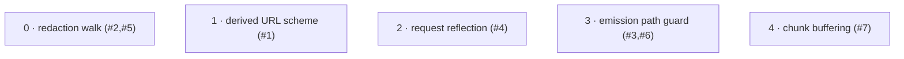

# Horizon 02 — llm-http-proxy review fixes

> Roadmap JSON: `horizon-02-review-fixes-roadmap.json` · Execute with
> `/dima-plan-roadmap-ddd-v5 execute docs/roadmaps/llm-http-proxy/horizons/horizon-02-review-fixes-roadmap.json`

## Task & Analysis

Horizon 2 of the `llm-http-proxy` project. Horizon 1 shipped the standalone package (scaffold,
interceptor-core, provider-parser, payload-redaction, pluggable-logger). This horizon is a
**review-fixes pass** on the seven correctness findings from the code review; the performance
finding (#8) and the two YAGNI cleanups (#9, #10) are deferred to a later Planning Horizon.
`vision.md` remains authoritative for the long-term objective — this horizon does not touch the
still-deferred vision success bars (latency benchmark, transformer pipeline, OTEL exporter,
package identity/publish, Nest adapter).

- **Objective:** Fix the seven correctness code-review findings (#1–#7) in the llm-http-proxy
  package, each shipped with a failing-before/passing-after regression test, keeping lint,
  typecheck, test and build green; findings #8/#9/#10 deferred.
- **Success definition:** Findings #1–#7 resolved in `packages/llm-http-proxy/src`; each fix has a
  regression test in the existing `*.test.ts` files that fails against the pre-fix implementation
  and passes after; the horizon-1 suite stays green; `pnpm lint / typecheck / test / build` green
  at package **and** repo-root level (root `nest build` + root `jest` after the package dist is
  rebuilt through the `link:` consumer); no new runtime dependency; no public API change.
- **Domain shape:** `technical` — interception machinery (monkey-patched ClientRequest, chunk
  decoding, an async emission path, a redaction tree-walk), no business entities or rules.
  Consistent with the binding `decisions.md` classification.

### Ubiquitous language

| Term | Meaning |
|---|---|
| interceptor | The Interceptor class that monkey-patches `ClientRequest.prototype.write/end`. |
| capture decision (`shouldCapture`) | Per-request test deciding whether a request is intercepted (finding #8, deferred). |
| emission path (`emitLogEntry`) | The `setImmediate`-deferred pipeline that parses, redacts, runs pluggable callbacks and calls the logger. |
| `completeCapture` / `state.emitted` | Finalization step that emits the log entry once per request; needs a once-only guard. |
| provider parser | The `ProviderParser` seam plus the `providerParser` option (registry collapse is deferred #9). |
| redaction walk | The recursive `walk()` in `redaction.ts` that masks sensitive keys. |
| chunk buffering | Collecting raw Buffers and concatenating before a single UTF-8 decode. |
| derived URL (`deriveUrl`) | Reconstruction of the logged request URL, including scheme. |
| request reflection (`reflectCall`) | Forwarding the intercepted write/end call to the pristine original unchanged. |

### Assumptions

- All in-scope findings live in `packages/llm-http-proxy/src`; #9/#10 (and thus `src/app.module.ts`) are out of scope this horizon.
- Baseline lint/typecheck/test/build are green, so "stay green" is a regression bar.
- Cited line numbers are fictitious — map findings to symbols (`deriveUrl`, `isSensitiveKey`/`DEFAULT_SENSITIVE_FIELDS`, `emitLogEntry`, `reflectCall`, `walk`, `completeCapture`, `appendChunk`).
- Runner is Jest (ts-jest) and stays Jest; regression tests go into the existing four `*.test.ts` files.
- Node ≥18 with the built-in `string_decoder` available.
- No public API change to `index.ts`; option semantics fully backward compatible.

### Risks

- Fixes #2–#7 touch shared machinery (`redaction.ts` walk, the monkey-patched ClientRequest path); a regression can silently corrupt captured payloads or alter non-matching-request behavior — each fix's revert-to-fail test must genuinely exercise the defect.
- Narrowing the `'token'` redaction rule (#2) could regress `access_token`/`refresh_token`/`api_token` while exempting the `*_tokens` accounting fields.
- #3 (unguarded async callback crash) and #6 (double emit) are async-ordering behaviors — the plan uses the public `attachCapture` + a fake EventEmitter and a `setImmediate` flush to keep them deterministic.
- The horizon-1 binding note (forward via the **unbound** original with the real ClientRequest as receiver) constrains the #4 fix — `original.apply(receiver, args)` satisfies it.

## Out of Scope / Deferred

| Item | Reason |
|---|---|
| #8 negative capture-decision cache (`kNoCapture` symbol tag) | Sole performance finding; independent of the correctness pass; onWrapper is a third call site — next horizon. |
| #9 collapse the fake per-provider parser registry to one `defaultParser` | Breaking public-API change (`index.ts` exports + `src/app.module.ts` consumer in lockstep + package rebuild); spans two subsystems — next horizon. |
| #10 remove dead scaffolding from `src/app.module.ts` | Cosmetic dead-code removal; depends on #9 (shares the file, consumes `resolveParser`/`parseCall`) — next horizon. |
| Enforced-order transformer pipeline with Content-Length accounting | Still-binding `vision.md` success bar, deferred since horizon 1. |
| Latency-budget benchmark | Still-binding `vision.md` bar; blocked on un-signed-off methodology (`blockers.md`). |
| OTEL span exporter demo | Still-binding `vision.md` bar, deferred since horizon 1. |
| Package identity / version bump / publish verification / thin Nest adapter | Open decisions in `blockers.md` / `next-horizon-brief.md`. |
| Adding real per-provider parsing divergence | Contradicts finding #9's collapse. |
| Streaming/SSE parsing beyond the multi-byte fix; test-runner migration; fixes elsewhere in the Nest app | Not asked for. |

## Phases

### 0 · Fix redaction walk token key-matching and DAG traversal
- **Subsystem / layer:** redaction walk · infrastructure · small
- **Findings:** #2 (bare `'token'` substring-redacts `*_tokens` accounting fields), #5 (`walk()` never removes nodes from the `seen` WeakSet → DAG second-reference becomes the placeholder)
- **Inputs:** `redaction.ts` (`DEFAULT_SENSITIVE_FIELDS`, `isSensitiveKey`, `walk`); `redaction.test.ts`; discovery findings finding-2/finding-5; task.md #2/#5
- **Expected result:** `DEFAULT_SENSITIVE_FIELDS` drops bare `'token'` for explicit `*Token`/`*_token` entries (access/refresh/auth/api/id); `walk()` does add-before-recurse / delete-after in **both** the array and object branches; `redaction.test.ts` gains a DAG regression test and a token-accounting regression test, each fail-before/pass-after; circular-reference, idempotency, PII and X-Password tests stay green.
- **Rubric:** token-accounting-fields-survive-redaction (8) · sensitive-token-keys-still-redacted (8) · dag-shared-subtree-preserved (7) · true-cycles-still-broken-and-idempotent (8) · regression-tests-fail-before-pass-after (9) · gates-green (9)
- **Healer hint:** most likely over-correction — a plain key named exactly `token` holding a credential stops being redacted, or a new `*_token` suffix rule still substring-matches `prompt_tokens`; use exact-match plus explicit `access_token`/`refresh_token` entries and an anchored suffix rule.

### 1 · Derive the URL scheme so HTTPS provider calls log an https:// URL
- **Subsystem / layer:** derived URL · infrastructure · small
- **Finding:** #1 (`emitLogEntry` calls `deriveUrl(req)` with no scheme → every HTTPS provider call logs `http://`; already flagged in the horizon-1 interceptor-core grade)
- **Inputs:** `interceptor.ts` (`deriveUrl` call site in `emitLogEntry`); `interceptor.test.ts`; discovery finding-1; task.md #1
- **Expected result:** the call site derives the scheme from `req.protocol` (fallback to a socket/agent TLS check) and passes `'https'`/`'http'` into `deriveUrl` **without changing its signature**; `interceptor.test.ts` gains one regression test asserting an intercepted TLS request logs an `https://` URL, fail-before/pass-after, with the existing plain-http `127.0.0.1` `http://` test unmodified and green.
- **Rubric:** https-scheme-derivation (8) · https-url-regression-and-http-still-green (7) · gates-green (9)
- **Healer hint:** read `req.protocol` first, then fall back to `req.socket instanceof tls.TLSSocket` / `req.agent?.protocol === 'https:'`; leave the `http://` `127.0.0.1` assertion untouched.

### 2 · Forward intercepted write/end without dropping the encoding argument
- **Subsystem / layer:** request reflection · infrastructure · small
- **Finding:** #4 (`reflectCall`'s `callback !== undefined` branch calls `original.call(receiver, chunk, callback)`, dropping the encoding for `req.write(str, 'base64', cb)`)
- **Inputs:** `interceptor.ts` (`reflectCall`, `writeWrapper`, `endWrapper`); `interceptor.test.ts`; discovery finding-4 + binding discovery (forward via unbound original, real ClientRequest as receiver); task.md #4
- **Expected result:** the hand-rolled dispatch is replaced by a faithful forward (`original.apply(receiver, args)`) so chunk/encoding/callback all reach the pristine original unchanged and the return value propagates; unused `chunk` param removed; `interceptor.test.ts` gains a regression test spying the pristine `ClientRequest.prototype.write` asserting `req.write(buf,'base64',cb)` reaches it with `'base64'` and the same callback reference, fail-before/pass-after; existing write/end tests green.
- **Rubric:** pristine-original-forwarding (8) · encoding-arg-regression-test (7) · gates-green (9)
- **Healer hint:** forward the wrapper's full argument list verbatim to the captured unbound original with the real ClientRequest as receiver; drop the now-unused `chunk` parameter.

### 3 · Guard the emission path against callback crashes and double emission
- **Subsystem / layer:** emission path · application · medium
- **Findings:** #3 (only `logger()` is try/caught; `deriveUrl`/`resolveParser`/`parseCall`/`redact` run unguarded inside `setImmediate` → a throwing pluggable callback crashes the process), #6 (`completeCapture` has no once-guard → response-then-error emits two entries, the second carrying `entry.error`)
- **Inputs:** `interceptor.ts` (`emitLogEntry`, `completeCapture`, `attachCapture`, `CaptureState`); `interceptor.test.ts`; discovery finding-3/finding-6; task.md #3/#6
- **Expected result:** the whole `emitLogEntry` body is wrapped in try/catch inside the `setImmediate`; a `state.emitted` flag set at the top of `completeCapture` early-returns on re-entry; `interceptor.test.ts` gains a test driving public `attachCapture` with a fake EventEmitter req emitting response+end then error asserting `entries.length === 1` after a `setImmediate` flush, and a test with a `providerParser` whose `extractModel` throws asserting no unhandled rejection/crash — both fail-before/pass-after; existing install-twice and refused-connection single-emission tests stay green.
- **Rubric:** exactly-once-emission-across-response-then-error (8) · emission-path-cannot-crash-process (8) · guard-preserves-legitimate-first-emission (7) · regression-tests-fail-before-pass-after-deterministic (8) · existing-suite-and-toolchain-stay-green (9)
- **Healer hint:** name the exact `interceptor.ts` symbol and guard placement; require the revert-to-fail demonstration and a `setImmediate` flush helper (no `setTimeout`).

### 4 · Buffer raw body-capture chunks before UTF-8 decode
- **Subsystem / layer:** chunk buffering · infrastructure · medium
- **Finding:** #7 (`appendChunk` decodes each Buffer chunk independently → a multi-byte character split across a chunk boundary becomes U+FFFD)
- **Inputs:** `interceptor.ts` (`CaptureState.requestBodyChunks`/`responseBodyChunks`, `appendChunk`, `emitLogEntry` body assembly); `interceptor.test.ts` (`startServer` helper); discovery finding-7; task.md #7
- **Expected result:** body chunks stored as `Buffer[]` (string/object chunks converted to Buffer at append time), concatenated and decoded once with `toString('utf8')` (or a single `node:string_decoder` pass) in `emitLogEntry`, no new dependency; `interceptor.test.ts` extends the response path so the server writes a body in two `res.write()` calls splitting a multi-byte character across the boundary and asserts `entry.maskedResponseBody` round-trips it, fail-before/pass-after; existing body-capture tests green.
- **Rubric:** multibyte-boundary-roundtrip (8) · request-and-response-both-fixed (7) · heterogeneous-chunk-inputs-handled (7) · no-new-dependency-builtins-only (9) · regression-test-splits-multibyte-across-writes (8) · gates-stay-green (8)
- **Healer hint:** push every request- and response-body chunk into a `Buffer[]` (wrapping strings with `Buffer.from(chunk, encoding)`), decode exactly once via `Buffer.concat(chunks).toString('utf8')` or a single `StringDecoder` pass ending with `end()`.

## Dependency map

All five phases are dependency-independent (`dependsOn: []`). Phases 1–4 all edit `interceptor.ts`,
so executing them in order avoids rebase churn — a sequencing preference, not a dependency.

## Success criteria

1. Findings #1–#7 resolved (one phase each; #2+#5 and #3+#6 paired within a single subsystem), each with a fail-before/pass-after regression test in the existing Jest `*.test.ts` files, `pnpm lint / typecheck / test / build` green at **both** package and repo-root level (root `nest build` + root `jest` after the package dist is rebuilt through the `link:` consumer), no new runtime dependency. #8/#9/#10 deferred and not certified here.
2. Phase 0: `redaction.ts` drops bare `'token'`, `walk()` add-before/delete-after in both branches; DAG + token-accounting regression tests fail-before/pass-after; circular/idempotency/PII/X-Password green.
3. Phase 1: scheme derived from `req.protocol` into the unchanged `deriveUrl`; TLS request logs `https://`, fail-before/pass-after; plain-http `http://` test green.
4. Phase 2: `reflectCall` no longer drops the encoding; `req.write(buf,'base64',cb)` reaches the pristine prototype with encoding + callback, fail-before/pass-after.
5. Phase 3: `emitLogEntry` body fully try/caught in the `setImmediate`; `state.emitted` once-guard; exactly one entry across response-then-error and no crash from a throwing `providerParser`, both fail-before/pass-after; install-twice + refused-connection tests green.
6. Phase 4: body chunks stored as `Buffer[]`, decoded once, no new dependency; multi-byte char split across two `res.write()` calls round-trips, fail-before/pass-after; body-capture tests green.

## Quality gate

- **Path:** Full. **Discovery:** ran (existing system). **Domain shape:** technical (matches phases, score 9).
- **Iterations:** 3.
  - Iteration 1 — critic failed `phase-blast-radius` (major): the combined phase bundled URL-scheme derivation (#1) + `reflectCall` forwarding (#4). Healed by splitting into phases 1 and 2 (5 phases total, within the 3–5 target).
  - Iteration 2 — critic failed `success-coverage` (major): `task` / `analysis.objective` / `successCriteria[0]` still claimed "all 10 findings" in scope, contradicting `deferred`. Healed by rewording to scope #1–#7 with #8/#9/#10 deferred; stale "horizon 2" deferral labels normalized.
  - Iteration 3 — **pass**. All 10 rubric dimensions pass. Residual stale `analysis.assumptions[6]/[7]` + `risks[1]` (still mentioned #9's registry collapse) cleaned up mechanically post-gate.
- **Adversarial verification:** none needed — no surviving blocker-severity issue (both failures were `major`, healed directly).
- **Accepted debt:** `resources-gathered` minor (score 7) — `requiredMaterials` empty; `task.md` is a consumed input not formally listed, but listing it would duplicate `discoveryFindings`.
- **Final verdict:** PASS.
