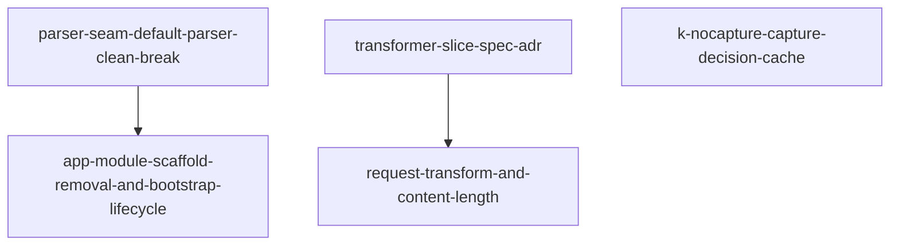

# Horizon 3 — clean-break parser, kNoCapture cache, transformer first slice

## Task & Analysis

**Objective:** Execute llm-http-proxy horizon 3: land the three deferred code-review findings — #9 (collapse the fake per-provider parser registry to a single defaultParser with a clean-break index.ts public surface and in-lockstep consumer update), #10 (remove dead app.module.ts scaffolding, move install() into a bootstrap hook), #8 (kNoCapture negative capture-decision cache) — plus the promoted first slice of the vision-track enforced-order request/response transformer pipeline with Content-Length accounting, all with both gate levels green.

**Success definition:** (1) provider-parser.ts keeps only defaultParser (plus types and default helpers); PARSERS_BY_HOST/resolveParser/parserToTokenCounter and the five aliases deleted; index.ts no longer exports resolveParser/parseCall; src/app.module.ts is the sole consumer compiling against the new surface; VERSION 0.2.0 in package.json AND index.ts + rebuilt dist. (2) app.module.ts has no sample*/void lines; install() runs from an OnApplicationBootstrap hook. (3) kNoCapture tag set on first shouldCapture=false, all three wrappers short-circuit, regression test proves exactly-once for non-matching requests. (4) request transformer runs before send; wire Content-Length = Buffer.byteLength of transformed body when replaced; ordering + intact-mutation tests. (5) both gate levels green, package dist rebuilt first.

**Domain shape:** technical — pure machinery engineering (parser registry collapse, capture-decision cache, lifecycle hook, transform/Content-Length logic in an HTTP interception pipeline); matches the binding decision in `decisions.md`.

**Ubiquitous language:** defaultParser · providerParser option · clean break · kNoCapture capture-decision cache · bootstrap hook · request transformer / response transformer · Content-Length accounting · wire/caller intact.

**Assumptions:** horizon 2 landed + green; parseCall may stay an internal; app.module.ts is the sole consumer; the bump is an in-package marker only; hostname fixed post-construction; transformer slice is sync with passthrough default; Content-Length rewritten only when a captured body was actually replaced (Buffer.byteLength).

**Risks:** stale kNoCapture (proven by test); #9 blast radius (grep + lockstep first); #10 startup-window gap (behavior change pinned by tests); transformer slice implicitly rewrites the latency bar; Content-Length/response-buffer edges (passthrough cases tested).

## Discovery Findings

20 findings grounded the plan — key ones:

| Area | Finding | Implication |
|---|---|---|
| provider-parser exports | exports resolveParser/parserToTokenCounter/parseCall + helpers; NO defaultParser exists | #9 must ADD defaultParser + delete the rest |
| 5 parser aliases | all five === genericChatParser (same object) | collapse is behavior-preserving |
| index.ts surface | exports resolveParser, parseCall, VERSION='0.1.0' among many | drop exactly 2 values, re-export defaultParser, bump both |
| wrapper call sites | exactly 3 shouldCapture sites: onWrapper / writeWrapper / endWrapper; no kNoCapture | #8 tag lives in wrappers, never inside shouldCapture |
| body flow | capture Buffer[] -> exactly-once emitted guard -> concat-parse; no Content-Length anywhere | transformer hooks are greenfield seams; CL accounting fresh |
| app.module.ts | import-time install(), dead sample*/void block, customProviderParser delegates to resolveParser(undefined); redact used only by maskedSample | #10 hook pairing; #9 rewrites delegate to defaultParser |
| whole-repo imports | ONLY app.module.ts imports 'llm-http-proxy' | clean break safe, no shims |
| gate baseline | horizon 2: package 89/89 + root gates green per ledger; dist read via link: | rebuild package dist before root gates every phase |

## Out of Scope (deferred)

- **Transformer response strand** — held for horizon 4 by the size cut; the ADR pins its contract.
- **Latency-budget benchmark** — blocked on benchmark-methodology sign-off in blockers.md.
- **OTEL span exporter demo** — blocked on optional @opentelemetry/* peer-dep decision.
- **Package identity/name decision, publish verification, npm publish** — blocked on the open name/version decision; only the in-package 0.2.0 marker is in scope.
- **Async/streaming/chunk-level and gzip/encoding-aware transformers** — beyond the first slice.
- **Streaming/SSE/TLS/retries/auth provider features** — interface-only per decisions.md.
- **Optional thin Nest adapter and repo-root workspaces/CI restructure.**
- **Public-API semver freeze for LlmLogEntry/LlmLoggingOptions** — the clean break is the only deliberate API change.

## Required Materials

| Name | Kind | Why needed | Acquisition |
|---|---|---|---|
| Transformer first-slice API contract (signatures, option names, ordering) | document | zero transformer code exists; the public API surface must be committed before code | Authored in the transformer-slice-spec-adr phase, logged in decisions.md |

## Phases

### Phase 1 — defaultParser clean break in the provider parser (#9)
- **boundedContext:** provider parser / parser seam · **layer:** infrastructure · **blastRadius:** medium
- **Goal:** collapse the fake registry (PARSERS_BY_HOST/resolveParser/parserToTokenCounter + 5 aliases) to `export const defaultParser`; drop resolveParser/parseCall from index.ts (clean break); keep parseCall internal; bump VERSION 0.1.0→0.2.0 in index.ts AND package.json; rewrite app.module.ts customProviderParser.extractModel to delegate to defaultParser (unknown→'elenwatch-fallback' kept); rewrite the two registry-identity tests.
- **Deliverable:** defaultParser-only surface, grep-clean, sole consumer compiles, VERSION 0.2.0 both sources + dist, both gates green.
- **Depends on:** — · **Compensation:** revert the parser/index diff + VERSION, rebuild dist.
- **Rubric:** registry-collapse-complete (8) · public-surface-clean-break (8) · consumer-lockstep (8) · default-parser-behavior-parity (8) · version-bump-consistent (7) · gates-green-both-levels (9)
- **Healer hint:** stale dist + straggler call sites; rebuild package dist before root build, then grep `resolveParser|parseCall|PARSERS_BY_HOST|0\.1\.0`.

### Phase 2 — app-module wiring: scaffold removal and bootstrap-lived install (#10)
- **boundedContext:** app-module wiring · **layer:** application · **blastRadius:** small
- **Goal:** delete sample*/void block + redact import (used only by maskedSample; DEFAULT_SENSITIVE_FIELDS stays); move install() from import time into new OnApplicationBootstrap.onApplicationBootstrap(); restore() stays in onApplicationShutdown.
- **Deliverable:** scaffold-free app.module.ts; install() only from the hook; both gates green.
- **Depends on:** parser-seam-default-parser-clean-break · **Compensation:** reinstate import-time install() (two-line revert).
- **Rubric:** no-import-time-install (9) · scaffold-and-imports-exactly-right (7) · clean-break-surface-compat (8) · bootstrap-hook-fires-and-pairs (9) · rollback-safe-diff (7) · both-gates-green (8)
- **Healer hint:** hook added but never fires (missing `implements OnApplicationBootstrap`); boot the app in test and assert isInstalled === true + one captured entry.

### Phase 3 — kNoCapture negative capture-decision cache (#8)
- **boundedContext:** capture decision · **layer:** infrastructure · **blastRadius:** small
- **Goal:** set kNoCapture symbol tag on first shouldCapture=false; short-circuit onWrapper/writeWrapper/endWrapper (tag in wrappers, shouldCapture stays pure); regression test proving shouldCapture runs exactly once for non-matching requests while matching ones still capture.
- **Deliverable:** kNoCapture cache at all three wrapper sites + exactly-once regression test; both gates green.
- **Depends on:** — (independent)
- **Rubric:** k-nocapture-tag-at-wrapper-call-sites (8) · all-three-wrappers-short-circuit (8) · decision-parity-preserved (7) · exactly-once-regression-test (8) · per-request-scoping-no-stale-state (7)
- **Healer hint:** guard lands only in writeWrapper or inside shouldCapture; move into all three wrappers, keep shouldCapture pure.

### Phase 4 — body transformation: first-slice contract ADR
- **boundedContext:** body transformation · **layer:** cross-cutting · **blastRadius:** small
- **Goal:** author the ADR pinning transformer signatures, InterceptorOptions field names (requestTransform?/responseTransform?), enforced ordering (request before send, response before caller), Content-Length policy (rewrite only replaced captured bodies, Buffer.byteLength utf8, chunked/gzip/absent pass through), response buffering boundary (captured non-streaming only). Log promotion in decisions.md.
- **Deliverable:** one slice-spec ADR + decisions.md promotion line.
- **Depends on:** — (independent)
- **Rubric:** option-names-pinned (8) · signatures-callable (8) · ordering-seam-specified (8) · content-length-policy-exhaustive (7) · response-buffering-boundary-bounded (7) · decisions-promotion-logged (7)
- **Healer hint:** ADR reads complete but contains 'or decided equivalents' / 'TBD'; grep and pin both option names + add the Content-Length decision table.

### Phase 5 — body transformation: request strand with Content-Length accounting
- **boundedContext:** body transformation · **layer:** infrastructure · **blastRadius:** medium
- **Goal:** wire requestTransformer between chunk capture and reflectCall in writeWrapper/endWrapper (mutate args so transformed body hits the wire); rewrite Content-Length to Buffer.byteLength(utf8) only when a captured body was actually replaced; passthrough default.
- **Deliverable:** mutated request body reaches wire intact/in-order with byte-accurate Content-Length; passthrough cases untouched; both gates green.
- **Depends on:** transformer-slice-spec-adr · **Compensation:** delete the additive transform fields + hook (passthrough restores prior behavior).
- **Rubric:** wire-body-intact-in-order (9) · content-length-accounting (8) · untransformed-passthrough (7) · reflect-arg-fidelity (7) · idempotent-repeatable-rollback (7) · gates-green-dist-rebuilt (8)
- **Healer hint:** transforming per chunk instead of once over the concatenated capture corrupts multibyte chars and Content-Length; run the transformer exactly once on the full concatenation at the terminal write/end.

## Dependency map

## Success Criteria

1. Findings #9, #10 and #8 resolved (one phase each except #10 pairs with #9's consumer lockstep), plus the promoted transformer request strand, each with both gate levels green and the package dist rebuilt before root gates; deferred: response strand, latency benchmark, OTEL exporter, package publish.
2. `parser-seam-default-parser-clean-break`: registry deleted, index.ts clean-break surface, app.module.ts sole consumer compiles, VERSION 0.2.0 both sources, registry tests rewritten, behavioral suites green, both gates green.
3. `app-module-scaffold-removal-and-bootstrap-lifecycle`: sample*/void + redact import gone, install() only from OnApplicationBootstrap (paired with restore()), no import-time patch, both gates green.
4. `k-nocapture-capture-decision-cache`: tag set on first negative and short-circuits all three wrappers, shouldCapture stays pure, exactly-once regression test, decision parity preserved, both gates green.
5. `transformer-slice-spec-adr`: one ADR pins signatures, option names, ordering, Content-Length policy, response buffering boundary; promotion logged in decisions.md.
6. `request-transform-and-content-length`: mutated request body reaches the wire intact/in-order with Content-Length = Buffer.byteLength, transform runs once per body, passthrough untouched, arg-forwarding preserved, both gates green with dist rebuilt.

## Quality Gate

- **Path:** full (technical shape, existing system, discovery ran, external materials)
- **Iterations:** 1 (passed on iteration 0)
- **Issues raised:** 10 (one per rubric dimension) → verified blockers 0 → healed 0 → **accepted debt 1**
- **Accepted debt (minor):** `resources-gathered` — requiredMaterials[0] is self-referential (the ADR phase authors the 'material' it lists). Category error, not a gap; the contract lives in phases[3].expectedResult and is consumed via phases[4].dependsOn/inputs. Fixing would be cosmetic re-labelling with no planning impact.
- **Final verdict:** **PASSED** — 0 surviving blocker/major issues; `domain-shape-fit` confirmed `technical` (no force-escalation); the single failing dimension is minor and recorded as accepted debt.

---

Execute with:
`/dima-plan-roadmap-ddd-v5 execute docs/roadmaps/llm-http-proxy/horizons/horizon-03-clean-break-knocapture-transformers-roadmap.json`