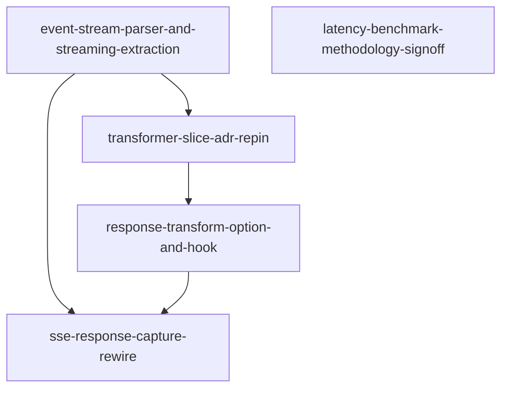

# Horizon 04 — streaming responses + latency benchmark sign-off
## Task & Analysis
**Task:** Can the llm-http-proxy module benefit from generator functions or readable/writable streams to improve stability and reduce latency and resources usage? Horizon 4 of the llm-http-proxy project: land real SSE event-stream response support with bounded memory (merged incremental parser + streaming token/model extraction, transformer-slice ADR re-pin for the streaming boundary, additive responseTransform option + constructor capture, and the response-strand rewire with SSE detection/bounded-capture/per-event redaction+transform/single end-entry) and sign off the latency-benchmark methodology + budget numbers in decisions.md (reconciling vision.md's obsolete 'no work beyond body capture on the request path' bar). The benchmark itself is NOT executed this horizon.
**Objective:** Land real streaming-response (SSE event-stream) support so llm-http-proxy emits usable, bounded-memory log entries for streamed LLM responses, revise the transformer-slice ADR's response/streaming contract, and sign off the latency-benchmark methodology + budget numbers in decisions.md — without executing the benchmark itself and without regressing any gate or test.
**Success definition:** Measurable bar: (1) an SSE `data:`-event stream (OpenAI chat/completions-style, incl. Anthropic message_start/message_delta) produces a single log entry with real model, inputTokens, outputTokens, and callerTrace — never 'unknown'/0 — proven by a package test that streams through the real patched ClientRequest path; (2) bounded memory is proven: when capturePayloads=false, streaming responses never append to responseBodyChunks (the full stream is never accumulated), demonstrated by a test that a large multi-chunk SSE body completes with an empty/uncapped response capture; (3) transformer-slice-spec.md (the binding ADR) is revised: the 'streaming out of scope' clause and the response-strand buffered-only boundary are replaced with a re-pinned streaming boundary + response-strand contract that preserves the binding ordering verbatim (transform before the body reaches the caller; emitLogEntry's JSON.parse sees the post-transform body; redaction runs after the transform) and states unambiguously what responseTransform means per SSE event vs the buffered path; (4) decisions.md records the signed-off benchmark methodology — concrete method (harness, hardware, warmup, iteration count, measurement points, interleaved baseline) AND budget numbers (added p50/p99 latency for buffered non-streaming interception including transformer work now on the request path) — with vision.md's obsolete 'no work beyond body capture on the request path' bar explicitly reconciled, such that a later horizon can execute the benchmark with no further decisions; (5) no regression: package gates (tsc, eslint, jest, build) and root gates stay green and the existing 95 package tests keep passing (new streaming/methodology tests are additive, not replacing).
**Domain shape:** technical — The objective is interception/streaming/parsing/redaction machinery plus a benchmark methodology — no business entities, rules, or workflows a domain expert would recognize — and decisions.md line 2 already records domain-shape-fit for llm-http-proxy as 'technical' (binding).
**Assumptions:**
- SSE is detected by content-type `text/event-stream` and/or the `data:`/`event:` line shape over the known provider patterns; both OpenAI-style (JSON per `data:` line) and Anthropic-style (event blocks carrying `data:` JSON) parse through one incremental event-stream parser.
- Model and tokens are extractable without full-body accumulation: model from early events' JSON (OpenAI per-chunk `model`, Anthropic `message_start`), output/input tokens from the terminal usage-bearing event (OpenAI final `usage` chunk, Anthropic `message_delta` usage) falling back to incremental char-delta estimation via running counters, never concatenated text.
- capturePayloads=true keeps bounded design by redacting each SSE event's JSON individually and retaining only redacted text in a bounded accumulator for maskedResponseBody; the AC's bounded-memory bar binds capturePayloads=false, and the true-branch policy is explicitly pinned in the ADR revision rather than left implicit.
- Caller-visible response delivery stays listener-only (attachCapture's 'data'/'end' handlers; no re-emission/replay of transformed bytes onto the caller's IncomingMessage listeners), which the ADR re-pin uses to ground 'transform before the body reaches the caller' against the buffered copy used for emission.
- vision.md's latency budget (<1ms p50 / <2% p99 added latency) remains the binding budget anchor; this horizon rewrites only the METHOD that measures it and pins the numbers, it does not measure.
- The open package name/version blocker and the OTEL peer-dep decision remain open and do not gate this horizon; provider-parser's defaultParser surface stays the clean VERSION 0.2.0 break and the streaming support is additive on the interceptor's response path.
- A secret whose sensitive field value spans two SSE events is a residual redaction gap (per-event redaction only); this is accepted and named in the ADR, not silently ignored.
**Risks:**
- SSE-detection ambiguity: a missing/incorrect content-type or a non-SSE chunked response could misroute into the streaming path (corrupt parse) or into the buffered path (unbounded accumulation returns, violating the AC) — mitigation is the content-type-plus-line-shape detection falling back to the previous buffered behavior under a bounded cap.
- Cross-chunk/cross-event boundaries: an SSE `data:` line or its JSON split across TCP chunks or mid multi-byte character corrupts on per-line parsing (the horizon-2 finding #7 class recursing on the streaming path) unless the streamed parse keeps a bounded line/event buffer — a regression here silently breaks the 'not unknown/0' AC.
- Token/model extraction risk: if the terminal usage event is absent (or arrives as `[DONE]` with no usage), and the incremental counter is not wired, streaming entries fall back to 0/'unknown' — directly failing AC item 1; the parser must treat usage-wins-else-incremental-estimate as a first-class streaming rule, not a buffered-afterthought.
- ADR re-pin vs binding ordering conflict: a sync-only ResponseTransformer over the full body is impossible under bounded memory, so the revised response-strand contract must define per-event transform semantics; if the revision weakens or silently relocates the binding ordering (transform-before-caller, JSON.parse post-transform, redaction after), the horizon ships a correctness regression against its own AC — this tension must be resolved in the ADR text and mirrored by tests.
- Response-data-path cost: today's appendChunk already runs per 'data' event (emission work is NOT off the response-data path), and streaming adds per-event parse+count on that path; the signed-off budget numbers must account for this or the later benchmark will measure a regression that streaming support itself introduced.
- Benchmark methodology signed off without execution can be non-reproducible: if harness, hardware, warmup, iteration count, and measurement points are not pinned exactly, the later execution horizon can game or stall on the numbers — and vision.md's obsolete 'no work beyond body capture on the request path' bar must be explicitly reconciled in the sign-off or the binding vision bar silently diverges from the ADR that now puts requestTransform on the request path.
- capturePayloads=true ambiguity: the AC's bounded-memory bar explicitly binds only capturePayloads=false, so a reader may assume bounded-both-ways; if the ADR revision does not pin the true-branch capture/redaction policy, the acceptance criterion's bounded bar becomes unverifiable and the streaming/horizon scope creeps.
- Regression surface: the streaming response path rewires attachCapture's 'data'/'end' handlers which sit next to the exactly-once emitted guard and the error path; a subtle change re-introduces double-emission or drops the error entry — the existing 95 tests must all stay green and new streaming-specific tests must cover end/error/abort ordering.

## Discovery Findings
| Area | Finding | File | Implication |
|---|---|---|---|
| attachCapture response wiring | attachCapture (interceptor.ts:398-429) tags the ClientRequest with a CaptureState { requestBodyChunks, responseBodyChunks, capturedEnd, finished, emitted, callerTrace } then attaches exactly three listeners via req.on: req.on('response', (res) => { res.on('data', (chunk) => { appendChunk(state.responseBodyChunks, chunk); }); res.on('end', () => { state.finished = true; this.completeCapture(req, state); }); }) and req.on('error', (err) => { this.completeCapture(req, state, err); }). responseBodyChunks gets appended at line 418 inside the res 'data' handler. There is NO res 'error'/'aborted'/'close' handler and no content-type inspection in the capture wiring; res.headers is reachable inside the 'response' callback, the only place SSE detection could read content-type before the first 'data' event. | packages/llm-http-proxy/src/interceptor.ts | The streaming path rewires lines 417-423. content-type detection slots into the 'response' callback between line 416 and res.on('data') at 417 without touching the wrapper hot path. Exactly-once guard and res 'end'/'error' ordering stay first. |
| completeCapture exactly-once guard + setImmediate emission | completeCapture (interceptor.ts:431-451): if (state.emitted) return; state.emitted = true; setImmediate(() => { try { this.emitLogEntry(req, state, error); } catch {} }). The emitted flag is the sole terminal-signal guard; state.finished is set in 'end' but never read by completeCapture. | packages/llm-http-proxy/src/interceptor.ts | Streaming keeps this exact structure; a streaming entry is emitted only after stream 'end' — per-event work is incremental capture, not incremental emission. end/error/abort ordering regression is the double-emission risk to test. |
| emitLogEntry derivation + parseCall + redact | emitLogEntry derives rawRequest = state.transformedBody ?? Buffer.concat(requestBodyChunks).toString('utf8') and rawResponse = Buffer.concat(responseBodyChunks).toString('utf8'), JSON.parses both (undefined on failure), then parseCall(effectiveParser, requestJson, responseJson, Boolean(error)) with parser = this.providerParser ?? defaultParser and tokenCounter hooks merged. Redaction: only inside if (this.capturePayloads): entry.maskedRequestBody = redact(requestJson, this.redaction, 'request'), entry.maskedResponseBody = redact(responseJson, this.redaction, 'response'). | packages/llm-http-proxy/src/interceptor.ts | For SSE, the concatenated rawResponse is a data:-line stream: JSON.parse fails, outputTokens → 0/'unknown' — the exact AC failure. Streaming design keeps buffers empty when capturePayloads=false (bounded bar) and teaches the parser/emit path per-event incremental results; maskedResponseBody comes from redacted per-event JSON when capturePayloads=true. |
| SSE / streaming detection — none exists | Repo-wide grep for event-stream|text/event|SSE|streaming|stream: zero detection code; only test-name comments and an eslint comment about Node's stream internals. No setEncoding, no StringDecoder, no PassThrough/Transform usage. appendChunk's Buffer concat contract (single decode at the end) is the only existing cross-chunk integrity precedent. | packages/llm-http-proxy/src/interceptor.ts | SSE detection (content-type text/event-stream plus data:/event: line shape) is new code with no existing convention to conflict with; the ADR 'streaming out of scope' clause and buffered-only boundary are accurate today and are exactly the text this horizon revises. The streaming parser must carry its own bounded line/event buffer. |
| response test harness in interceptor.test.ts | Two reusable patterns. (1) Real-patched-path: startServer() (test:38-72) serves canned bodies, post() (94-119) fires a real http.request, withEntries() (75-91) installs/restores and flushes via two setImmediate awaits. Streaming through the real path: server handler calls res.write(...) twice to split a body mid multi-byte char (test:704-741). (2) Off-network direct: fakeReq() (559-567) builds an EventEmitter with hostname/path/protocol/getHeader, then emit('response', res), emit('data', Buffer.from(...)), emit('end') drives capture, flushed with setImmediate. Advisory: Jest isolates module registries per spec file so restore() before others run. | packages/llm-http-proxy/src/interceptor.test.ts | Streaming-response tests reuse BOTH: the real-patched-path server variant (content-type text/event-stream, multiple res.write chunks splitting data: lines / mid-char) satisfies AC item 1; the fakeReq + emit('data') variant gives deterministic control (many small chunks prove responseBodyChunks stays empty when capturePayloads=false). Both flush with two setImmediate awaits and restore() in finally. |
| transformer ADR response-strand contract (§3, §5, §6) | §3 (71-74): 'the transform runs BEFORE the body reaches the caller. Relationship to the emission path is pinned: emitLogEntry's JSON.parse sees the POST-transform body (the log entry reflects what the caller actually received), and redaction runs after the transform.' §5 (96-103): 'Only captured, non-streaming responses qualify for buffering + transformation... no SSE/streaming/chunked-response special handling in the slice. This boundary is NOT extended by this ADR.' §6 (105-110) out of scope: async transformers, 'Streaming / chunk-level (per-chunk) transformation', gzip, 'The response strand (responseTransform implementation) — horizon 4'. §1 line 27 reserves responseTransform as 'NOT implemented in horizon 3'. | docs/roadmaps/llm-http-proxy/transformer-slice-spec.md | Exactly the sentences the horizon revises: §3 ordering ('JSON.parse sees POST-transform body', 'before the body reaches the caller') must be re-pinned to per-event transform semantics for streaming, §5's buffered-only boundary extended, §6's streaming/per-chunk out-of-scope line re-scoped, and the sync-only full-body ResponseTransformer signature (§2) reconciled with bounded-memory per-event streaming. |
| provider-parser defaultParser surface to mirror | defaultParser (provider-parser.ts:141-152): extractModel = readString(requestJson, 'model', 'model_name') ?? 'unknown'; estimateInputTokens = ceilCharsOverFour(readInputText(requestJson)); extractOutputTokens = usage-wins-else-ceilCharsOverFour(readOutputText). Helpers: readInputText (55-75) joins messages[].content / prompt / input; ceilCharsOverFour = Math.ceil(text.length/4); readUsageTokens (86-102) prefers usage.completion_tokens over usage.output_tokens; readOutputText (105-129) prefers choices[].message.content / choices[].text / completion / output_text. parseCall (155-166) zeroes outputTokens when isError. Providers MUST be pure, never mutate, fall back to 'unknown'/0, never throw. | packages/llm-http-proxy/src/provider-parser.ts | The incremental streaming variant mirrors this exact shape: model on early per-event data (OpenAI per-chunk 'model', Anthropic 'message_start'), output tokens from the terminal usage-bearing event (OpenAI final 'usage' chunk, Anthropic 'message_delta' usage), chars/4 estimator as per-event delta fallback, purity/no-throw contract binding. |
| redaction walk() — per-event reuse feasibility | redact() (redaction.ts:189-200) resolves config, side-gates via shouldMaskSide, then fresh WeakSet<object> + walk(payload, resolved, seen). walk() (207-243) returns primitives as-is, cycle-breaks via seen.has, arrays via map, plain objects key-by-key with isSensitiveKey substring masking, and seen.delete(value) after recursing so shared DAG subtrees are re-walked. Input never mutated; result is a structural copy. | packages/llm-http-proxy/src/redaction.ts | Per-event redaction reuses redact() directly and safely: stateless per call (fresh WeakSet), pure, cycle/DAG-safe, side-agnostic. Each SSE event passes through redact(eventJson, this.redaction, 'response') with no lingering state. The only gap is the named residual: a sensitive value split across two events (per-event redaction only). |
| benchmark / perf infrastructure — none | No benchmark, perf, latency, hrtime, or performance.now code exists anywhere. Package scripts: clean/prebuild/build/postbuild/lint/test/test:coverage/typecheck — no bench script, no bench fixture. Package jest testRegex `(/__tests__/.*|(\.|/)(test|spec))\.ts$`, ts-jest, testEnvironment node, --passWithNoTests. Root jest testRegex `.*\.spec\.ts$`, rootDir src. A `*.bench.ts` file would NOT be picked up by either config. | packages/llm-http-proxy/package.json | The methodology sign-off is a decisions.md/vision.md text change (no code). If the horizon adds any perf-measurement test it must be named *.test.ts/*.spec.ts to run under existing jest configs; --passWithNoTests means a skipped benchmark spec still passes gates. |
| VERSION marker / version baseline | index.ts:31 `export const VERSION = '0.2.0';` and package.json:3 `"version": "0.2.0"` are in exact agreement; no CHANGELOG at repo root. VERSION is part of the package public API. | packages/llm-http-proxy/src/index.ts | Streaming support is additive on the 0.2.0 surface: no existing export needs a breaking change; adding streaming options/parser variants is non-breaking. New public API must keep all existing exports byte-compatible (the 95 existing tests are the regression net). |
| responseTransform option — absent from code | Grep for ResponseTransformer|responseTransform in packages/llm-http-proxy returns NO matches in code: the type exists only in the ADR doc (§1 line 27, §2 line 55 `type ResponseTransformer = (responseBody: string) => string | undefined;`). options.ts:91 has only requestTransform; InterceptorOptions ends at requestTransform. No response-transform hook anywhere in the response path. | packages/llm-http-proxy/src/options.ts | Both the option type and the hook must be defined fresh. The ADR's sync-only full-body ResponseTransformer signature directly conflicts with bounded-memory per-event streaming, so the ADR re-pin (per-event transform semantics vs buffered transform) is a code-design decision the planner must make explicit. |

## Out of Scope (deferred)
- Executing the latency benchmark itself — the user explicitly defers execution to a later horizon, making the signed-off methodology the binding input to it, not this horizon's output.
- OTEL span exporter demo — still blocked on the unresolved @opentelemetry/* peer-dep decision and remains a full-objective deferred success bar.
- Package identity / name / version / publish verification — the horizon-1 blocker is still open and unrelated to streaming or benchmark methodology.
- Request-side streaming or chunk-level request transformation — the focus is response SSE; the request strand keeps the ADR's fully-buffered synchronization boundary (ADR §6 'streaming/chunk-level transformation' stays out of scope).
- Async (Promise-returning) transformers and gzip/content-encoding-aware streaming (decode + re-encode) — both remain ADR §6 exclusions and have no implementation or decision pending in this horizon.
- Non-SSE streaming response formats (raw e.g. NDJSON without event framing, WebSocket, byte-stream) — the horizon's streaming boundary is SSE/event-stream per the user's selected scope.
- Cross-event redaction continuity (a sensitive value split across two SSE events) — per-event redaction is the shipped boundary, recorded in the ADR as a named residual rather than engineered as a cross-event redaction state machine.
- Rewriting the caller-visible IncomingMessage delivery to replay transformed bytes to caller-attached listeners — delivery stays listener-only per assumption; the ADR re-pin interprets 'before the body reaches the caller' against the buffered-copy emission path.
- Changes to provider-parser's defaultParser buffered-path extraction logic — streaming support is additive on the response capture path; the existing buffered parseCall/redact pipeline stays byte-for-byte the same.
- Any attempt to change the still-binding vision success bars (OTEL, publish, latency-benchmark execution) beyond the single obsolete sub-bar ('no work beyond body capture on the request path') this horizon is explicitly authorized to reconcile.
- latency-benchmark-execution — Explicit user deferral — the signed-off methodology + budget numbers are this horizon's binding input to it, not this horizon's output.
- otel-span-exporter-demo — BLOCKED on the unresolved @opentelemetry/* peer-dep decision; remains a binding full-objective vision success bar, unrelated to streaming.
- package-identity-and-publish — BLOCKED on the still-open package name/version blocker from horizon 1, unrelated to streaming or benchmark methodology.
- async-and-request-strand-and-gzip-streaming-transforms — ADR §6 stays: only response SSE per-event responseTransform is re-scoped in; async, request-strand streaming/chunk-level, and gzip decode/re-encode remain exclusions.
- non-sse-streaming-formats — NDJSON-without-event-framing, WebSocket, and raw byte-streams stay outside the SSE/event-stream boundary.
- cross-event-redaction-continuity — A sensitive value split across two SSE events is per-event redaction's named residual, recorded in the ADR re-pin rather than engineered as a cross-event state machine.
- caller-visible-stream-replay — Response delivery stays listener-only; 'transform before the body reaches the caller' is grounded against the buffered-copy emission path.
- defaultParser-buffered-path-changes — Streaming support is additive on the response capture path; the existing buffered parseCall/redact pipeline stays byte-for-byte unchanged.
- full-whatwg-sse-grammar — CONSTRAINT B slims the grammar to data:/event: line shapes the target providers actually emit; no in-scope stream exercises id:/retry/multiline handling.

## Required Materials
| Name | Kind | Why needed | Acquisition |
|---|---|---|---|
| WHATWG HTML Living Standard 'Parsing an event stream' algorithm (SSE wire grammar) | knowledge | The incremental event-stream parser must implement the normative SSE line grammar — CR/CRLF/LF terminator handling, multi-line data: field accumulation with embedded newlines, event:/id:/comment lines, and event dispatch on the blank line — or cross-chunk and cross-event parsing corrupts and the bounded-memory/'never unknown-or-0' acceptance criteria fail. Zero SSE parsing code exists in the repo (discovery #4), so this spec is the sole external source of truth. | Read the 'Parsing an event stream' subsection of the WHATWG HTML Living Standard (https://html.spec.whatwg.org/multipage/server-sent-events.html); free reading, no credential. |
| Real OpenAI chat/completions + Anthropic Messages streaming wire transcripts | dataset | The AC-proving test must stream through the real patched ClientRequest path and extract real model/tokens — proof depending on fixtures faithful to actual provider wire bytes (OpenAI per-chunk model field, terminal usage chunk, [DONE] sentinel; Anthropic event:-prefixed message_start/content_block_delta/message_delta usage/message_stop blocks). Invented fixtures risk encoding believed framing rather than real framing. | Preferred: run 2-3 short live streaming completions through the OpenAI and Anthropic APIs and save raw response bytes as static fixtures under packages/llm-http-proxy/src/__fixtures__/. Fallback: lift the full unedited stream examples from the OpenAI/Anthropic streaming API docs. |
| Node.js latency-measurement methodology knowledge (high-resolution clocks, warmup, stable p50/p99 estimation) | knowledge | The decisions.md sign-off must pin a concrete, non-gameable method — harness, hardware, warmup, iteration count, measurement points, interleaved baseline — so a later horizon executes the benchmark with no further decisions (AC item 4). Enough warmup/iterations for p99 to stabilize under JIT/GC and monotonic high-resolution clocks (process.hrtime.bigint / perf_hooks) is the knowledge that makes the signed-off numbers trustworthy. | Reading only: Node.js perf_hooks and process.hrtime documentation plus a reputable microbenchmark-methodology guide; nothing is run this horizon — the deliverable is the written method in decisions.md. |

## Phases
### 1. event-stream: merged incremental SSE parser + streaming model/token extraction (`event-stream-parser-and-streaming-extraction`)
- **Bounded context:** event-stream (SSE data: events) | **Layer:** infrastructure | **Blast radius:** medium
- **Goal:** Add one incremental event-stream parser module to packages/llm-http-proxy/src that (a) frames SSE data:/event: lines with a small bounded line/event buffer and (b) in the SAME incremental loop performs streaming model/token extraction — merged concerns, one parse loop, one proving test suite. Grammar is scoped to what the target providers actually emit (OpenAI chat/completions-style per-chunk model + terminal usage chunk + [DONE]; Anthropic event:-prefixed message_start/content_block_delta/message_delta usage/message_stop), NOT full WHATWG compliance. Extraction mirrors defaultParser's contract: model from early per-event JSON, input/output tokens from the terminal usage-bearing event, usage-wins-else-incremental ceilCharsOverFour delta estimate via running counters; pure, never mutates, never throws, falls back to 'unknown'/0. Cross-chunk integrity is Buffer-based single-decode-at-end, so a data: line or multi-byte character split across TCP chunks does not corrupt.
- **Inputs:** interceptor.ts appendChunk Buffer-concat single-decode-at-end precedent + attachCapture response wiring (discovery); provider-parser.ts defaultParser extraction contract (model, usage-wins-else-chars/4, purity) to mirror (discovery); WHATWG 'Parsing an event stream' grammar scoped down to the target provider shapes + real OpenAI/Anthropic streaming transcript fixtures (materials); interceptor.test.ts real-patched-path startServer/post/withEntries + fakeReq split-body/multi-byte harness (discovery)
- **Expected result:** the new pure incremental module packages/llm-http-proxy/src/event-stream-parser.ts (chunk-in, bounded carry, StreamingResult { model, inputTokens, outputTokens, eventCount } out — bounded aggregates only, never the accumulated body — with each event's JSON delivered to the consumer incrementally via a per-event callback/iterator so the rewire phase can redact+transform per event without retention; when capturePayloads=true the caller retains only the redacted masked text in a bounded accumulator, never raw per-event JSON) plus its green package-jest streaming tests over OpenAI-style and Anthropic-style SSE transcripts split across TCP chunk boundaries incl. mid multi-byte char.
- **Depends on:** —
- **Compensation:** The parser module is additive with zero invocation sites until the rewire phase; deleting event-stream-parser.ts and its test file restores the pre-horizon surface exactly.
- **Rubric:**
  | Dimension | Rule | Min score |
  |---|---|---|
  | OpenAI chat/completions streams yield usable model + token extraction | Derived verbatim from the caller-supplied acceptance criterion: over a realistic OpenAI chat/completions SSE transcript the parser's StreamingResult must carry the real model and token numbers a log entry would use — never 'unknown'/0 when the transcript carries them. | 8 |
  | Anthropic Messages event: streams extract model + usage | The parser handles the Anthropic event:-prefixed grammar it is scoped to — message_start, content_block_delta, message_delta (usage), message_stop — extracting the model from message_start data and input/output tokens from the usage-bearing events. | 8 |
  | Bounded capture — the full stream is never accumulated in RAM | Derived from the caller-supplied acceptance criterion: the parser never retains the stream body; each event's JSON is handed to the consumer via a per-event callback/iterator and internal carry state is bounded by the size of a single unclosed event/line/tail and independent of stream length. | 9 |
  | Cross-chunk integrity: arbitrary splits and mid multi-byte chars don't corrupt | Cross-chunk integrity is Buffer-based single-decode-at-end: a data: line, an event, or a multi-byte UTF-8 character split across TCP chunks must not corrupt the parse, and the StreamingResult over any chunk partition of a transcript must equal the result of feeding it as one chunk (partition-invariant and repeatable). | 9 |
  | Mirrors defaultParser contract: usage-wins-else-incremental delta, pure, never throws | Extraction mirrors the ADR-pinned defaultParser contract: usage-wins-else-incremental ceilCharsOverFour delta estimate via running counters; the parser is pure, never mutates its input, never throws, and falls back to 'unknown'/0. | 8 |
  | Additive delivery: zero invocation sites, two-file revert restores surface, gates green | The module is delivered additively with zero invocation sites until the rewire phase — deleting event-stream-parser.ts and its test file restores the pre-horizon surface exactly — and the package gates stay green with the existing 95 package tests still passing. | 8 |
- **Healer hint:** The parser most likely decodes each inbound chunk with .toString() (or grows an accumulating body array) instead of carrying the incomplete tail as raw Buffer and single-decoding each completed event — keep the tail as bytes, decode once per completed event, and add the every-byte split + constant-carry tests first.
### 2. transformer slice ADR re-pin for the streaming boundary (`transformer-slice-adr-repin`)
- **Bounded context:** response strand / transformer contract (ADR) | **Layer:** cross-cutting | **Blast radius:** small
- **Goal:** Revise docs/roadmaps/llm-http-proxy/transformer-slice-spec.md for the streaming boundary: §3 ordering gains per-event vs buffered response semantics (transform-before-caller, emitLogEntry's JSON.parse sees the post-transform body, redaction-after — kept verbatim for the buffered path, with a parallel per-event clause added, not substituted); §5 buffered-only boundary is extended to bounded event-streams with the capturePayloads=true policy pinned; §6 replaces 'Streaming / chunk-level transformation' with the re-scoped boundary (SSE per-event responseTransform in; async/Promise transformers, gzip/content-encoding-aware, and request-strand streaming stay out); the sync-only full-body ResponseTransformer signature (§2) is reconciled with bounded-memory per-event streaming; the cross-event redaction residual is named.
- **Inputs:** event-stream-parser-and-streaming-extraction result (per-event semantics, bounded-capture proof, non-accumulating loop); transformer-slice-spec.md current §§1-7 text (binding horizon-3 ADR); analysis ubiquitous language: event-stream, bounded-capture, responseTransform, capturePayloads, usage chunk
- **Expected result:** the revised binding ADR docs/roadmaps/llm-http-proxy/transformer-slice-spec.md whose §1-§6 re-pin the streaming boundary and response-strand contract with capturePayloads=true bounded policy and the cross-event redaction residual named.
- **Depends on:** event-stream-parser-and-streaming-extraction
- **Compensation:** git revert the ADR diff — §§1/2/3/5/6 return to the horizon-3 text; no code is touched so nothing else rolls back.
- **Rubric:**
  | Dimension | Rule | Min score |
  |---|---|---|
  | Buffered-path ordering contract stays binding (acceptance-derived) | The revised ADR keeps the response-strand ordering contract binding verbatim for the buffered path: 'transform before the body reaches the caller; emitLogEntry's JSON.parse sees the post-transform body; redaction runs after the transform'. | 9 |
  | Parallel per-event ordering clause added, not substituted | §3 gains a parallel clause (not a replacement) pinning the per-event streaming variant: responseTransform runs on each SSE event before the event reaches the caller, emitLogEntry's JSON.parse sees the post-transform per-event body, and redaction runs after the transform per event. | 8 |
  | §5 boundary extended to bounded event-streams, capturePayloads gated | §5 replaces its buffered-only future boundary with an explicit extension to bounded SSE event-streams, without admitting unbounded accumulation. | 8 |
  | §6 replaced by re-scoped boundary (in: SSE per-event; out: async/gzip/request-strand) | §6 drops 'Streaming / chunk-level transformation' as a blanket exclusion and replaces it with the re-scoped boundary: SSE per-event responseTransform is in; async/Promise transformers, gzip/content-encoding-aware transformation, and request-strand streaming stay out. | 8 |
  | §2 sync-only ResponseTransformer signature reconciled with per-event streaming | §2 keeps the sync-only ResponseTransformer signature and reconciles it with bounded-memory per-event streaming by pinning invocation semantics, without changing the type to async or per-chunk/generator. | 7 |
  | Cross-event redaction residual named in the ADR | The ADR explicitly names the cross-event redaction residual — a masked pattern split across two SSE events is not recognized per-event — as a known, decided limitation rather than an oversight. | 7 |
- **Healer hint:** Most likely the executor edits the §3 buffered-path ordering text instead of adding a parallel per-event clause, or leaves a stale 'horizon 4'/'not extended' sentence in §§2/5/6 — fastest fix is to make the spec diff purely additive (add only new per-event clauses, keep every horizon-3 sentence byte-identical), then grep the three ordering phrases to confirm they survive word-for-word.
### 3. responseTransform option + constructor capture (additive, passthrough-default, zero invocation sites) (`response-transform-option-and-hook`)
- **Bounded context:** response strand / responseTransform option | **Layer:** interface | **Blast radius:** small
- **Goal:** Land the fresh ResponseTransformer type + InterceptorOptions.responseTransform field + Interceptor constructor capture per the re-pinned ADR: additive, passthrough-default (absent option = today's behavior, unchanged), and ZERO invocation sites until the rewire phase.
- **Inputs:** transformer-slice-adr-repin result (ResponseTransformer signature, per-event vs buffered semantics, passthrough rule); options.ts InterceptorOptions + landed RequestTransformer pattern (horizon 3); index.ts export surface + interceptor constructor where this.requestTransform is captured
- **Expected result:** packages/llm-http-proxy/src/options.ts defines and exports type ResponseTransformer and InterceptorOptions gains additive responseTransform? captured in the Interceptor constructor with a passthrough default, index.ts re-exports the type, and a repo grep proves zero invocation sites (option declared/captured/re-exported only).
- **Depends on:** transformer-slice-adr-repin
- **Compensation:** Delete the additive type, the option field, and the constructor capture — zero consumers exist until the rewire phase, so prior behavior restores exactly.
- **Rubric:**
  | Dimension | Rule | Min score |
  |---|---|---|
  | ResponseTransformer encodes the bounded-streaming boundary | The type must be shaped so that the full stream is never accumulated in RAM when capturePayloads is false: the transformer receives per-event units, never a concatenated body, and the terminal usage chunk stays the authoritative output-token source. | 8 |
  | Type implements the re-pinned ADR response-strand contract | The option implements, not contradicts, the transformer-slice ADR repin: the response strand contract and streaming boundary are re-pinned, and the strand ordering — transform before the body reaches the caller; emitLogEntry's JSON.parse sees the post-transform body; redaction runs after the transform — stays binding. | 8 |
  | Additive optional option, passthrough default, zero behavior change | The option must be additive and optional: omitting responseTransform reproduces today's exact behavior, and all gates stay green with the existing 95 package tests passing. | 8 |
  | Declared surface only — zero invocation sites, trivial rollback | responseTransform may exist only as declared surface — the type and option field in options.ts, the constructor capture, and the index.ts re-export. Zero invocation sites keeps the documented compensation true and means no runtime path can observe the new option. | 9 |
- **Healer hint:** Most likely someone wires responseTransform into the response path (a hidden invocation or import) so behavior silently changes and the compensation contract dies — grep for responseTransform, strip every reference outside options.ts, the constructor capture, and the index.ts re-export, then re-run the gates.
### 4. response strand rewire: SSE detection, bounded-capture, per-event redaction/transform, single end-entry (`sse-response-capture-rewire`)
- **Bounded context:** response strand / SSE detection & bounded-capture | **Layer:** infrastructure | **Blast radius:** medium
- **Goal:** Rewire attachCapture's 'response' callback: detect SSE by content-type text/event-stream plus the data:/event: line shape within a bounded fallback cap (non-SSE chunked responses fall back to the previous buffered behavior). Under streaming, keep bounded-capture (never append the stream to responseBodyChunks when capturePayloads=false); feed each chunk to the merged incremental parser; when enabled, run per-event redaction and responseTransform per the re-pinned ADR; on 'end' make exactly one entry via completeCapture/emitLogEntry using the parser's StreamingResult (real model/inputTokens/outputTokens/callerTrace, never 'unknown'/0), with the exactly-once state.emitted guard intact across end/error/abort ordering.
- **Inputs:** event-stream-parser-and-streaming-extraction result (event-stream-parser.ts + StreamingResult); response-transform-option-and-hook result (this.responseTransform captured on the interceptor); interceptor.ts attachCapture 'response' callback + completeCapture/emitLogEntry composition (discovery); interceptor.test.ts real-patched-path + fakeReq harness (discovery)
- **Expected result:** the rewire diff in packages/llm-http-proxy/src/interceptor.ts where a real text/event-stream response through the patched ClientRequest path emits exactly one log entry with real model/inputTokens/outputTokens/callerTrace, a large multi-chunk SSE body completes with responseBodyChunks empty when capturePayloads=false, capturePayloads=true yields per-event-redacted maskedResponseBody, responseTransform is invoked per event when supplied, the exactly-once guard holds across end/error/abort, and both gate levels are green with dist rebuilt.
- **Depends on:** event-stream-parser-and-streaming-extraction, response-transform-option-and-hook
- **Compensation:** Flip SSE detection off (the content-type check never matches) so the response path returns exactly to the pre-horizon buffered behavior; the additive parser/option imports become dead-but-harmless code.
- **Rubric:**
  | Dimension | Rule | Min score |
  |---|---|---|
  | Bounded-memory streaming capture | When capturePayloads=false, an SSE response stream never accumulates into responseBodyChunks; only the incremental per-event parse and running counters hold state. | 9 |
  | Real model/token/callerTrace from the usage chunk | The emitted entry carries real model, inputTokens, outputTokens, and callerTrace sourced from the parser's StreamingResult and the terminal usage-bearing SSE event — never the fallback 'unknown' or 0. | 9 |
  | Per-event redaction and transform ordering | When capturePayloads=true, maskedResponseBody is assembled per SSE event; when responseTransform is supplied it runs per event, and redaction applies after the transform, per the re-pinned ADR ordering. | 8 |
  | Exactly-once terminal emission across end/error/abort | completeCapture/emitLogEntry runs exactly once per response regardless of how end/error/abort interleave; the state.emitted guard is set synchronously before any deferred emit and stays intact. | 9 |
  | Non-SSE fallback and rollback safety | Non-SSE responses keep the pre-horizon buffered capture behavior, and flipping SSE detection off restores buffered behavior exactly. | 8 |
  | Package and root gates green with dist rebuilt | All package and root gates pass, the previously passing suite stays green, and the deliverable is built into dist. | 10 |
- **Healer hint:** The entry most likely fails single-terminal-entry because end and error both reach the terminal path and a guard set after the deferred emit allows a second emission — hoist the state.emitted check-and-set to the first line of the terminal handler; second risk is a hidden appendChunk on the streaming branch — grep the streaming branch for responseBodyChunks.push/appendChunk to prove the bounded bar.
### 5. latency-benchmark methodology + budget numbers sign-off (`latency-benchmark-methodology-signoff`)
- **Bounded context:** latency-benchmark methodology + budget numbers | **Layer:** cross-cutting | **Blast radius:** small
- **Goal:** Record in decisions.md the signed-off latency-benchmark methodology AND budget numbers: concrete harness (interleaved baseline-vs-intercepted runs over the real patched ClientRequest path), hardware, warmup, iteration count, measurement points (incl. the response-data path's per-event parse+count work the streaming rewire adds, and requestTransform now on the request path from horizon 3), and the p50/p99 added-latency budget anchors (vision bar: <1ms p50 / <2% p99 added latency) — explicitly reconciling vision.md's obsolete 'no work beyond body capture on the request path' bar. This phase does NOT run the benchmark.
- **Inputs:** vision.md full-objective latency bar incl. the obsolete 'no work beyond body capture on the request path' phrase; stage2 material: Node latency-measurement knowledge (process.hrtime.bigint / perf_hooks, warmup, stable p50/p99); landed request-path transformer work (requestTransform + Content-Length, horizon 3) + the merged parser's per-event response-data-path cost (analysis risk); decisions.md / blockers.md open benchmark-methodology entry (blockers.md line 3)
- **Expected result:** new dated decisions.md lines recording the signed-off latency-benchmark method + budget numbers and reconciling the vision.md bar, with blockers.md line 3 resolved/closed — a decision record, not code.
- **Depends on:** —
- **Rubric:**
  | Dimension | Rule | Min score |
  |---|---|---|
  | Method is pinned exactly so later execution needs no decisions | The decisions.md sign-off pins the concrete method: harness, hardware, warmup, iteration count, measurement points, interleaved baseline — so a later horizon executes the benchmark with no further decisions. | 9 |
  | Budget numbers recorded and reconcilable with vision | The sign-off records the added p50/p99 latency budget for buffered non-streaming interception, including requestTransform work now on the request path, anchored on vision.md's <1ms p50 / <2% p99 bar. | 9 |
  | Response-data-path per-event cost accounted | The sign-off acknowledges appendChunk already runs per 'data' event and that streaming adds per-event parse+count on that path; the measurement points and budget account for it so the later benchmark won't measure a self-inflicted regression. | 8 |
  | vision.md obsolete bar explicitly reconciled | The sign-off explicitly reconciles vision.md's 'no work beyond body capture on the request path' bar with the transformer work the ADR now puts on the request path and the async 'response' event path. | 8 |
  | Sign-off recorded in decisions.md and blockers entry closed | decisions.md gains the dated sign-off line(s) and blockers.md line 3 (explicit latency budget + benchmark methodology not signed off) is resolved/closed, so the next horizon's brief cannot list it as open. | 8 |
- **Healer hint:** Most likely the sign-off records numbers but no harness/warmup/iteration specifics, or quietly drops the vision-bar reconciliation — block until the method names a harness, warmup count, iteration count, clock source, measurement points including the response-data path, and an explicit sentence resolving the obsolete 'no work beyond body capture' bar.

## Dependency map

## Success Criteria
- Measurable bar: (1) an SSE `data:`-event stream (OpenAI chat/completions-style, incl. Anthropic message_start/message_delta) produces a single log entry with real model, inputTokens, outputTokens, and callerTrace — never 'unknown'/0 — proven by a package test that streams through the real patched ClientRequest path; (2) bounded memory is proven: when capturePayloads=false, streaming responses never append to responseBodyChunks (the full stream is never accumulated), demonstrated by a test that a large multi-chunk SSE body completes with an empty/uncapped response capture; (3) transformer-slice-spec.md (the binding ADR) is revised: the 'streaming out of scope' clause and the response-strand buffered-only boundary are replaced with a re-pinned streaming boundary + response-strand contract that preserves the binding ordering verbatim (transform before the body reaches the caller; emitLogEntry's JSON.parse sees the post-transform body; redaction runs after the transform) and states unambiguously what responseTransform means per SSE event vs the buffered path; (4) decisions.md records the signed-off benchmark methodology — concrete method (harness, hardware, warmup, iteration count, measurement points, interleaved baseline) AND budget numbers (added p50/p99 latency for buffered non-streaming interception including transformer work now on the request path) — with vision.md's obsolete 'no work beyond body capture on the request path' bar explicitly reconciled, such that a later horizon can execute the benchmark with no further decisions; (5) no regression: package gates (tsc, eslint, jest, build) and root gates stay green and the existing 95 package tests keep passing (new streaming/methodology tests are additive, not replacing).
- event-stream: merged incremental SSE parser + streaming model/token extraction: the new pure incremental module packages/llm-http-proxy/src/event-stream-parser.ts (chunk-in, bounded carry, StreamingResult { model, inputTokens, outputTokens, eventCount } out — bounded aggregates only, never the accumulated body — with each event's JSON delivered to the consumer incrementally via a per-event callback/iterator so the rewire phase can redact+transform per event without retention; when capturePayloads=true the caller retains only the redacted masked text in a bounded accumulator, never raw per-event JSON) plus its green package-jest streaming tests over OpenAI-style and Anthropic-style SSE transcripts split across TCP chunk boundaries incl. mid multi-byte char.
- transformer slice ADR re-pin for the streaming boundary: the revised binding ADR docs/roadmaps/llm-http-proxy/transformer-slice-spec.md whose §1-§6 re-pin the streaming boundary and response-strand contract with capturePayloads=true bounded policy and the cross-event redaction residual named.
- responseTransform option + constructor capture (additive, passthrough-default, zero invocation sites): packages/llm-http-proxy/src/options.ts defines and exports type ResponseTransformer and InterceptorOptions gains additive responseTransform? captured in the Interceptor constructor with a passthrough default, index.ts re-exports the type, and a repo grep proves zero invocation sites (option declared/captured/re-exported only).
- response strand rewire: SSE detection, bounded-capture, per-event redaction/transform, single end-entry: the rewire diff in packages/llm-http-proxy/src/interceptor.ts where a real text/event-stream response through the patched ClientRequest path emits exactly one log entry with real model/inputTokens/outputTokens/callerTrace, a large multi-chunk SSE body completes with responseBodyChunks empty when capturePayloads=false, capturePayloads=true yields per-event-redacted maskedResponseBody, responseTransform is invoked per event when supplied, the exactly-once guard holds across end/error/abort, and both gate levels are green with dist rebuilt.
- latency-benchmark methodology + budget numbers sign-off: new dated decisions.md lines recording the signed-off latency-benchmark method + budget numbers and reconciling the vision.md bar, with blockers.md line 3 resolved/closed — a decision record, not code.

## Alignment Preview
User redirected once at Stage 3.4 (endorsed: keep the responseTransform option phase; merge parser+extraction with slimmed grammar). 3 advisory concerns surfaced (scope-doubling, over-engineered grammar, phase count) — the merge+slim resolved two, the option phase was kept by user choice.

## Quality Gate
- **Path:** full. Iterations run: 2 (gate passed on iteration 2).
- **Iteration 1:** 1 major (`phase-measurable-result` — `StreamingResult.perEventJson[]` contradicted the bounded-capture rubric) healed; 3 minors accepted as debt.
- **Iteration 2:** all 10 rubric dimensions pass; no blockers, no majors; 0 minors.
- **Verdict: passed.**
