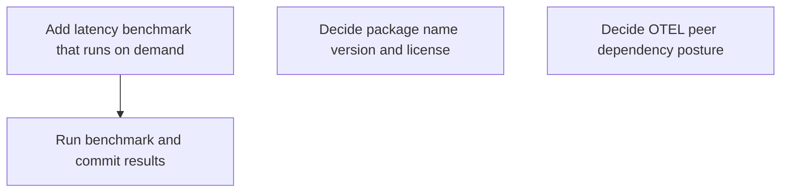

# Horizon 05 — Execute latency benchmark + decide package identity & OTEL posture

# Horizon 05 — Execute latency benchmark + decide package identity & OTEL posture

## 🎯 What are we trying to achieve?
Run the latency benchmark exactly the way a prior horizon signed it off (1000 warmup + 10000 measured iterations, interleaved with/without the interceptor, high-resolution clocks, both measurement points) and write the real p50/p99 added-latency numbers into a committed report with an honest pass-or-fail verdict against the p50 <1ms / p99 <2% budget. Alongside that, record two long-open decisions in decisions.md: the package's identity (name/version/license) and how it will carry optional OpenTelemetry dependencies — each unblocking a deferred success bar (publish verification; OTEL span-exporter demo) without building them.

## 🧠 Why does this change need to happen?
The benchmark method and budget were signed off but never executed, so the package has no measured latency numbers — the vision's latency success bar cannot be claimed and there is no evidence about whether the streaming additions regressed the response path. Two blockers have been open unanswered since horizon 1 (package name/version/license) and horizon 4 (OTEL peer-dep posture), gating the publish and OTEL demo bars. Measuring now, and recording the two decisions, is the prerequisite for everything publish- and observability-related that follows.

## At a glance
- **Implementation:** 4 phases
- **Complexity:** Low — one opt-in benchmark spec + run-and-record + two text-only decision records; no feature code
- **Main risk:** the benchmark silently not running (jest --passWithNoTests) or measuring a stale dist — proof of execution is required, not assumed
- **Quality/performance target:** p50 added latency <1ms / p99 <2% (signed-off anchors); a recorded miss is an honest, valid outcome
- **Testing focus:** benchmark harness method fidelity (interleaved, high-res, 1000/10000), opt-in gating, verdict correctness, gate safety

## Order of work (dependency chain)

1. **Add latency benchmark that runs on demand** (Technical ID `add-opt-in-latency-benchmark-spec`) — why after the previous: can start immediately — no dependencies.
2. **Run benchmark and commit results** (Technical ID `run-benchmark-and-commit-results`) — why after the previous: consumes the previous phase's deliverable.
3. **Decide package name version and license** (Technical ID `decide-package-identity`) — why after the previous: can start immediately — no dependencies.
4. **Decide OTEL peer dependency posture** (Technical ID `decide-otel-peer-dependency-posture`) — why after the previous: can start immediately — no dependencies.

---

## Phases

### Phase 1 — Add latency benchmark that runs on demand

Technical ID: `add-opt-in-latency-benchmark-spec` · latency-benchmark execution · layer cross-cutting · blast radius small

- **Goal** — Create src/benchmark.test.ts — an opt-in jest spec that measures the signed-off p50/p99 added latency of buffered interception over the real patched ClientRequest path (request path and response-data path measurement points) while leaving the default npm test / two-level gate fast.
- **Why** — decisions.md line 11 signed off the latency-benchmark method (1000 warmup + 10000 measured iterations, interleaved baseline-vs-intercepted runs, process.hrtime.bigint/perf_hooks clocks, request path + response-data path measurement points, p50 <1ms / p99 <2% anchors) but nothing implements it. The package jest config already matches *.test.ts and ts-jest is the only TypeScript runner in the package (no ts-node devDep), so an env-gated spec named benchmark.test.ts is the mechanism with the least new machinery — no standalone script, no config change. Wrapping the suite in describe.skipIf(!process.env.RUN_BENCH) keeps the default gate path running in milliseconds.
- **Changes** — Create src/benchmark.test.ts with the whole suite wrapped in describe.skipIf(!process.env.RUN_BENCH): default `npm test` (and the two-level gate) skips it in milliseconds, while `RUN_BENCH=1 npx jest src/benchmark.test.ts` runs the full measurement — do NOT touch either jest config (out of scope).; Clone the real-patched-path harness shape from interceptor.test.ts — startServer() boots a real 127.0.0.1 http server, post() fires a real http.request, withEntries-style install()/run()/restore() — and interleave baseline (interceptor not installed) and intercepted (Interceptor installed with a requestTransform) runs over the same client/server so JIT/GC drift cancels.; Measure per the signed-off method with monotonic high-resolution clocks (process.hrtime.bigint / perf_hooks): 1000 warmup iterations then 10000 measured iterations, computing p50/p99 added latency for the request path (shouldCapture/wrappers/requestTransform) and a separate response-data-path measurement of the per-'data'-event appendChunk/parse+count cost (buffered vs streaming) using the fakeReq+emit('data') pattern.; Add no feature code beyond the harness: import only existing exports (Interceptor, shouldCapture, etc.) and leave interceptor.ts, options.ts, index.ts, and both package.json jest configs unchanged, then verify package typecheck/lint/build stay green and `npm test` still completes fast with the suite skipped.
- **Files / areas** — packages/llm-http-proxy/src/benchmark.test.ts
- **How to verify** — Benchmark runs only on demand; default gate stays fast (Open src/benchmark.test.ts: the whole suite is wrapped in describe.skipIf(!process.env.RUN_BENCH)(...) — grep for skipIf and RUN_BENCH and confirm no top-level test(/describe( exists beside the wrapper.) | Implements the signed-off method: 1000 warmup / 10000 measured, high-res clock, interleaved (Grep the file for the iteration counts: a warmup loop of 1000 iterations and a measured loop of 10000 iterations (as literals or constants bound to 1000/10000).) | Request path measured over the real patched ClientRequest path with requestTransform (The file boots a real HTTP server listening on 127.0.0.1 (mirroring startServer in interceptor.test.ts) and issues requests through real http.request calls — grep for listen/127.0.0.1/http.request.) | Response-data path measured separately: per-'data'-event cost, buffered vs streaming (The file contains a second describe/test that builds a fake ClientRequest (an EventEmitter with hostname/path/getHeader) and drives capture by calling emit('data', chunk) in a loop — the fakeReq pattern from interceptor.test.ts.) | Full signed-off method executes and commits honest PASS-or-FAIL verdicts per anchor (Run `RUN_BENCH=1 npx jest src/benchmark.test.ts` and read the output: the full signed-off method executed (1000 warmup + 10000 measured iterations on a high-res clock, both measurement points) and the numbers include p50 and p99 added latency for the request path AND for the response-data path — the numbers are printed or asserted, not silently discarded.) | Only benchmark.test.ts added; no feature code or config edits; package gates green (Run `git diff --stat` from the repo root: the only new file is packages/llm-http-proxy/src/benchmark.test.ts with zero diff on interceptor.ts, options.ts, index.ts, and both package.json jest configs (package + root).)
- **Done when** — src/benchmark.test.ts — the single opt-in harness spec that default `npm test` skips in milliseconds and `RUN_BENCH=1 npx jest src/benchmark.test.ts` executes as the full signed-off measurement, with gates green.
- **Depends on** — nothing — can start immediately
- **Rollback** — Delete src/benchmark.test.ts to return to the pre-horizon state; the spec is opt-in so it has zero default-gate effect and rolls back trivially.
- **Healer hint** — The spec most likely passes by timing baseline and intercepted runs in two separate sequential batches with a wall clock, so the recorded numbers come from JIT/GC drift instead of the interleaved high-res method — flatten the run into one loop that samples process.hrtime.bigint() around each interleaved baseline/intercepted pair and verify the run actually executed the full signed-off method and committed an honest PASS-or-FAIL verdict per anchor. Do not re-run to make the printed p50/p99 match the anchors — a recorded budget miss is a valid completed phase outcome that flows to the phase-1 results record and the deferred latency-regression remediation.

Reference — full rubric (6 dimensions)

| Dimension | Rule | Pass criteria | Failure examples | Min |
|---|---|---|---|---|
| opt-in-gating | The entire benchmark suite is gated behind the RUN_BENCH env var so the default npm test path skips it in milliseconds while RUN_BENCH=1 executes the full measurement. | ['Open src/benchmark.test.ts: the whole suite is wrapped in describe.skipIf(!process.env.RUN_BENCH)(...) — grep for skipIf and RUN_BENCH and confirm no top-level test(/describe( exists beside the wrapper.', 'Run `npm test` in packages/llm-http-proxy: jest reports the benchmark tests as skipped (not run) and the run completes in a few seconds with exit 0.', 'Run `RUN_BENCH=1 npx jest src/benchmark.test.ts`: the summary shows benchmark tests actually executed (test count > 0, none skipped) and exits 0.'] | ['Default `npm test` executes the 11k-iteration measurement (suite shows tests as run, not skipped, or the run takes minutes).', 'The gate reads a different variable than RUN_BENCH (e.g. process.env.BENCH), so setting RUN_BENCH=1 leaves the suite skipped.', 'A chunk of the benchmark (e.g. the response-data-path timing) sits outside the skipIf wrapper and always runs.'] | 9 |
| measurement-method-fidelity | The spec measures exactly per the recorded method: 1000 warmup then 10000 measured iterations on a monotonic high-resolution clock, with baseline and intercepted runs interleaved in one loop over the same server so JIT/GC drift cancels. | ['Grep the file for the iteration counts: a warmup loop of 1000 iterations and a measured loop of 10000 iterations (as literals or constants bound to 1000/10000).', 'Grep the timing lines: samples use process.hrtime.bigint() or performance.now() from node:perf_hooks; no Date.now() appears anywhere in the measurement paths.', 'Read the main request-path loop: a single loop body alternates one baseline sample (no interceptor installed) and one intercepted sample (Interceptor installed) against the same 127.0.0.1 server — not two separate sequential batches.'] | ['Warmup/measured counts are not 1000/10000 (e.g. 100 warmup / 1000 measured).', 'Timing uses Date.now() (ms wall clock), so sub-millisecond added latency and the p99 shape are unmeasurable.', 'Baseline iterations complete in one loop and intercepted iterations in a later loop (e.g. after server warmup), so JIT/GC state decides the difference instead of the pairing.'] | 8 |
| request-path-measurement | The request-path measurement runs through the real patched http.ClientRequest path against a live 127.0.0.1 server, with an Interceptor configured with a requestTransform installed for the intercepted samples, so shouldCapture/wrapper/transform work is what the p50/p99 reflect. | ['The file boots a real HTTP server listening on 127.0.0.1 (mirroring startServer in interceptor.test.ts) and issues requests through real http.request calls — grep for listen/127.0.0.1/http.request.', 'The intercepted sample constructs `new Interceptor(...)` configured with a requestTransform callback (grep for requestTransform in the file) and calls restore() after the run.', 'The code computes per-iteration added latency as intercepted minus baseline (or the measurement reports the intercepted/baseline pair), so the published p50/p99 are added latency, not raw latency.'] | ["The 'intercepted' run calls interceptor.attachCapture directly on a fake request instead of exercising the patched http.request path, so wrapper/transform overhead is not measured.", 'No requestTransform is configured, so the recorded numbers cannot be judged against an anchor that includes transform work.', 'There is no baseline sample in the same file, so added latency cannot be computed at all.'] | 8 |
| response-data-path-measurement | A separate measurement point times the per-'data'-event handling cost (appendChunk/parse+count) using the fakeReq + emit('data') pattern from interceptor.test.ts, reporting the streaming rewire's added per-event cost against the buffered path. | ["The file contains a second describe/test that builds a fake ClientRequest (an EventEmitter with hostname/path/getHeader) and drives capture by calling emit('data', chunk) in a loop — the fakeReq pattern from interceptor.test.ts.", "The measurement reports a per-'data'-event cost for a buffered configuration and a per-'data'-event cost for the streaming configuration (event-stream-parser wired into the data handler), so the streaming rewire's added cost appears as its own number.", 'The fakeReq measurement is self-contained: it restores any installed interceptor state and closes the server in a finally-equivalent, so the request-path measurement is not contaminated.'] | ["Response-data cost can only be inferred from end-to-end request time (no per-emit timing), so the streaming rewire's per-event parse+count cost is invisible.", 'Only the buffered configuration is timed — the streaming comparison number is missing.', "The 'data'-event measurements run on a real network response instead of the deterministic fakeReq + emit('data') pattern, so noise hides sub-us per-event costs."] | 8 |
| budget-anchor-compliance | The phase is done when the spec EXECUTES the full signed-off method — 1000 warmup + 10000 measured iterations, interleaved baseline-vs-intercepted runs, high-res clocks, both measurement points (request path and response-data path) — and commits/asserts an explicit PASS-or-FAIL verdict per anchor, judged against the binding anchors p50 <1ms / p99 <2% added latency. A recorded budget miss is a valid completed phase-0 outcome: it flows forward to phase 1's honest record and the deferred latency-regression remediation. The anchor assertion is a loud red line that labels the result, never a retry-until-green mechanism — an anchor miss must not be masked by re-running or by an "exits 0 implies pass" interpretation. | ['Run `RUN_BENCH=1 npx jest src/benchmark.test.ts` and read the output: the full signed-off method executed (1000 warmup + 10000 measured iterations on a high-res clock, both measurement points) and the numbers include p50 and p99 added latency for the request path AND for the response-data path — the numbers are printed or asserted, not silently discarded.', "The spec commits/asserts an explicit PASS or FAIL verdict for each anchor — request-path p50 (<1ms), request-path p99 (<2% of the run's own measured baseline p99, not a hardcoded constant), and the response-data-path bounds — where PASS requires the recorded number to satisfy the anchor and FAIL means the recorded number misses it.", 'A recorded miss is representable as a completed outcome: if the printed request-path p50 >= 1ms or p99 >= 2% of baseline, the output labels the verdict FAIL and the run still commits the numbers — it does not exit early, loop, or re-run until green.', 'The spec does not mask misses: no retry loop, no fallback to a second run, and no branch that skips the assertion when it would fail — each verdict is exactly the comparison of the committed number to the signed-off anchor.'] | ['The spec passes while printing no latency numbers and no PASS/FAIL verdicts (results are computed but never committed/asserted, so the anchors are never judged).', 'The spec re-runs or retries until the numbers satisfy the anchors, or treats exit 0 as pass without a verdict — the anchor check becomes retry-until-green / exits-0-implies-pass.', "The spec hard-fails or crashes on a recorded budget miss instead of committing the honest FAIL numbers for phase 1's record and the deferred remediation.", 'The response-data-path results omit the streaming configuration, so the streaming rewire cost is never judged against the anchors.'] | 9 |
| scope-containment-gates-green | The phase ships exactly one new file importing only existing exports — interceptor.ts, options.ts, index.ts, and both jest configs stay byte-identical — and the package typecheck/lint/build gates pass. | ['Run `git diff --stat` from the repo root: the only new file is packages/llm-http-proxy/src/benchmark.test.ts with zero diff on interceptor.ts, options.ts, index.ts, and both package.json jest configs (package + root).', "Read the imports at the top of benchmark.test.ts: every import resolves to an export that already exists in this package's src modules (e.g. Interceptor, shouldCapture from './interceptor'); no new or modified module under src is imported.", 'Run `npm run typecheck`, `npm run lint`, and `npm run build` in packages/llm-http-proxy: all three exit 0.'] | ['git diff shows edits to interceptor.ts, options.ts, index.ts, or a jest config (e.g. testRegex/transform changed to make the benchmark run).', "The file imports a helper that didn't exist before (e.g. src/benchmark-utils.ts) or re-implements interception logic instead of importing existing exports.", 'Any of typecheck/lint/build exits non-zero after the file lands.'] | 8 |

---
### Phase 2 — Run benchmark and commit results

Technical ID: `run-benchmark-and-commit-results` · latency-benchmark execution · layer cross-cutting · blast radius small

- **Goal** — Execute the opt-in latency bench harness against a freshly rebuilt package, capture the measured p50/p99 added-latency numbers for the request path and the response-data path, judge them pass/fail against the signed-off budget anchors, and commit an attributable results report so the run is provable.
- **Why** — jest runs with --passWithNoTests, so a skipped or un-matched bench file would gate green even if it never ran — a committed, dated numbers record is the only honest proof the benchmark happened. dist/ is gitignored and the root consumes the package via link:, so the recorded numbers must be attributed to a freshly rebuilt dist built from the same committed source the harness measures.
- **Changes** — Rebuild the package first (`npm run build` in packages/llm-http-proxy — dual tsc emit + postbuild) so the root's link: consumption and the recorded numbers both point at fresh dist, then run `RUN_BENCH=1 npx jest src/benchmark.test.ts --runInBand` to execute the full 1000-warmup/10000-measured measurement on the pinned machine.; Capture from the run output the request-path p50/p99 added latency (judged against the <1ms p50 / <2% p99 anchors, incl. requestTransform work) and the response-data-path per-event parse+count cost (buffered vs streaming) so the streaming cost is visible per the methodology.; Write docs/roadmaps/llm-http-proxy/benchmark-results.md recording the run date, hardware, method summary (warmup/iterations/clock source), the measured numbers per measurement point, and an explicit PASS/FAIL verdict per anchor — a recorded budget miss stays recorded honestly as a valid outcome, not a reason to edit the numbers.; Leave the harness and the signed-off method untouched: no re-derivation of iteration/warmup counts or measurement points to make numbers pass, and confirm the default `npm test` plus root gates still run fast with the suite skipped.
- **Files / areas** — packages/llm-http-proxy; docs/roadmaps/llm-http-proxy/benchmark-results.md
- **How to verify** — Measured numbers and PASS/FAIL verdicts recorded per signed-off anchor (benchmark-results.md contains a numeric request-path p50 value and a numeric request-path p99 value that can be read and compared against the anchors at decisions.md line 11 (p50 <1ms, p99 <2% added latency).) | Numbers attributable to a freshly rebuilt dist from the measured commit (The report records the git commit SHA (or equivalent source fingerprint) of packages/llm-http-proxy that the run measured.) | Run executed the signed-off method with the harness untouched (The report's method summary names a warmup count and a total iteration count that match the signed-off values at decisions.md line 11 exactly (1000 warmup / 10000 measured).) | Clean re-run reproduces the recorded numbers and verdicts (From packages/llm-http-proxy, `npm run build` succeeds, then `RUN_BENCH=1 npx jest src/benchmark.test.ts --runInBand` completes and prints p50/p99 output (it does not hang, crash, or report 'no tests').) | Default gates stay fast/green with the benchmark skipped and no feature code shipped (From packages/llm-http-proxy, `npm test` with no RUN_BENCH env var finishes in under a minute and does not execute the benchmark spec.)
- **Done when** — docs/roadmaps/llm-http-proxy/benchmark-results.md — one committed, dated, attributable results report with request-path and response-data-path p50/p99 numbers and an explicit PASS/FAIL verdict against each signed-off anchor.
- **Depends on** — Add latency benchmark that runs on demand
- **Rollback** — None needed — a committed doc artifact; deleting benchmark-results.md fully reverts the record.
- **Healer hint** — Most likely the run happened on stale dist or with RUN_BENCH unset (silent skip), so the committed numbers don't reproduce — rebuild first, paste the exact harness output lines into the report without editing values, and recompute every verdict directly from the decisions.md anchors.

Reference — full rubric (5 dimensions)

| Dimension | Rule | Pass criteria | Failure examples | Min |
|---|---|---|---|---|
| budget-verdicts-per-anchor | The report records numeric p50/p99 added-latency values for every signed-off measurement point — request path (p50 <1ms / p99 <2%, incl. requestTransform work) and response-data path per-event cost (buffered AND streaming) — and every PASS/FAIL verdict can be recomputed by comparing the recorded number to the signed-off anchor in decisions.md line 11. | ['benchmark-results.md contains a numeric request-path p50 value and a numeric request-path p99 value that can be read and compared against the anchors at decisions.md line 11 (p50 <1ms, p99 <2% added latency).', 'The report has at least one row for the response-data-path per-event cost under buffered interception and one row under streaming interception, each with a number, so the streaming delta is visible in the file.', 'For every measurement row the report explicitly labels PASS or FAIL, and the label matches what a reader gets by comparing the recorded number to its anchor (a recorded p50 >= 1.0ms or p99 >= 2% must not be labeled PASS).', "The recorded values appear as the harness's raw output (e.g. 'p50 0.31ms') rather than only as a rounded or rewritten figure a reader cannot verify."] | ["The report records only request-path numbers and omits the response-data-path buffered-vs-streaming rows, hiding the streaming rewire's cost.", 'A row labeled PASS carries a number that fails its anchor (e.g. p50 1.4ms labeled PASS).', 'The report gives verdicts with no numbers, so the PASS/FAIL claims cannot be checked.'] | 9 |
| fresh-build-attribution | The recorded numbers must be provably linked to a freshly rebuilt dist built from the same committed source the harness measured, so a later reader can reproduce the exact artifact behind the numbers. | ['The report records the git commit SHA (or equivalent source fingerprint) of packages/llm-http-proxy that the run measured.', '`git show --stat` (or `git diff --stat`) for the phase commit shows zero changes under packages/llm-http-proxy/src — the only committed change outside docs is build output (dist/ is gitignored).', 'The newest file under packages/llm-http-proxy/dist has a filesystem modification time newer than the recorded source commit time, proving rebuild happened before the measure run (not stale dist).', 'The report names the machine/hardware the run used, so the numbers carry the signed-off hardware attribution.'] | ['The report has no commit SHA or source reference, so the numbers cannot be linked to any code revision.', 'The phase commit edits files under packages/llm-http-proxy/src, leaking feature work into the benchmark phase.', 'dist files all predate the recorded source commit, meaning the run measured a stale build.'] | 8 |
| method-fidelity-to-signoff | The run performed the exact signed-off method — same warmup count, total iteration count, clock source, and measurement order as decisions.md — and the harness itself was not modified to make the numbers pass. | ["The report's method summary names a warmup count and a total iteration count that match the signed-off values at decisions.md line 11 exactly (1000 warmup / 10000 measured).", 'The report names a clock source matching decisions.md (process.hrtime.bigint or perf_hooks), not a wall-clock source.', '`git diff` of packages/llm-http-proxy/src/benchmark.test.ts between the phase commit and its parent is empty — the harness is byte-identical.', 'The report records the hardware (or applies the signed-off hardware-pinning rule) it ran on.'] | ['The report claims 2000 warmup iterations while decisions.md signed off 1000.', 'benchmark.test.ts shows a diff adjusting iteration counts or dropping a measurement point from the signed-off version.', 'The report omits both hardware and a hardware-pinning rule, breaking the attribution rule.'] | 8 |
| clean-rerun-reproducibility | Re-running the harness from the recorded commit and a fresh build reproduces the recorded p50/p99 values within a tolerance and reproduces every PASS/FAIL verdict, proving the record is a repeatable measurement rather than a one-off or cherry-picked run. | ["From packages/llm-http-proxy, `npm run build` succeeds, then `RUN_BENCH=1 npx jest src/benchmark.test.ts --runInBand` completes and prints p50/p99 output (it does not hang, crash, or report 'no tests').", "The re-run's request-path p50 and p99 values are each within 2x of the values recorded in benchmark-results.md.", 'Every re-run PASS/FAIL verdict equals the recorded verdict — a recorded PASS must not re-run as FAIL, and vice versa.'] | ['The re-run prints no numbers and jest reports zero tests ran, meaning the opt-in gate masked a skipped benchmark.', 'Re-run values differ from the record by an order of magnitude with no explanation in the report.', 'A recorded PASS flips to FAIL on the clean re-run, showing the recorded run did not reflect the committed source.'] | 7 |
| default-suite-scope-guard | The opt-in gate still works — default `npm test` and root gates stay fast and green with the benchmark suite skipped — and the phase shipped no feature code beyond the unchanged harness, so the change rolls back cleanly. | ['From packages/llm-http-proxy, `npm test` with no RUN_BENCH env var finishes in under a minute and does not execute the benchmark spec.', '`npm run lint` and `npm run typecheck` pass in packages/llm-http-proxy.', 'The root gate (root `npm test`/nest build) passes against the freshly rebuilt dist.', "The phase commit's diff touches only docs/ and nothing under packages/llm-http-proxy/src — deleting docs/roadmaps/llm-http-proxy/benchmark-results.md fully reverts the phase."] | ['`npm test` runs the full 10000-iteration benchmark unprompted, ballooning the default gate.', 'The commit carries source changes unrelated to the benchmark harness.', '`npm run lint`, `npm run typecheck`, or the root gate fails red.'] | 8 |

---
### Phase 3 — Decide package name version and license

Technical ID: `decide-package-identity` · package identity · layer infrastructure · blast radius small

- **Goal** — Record in decisions.md the binding package identity — name llm-http-proxy, version 0.2.0, license MIT, plus the streaming-additive vs 0.3.0-bump sub-question — and close blockers.md line 2 so the deferred package-identity-and-publish bar is unblocked.
- **Why** — At planning time the npm registry returned 404 for https://registry.npmjs.org/llm-http-proxy (checked 2026-08-29), indicating the name was free to publish then; because registry availability is not static, this phase re-runs the check immediately before writing the decision record and pins the identity on the decision-time status. The on-disk manifest already pins version 0.2.0 / license MIT with the index.ts VERSION const in sync and a LICENSE file present. This pure-decision blocker is resolved by a decision record — text, not code — closing blockers.md line 2 and unblocking a whole deferred success bar.
- **Changes** — Run the npm-registry availability check immediately before writing the decision record: `npm view llm-http-proxy` or GET https://registry.npmjs.org/llm-http-proxy, and record the ACTUAL status observed in the entry (404/empty = free / 200 = taken, incl. the actual status code) plus the date of this decision-time check — the planning-time 404 is rationale context, not the entry's evidence, since the name can be claimed between planning and decision-writing time.; Answer the semver sub-question inside the same record: streaming/responseTransform additions stay same-version additive surface on 0.2.0 (they already landed additively and VERSION is in sync), reserving a 0.3.0 bump for any future breaking change — and note the missing package README.md (referenced by package.json files[]) as publish-hygiene debt for the publish-verification bar.; Name the deferred bar this decision unblocks (package-identity-and-publish) in the entry, and close blockers.md line 2 as resolved with a pointer to the decisions.md entry; change no code and install no dependencies.
- **Files / areas** — docs/roadmaps/llm-http-proxy/decisions.md; docs/roadmaps/llm-http-proxy/blockers.md
- **How to verify** — Binding identity is pinned in the record (Open docs/roadmaps/llm-http-proxy/decisions.md and find the entry dated 2026-08-29 whose heading contains 'package identity') | Decision-time registry check status and date are recorded (Run `npm view llm-http-proxy` (or GET https://registry.npmjs.org/llm-http-proxy) immediately before writing the entry, and the entry reflects THAT decision-time check rather than a planning-time or assumed result.) | Semver sub-question is decided (The entry states that streaming/responseTransform additions remain on 0.2.0 as additive surface) | blockers.md line 2 is closed with a pointer (Open docs/roadmaps/llm-http-proxy/blockers.md and line 2 is marked resolved/closed, not open) | Change is text-only, no code or deps (Run 'git status' (or 'git diff --name-only') and every changed path is under docs/roadmaps/llm-http-proxy/ and is either decisions.md or blockers.md)
- **Done when** — A decisions.md package-identity decision record with blockers.md line 2 closed — one dated decision entry, not code, naming the package-identity-and-publish bar it unblocks.
- **Depends on** — nothing — can start immediately
- **Rollback** — None needed — doc-only; the record can be reworded anytime before publish.
- **Healer hint** — The most likely failure is that blockers.md line 2 stays 'open' (or the semver sub-question gets deferred) because the entry was written vaguely — reopen decisions.md, paste the exact three-field pin (llm-http-proxy / 0.2.0 / MIT) plus the one-line 0.3.0-bump answer, then flip line 2 to resolved with a dated pointer to that entry.

Reference — full rubric (5 dimensions)

| Dimension | Rule | Pass criteria | Failure examples | Min |
|---|---|---|---|---|
| identity-fields-pinned | The dated decisions.md entry explicitly pins name=llm-http-proxy, version=0.2.0, and license=MIT as the binding package identity. | ["Open docs/roadmaps/llm-http-proxy/decisions.md and find the entry dated 2026-08-29 whose heading contains 'package identity'", "The entry body contains the exact token 'llm-http-proxy' as the chosen name", "The entry body contains the exact token '0.2.0' as the chosen version", "The entry body contains the exact token 'MIT' as the chosen license"] | ['The entry pins only a name, leaving version or license unwritten', "The entry uses 'TBD' or 'finalize later' for any of the three identity fields", 'The entry is dated but says nothing about name/version/license'] | 7 |
| registry-availability-fact-recorded | The entry records the status and date of the decision-time registry check, which must have been run at decision-writing time — the ACTUAL status code observed (404 = free / 200 = taken) for the queried name at registry.npmjs.org and the date that check ran — as the evidence the pinned name is publishable. A 404 result is a valid recorded outcome, not a mandated one; the entry must never assert a 404 that the decision-time check did not produce. | ['Run `npm view llm-http-proxy` (or GET https://registry.npmjs.org/llm-http-proxy) immediately before writing the entry, and the entry reflects THAT decision-time check rather than a planning-time or assumed result.', 'The entry records the status (404 = free / 200 = taken, plus the actual status code observed) and the date of the decision-time registry check.', "The entry contains the URL 'registry.npmjs.org/llm-http-proxy' so the check is attributable."] | ['The entry claims the name is free without naming the URL or the decision-time result.', "The entry hard-codes 'HTTP 404' without having run the decision-time check, or records a status inconsistent with the check that actually ran at decision-writing time.", 'The entry records the status but no date, so the check cannot be audited to decision-writing time.'] | 7 |
| semver-posture-answered | The entry answers the streaming/responseTransform additions vs 0.3.0-bump sub-question: additions stay additive on 0.2.0, 0.3.0 is reserved for breaking changes, and the missing README.md is recorded as publish-hygiene debt. | ['The entry states that streaming/responseTransform additions remain on 0.2.0 as additive surface', 'The entry states that a future breaking change would require a 0.3.0 bump', 'The entry mentions the missing package README.md (referenced by package.json files[]) as publish-hygiene debt'] | ["The entry punts the version question with 'defer to publish time'", 'The entry gives semver reasoning but omits the README.md debt that publish-verification must see'] | 7 |
| blocker-closed-with-pointer | blockers.md line 2 (open package name/version/license) is marked resolved, points to the new decisions.md entry, and names the deferred bar this unlocks (package-identity-and-publish). | ['Open docs/roadmaps/llm-http-proxy/blockers.md and line 2 is marked resolved/closed, not open', 'The line 2 closure points to a decisions.md entry (e.g., a dated entry reference or link)', "The closure names the deferred bar 'package-identity-and-publish'"] | ["blockers.md line 2 still reads 'open' with no resolution marker", 'Line 2 is resolved but references an entry that does not exist in decisions.md', 'The closure does not name the package-identity-and-publish bar it unblocks'] | 7 |
| doc-only-diff | The phase lands as a documentation change: the working-tree diff touches only the two docs files and no code, manifest, or lockfile. | ["Run 'git status' (or 'git diff --name-only') and every changed path is under docs/roadmaps/llm-http-proxy/ and is either decisions.md or blockers.md", 'No src/, package.json, package-lock.json, or yarn.lock file appears in the diff', 'No new dependency appears in any lockfile'] | ['The diff shows edits to src/index.ts or a new .ts file', 'package.json or a lockfile changed during the phase', 'A stray file (e.g., a backup or scratch script) is tracked in the diff'] | 7 |

---
### Phase 4 — Decide OTEL peer dependency posture

Technical ID: `decide-otel-peer-dependency-posture` · OTEL peer-dep posture · layer cross-cutting · blast radius small

- **Goal** — Record in decisions.md the @opentelemetry/* activation posture — optional peer dependencies activated through the existing Logger seam only when installed — unblocking the deferred OTEL span-exporter demo without installing any dependency this horizon.
- **Why** — The package has zero @opentelemetry/* presence (empty dependencies, no peerDependencies/optionalDependencies fields) and the Logger seam is already documented as the future span-exporter hook, so there is nothing to reconcile in code. This pure-decision blocker is resolved by naming the activation mechanism in a decisions.md record, which is the only thing the deferred OTEL demo needs to start.
- **Changes** — Add a dated decisions.md entry recording the OTEL peer-dep posture: @opentelemetry/* packages are optional peer dependencies, never hard dependencies, and the future span exporter activates through the existing Logger seam (src/logger.ts, src/index.ts doc comments) only when those peer deps are present, per vision.md.; State explicitly what the decision does not do: no dependency is installed and no activation code ships this horizon — the OTEL span-exporter demo bar stays deferred and is merely unblocked.; Name the deferred bar this decision unblocks (OTEL span-exporter demo) and record it as unblocked for a later horizon; change no code and install no dependencies.
- **Files / areas** — docs/roadmaps/llm-http-proxy/decisions.md
- **How to verify** — Dated decision record present (docs/roadmaps/llm-http-proxy/decisions.md contains an entry whose heading mentions OTEL (e.g. 'OTEL peer' or 'OpenTelemetry').) | Optional peer-dependency posture declared (The entry names the package scope '@opentelemetry/*' verbatim.) | Logger-seam activation named with install guard (The entry names the seam by containing 'Logger seam', 'src/logger.ts', or 'src/index.ts'.) | Non-goal scope stated explicitly (The entry contains an explicit out-of-scope statement such as 'no dependency is installed', 'no code ships this horizon', or 'no activation code'.) | Text-only change, no code or dependency drift (git status --porcelain shows only docs/roadmaps/llm-http-proxy/decisions.md as modified.)
- **Done when** — A decisions.md OTEL peer-dep posture entry — one dated decision record, no code and no dependency install, naming the OTEL span-exporter demo bar it unblocks.
- **Depends on** — nothing — can start immediately
- **Rollback** — None needed — doc-only.
- **Healer hint** — The most likely failure is the entry drifting into wishy-washy plan-speak — describing what the posture 'will be' with no explicit non-goal and no install-guard — so the fastest fix is rewriting it as two labeled lines, 'Decision:' naming optional peer deps activated via the Logger seam only when installed, and 'Non-goals this horizon:' stating no install and no code, a 60-second text edit that repairs every rubric dimension at once.

Reference — full rubric (5 dimensions)

| Dimension | Rule | Pass criteria | Failure examples | Min |
|---|---|---|---|---|
| dated-record-present | A new, dated decisions.md entry about the OTEL peer-dep posture exists in the deliverable file. | ["docs/roadmaps/llm-http-proxy/decisions.md contains an entry whose heading mentions OTEL (e.g. 'OTEL peer' or 'OpenTelemetry').", 'The entry carries a date in YYYY-MM-DD format and is the newest entry in the file (no later-dated entry above it).', 'git diff -- docs/roadmaps/llm-http-proxy/decisions.md shows this entry as newly added text and not as an edit to an existing decision.'] | ['No new entry about OTEL peer posture appears in decisions.md.', 'The newest entry discusses OTEL but has no date, so it cannot be audited to this horizon.'] | 7 |
| peer-posture-declared | The record commits to @opentelemetry/* as optional peer dependencies only, never hard or direct dependencies. | ["The entry names the package scope '@opentelemetry/*' verbatim.", "The entry contains 'peer' in the sense of 'optional peer dependencies' or 'peerDependencies'.", "The entry explicitly negates a hard dependency, e.g. contains 'never a hard dependency', 'not a hard dependency', or 'not a direct dependency'."] | ['The entry describes the OTEL posture without ever saying whether the packages are peers, hard deps, or bundled.', "The entry says 'add OpenTelemetry as a regular dependency' with no peer or optional qualifier."] | 8 |
| logger-seam-activation-named | The record names the existing Logger seam as the future span-exporter activation point and makes activation conditional on the peer packages being installed. | ["The entry names the seam by containing 'Logger seam', 'src/logger.ts', or 'src/index.ts'.", "The entry includes an install-guard condition such as 'only when installed', 'only if present', or 'when the peer deps are present'.", 'The entry does not name a new file or hook that would have to be built this horizon.'] | ['The entry promises a span exporter but never says where activation will hook in.', "The entry implies the exporter is always active, with no 'only when installed' condition."] | 7 |
| non-goal-scope-stated | The record states what the decision does not do this horizon — no dependency install and no activation code — and names the deferred bar it unblocks. | ["The entry contains an explicit out-of-scope statement such as 'no dependency is installed', 'no code ships this horizon', or 'no activation code'.", "The entry contains 'OTEL span-exporter demo' or 'span-exporter demo' and marks it 'deferred' and 'unblocked' (or 'no longer blocked') for a later horizon.", "The text gives no command or checklist that would add a dependency or edit source (no 'npm install @opentelemetry/*' or 'implement the exporter' step)."] | ['The entry records a posture but never says what is out of scope, so the horizon boundary is unenforceable.', "The entry closes with a to-do like 'next: wire the exporter into src/logger.ts this horizon', which is a code step, not a decision."] | 7 |
| doc-only-integrity | Repo state proves the phase was doc-only: no source changed, no dependencies added, so the change is trivially rollback-safe. | ['git status --porcelain shows only docs/roadmaps/llm-http-proxy/decisions.md as modified.', "git diff -- package.json package-lock.json produces no output and package.json still has no 'peerDependencies' or 'optionalDependencies' field containing @opentelemetry/*.", 'git diff -- src/ produces no output and no @opentelemetry import or reference appears outside decisions.md.'] | ['package.json shows @opentelemetry/api added under dependencies or peerDependencies after this phase.', 'src/logger.ts was edited to import an OpenTelemetry package.', 'A new source file (e.g. otel-exporter.ts) appears in the diff.'] | 10 |

## Discovery Findings

| Area | Finding | File path | Implication |
|---|---|---|---|
| benchmark-methodology-signoff | decisions.md line 11 records the binding sign-off: harness = interleaved baseline-vs-intercepted runs over the real patched ClientRequest path, hardware pinning rule stated, warmup 1000 iters, total 10000 iters, clocks = process.hrtime.bigint and perf_hooks, measurement points = request path (shouldCapture/wrappers/transform incl. requestTransform+Content-Length) AND response-data path (appendChunk/parse per 'data' event), and budget anchors p50 <1ms / p99 <2% added latency for buffered non-streaming interception. Horizon-04 roadmap phase latency-benchmark-methodology-signoff graded 10/10 and blockers.md line 3 is marked resolved (pointer to that decision). | /Users/dimitrykatz/workspace/elenwatch/docs/roadmaps/llm-http-proxy/decisions.md | The harness must faithfully implement exactly these pinned numbers/method and measure BOTH named measurement points; the streaming response-data-path cost (parser.feed per 'data' event) must be visible for comparability, and a recorded budget miss is a valid p50>=1ms or p99>=2% outcome — the plan should commit numbers as pass/fail against these anchors, not re-derive the method. |
| jest-setup | No jest.config.js exists; package jest config is inline in package.json (rootDir '.', ts-jest transform with tsconfig.json, testEnvironment node). testRegex is `(/__tests__/.*|(\.|/)(test|spec))\.ts$`, so a spec named benchmark.test.ts WOULD be picked up by the package config, while any *.bench.ts matches neither config (root config: testRegex `.*\.spec\.ts$`, rootDir src). Package 'test' script is `jest --passWithNoTests`, so an un-matched/skipped bench file still gates green. | /Users/dimitrykatz/workspace/elenwatch/packages/llm-http-proxy/package.json | Name the harness benchmark.test.ts if it must run under package jest in-gate, or ship it as a standalone script; 'ran and recorded' must be proven by a committed numbers artifact since --passWithNoTests hides a silent no-op. Changing either jest config is out of scope. |
| test-tsconfig-and-runner | There is no separate test tsconfig. Base tsconfig.json (module commonjs, types ['node','jest'], includes src/**/*.ts) serves ts-jest AND `npm run typecheck`; build configs tsconfig.cjs.json/tsconfig.esm.json extend it and `exclude: ["src/**/*.test.ts"]`. ts-jest is a package devDep. ts-node exists only at the ROOT (root devDependencies), not in package devDependencies. | /Users/dimitrykatz/workspace/elenwatch/packages/llm-http-proxy/tsconfig.json | A standalone .ts bench script cannot rely on ts-node as a package devDep — it must be plain .js/.mjs, compiled-then-run via the existing tsc build, or shipped as a jest-compat benchmark.test.ts that ts-jest already handles. No new test tsconfig needed. |
| test-harness-patterns-to-reuse | interceptor.test.ts provides the exact reusable harness: startServer() (lines 38-72) boots a real http server on 127.0.0.1 with a canned-body handler; withEntries() (75-91) constructs an Interceptor with a collecting logger, installs, runs, flushes via TWO `await new Promise(r => setImmediate(r))` (lines 87-88) and restores; post() (94-119) fires a real http.request; postWithLength() at line 1039; fakeReq() (559-567) builds an EventEmitter cast to ClientRequest with hostname/path/protocol/getHeader, driven by emit('response'|'data'|'end') plus flush() (569-571). Restore happens in finally-style after assert. | /Users/dimitrykatz/workspace/elenwatch/packages/llm-http-proxy/src/interceptor.test.ts | The benchmark harness should clone the startServer+post+withEntries shape for the interleaved baseline/intercepted runs over the same client/server, and can use fakeReq+emit('data') for the isolated response-data-path measurement; the two-setImmediate flush is the emission-wait idiom the signed-off method implicitly relies on. |
| interceptor-public-API-and-patch-surface | interceptor.ts exports class Interceptor with install()/restore() (prototype patch of http.ClientRequest.write/end/on, singleton-guarded), attachCapture(req, callerTrace?) public, isInstalled getter; exported helpers: shouldCapture(req, providers), deriveUrl, captureCallerTrace, isSseResponse, probeSseShape; re-exports defaultEstimateInputTokens/defaultExtractOutputTokens. requestTransform runs at the terminal write/end via applyRequestTransform (interceptor.ts:328-340), Content-Length only rewritten when header exists; appendChunk runs per 'data' event on the buffered path (520-522) and parser.feed per 'data' on SSE (580-582); kNoCapture negative cache short-circuits capture decisions; completeCapture's exactly-once emission is deferred via setImmediate (604-624). | /Users/dimitrykatz/workspace/elenwatch/packages/llm-http-proxy/src/interceptor.ts | The bench measures the real patched path through write/end wrappers (request path: shouldCapture+attachCapture+appendChunk+applyRequestTransform) and the 'response'/'data' handlers (response-data path: appendChunk/parser.feed+per-event parse+count); install()/restore() bracket each intercepted run, and the bench can import internals straight from src/interceptor as tests already do. |
| package-identity | package.json: name llm-http-proxy, version 0.2.0, license MIT; index.ts:32 `export const VERSION = '0.2.0'` — perfectly in sync. LICENSE file EXISTS in package dir (MIT, 'Copyright (c) 2026'). files array = [dist, README.md, LICENSE] but NO README.md exists in the package directory (only root README.md). No publishConfig and no private flag (package is publishable as-is); author is empty string. Root consumer app.module.ts imports VERSION as LLM_HTTP_PROXY_VERSION and providers array from the package. Blockers.md line 2 (package name/version/license) is still OPEN. | /Users/dimitrykatz/workspace/elenwatch/packages/llm-http-proxy/package.json | The package-identity decision pins the on-disk candidate (llm-http-proxy@0.2.0 MIT, LICENSE present); the open sub-question is whether streaming/OTEL-posture additions stay same-version additive or force a 0.3.0 bump in both package.json and the index.ts VERSION const; a missing package README.md (referenced by files[]) should be noted as publish-hygiene debt the decision record can acknowledge. |
| otel-dependency-state | Zero @opentelemetry/opentelemetry anywhere: package dependencies is empty {} with no peerDependencies/optionalDependencies fields at all, root package.json has no OTEL dep either, and src contains only the words 'OTEL' in doc comments (index.ts:5, logger.ts:4, logger.test.ts:4) where the Logger seam is explicitly the future span-exporter hook. | /Users/dimitrykatz/workspace/elenwatch/packages/llm-http-proxy/package.json | The OTEL peer-dep posture is a pure text decision with nothing to reconcile in code: there is no optionalDependencies/peerDependencies scaffold yet, so the decision must name the activation mechanism (optional @opentelemetry/* activation via the Logger seam, per vision.md) without installing any dependency this horizon. |
| root-consumption-and-dist-rebuild | Root package.json depends on `"llm-http-proxy": "link:packages/llm-http-proxy"` and runs `nest build` for its build; root src/app.module.ts imports Interceptor/consoleLogger/LlmLogEntry/etc. from 'llm-http-proxy', resolving through the link to dist/cjs via exports. dist/ is gitignored in BOTH the root .gitignore (/dist) and package .gitignore (dist/) — a built dist is never committed. Root jest only matches *.spec.ts (rootDir src); package test count is now 124 (per horizon-04 status evidence; state.md confirms). | /Users/dimitrykatz/workspace/elenwatch/package.json | Any root-gate or bench run against the package measures stale code unless the package dist is rebuilt first (npm run build) — the plan must sequence 'rebuild dist' before the benchmark run and root jest; the recorded benchmark numbers must be tied to the same rebuilt dist so they're attributable. |
| benchmark-infrastructure-absence | There is no bench script anywhere, no src/__fixtures__/ directory, no *.bench file, and no hrtime/performance.now/perf_hooks code in packages/llm-http-proxy (grep-confirmed). Package scripts are only clean/prebuild/build/lint/test/test:coverage/typecheck. | /Users/dimitrykatz/workspace/elenwatch/packages/llm-http-proxy/package.json | The benchmark harness is fully greenfield — no existing perf/bench convention, fixture dir, or script to hook into; the harness (script or benchmark.test.ts) plus a committed numbers record are the only new code the horizon ships. |
| postbuild-and-build-output | scripts/postbuild.mjs writes {type:'module'} into dist/esm/package.json and {type:'commonjs'} into dist/cjs/package.json, then verifies every ESM .js under dist/esm is a real module. Build = `tsc -p tsconfig.cjs.json && tsc -p tsconfig.esm.json && npm run postbuild`; both tsconfigs set declaration+declarationMap true, so the build emits dual ESM/CJS plus .d.ts/.d.ts.map; package exports/types point at dist/cjs/index.d.ts, import dist/esm/index.js, require dist/cjs/index.js. | /Users/dimitrykatz/workspace/elenwatch/packages/llm-http-proxy/scripts/postbuild.mjs | The dist rebuild for the two-level gate is the full dual-format emit incl. declarations; a standalone bench script can import the built package (dist/esm or dist/cjs) or the TS source via ts-jest — either way the measured code must be the freshly rebuilt dist for root-link consumption to see it. |
| blockers-tracked-gates | blockers.md line 3 (latency budget/methodology) is closed by the horizon-4 sign-off, but line 2 (package name/version/license) remains OPEN, and line 4 (LlmLogEntry/LlmLoggingOptions semver-freeze) is the adjacent open question the package-identity decision's version-bump sub-question touches. vision.md line 10 still literally lists the deferred bar 'no work beyond body capture on the request path' — superseded by the decisions.md sign-off but not reworded in the deferred list. | /Users/dimitrykatz/workspace/elenwatch/docs/roadmaps/llm-http-proxy/blockers.md | The horizon's closure work for the two pure decisions is decisions.md entry + blockers.md line 2 resolved/closed (and the semver-freeze question line 4 must be answered inside the package-identity record, naming which deferred bar it unblocks), with vision.md's obsolete phrase cross-referenced as superseded — all doc-only, no code. |

## Out of Scope (deferred)

- Executing the OTEL span-exporter demo — the posture decision this horizon records merely unblocks it; the demo itself needs @opentelemetry/* dependency install + exporter code and remains a deferred full-objective success bar.
- npm publish verification / dry-run — unblocked by the package-identity decision (name llm-http-proxy confirmed free on npm via 404 on 2026-08-29) but the publish bar itself stays deferred; includes the publish-hygiene debt (missing package README.md referenced by files[], empty author field).
- Latency-regression remediation — if the benchmark records a budget miss (p50 >=1ms or p99 >=2%), fixing the underlying interceptor/parser code is follow-up work for a later horizon; this horizon records honestly per the signed-off method.
- Changing either jest config to pick up *.bench.ts — out of scope; the opt-in RUN_BENCH-gated jest spec runs under existing configs.
- Streaming residuals (cross-event redaction continuity, caller-visible stream replay, non-SSE streaming formats) — named residuals from the streaming re-pin, still not re-scoped by the user.
- npm bench convenience script — the RUN_BENCH=1 npx jest src/benchmark.test.ts invocation is documented in the harness phase; a wrapper script was judged YAGNI until the workflow proves awkward.
- Authoring the missing package README.md and filling the empty author field — publish-hygiene debt acknowledged in the package-identity decision record; belongs to the publish-verification bar.
- Rewording vision.md's superseded 'no work beyond body capture on the request path' phrase — already reconciled by the horizon-4 decisions.md sign-off; the cosmetic doc edit can wait.

## Required Materials

| Name | Kind | Why needed | Acquisition |
|---|---|---|---|
| npm registry name availability for 'llm-http-proxy' | api | The package-identity decision must pin a publishable name/version/license to close blockers.md line 2 and unblock the deferred package-identity-and-publish bar; if 'llm-http-proxy' is already claimed on npm (or a near-collision name is live), the pinned identity is invalid and the publish bar inherits a bad decision. This is the only constituent of the identity decision that is not knowable from the repo itself. | Query the public npm registry with `npm view llm-http-proxy` or GET https://registry.npmjs.org/llm-http-proxy; a 404/empty response confirms the name is free to publish. Public read-only API — no credential or account login required. Re-check at decision-writing time since availability is not static. |

## Success Criteria

- (1) A latency benchmark harness (a standalone script or a jest-compat *.test.ts/*.spec.ts spec — a *.bench.ts file matches neither jest config, so it would silently not run) executes the binding signed-off method: interleaved baseline-vs-intercepted runs over the real patched ClientRequest path, 1000 warmup + 10000 measured iterations, process.hrtime.bigint/perf_hooks clocks, measuring both named measurement points — the request path (shouldCapture/wrappers/requestTransform) and the response-data path (appendChunk/per-event parse+count) — and records the p50/p99 added-latency numbers for buffered non-streaming interception (incl. requestTransform work) against the anchors p50 <1ms / p99 <2%, with the streaming response-data-path per-event cost visible per the methodology, and the recorded numbers are committed, pass or fail; (2) decisions.md gains the two dated decision records — package identity (name/version/license, incl. whether streaming support is a same-version additive surface or a version bump) closing blockers.md line 2, and the OTEL peer-dep posture (@opentelemetry/* optional/peer activation) — each naming the deferred bar it unblocks (package-identity-and-publish; OTEL span-exporter demo); (3) no feature code beyond the bench harness, and the two-level gate is green (package tsc/eslint/jest/build with dist rebuilt, then root build/jest/lint).
- Add latency benchmark that runs on demand: src/benchmark.test.ts — the single opt-in harness spec that default `npm test` skips in milliseconds and `RUN_BENCH=1 npx jest src/benchmark.test.ts` executes as the full signed-off measurement, with gates green.
- Run benchmark and commit results: docs/roadmaps/llm-http-proxy/benchmark-results.md — one committed, dated, attributable results report with request-path and response-data-path p50/p99 numbers and an explicit PASS/FAIL verdict against each signed-off anchor.
- Decide package name version and license: A decisions.md package-identity decision record with blockers.md line 2 closed — one dated decision entry, not code, naming the package-identity-and-publish bar it unblocks.
- Decide OTEL peer dependency posture: A decisions.md OTEL peer-dep posture entry — one dated decision record, no code and no dependency install, naming the OTEL span-exporter demo bar it unblocks.

## Alignment Preview

Two advisory concerns raised before the gate and steered by the user:
1. **Bench should run on demand, not in default tests** — the harness is opt-in via `RUN_BENCH=1` (default `npm test` skips it in milliseconds); user picked "Make bench opt-in (Recommended)".
2. **Package-identity pin needed a groundable npm check** — the registry was queried now (404 = name free on 2026-08-29); user picked "Check npm now (Recommended)". The roadmap's decision phase re-checks at decision-writing time (planning-time 404 is context, not evidence).
The updated preview was accepted on the second round (user answered yes) — no redirect budget exhausted.

## Quality Gate

- **Path:** Full
- **Iterations:** 2 (iteration 1: critic found 1 blocker + 1 major → 1 blocker adversarially verified CONFIRMED → healed; iteration 2: all 10 dimensions pass, no failing issues)
- **Issues raised → verified → healed:** testable-rubrics (blocker) verified CONFIRMED and healed — phase-0 anchor rubric recast to honest PASS-or-FAIL verdicts, no retry-until-green, healerHint fixed; grounded-in-discovery (major) healed — package-identity phase re-checks the registry at decision-writing time, rubric requires actual status/date, planning-time 404 downgraded to context
- **Accepted debt (minor):** phase-1 filesAffected lists the package directory instead of concrete files (cosmetic)
- **Final verdict:** PASSED (0 failing dimensions remain)

## Full analysis

- **Domain shape:** technical — The objective is microbenchmark/measurement machinery plus package-manifest and peer-dependency config decisions for a shipped npm package — no business entities, rules, or workflows a domain expert would recognize — and decisions.md line 1 already pins llm-http-proxy's domain-shape-fit as 'technical' (binding).
- **Ubiquitous language:**

| Term | Meaning |
|---|---|
| latency bench harness | the standalone script or jest-compat *.test.ts/*.spec.ts spec that runs the signed-off interleaved baseline/intercepted measurement over the real patched ClientRequest path and commits p50/p99 numbers |
| added-latency budget | the binding signed-off anchors p50 <1ms / p99 <2% for buffered non-streaming interception, incl. requestTransform work, that the recorded results are judged against |
| request path | the named measurement point covering shouldCapture/wrappers/requestTransform work on the way out |
| response-data path | the named measurement point covering appendChunk/per-event parse+count work on every response 'data' event, where the streaming rewire's cost must be visible |
| package identity | the pure-decision blocker on name/version/license, resolved as a decisions.md record and unblocking package-identity-and-publish |
| OTEL peer-dep posture | the pure-decision blocker on optional @opentelemetry/* activation, resolved as a decisions.md record and unblocking the OTEL span-exporter demo |
| decision record | a dated decisions.md entry — the only deliverable allowed for the two pure-decision blockers; a text change, not code |

- **Assumptions:**

- The decisions.md latency sign-off is binding and complete (harness, hardware rule, warmup 1000, total 10000 iterations, clocks, measurement points incl. request and response-data paths; budget p50 <1ms / p99 <2% incl. requestTransform work) — this horizon executes it, never re-derives it.
- Because *.bench.ts is matched by neither jest config, the harness must be a standalone script or a jest-compat *.test.ts/*.spec.ts; --passWithNoTests means a skipped spec still passes gates, so 'ran and recorded' must be provable, not assumed from a green run.
- The methodology's response-data-path measurement point requires the harness to measure the streaming per-event parse+count cost on that path (buffered vs streaming comparability), not just the buffered path.
- The on-disk package identity (name llm-http-proxy, version 0.2.0, license MIT with the VERSION marker in sync) is the candidate the package-identity decision pins; the streaming-additive vs 0.3.0-bump question is part of that decision.
- Pure-decision blockers are resolved by decisions.md text entries only — no code, no dependency install — and the deferred bars they unblock (publish-verification, OTEL demo) stay deferred.
- The package is consumed by the root via link:, so any run of root gates or the bench harness requires a package dist rebuild first or it measures stale code.
- A budget miss recorded honestly is a valid outcome that triggers follow-up work, not a reason to re-open the signed-off numbers.

- **Risks:**

- Noise/stability: p50/p99 on a macOS dev box under JIT/GC can wobble; a recorded miss may be environmental rather than a real regression, and the harness must follow the hardware-pinning rule so the miss is attributable.
- Harness silently not running: a *.bench.ts file matches neither jest config and --passWithNoTests lets a skipped spec pass — if the harness does not prove it ran (recorded numbers committed), the benchmark phase is a no-op dressed as success.
- Stale dist: the root consumes the package via link:, so a harness or root-gate run against an unrebuilt dist measures pre-horizon code.
- Deviation/gaming of the signed-off method: changing warmup/iteration counts or dropping a measurement point to make the numbers pass violates the binding horizon-4 decision.
- Adjacent-question scope creep: package identity touches the unresolved semver-freeze blocker (blockers.md line 3) and OTEL posture could pull in dependency install/activation — both must stay inside a decisions.md line.
- A budget miss on the response-data path signals a genuine streaming regression (per-event parse+count cost); remediating it is follow-up, and doing it here would bleed this horizon's scope.

- **Out of scope (analysis):**

- Building the OTEL span exporter demo or installing/activating @opentelemetry/* deps — the demo stays blocked until this horizon records the peer-dep posture decision only.
- Publish verification / npm publish dry-run — gated on the package-identity decision; the deferred package-identity-and-publish bar is unblocked, not executed.
- Fixing latency that misses the budget — the horizon records numbers against the signed-off method; remediation of a regression is a later horizon's work.
- Changing either jest config to pick up *.bench.ts — the brief requires the harness to run under existing configs or as a standalone script; config changes are out of scope.
- Re-opening the horizon-4 signed-off methodology or budget numbers — binding decision; this horizon executes against it.
- Feature code beyond the benchmark harness (interceptor, event-stream-parser, redaction, transformers, options) — the task explicitly forbids it.
- Streaming residuals: cross-event redaction continuity, caller-visible stream replay, non-SSE streaming formats — named residuals, not re-scoped per the user's selected scope.
