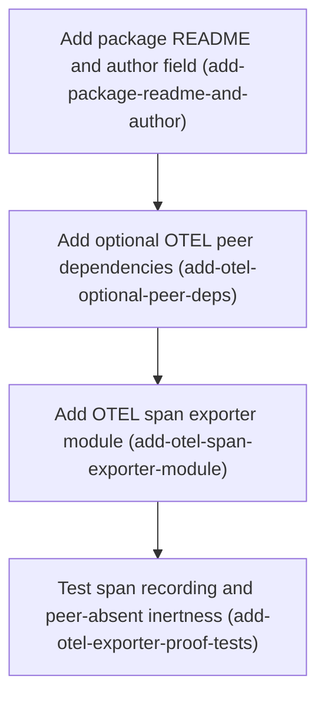

# Horizon 6 — Publish verification + OTEL span-exporter demo

## Executive Summary

### 🎯 What are we trying to achieve?
The `llm-http-proxy` npm package lands its two remaining unblocked goals in one small horizon: (1) prove it can actually be published — `npm publish --dry-run` must exit 0 after closing two known packaging gaps (a missing README and an empty author field), and (2) ship and prove an OpenTelemetry trace demo — a logger that turns each log entry into a trace span, but only when the consumer has installed the optional OTEL packages, so nobody is ever forced to take OTEL as a dependency.

### 🧠 Why does this change need to happen?
The package was signed off for production quality in earlier horizons, but two success bars from the project's long-term goal were never executed: publish verification and the OTEL exporter demo. The README the package manifest already lists simply does not exist on disk, the author field is empty, and the OTEL posture decision (optional peer dependencies, never hard ones) was recorded but no code and no proof of it exist yet. This horizon closes both bars with no changes to the request-capture code.

### At a glance
- **Implementation:** 4 phases (within the 3-5 target)
- **Complexity:** Low — every phase is small or medium blast radius, no request-path code, no migrations
- **Main risk:** a top-level static import of `@opentelemetry/api` would pass every local gate (the package is installed for dev) while silently killing opt-in activation for consumers — each OTEL phase's rubric guards this explicitly
- **Quality/performance target:** `npm publish --dry-run` exits 0; both exporter proofs run in the always-green default test suite; all package + root gates stay green after every phase
- **Testing focus:** span recording fidelity, peer-absent inertness, no-raw-data invariant, optional-peer manifest metadata, dry-run repeatability

---

## Implementation plan

### Order of work
1. **Add package README and author field** — first, because it alone unblocks the publish dry-run; nothing else depends on it.
2. **Add optional OTEL peer dependencies** — after the hygiene fix, because it re-verifies the dry-run against the updated manifest.
3. **Add OTEL span exporter module** — after the peers are installed, because it needs the OTEL types present to compile and be proven.
4. **Test span recording and peer-absent inertness** — last, because it proves the module from step 3 in both directions and closes the horizon with the full two-level gate.

### Phase 0 — Add package README and author field
Technical ID: `add-package-readme-and-author` · subsystem: packaging · layer: interface · blast radius: small

- **Goal** — close the two known publish-hygiene gaps so `npm publish --dry-run` exits 0: create the package README that the manifest's `files[]` already lists but that does not exist, and fill the empty author field.
- **Why** — `npm publish --dry-run` cannot pass while `files[]` references a missing README, and an empty author is the second known gap. Closing both is the smallest slice that makes the publish bar pass.
- **Changes**
  - Create `packages/llm-http-proxy/README.md` containing exactly: the package name, a one-line purpose, `npm install llm-http-proxy`, and a basic usage snippet showing the `logger:` option via `InterceptorOptions.logger`. Do **not** document the OTEL exporter; do **not** reuse the root NestJS app README.
  - Set `package.json` `author` to `Dimitry Katz <dimitry.kazt@gmail.com>` (git identity, confirmed by the user at the alignment preview) — name/version/license untouched.
  - Run `npm run build`, then `npm publish --dry-run` — must exit 0 with README.md, LICENSE, and dist/ in the tarball.
- **Files / areas** — `packages/llm-http-proxy/README.md`, `packages/llm-http-proxy/package.json`
- **How to verify**
  - README exists, names the package, shows install + `logger:` usage, contains no "opentelemetry", and is not byte-identical to the root README.
  - `author` equals the pinned value; name/version/license unchanged.
  - `npm publish --dry-run` exits 0 with the full tarball, twice in a row.
  - Package typecheck/lint/test green.
  - `git status` shows exactly the two declared files; reverting them restores the failing dry-run.
- **Done when** — the two hygiene gaps are closed and the dry-run exits 0 with README.md, LICENSE, and dist/ in the tarball.
- **Depends on** — nothing; can start immediately.
- **Rollback** — delete README.md and empty the author field; the dry-run fails again exactly as before.

### Phase 1 — Add optional OTEL peer dependencies
Technical ID: `add-otel-optional-peer-deps` · subsystem: packaging · layer: infrastructure · blast radius: small

- **Goal** — make `@opentelemetry/api` and `@opentelemetry/sdk-trace-base` resolvable for local typecheck/lint/jest while keeping them strictly optional for consumers, without committing a lockfile (the repo deliberately keeps zero lockfiles everywhere).
- **Why** — the exporter must compile against real OTEL types locally, but consumers without OTEL must never be force-installed or crashed. Optional peer dependencies (plus devDependencies for local resolution) are the only way to get both properties at once. The install creates a `package-lock.json`; the repo's convention is zero lockfiles, so it is gitignored and the declared ranges carry reproducibility.
- **Changes**
  - Verify registry reachability (`npm ping` / `npm view @opentelemetry/api version`) — if unreachable, stop; the OTEL bar cannot be proven.
  - Read the compatible api range from `npm view @opentelemetry/sdk-trace-base@latest peerDependencies`.
  - `npm install --save-dev @opentelemetry/api @opentelemetry/sdk-trace-base` inside the package.
  - Add `peerDependencies` + `peerDependenciesMeta.optional:true` for both; keep `dependencies` exactly `{}`.
  - Add `package-lock.json` to the package `.gitignore` (zero-lockfile convention).
  - Run the full package gate and re-run `npm publish --dry-run` — must still exit 0 with the new peer metadata in the manifest.
- **Files / areas** — `packages/llm-http-proxy/package.json`, `.gitignore`, generated `package-lock.json` (gitignored)
- **How to verify**
  - `peerDependencies` has exactly the two OTEL keys; `peerDependenciesMeta` marks each optional.
  - `dependencies` is exactly `{}`; `npm ls --omit=dev` shows no OTEL in production.
  - Explicit caret ranges, mutually compatible per the registry, mirrored in devDependencies.
  - Lockfile exists on disk but is gitignored and untracked.
  - Package gate + dry-run green; root typecheck/build green.
- **Done when** — both packages declared as optional peers and devDeps at a compatible range, `dependencies` still `{}`, lockfile gitignored, gates and dry-run green.
- **Depends on** — Phase 0.
- **Rollback** — remove the peer/devDependency entries, the gitignore line, node_modules, and the lockfile.

### Phase 2 — Add OTEL span exporter module
Technical ID: `add-otel-span-exporter-module` · subsystem: logger seam · layer: infrastructure · blast radius: medium

- **Goal** — write `src/otel.ts`: a Logger-seam-compatible span exporter that lazily attaches to OpenTelemetry only when the optional peer is installed, copies only `LlmLogEntry` fields into the span, is a no-op when the peer is absent, and is re-exported from the package root so a real consumer can reach it.
- **Why** — the Logger seam is the function type `(entry: LlmLogEntry) => void`, and this exporter is its first real consumer. A top-level static import of any `@opentelemetry/*` would break typecheck/lint/jest for anyone without the peers, so the peer is resolved at runtime via a try/catch `require`. Only entry fields may go into span attributes, preserving the package's no-raw-data redaction invariant. The `src/index.ts` re-export makes the demo consumer-reachable (the `exports` map exposes only the root entry); the user endorsed it at the alignment preview.
- **Changes**
  - Create `src/otel.ts` exporting `otelSpanLogger: Logger` with signature `(entry: LlmLogEntry) => void`; only `import type` from the package's own modules.
  - Feature-detect once at module load: `try { const { trace } = require('@opentelemetry/api') ... } catch { inert }` — never a top-level static import; scoped `eslint-disable` for `no-var-requires`; cast to the imported type.
  - When present: one span named `llm-http-proxy.llm-call` via `trace.getTracer('llm-http-proxy')`, start time from `entry.timestamp`, attributes from `model`, `inputTokens`, `outputTokens`, `callerTrace`, `url` (+ masked bodies when present; error → status); `span.end()` on every path.
  - When absent: non-throwing no-op.
  - Re-export `otelSpanLogger` from `src/index.ts`.
  - Run typecheck/lint/test/build — the dual CJS+ESM build picks the module up with zero config changes.
- **Files / areas** — `packages/llm-http-proxy/src/otel.ts`, `src/index.ts`
- **How to verify**
  - Export is typed `Logger`, signature `(entry) => void`; type-only imports from the seam; re-export in `src/index.ts`.
  - No top-level `@opentelemetry` import; require inside try/catch with the disable comment; catch branch contains no throw/log/OTEL call; calling twice without peers does not throw.
  - No `req/res/headers/request/response` references; every attribute comes from the entry; masked bodies only behind presence checks; error path records only `entry.error.message`.
  - `getTracer('llm-http-proxy')` + exact span name; start time from entry; `span.end()` on all paths; deterministic across calls.
  - `src/interceptor.ts` untouched; `dependencies` still `{}`; `git status` shows exactly the two declared files.
  - Package + root gates green; both `dist/cjs/otel.js` and `dist/esm/otel.js` emitted; the ESM `require` inside try/catch is the declared inert failure mode.
- **Done when** — the module exists, re-exported, lazy-loads via try/catch, emits spans from entry fields only, no-ops without the peer, and all gates pass.
- **Depends on** — Phase 1.
- **Rollback** — delete `src/otel.ts` and the index.ts re-export line.

### Phase 3 — Test span recording and peer-absent inertness
Technical ID: `add-otel-exporter-proof-tests` · subsystem: logger seam · layer: application · blast radius: small

- **Goal** — prove both exporter behaviors in the default jest suite with no environment flag: an `LlmLogEntry` becomes a span when the OTEL peers are installed, and the exporter is inert when they are absent.
- **Why** — the exporter is only trusted when both behaviors are verified. Both proofs are fast (in-memory span round-trips are milliseconds) and the OTEL packages are already devDependencies, so they belong in the always-green default `npm test`. The opt-in posture applies to runtime consumers, never to the package's own test gate — this was the user's alignment-preview redirect.
- **Changes**
  - Create `src/otel.test.ts` (matches the existing jest testRegex — no jest-config change).
  - Peers-present test: `BasicTracerProvider` + `InMemorySpanExporter` + `SimpleSpanProcessor`, call `otelSpanLogger` with a fixture entry, assert exactly one finished span with matching attributes and start time; then `provider.shutdown()` + `trace.disable()`.
  - Peers-absent test: `jest.doMock('@opentelemetry/api', () => { throw new Error('peer not installed'); })` inside `jest.isolateModules`, re-require `src/otel.ts`, assert calling the exported logger does not throw.
  - Run default `npm test`, then the full two-level gate (package typecheck/lint/test/build with dist rebuilt, root `nest build` + jest).
- **Files / areas** — `packages/llm-http-proxy/src/otel.test.ts`
- **How to verify**
  - No env flag / `.skip` / jest-config edit — both proofs run in plain `npm test`.
  - Real SDK classes wired; exactly one finished span; attributes + start time match the entry (non-trivial fixture with error and masked bodies).
  - Peers-absent test inside `isolateModules` with the throwing mock registered before re-require; asserts the non-throw.
  - `shutdown()` + `trace.disable()` after the peers-present test; default-order full run green.
  - Package + root gates green; `src/interceptor.ts` and the optional-peer posture untouched.
- **Done when** — both proofs pass in the default suite and the full two-level gate is green.
- **Depends on** — Phase 2.

---

## Discovery Findings
| Area | Finding | File | Implication |
|---|---|---|---|
| publish-verification | `files[]` lists `README.md` but no such file exists; only the root app README exists; LICENSE exists | `packages/llm-http-proxy/package.json` | Package README must be created; root README must not be reused |
| publish-verification | `author` is empty; no repository/bugs/homepage/publishConfig | `package.json` | Author is the second hygiene fix; metadata fields optional |
| publish-verification | `dist/` gitignored and absent; no prepack/prepublishOnly | `.gitignore`, `package.json` | Dry-run must build first; prepack deferred under YAGNI |
| otel-peer-posture | No peerDependencies at all; `dependencies` is `{}`; zero `@opentelemetry` references anywhere | `package.json` | Optional-peer block is greenfield; "never in dependencies" is checkable |
| logger-seam | Seam is `export type Logger = (entry: LlmLogEntry) => void`; logger.ts has zero runtime imports | `src/logger.ts` | Exporter implements exactly that shape; not imported by logger.ts |
| logger-seam-invariants | `logger.test.ts` enforces no-nestjs/no-raw source-grep invariants | `src/logger.test.ts` | Exporter lives in its own module; mirrors the no-raw invariant |
| redaction-invariant | Redaction runs before entry assembly; entry has no headers; `capturePayloads=false` default | `src/options.ts` | Copying only entry fields into spans cannot leak raw data |
| interceptor-request-path | The prototype patch is the only interception point | `src/interceptor.ts` | Horizon must not touch it; wiring is consumer-side |
| opt-in-test-gating | `benchmark.test.ts` uses `if (RUN_BENCH) describe else describe.skip` | `src/benchmark.test.ts` | Precedent exists, but OTEL proofs run ungated per user redirect |
| feature-detection-proof | Strict typecheck/lint; any top-level static OTEL import fails when peers absent | `tsconfig.json` | Runtime try/catch require mandatory; peers also in devDependencies |
| dependency-lockfile-state | Zero lockfiles repo-wide; install will create one | `packages/llm-http-proxy` | Lockfile gitignored; previous "empty manifest diff" evidence no longer applies |
| dual-build-emit | Build = dual CJS+ESM tsc + postbuild markers; tests excluded from dist | `scripts/postbuild.mjs` | New `src/otel.ts` ships in both builds with zero config changes |
| root-consumption | Root consumes via `link:`; no workspaces; root needs no OTEL additions | root `package.json` | Two-level gate unchanged |
| jest-config | Jest config in package.json; testRegex matches `*.test.ts` | `package.json` | `otel.test.ts` discovered with zero config changes |
| runtime-constraints | engines node >=18; npm is the gate runner; VERSION 0.2.0 | `src/index.ts` | Dynamic require available; keep npm; no version bump |

## Out of Scope (deferred)
- **Latency-regression remediation** of the recorded p99 miss (173.88% of baseline) — explicitly deferred by the user's scope choice; attributed to measurement churn, not interceptor code.
- **A real `npm publish`** (registry upload) — dry-run only; the open semver-freeze decision gates the real publish.
- **Any interceptor request-path change** — forbidden by the task.
- **New feature code beyond the two bars** — no new transformers, parsers, redaction rules, or SSE work.
- **Streaming residuals** (cross-event redaction continuity, caller-visible replay, non-SSE formats) — declared out in the horizon-5 brief.
- **OTEL beyond the demo** — no OTLP/HTTP/gRPC exporter, trace propagation, context injection, or collector.
- **prepack/prepublishOnly auto-build script** — YAGNI gate 2 (build runs explicitly before the dry-run).
- **repository/homepage/bugs/publishConfig fields** — YAGNI gates 1+4 (dry-run exits 0 without them).
- **Consumer-facing OTEL docs in the README** — YAGNI gate 1 (explicitly excluded).
- **ESM lazy-load via createRequire/async import** — YAGNI gates 2+3 (proofs run on CJS/jest; ESM bare require is safely inert).
- **OTLP/HTTP/gRPC exporter or collector** — YAGNI gates 1+3 (InMemorySpanExporter proves the span).
- **Trace propagation / context injection** — YAGNI gates 1+3 (the horizon proves the seam attaches).
- **Real `npm publish`** — YAGNI gate 2 (dry-run proves publishability; semver-freeze still open).

## Required Materials
| Name | Kind | Why needed | Acquisition |
|---|---|---|---|
| @opentelemetry/api package | api | Trace API the exporter calls; must be the optional peer + devDep | `npm install --save-dev @opentelemetry/api` |
| @opentelemetry/sdk-trace-base package | api | TracerProvider + InMemorySpanExporter for the proofs | `npm install --save-dev @opentelemetry/sdk-trace-base` |
| Mutually compatible api ↔ sdk-trace-base range | knowledge | OTEL SDKs couple to the api version; incompatible peers break install | `npm view @opentelemetry/sdk-trace-base@latest peerDependencies` |
| Canonical author identity | knowledge | The author field value must not reopen package identity | Resolved: git config, confirmed by user at the alignment preview |
| npm registry reachability | api | OTEL devDep install requires live registry access | `npm ping` / `npm view @opentelemetry/api version` before install |

## Success Criteria
1. `npm publish --dry-run` from packages/llm-http-proxy exits 0 with the packed tarball containing dist/, README.md, and LICENSE, and author set to a non-empty value; @opentelemetry/* appear only as peerDependencies marked optional via peerDependenciesMeta (never in dependencies); a Logger-compatible span exporter ships with one test proving an LlmLogEntry becomes a span when peers are installed and one test proving the exporter is inert when peers are absent; no span attribute or emitted field leaks raw payload/header data; the horizon keeps 3-5 phases; package build/lint/typecheck/jest and root gates stay green after every phase; no interceptor request-path code changes; the recorded p99 latency miss is left deferred with no remediation code.
2. Add package README and author field: the package's two known publish-hygiene gaps are closed — README.md exists with the mandated content, author is non-empty, and `npm run build && npm publish --dry-run` exits 0 with README.md, LICENSE, and dist/ in the tarball.
3. Add optional OTEL peer dependencies: package.json declares both @opentelemetry/* packages as optional peerDependencies (peerDependenciesMeta.optional:true) and as devDependencies, with `dependencies` still {}, the generated package-lock.json gitignored rather than committed, and typecheck/lint/test/build plus `npm publish --dry-run` all green.
4. Add OTEL span exporter module: src/otel.ts exists and exports a Logger-compatible span exporter, re-exported from src/index.ts, that lazy-loads @opentelemetry/api via try/catch require, emits a span from LlmLogEntry fields only, and is a non-throwing no-op when the peer is absent; the package typecheck/lint/test/build gates pass.
5. Test span recording and peer-absent inertness: src/otel.test.ts runs in the default `npm test` (no env flag) with two passing proofs — one span recorded via InMemorySpanExporter with matching attributes and start time when peers are present, and a non-throwing no-op when peers are simulated absent — and the full two-level gate (package typecheck/lint/test/build + root nest build/jest) is green.

## Alignment Preview
The user was shown the phase list twice. On the first preview (6 phases) the reviewer surfaced 3 concerns: phase count above target (two one-line edits each had their own phase), the exporter proofs gated behind a RUN_OTEL flag (so the always-green suite never exercised the new code), and an underspecified README phase. The user redirected: **merge the two hygiene edits into one phase and run the proof tests ungated**. A second preview (4 phases) surfaced 3 more advisory notes: the `src/index.ts` re-export grows the public API (kept — the user endorsed it; without it the demo is only deep-importable), committing the new lockfile would flip the repo's zero-lockfile convention (fixed — gitignored), and the author email `dimitry.kazt@gmail.com` from git config may be a typo (user confirmed **use as configured**). Redirect rounds used: 1 of 2.

## Quality Gate
- **Path:** full
- **Iterations run:** 1
- **Verdict:** passed on the first iteration — 10/10 dimensions at or above minScore, 0 blockers, 0 majors
- **Accepted debt (3 minors):** (a) the `pinned-compatible-ranges` rubric label calls caret ranges "pinned" while the lockfile is gitignored — wording-only; (b) the success criterion's "entry becomes a span" promise is proven on the CJS/jest path while the ESM dist is deliberately inert — documented in the deferred list and phase 2's rubric; (c) the author required-material's acquisitionNote still reads "ask the owner" though the value was confirmed at the preview.

## Full analysis
- **Domain shape:** technical — package-publishing machinery and observability wiring (dry-run verification, optional-peer feature-detection, a span exporter on a function-typed Logger seam); no business entities, rules, or workflows. Consistent with the project's horizon-1 classification.
- **Ubiquitous language:** publish verification · publish hygiene · Logger seam · span exporter · opt-in activation · optional peer deps · interceptor request path · gates · packaging
- **Assumptions:** npm registry reachable for the optional-peer install; the existing Logger seam signature suffices (seam extension only if strictly necessary — blockers.md line 3 still open); the pinned package identity (llm-http-proxy 0.2.0, MIT) stays closed; `peerDependenciesMeta.optional:true` is required for genuine opt-in under npm v7+; the OTEL proof targets a minimal span via api + sdk-trace-base (no OTLP exporter); "gates green" = package suite (with dist rebuilt) + root build/jest; the RUN_BENCH benchmark is not part of the default gate.
- **Risks:** the deferred p99 miss must not be silently reopened · the Logger seam may need a signature extension (deliberate decision required) · peers without `optional:true` would force OTEL on consumers · the exporter must not copy raw request/response data into attributes · registry unreachability would force a re-plan of the OTEL bar · the dry-run may surface hygiene issues beyond the two known · an accidental runtime dep would leak OTEL into the root Nest build.
