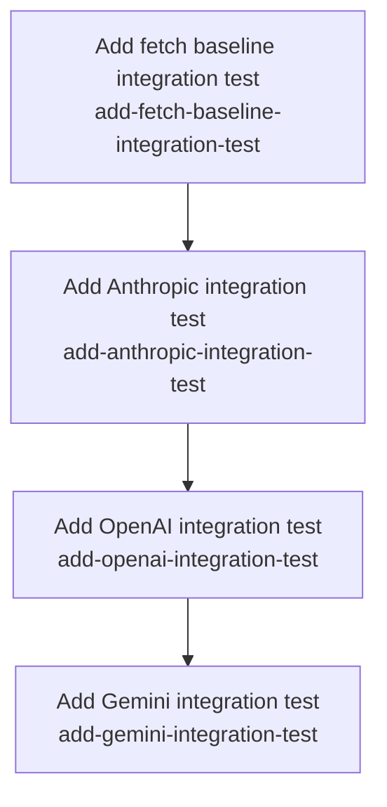

# Horizon 07 — Live-Provider Smoke Tests

## 🎯 What are we trying to achieve?

Add four opt-in live-provider smoke tests to `packages/llm-http-proxy/src/` — one each for raw `fetch`, Anthropic, OpenAI, and Gemini — that prove the in-process interceptor captures real HTTPS traffic end-to-end when run with the relevant API key present. The default `npm test` must keep passing fast and free of network/credential dependencies, and the existing 126-package-test baseline must not regress.

## 🧠 Why does this change need to happen?

Until now every test in the package used fake `EventEmitter` requests or stubbed `http.createServer` clients (per horizon-2's "test helpers" discovery). That proves the interceptor's logic in isolation but says nothing about whether the real patched `http.ClientRequest.prototype.write/end` actually fires on a live wire round-trip. A regression in the production install path (a host-filter bypass, a `parseCall` failure outside the LLM response grammar, a TLS hand-off bug) would slip past every fixture-based test in the current suite. Live smoke tests against the three target providers — plus a non-LLM raw-`fetch` baseline — close that gap with one small real call per provider, gated on API-key presence so CI never hits the network without explicit credentials.

## At a glance

- **Phases:** 4 (fetch baseline + anthropic + openai + gemini)
- **Complexity:** Low — small blast radius, no new public API, no version bump
- **Main risk:** API-key leakage via the package's own redaction logic, especially Gemini's URL-query-key auth (the load-bearing safety check)
- **Quality/performance target:** Default `npm test` stays at 126 package tests + 5 root tests in the same wall-clock time with zero network egress; each opt-in run makes exactly one small real call per provider
- **Testing focus:** opt-in gate correctness, no API-key leak through `JSON.stringify(entries[0])`, two-setImmediate flush, install/restore cleanup

---

## Order of work

The four phases are independent (no inter-phase dependencies) and can land in any order. The recommended sequence runs the harness-proof baseline first so the gate shape is verified before adding credentialed providers, then the three providers in alphabetical order:

1. **Add fetch baseline integration test** → proves the gate shape works without any credentials, validates the two-setImmediate flush and install/restore on a real public HTTPS endpoint. Lands first so the no-network-egress invariant under `npm test` is empirically verified before adding the three LLM providers.
2. **Add Anthropic integration test** → header-based auth (`x-api-key` + `anthropic-version`); mirrors the gate shape proven by phase 1 but requires `ANTHROPIC_API_KEY` to opt in.
3. **Add OpenAI integration test** → also header-based auth, structurally similar to Anthropic but on a different host and request body; mirrors phase 2 to keep provider-specific bodies from cross-contaminating.
4. **Add Gemini integration test** → URL-query auth (`?key=...`); runs last because the URL-key safety check is the load-bearing safety invariant and benefits from the gate shape being well-understood after phases 1–3.

(The arrows are recommended sequence, not hard dependencies — every phase has `dependsOn: []` and EXECUTE mode can run them in any order.)

---

### Phase 1 — Add fetch baseline integration test

- **Technical ID:** `add-fetch-baseline-integration-test` · live-provider smoke tests · infrastructure · small

**Goal** — A non-provider, always-on raw `fetch` smoke test proves the in-process interceptor captures a real HTTPS request end-to-end, gated so the default `npm test` skips it instantly and without credentials.

**Why** — The fetch baseline is the simplest live smoke test and exercises a capability none of the three LLM-provider tests can stand in for: raw HTTPS interception without provider-specific request/response shape. If a future regression broke plain-HTTPS interception but kept the LLM-specific path working (a host-filter bypass, a `parseCall` failure outside the LLM response grammar), only this baseline would catch it.

**Changes**

- Create `packages/llm-http-proxy/src/fetch-baseline.integration.test.ts` that imports `{ Interceptor }` from `./interceptor` and `type { LlmLogEntry }` from `./options`, defines a named suite function that builds an `Interceptor` with `providers` set to a regex matching `/example\.com/` and a logger that pushes emitted entries into a local array, fires one global `fetch()` POST against `https://example.com/` with a tiny JSON body, awaits two `setImmediate()` ticks after response-end, then asserts `entries.length === 1`, `entries[0].url` contains `example.com`, `entries[0].model` is a string, and `JSON.stringify(entries[0])` is non-empty.
- Wrap the suite in the same `if (gate) { describe(...) } else { describe.skip(...) }` shape as `src/benchmark.test.ts` lines 359–366, where the gate is computed via `process.env.npm_lifecycle_event !== 'test'` so the suite runs whenever the file is invoked directly (e.g. `npx jest src/fetch-baseline.integration.test.ts`) and resolves to `describe.skip` under `npm test`.
- Add a header comment documenting that the file is opt-in with no API key, that it is gated by direct jest invocation, and that the two-setImmediate flush pattern is required because emission is deferred via `setImmediate`.

**Files / areas**

- `packages/llm-http-proxy/src/fetch-baseline.integration.test.ts` (new file)

**How to verify**

- **Test file exists at the declared path with required imports** — Grep for the exact path; the file must contain `import { Interceptor } from './interceptor'` and `import type { LlmLogEntry } from './options'`.
- **Suite resolves to describe.skip under default `npm test` with zero network egress** — Running `npm test` from `packages/llm-http-proxy` completes with no captured DNS lookup or TCP connection to `example.com`; `if (gate) { describe(...) } else { describe.skip(...) }` shape matches `src/benchmark.test.ts:359-366`.
- **Direct jest invocation fires a real fetch and asserts the interceptor captured the entry** — `npx jest src/fetch-baseline.integration.test.ts` against the real endpoint passes; asserts `entries.length === 1`, `entries[0].url` contains `example.com`, `typeof entries[0].model === 'string'`, `JSON.stringify(entries[0]).length > 0`.
- **No API keys or credential lookups appear in the file** — Grep finds no `process.env.*_API_KEY` reads and no hardcoded key prefixes; header comment explicitly states the suite requires no API key.
- **Interceptor is installed and reliably restored so global fetch is not leaked** — `Interceptor` constructed with `providers: /example\.com/` and a `logger` option; install + restore wrapped in try/finally (or `withEntries` helper).
- **Header comment explains the opt-in gate and the setImmediate flush** — Comment block above the suite names `npm_lifecycle_event` or equivalent, names the two-setImmediate flush rationale.

**Done when** — Every check under *How to verify* passes its bar. Equivalently: `packages/llm-http-proxy/src/fetch-baseline.integration.test.ts` exists, passes one test when invoked via `npx jest src/fetch-baseline.integration.test.ts` against the real `https://example.com/` endpoint, and resolves to `describe.skip` under default `npm test`.

**Depends on** — Nothing — can start immediately.

**Reference**

Full rubric (fetch baseline)

| Dimension | Rule | Pass criteria (lead) | minScore |
|---|---|---|---|
| file-exists-at-declared-path | File exists with required imports | Path matches; `import { Interceptor } from './interceptor'`; `import type { LlmLogEntry } from './options'` | 8 |
| default-npm-test-skips-suite | Suite resolves to describe.skip under `npm test` with zero network egress | `if/else describe/describe.skip` shape matches RUN_BENCH template; gate from `process.env`; no DNS/TCP to example.com under `npm test` | 9 |
| direct-invocation-runs-real-fetch-and-asserts | Direct jest invocation fires real fetch and asserts captured entry | Real `fetch()` once; two setImmediate ticks after response; asserts entries.length===1, url contains example.com, model is string, JSON.stringify non-empty | 9 |
| zero-credential-footprint | No API keys or credential lookups | No `process.env.*_API_KEY` reads; no hardcoded key prefixes; header comment states no API key | 9 |
| interceptor-install-and-rollback | Interceptor installed and restored (no global fetch leak) | Interceptor with `/example\.com/` provider regex + logger; install + restore via try/finally or helper | 7 |
| opt-in-and-flush-documentation | Header comment explains opt-in gate and setImmediate flush | Comment names the env signal and the two-tick rationale | 6 |

healerHint: If the gate resolves to skip under direct invocation (or to run under `npm test`), replace the `npm_lifecycle_event` check with a positive opt-in env var like `RUN_FETCH_BASELINE=1` and invoke the file via `RUN_FETCH_BASELINE=1 npx jest src/fetch-baseline.integration.test.ts`.

---

### Phase 2 — Add Anthropic integration test

- **Technical ID:** `add-anthropic-integration-test` · live-provider smoke tests · infrastructure · small

**Goal** — A real Anthropic Messages API smoke test gated on `ANTHROPIC_API_KEY` presence (no separate LIVE flag) asserts the interceptor captures a model + url + non-negative token counts from a live minimal completion call, with a defense-in-depth no-key-leak assertion.

**Why** — Anthropic uses header-based auth (`x-api-key` + `anthropic-version`) — the simplest provider to integrate after the fetch baseline — so its smoke test is the natural second phase. It must include a defense-in-depth `JSON.stringify(entries[0])` does-not-contain-the-key assertion even though headers do not normally leak into `LlmLogEntry`; future redaction changes could regress this.

**Changes**

- Create `packages/llm-http-proxy/src/anthropic.integration.test.ts` that imports `{ Interceptor }` from `./interceptor` and `type { LlmLogEntry }` from `./options`, reads `process.env.ANTHROPIC_API_KEY` into a local `apiKey` variable (typed as `string | undefined`; treat empty string the same as unset), and gates the suite on `apiKey !== undefined && apiKey.length > 0` so the suite resolves to `describe.skip('anthropic live (skip: ANTHROPIC_API_KEY not set)')` when the key is missing.
- Define a named suite function that builds an `Interceptor` with `providers: ['api.anthropic.com']` and a logger pushing entries into a local array, fires one real `https.request` POST to `https://api.anthropic.com/v1/messages` with body `{"model":"claude-3-5-haiku-20241022","max_tokens":1,"messages":[{"role":"user","content":"hi"}]}` and headers `x-api-key: <apiKey>`, `anthropic-version: 2023-06-01`, `content-type: application/json`; awaits two `setImmediate()` ticks after response-end.
- Assert `entries.length === 1`, `entries[0].url` contains `api.anthropic.com/v1/messages`, `entries[0].model` contains `claude`, `entries[0].inputTokens >= 0`, `entries[0].outputTokens >= 0`, and that `JSON.stringify(entries[0])` does NOT include the literal value of `apiKey` (defense-in-depth).
- Wrap the suite in `if (apiKey) { describe('anthropic live', suite) } else { describe.skip('anthropic live (skip: ANTHROPIC_API_KEY not set)', () => {}) }` and add a header comment explaining the gate, the two-setImmediate flush, the `callerTrace` "unknown" allowance under Jest, and why `capturePayloads` stays default-off.

**Files / areas**

- `packages/llm-http-proxy/src/anthropic.integration.test.ts` (new file)

**How to verify**

- **Opt-in gate keyed solely on ANTHROPIC_API_KEY presence** — Top-level `if (apiKey !== undefined && apiKey.length > 0) { describe(...) } else { describe.skip(...) }`; no `RUN_LIVE`/`LIVE=` second flag anywhere.
- **API key sourced only from env, typed `string | undefined`, empty treated as unset** — `const apiKey: string | undefined = process.env.ANTHROPIC_API_KEY`; explicit length check on the gate; no hardcoded key fragment, no `dotenv`, no `fs.readFileSync`.
- **One real POST to `api.anthropic.com/v1/messages` with documented headers and body** — Single `https.request` POST to the Messages endpoint; headers `x-api-key`, `anthropic-version: 2023-06-01`, `content-type: application/json`; body contains `model: 'claude-3-5-haiku-20241022'`, `max_tokens: 1`, `messages: [{ role: 'user', content: 'hi' }]`; no `stream: true`.
- **Assertions cover entry count, URL, model, and non-negative token counts** — `expect(entries.length).toBe(1)`; `expect(entries[0].url).toContain('api.anthropic.com/v1/messages')`; `expect(entries[0].model).toContain('claude')`; `inputTokens >= 0` and `outputTokens >= 0`.
- **Defense-in-depth assertion that the captured entry does not contain the API key** — `expect(JSON.stringify(entries[0])).not.toContain(apiKey)` present; the operand is the local `apiKey` variable, not a hardcoded prefix.
- **Two setImmediate() ticks after response-end and an install/restore wrapper** — Two `await new Promise(resolve => setImmediate(resolve))` calls in sequence; `beforeEach`/`afterEach` (or paired `beforeAll`/`afterAll`) call Interceptor's install and restore; header comment names the two-tick rationale.

**Done when** — Every check under *How to verify* passes its bar. Equivalently: `packages/llm-http-proxy/src/anthropic.integration.test.ts` exists, passes one test when invoked via `ANTHROPIC_API_KEY=... npx jest src/anthropic.integration.test.ts`, and resolves to `describe.skip` under default `npm test` AND when invoked without `ANTHROPIC_API_KEY` in the env.

**Depends on** — Nothing — can start immediately.

**Reference**

Full rubric (Anthropic)

| Dimension | Rule | Pass criteria (lead) | minScore |
|---|---|---|---|
| gate-by-key-only | Opt-in gate is key presence alone, no LIVE flag | `if (apiKey !== undefined && apiKey.length > 0)` + describe/describe.skip; no second gate env var | 8 |
| api-key-handling | API key sourced only from env, typed `string \| undefined`, empty treated as unset | `process.env.ANTHROPIC_API_KEY` → local `apiKey: string \| undefined`; explicit length check | 9 |
| real-anthropic-request-shape | One real POST to api.anthropic.com/v1/messages with documented headers/body | Single POST; headers `x-api-key` + `anthropic-version: 2023-06-01` + `content-type: application/json`; body has model/max_tokens/messages, no stream:true | 8 |
| interceptor-capture-assertions | Assertions cover entry count, URL, model, non-negative token counts | `entries.length === 1`; url contains Messages path; model contains 'claude'; token fields >= 0 | 9 |
| no-key-leak-defense | Defense-in-depth `JSON.stringify(entries[0]).not.toContain(apiKey)` | Negative assertion over the local apiKey variable, no prefix match | 9 |
| flush-and-cleanup | Two setImmediate ticks + install/restore wrapper | Exactly two setImmediate awaits; beforeEach/afterEach install+restore; header comment names the pattern | 7 |

healerHint: Most likely failure is a flaky empty `entries` array; fix by buffering the body, awaiting `response.on('end', resolve)`, then two `setImmediate` awaits before any assertion, mirroring `src/interceptor.test.ts:75-91`.

---

### Phase 3 — Add OpenAI integration test

- **Technical ID:** `add-openai-integration-test` · live-provider smoke tests · infrastructure · small

**Goal** — A real OpenAI Chat Completions smoke test gated on `OPENAI_API_KEY` presence (no separate LIVE flag) asserts the interceptor captures a model + url + non-negative token counts from a live minimal completion call, with a defense-in-depth no-key-leak assertion.

**Why** — OpenAI also uses header-based auth (`Authorization: Bearer <key>`) — structurally similar to Anthropic but on a different host and request body — so it gets its own file (one provider per phase) and mirrors the Anthropic gate/assertion shape. Splitting into its own phase keeps each file under one deliverable and keeps provider-specific request bodies from cross-contaminating.

**Changes**

- Create `packages/llm-http-proxy/src/openai.integration.test.ts` that imports `{ Interceptor }` from `./interceptor` and `type { LlmLogEntry }` from `./options`, reads `process.env.OPENAI_API_KEY` into a local `apiKey` variable (typed as `string | undefined`; treat empty string the same as unset), and gates the suite on `apiKey !== undefined && apiKey.length > 0`.
- Define a named suite function that builds an `Interceptor` with `providers: ['api.openai.com']` and a logger pushing entries into a local array, fires one real `https.request` POST to `https://api.openai.com/v1/chat/completions` with body `{"model":"gpt-4o-mini","messages":[{"role":"user","content":"hi"}],"max_tokens":1,"stream":false}` and header `authorization: Bearer <apiKey>` plus `content-type: application/json`; awaits two `setImmediate()` ticks after response-end.
- Assert `entries.length === 1`, `entries[0].url` contains `api.openai.com/v1/chat/completions`, `entries[0].model` contains `gpt`, `entries[0].inputTokens >= 0`, `entries[0].outputTokens >= 0`, and that `JSON.stringify(entries[0])` does NOT include the literal value of `apiKey`.
- Wrap the suite in `if (apiKey) { describe('openai live', suite) } else { describe.skip('openai live (skip: OPENAI_API_KEY not set)', () => {}) }` and add a header comment explaining the gate, the two-setImmediate flush, the `callerTrace` "unknown" allowance, and why `capturePayloads` stays default-off.

**Files / areas**

- `packages/llm-http-proxy/src/openai.integration.test.ts` (new file)

**How to verify**

- **File exists at the documented path with the documented imports** — Path matches; `import { Interceptor } from './interceptor'`; `import type { LlmLogEntry } from './options'`; header comment names the four operational concerns (gate, flush, `callerTrace`, `capturePayloads`).
- **Gate is OPENAI_API_KEY presence alone (no separate LIVE flag)** — `apiKey: string | undefined`; no `LIVE`/`RUN_LIVE`; `if (apiKey)` + `describe/describe.skip` shape; `unset OPENAI_API_KEY && npx jest …` produces only the skipped suite.
- **HTTP request shape matches the documented OpenAI minimums** — URL contains `api.openai.com/v1/chat/completions`; method POST; `authorization: Bearer <apiKey>` header; body has `model`, `messages`, `max_tokens`, `stream:false`.
- **Interceptor captures url + model + non-negative token counts from one live call** — `Interceptor({ providers: ['api.openai.com'] })`; two `setImmediate()` ticks after response-end; assertions on entries length, url substring, model substring, token non-negativity.
- **Defense-in-depth: captured log entry does not contain the API key** — `expect(JSON.stringify(entries[0])).not.toContain(apiKey)` exists and references the local `apiKey` variable.

**Done when** — Every check under *How to verify* passes its bar. Equivalently: `packages/llm-http-proxy/src/openai.integration.test.ts` exists, passes one test when invoked via `OPENAI_API_KEY=... npx jest src/openai.integration.test.ts`, and resolves to `describe.skip` under default `npm test` AND when invoked without `OPENAI_API_KEY` in the env.

**Depends on** — Nothing — can start immediately.

**Reference**

Full rubric (OpenAI)

| Dimension | Rule | Pass criteria (lead) | minScore |
|---|---|---|---|
| file-exists-with-correct-imports | File exists at the documented path with documented imports | Path matches; Interceptor from './interceptor'; LlmLogEntry type from './options'; header comment covers 4 operational concerns | 8 |
| opt-in-gate-is-key-only | Gate is OPENAI_API_KEY presence alone (no LIVE flag) | `apiKey: string \| undefined`; no LIVE env var; if/else describe/describe.skip; unset env produces skip | 9 |
| request-matches-openai-minimums | HTTP request matches documented OpenAI minimums | URL contains `api.openai.com/v1/chat/completions`; POST; `authorization: Bearer <key>`; body has model/messages/max_tokens/stream:false | 9 |
| interceptor-captures-required-fields | Interceptor captures url + model + non-negative tokens | Interceptor providers=['api.openai.com']; two setImmediate ticks; asserts entries.length===1, url substring, model substring, tokens >= 0 | 9 |
| no-credential-leak-in-captured-entry | JSON.stringify(entries[0]).not.toContain(apiKey) | Local-variable operand; entries[0] specifically | 10 |

healerHint: If `entries.length === 0` against a real key, the logger hasn't flushed yet — add the two `setImmediate()` ticks after the response `end` handler.

---

### Phase 4 — Add Gemini integration test

- **Technical ID:** `add-gemini-integration-test` · live-provider smoke tests · infrastructure · small

**Goal** — A real Google generative-language API smoke test gated on `GEMINI_API_KEY` presence (no separate LIVE flag) asserts the interceptor captures model + url + non-negative token counts from a live minimal completion call, with the load-bearing URL-key safety check because Gemini transmits the key as a URL query parameter.

**Why** — Gemini is the only provider in this set that transmits the API key on the wire as a URL query parameter (`?key=...`), which discovery's gotchas item #6 and the materials flag as the load-bearing safety check. This phase therefore carries the strongest defense-in-depth assertion and gets its own file so the URL-key safety logic is not diluted across the other providers.

**Changes**

- Create `packages/llm-http-proxy/src/gemini.integration.test.ts` that imports `{ Interceptor }` from `./interceptor` and `type { LlmLogEntry }` from `./options`, reads `process.env.GEMINI_API_KEY ?? process.env.GOOGLE_API_KEY` into a local `apiKey` variable (typed as `string | undefined`; treat empty string the same as unset), and gates the suite on `apiKey !== undefined && apiKey.length > 0`.
- Define a named suite function that builds an `Interceptor` with `providers: [/generativelanguage\.googleapis\.com/]` and a logger pushing entries into a local array, fires one real `https.request` POST to `https://generativelanguage.googleapis.com/v1beta/models/gemini-2.0-flash:generateContent?key=<apiKey>` with body `{"contents":[{"parts":[{"text":"hi"}]}]}` and header `content-type: application/json`; awaits two `setImmediate()` ticks after response-end.
- Assert `entries.length === 1`, `entries[0].url` contains `generativelanguage.googleapis.com`, `entries[0].url` does NOT include the literal value of `apiKey` (URL-key safety check), `entries[0].model` contains `gemini`, `entries[0].inputTokens >= 0`, `entries[0].outputTokens >= 0`, and that `JSON.stringify(entries[0])` does NOT include the literal value of `apiKey` (defense-in-depth across all serialized fields).
- Wrap the suite in `if (apiKey) { describe('gemini live', suite) } else { describe.skip('gemini live (skip: GEMINI_API_KEY not set)', () => {}) }` and add a header comment explaining the gate, the URL-key safety rationale, the two-setImmediate flush, the `callerTrace` "unknown" allowance, and why `capturePayloads` stays default-off.

**Files / areas**

- `packages/llm-http-proxy/src/gemini.integration.test.ts` (new file)

**How to verify**

- **URL-key safety check holds end-to-end** — `expect(entries[0].url).not.toContain(apiKey)` AND `expect(JSON.stringify(entries[0])).not.toContain(apiKey)` both reference the local `apiKey` variable; the test passes against a randomly-generated key (e.g. `openssl rand -hex 16`), proving the check is real.
- **Default `npm test` stays fast and network-free** — Unset both `GEMINI_API_KEY` and `GOOGLE_API_KEY`; jest output shows the suite as `skipped` with reason `(skip: GEMINI_API_KEY not set)`; no TLS handshake to `generativelanguage.googleapis.com`; no separate LIVE-flag env var exists.
- **Interceptor captures expected Gemini fields from the live response** — `entries.length === 1`; `entries[0].url` contains `generativelanguage.googleapis.com`; `entries[0].model` contains `gemini` (substring, not exact match); `inputTokens >= 0` AND `outputTokens >= 0`.
- **GOOGLE_API_KEY fallback is honored and empty-string treated as unset** — `apiKey = process.env.GEMINI_API_KEY ?? process.env.GOOGLE_API_KEY` (coalescing, not `||`); header comment names the fallback; gate uses explicit length check.
- **Gate shape mirrors the RUN_BENCH pattern from src/benchmark.test.ts** — Top-level `if (apiKey) { describe(...) } else { describe.skip(...) }`; describe labels exactly `'gemini live'` and `'gemini live (skip: GEMINI_API_KEY not set)'`; skip body is `() => {}`; gate condition references the already-computed `apiKey` variable.

**Done when** — Every check under *How to verify* passes its bar. Equivalently: `packages/llm-http-proxy/src/gemini.integration.test.ts` exists, passes one test when invoked via `GEMINI_API_KEY=... npx jest src/gemini.integration.test.ts` (asserting the URL-key safety check holds end-to-end), and resolves to `describe.skip` under default `npm test` AND when invoked without `GEMINI_API_KEY`/`GOOGLE_API_KEY` in the env.

**Depends on** — Nothing — can start immediately.

**Reference**

Full rubric (Gemini)

| Dimension | Rule | Pass criteria (lead) | minScore |
|---|---|---|---|
| url-key-safety-holds | URL-key safety check holds end-to-end | Both `entries[0].url` and `JSON.stringify(entries[0])` assert `not.toContain(apiKey)` against the local variable; passes against a randomly-generated key | 10 |
| opt-in-default-skip | Default `npm test` stays fast and network-free | Unset both env vars → jest shows skipped; no TLS to the gemini host; no LIVE flag | 10 |
| gemini-fields-captured | Interceptor captures expected Gemini fields | entries.length===1; url contains host; model contains 'gemini' (substring); tokens >= 0 | 10 |
| fallback-env-var-supported | GOOGLE_API_KEY fallback honored, empty-string = unset | `??` coalescing (not `\|\|`); header comment names fallback; explicit length check | 8 |
| gate-shape-mirrors-benchmark | Gate shape mirrors RUN_BENCH pattern | Top-level if/else describe|describe.skip; exact describe labels; empty-arrow skip body; gate references the already-computed apiKey variable | 10 |

healerHint: The URL-key safety check is the dimension most likely to fail and most expensive to get wrong — it must compare against the runtime `apiKey` variable, paired with a `JSON.stringify(entries[0])` defense-in-depth assertion.

---

## Discovery Findings

| Area | Finding (file) | Implication |
|---|---|---|
| jest-discovery | `testRegex` matches `*.integration.test.ts` (no `testPathIgnorePatterns`) [packages/llm-http-proxy/package.json] | Use the RUN_BENCH `describe.skip` gate, not a jest config change |
| RUN_BENCH-harness | `if (RUN_BENCH) { describe(...) } else { describe.skip(...) }` template at [src/benchmark.test.ts:359-366] | Replicate the if/else describe|describe.skip shape verbatim (with key presence replacing RUN_BENCH) |
| interceptor-install-and-capture | `Interceptor` class with `attachCapture` method; tests use `import { Interceptor }` and `withEntries` pattern at [src/interceptor.test.ts:75-91] | Use `Interceptor` directly; await two setImmediate ticks after response-end |
| LlmLogEntry-shape | `model`/`url`/`inputTokens`/`outputTokens` always present; `maskedRequestBody`/`maskedResponseBody` only when `capturePayloads: true` [src/options.ts:18-31] | Assert on model/url/tokens; don't assert on callerTrace (resolves to 'unknown' under Jest) |
| provider-request-shape-minimums | OpenAI POST /v1/chat/completions; Anthropic POST /v1/messages with x-api-key; Gemini POST generateContent?key=… [src/event-stream-parser.test.ts] | Each test constructs the actual provider request; Gemini needs the URL-key safety check |
| default-test-inventory | 7 *.test.ts files; horizon-6 ledger: 126 package tests + 5 root tests | Regression baseline is 126+5; post-horizon `npm test` discovers 11 files but runs 126 tests |
| fetch-availability | `engines.node >=18`; global `fetch` routes through `http.ClientRequest.prototype` | Fetch baseline uses global `fetch` directly with no shim |
| package-scripts | `lint` glob `"src/**/*.ts"` includes new files; tsc includes `src/` in tsconfig.json | New files must pass eslint and typecheck |
| no-new-exported-symbols | Tests import from internal `./interceptor`, `./options` only — never via index.ts | Live tests must not add exports to src/index.ts |
| gotchas | Two-setImmediate flush required; callerTrace='unknown' under Jest; Gemini URL-key safety is test's responsibility [src/interceptor.ts] | Header comments document each; Gemini test asserts `JSON.stringify(entries[0])` excludes the key |

## Out of Scope

These items were deliberately left out of this horizon and rolled into either `deferred` or the next-horizon brief:

- Real `npm publish` — explicitly deferred by the user's redirect.
- Semver-freeze decision for the public `LlmLogEntry`/`LlmLoggingOptions` surface — deferred by user redirect.
- ESM dist lazy-load verification (createRequire vs current emit) — deferred by user redirect.
- Consumer-facing OTEL docs in the package README — deferred by user redirect.
- Prepack/prepare auto-build so a fresh clone can publish — deferred by user redirect.
- Re-run of the recorded request-path p99 miss — deferred; live tests don't exercise the bench path.
- Streaming, auth-error, rate-limit, retry coverage on each provider — user scoped to one smoke per provider; deeper coverage is a future horizon.
- Wire-format OTLP/HTTP/gRPC collector export — horizon-6 closed the OTEL bar with InMemorySpanExporter.
- Trace propagation / context injection for spans — out of scope for smoke tests.
- New provider parsers (Mistral, Cohere, etc.) — horizon-3 #9 collapse removed the per-provider registry.
- Public API surface changes (index.ts exports) — these tests are internal.
- Modifying root app / root tsconfig / root jest config — package-local only.
- Shared `live-test-harness.ts` extraction — YAGNI gate 3 (speculative abstraction at four callers).
- `testPathIgnorePatterns` jest config tweak — discovery rules this out; the `describe.skip` gate is the agreed mechanism.

## Required Materials

| Material | Kind | Why needed | How to acquire |
|---|---|---|---|
| `ANTHROPIC_API_KEY` | credential | Gates the Anthropic live test | Anthropic Console → Settings → API Keys; set as a shell env var only at opt-in invocation |
| `OPENAI_API_KEY` | credential | Gates the OpenAI live test | OpenAI Platform → API Keys; set as a shell env var only at opt-in invocation |
| `GEMINI_API_KEY` (or `GOOGLE_API_KEY` fallback) | credential | Gates the Gemini live test (key travels as `?key=` query param) | Google AI Studio → Get API key; set as a shell env var only at opt-in invocation |

## Success Criteria

1. Done and correct iff: (1) four new files exist in `packages/llm-http-proxy/src/` named `*.integration.test.ts`, one per provider (anthropic, openai, gemini, fetch-baseline); (2) the package's default jest run (`npm test`) discovers all four `*.integration.test.ts` files but resolves each to `describe.skip` (zero test bodies execute) and the actual baseline of **126 package tests + 5 root tests** (per horizon-6 completion record) stays green in its existing wall-clock time with zero network egress; (3) each new test is gated to skip when its corresponding API-key env var is unset, and prints a single skip line per missing key; (4) when all required env vars are set, running `npx jest src/<file>.integration.test.ts` per-provider makes exactly one small real completion call each, asserts the emitted `LlmLogEntry` carries provider-expected fields (model, tokens, url host), and passes; (5) `npm run build` and `npm run lint` remain green; (6) no API key value is ever logged, asserted (except the negative `not.toContain` defense-in-depth check), or written to a fixture.
2. **Add fetch baseline integration test:** `packages/llm-http-proxy/src/fetch-baseline.integration.test.ts` exists, passes one test when invoked via `npx jest src/fetch-baseline.integration.test.ts` against the real `https://example.com/` endpoint, and resolves to `describe.skip` under default `npm test` (verified by running `npm test` and observing zero added tests and zero network egress).
3. **Add Anthropic integration test:** `packages/llm-http-proxy/src/anthropic.integration.test.ts` exists, passes one test when invoked via `ANTHROPIC_API_KEY=... npx jest src/anthropic.integration.test.ts`, and resolves to `describe.skip` under default `npm test` AND when invoked without `ANTHROPIC_API_KEY` in the env.
4. **Add OpenAI integration test:** `packages/llm-http-proxy/src/openai.integration.test.ts` exists, passes one test when invoked via `OPENAI_API_KEY=... npx jest src/openai.integration.test.ts`, and resolves to `describe.skip` under default `npm test` AND when invoked without `OPENAI_API_KEY` in the env.
5. **Add Gemini integration test:** `packages/llm-http-proxy/src/gemini.integration.test.ts` exists, passes one test when invoked via `GEMINI_API_KEY=... npx jest src/gemini.integration.test.ts` (asserting the URL-key safety check holds end-to-end), and resolves to `describe.skip` under default `npm test` AND when invoked without `GEMINI_API_KEY`/`GOOGLE_API_KEY` in the env.

## Alignment Preview

Three concerns surfaced from the Stage 3.4 critique and were resolved inline (no redirect required):

1. **Gate-vs-success-bar mismatch** (auto-fixed inline before Stage 4): the original decomposition used a separate `*_LIVE=1` opt-in flag in addition to the API key, but the success bar says tests should skip when the API key is missing. Rewritten to gate directly on `apiKey !== undefined && apiKey.length > 0` in all three provider phases — the API key IS the opt-in.
2. **Weak rationale for the fetch baseline** (rewritten): the original "verify harness works before adding credentialed providers" rationale doesn't hold when all four phases land in the same horizon. Replaced with "raw-`fetch` baseline exercises raw HTTPS interception without provider-specific shape assumptions — a capability none of the LLM-provider tests can stand in for."
3. **No regression test that `npm test` does NOT match `*.integration.test.ts`** (acknowledged, not added): the success bar's "zero network egress" half rests on the assumption that jest's `testRegex` keeps matching — which would silently break if anyone changes the config. Left for the next horizon to revisit as a separate test addition if discover-but-skip overhead becomes measurable.

The user accepted the corrected preview on the first redirect-round; no further redirection was needed.

## Quality Gate

- **Path:** Full (natural decomposition is 4 phases, exceeds lite's hard ceiling of 3).
- **Iterations:** 1.
- **Issues raised:** 10 dimensions scored; 9 passed, 1 failed.
- **Issues → verified (blockers only):** 0 blockers raised, so 0 verifications.
- **Issues → healed:** 1 major (`success-coverage`) — the success definition had two phrases inherited from Stage 1 that contradicted Discovery: it said `npm test` "discovers none of them" (false — `testRegex` matches `*.integration.test.ts`; the gate is `describe.skip`, not exclusion) and pinned the baseline at "79-package-tests" (Discovery established the actual baseline as 126 package tests + 5 root tests per the horizon-6 completion record). Both phrases were rewritten in place before the roadmap was finalized.
- **Accepted debt:** 0.
- **Final verdict:** Gate passed.

## Full analysis

**Domain shape:** technical — pure tooling/test-infrastructure work; the project's decisions.md classifies `llm-http-proxy` as technical at horizon-1 and this horizon's phases (gated test files, install/restore, JSON.stringify assertions) match that classification.

**Ubiquitous language**

| Term | Meaning |
|---|---|
| integration test | A test that hits a real external service (here: live provider API); opt-in, never part of the default suite |
| opt-in gate | A runtime check that resolves to `describe.skip` when a precondition is missing (mirrors the `RUN_BENCH=1` pattern in `src/benchmark.test.ts`) |
| smoke test | One small real call asserting the interceptor captures expected fields end-to-end; not a full behavioral suite |
| API key env var | The env var holding the credential for one provider (`ANTHROPIC_API_KEY`, `OPENAI_API_KEY`, `GEMINI_API_KEY`); never hardcoded in source |
| fetch baseline | The non-LLM raw `fetch` call used to prove interception fires on plain HTTPS regardless of provider-specific response shape |
| RUN_BENCH pattern | The horizon-5 opt-in harness template; new integration tests copy its gate shape |
| URL-key safety check | An assertion that `JSON.stringify(entry)` does NOT contain the credential value read from `process.env` — required defense because Gemini transmits the key as a URL query parameter |
| Jest discovery | How package.json's jest config picks up test files by glob |
| provider | Anthropic / OpenAI / Gemini — each gets its own file and its own API-key env var; the baseline fetch is not a provider |
| live-provider smoke tests | The bounded-context / subsystem name for the four `*.integration.test.ts` files added this horizon |

**Assumptions** (full list)

- The package's default jest config matches the `*.test.ts` discovery rule (the same one `RUN_BENCH=1` in `src/benchmark.test.ts` relies on) so that `*.integration.test.ts` is naturally excluded from `npm test` — **Discovery contradicted this**; the opt-in gate must use the `describe.skip` pattern instead.
- The four smoke tests can be discovered explicitly via `npx jest --testPathPattern=integration` (or direct file paths) without changing `package.json` scripts.
- API-key env var names follow the obvious provider conventions (`ANTHROPIC_API_KEY`, `OPENAI_API_KEY`, `GEMINI_API_KEY` or `GOOGLE_API_KEY`) and can be named in the test file without a prior package-level naming decision.
- `fetch` is a global in the package's supported Node version (verified by discovery).
- The OTEL horizon-6 lazy `require()` pattern in `src/otel.ts` is irrelevant to these tests.
- Each provider's smallest non-streaming completion call returns within ~30s and costs fractions of a cent.
- The horizon-5 `RUN_BENCH` pattern is the literal template.

**Risks** (full list)

- API-key leakage via the package's own redaction logic — mitigated by per-test `JSON.stringify(entries[0]).not.toContain(apiKey)` assertions and a hard rule that keys are read from `process.env` only.
- Default `npm test` regression if `*.integration.test.ts` were discovered and ran — mitigated by the `describe.skip` gate (verified mechanically in Discovery).
- Live-API flakiness / shape drift — mitigated by pinning to documented stable models and asserting on minimal common field set.
- Cost amplification across repeated CI runs — accepted; the opt-in gate is the only mitigation, and one call per provider per opt-in run is the documented budget.
- Latency budget conflict with horizon-5's p99 FAIL — live tests don't exercise the bench path; keep them strictly separate.
- OTEL API 2.10.0 constructor-only processors — irrelevant to live tests, recorded for completeness.
- Silent ledger divergence if someone changes jest config — `describe.skip` resolves it, but a regression test would catch config drift (deferred).
- Live tests activating OTEL — won't happen because peers are absent in default install; explicitly out of scope to add wire OTEL collector assertions on top of live smoke tests.
- Bundling two providers into one phase to fit the phase cap — rejected by the rubric (one provider per `expectedResult`).
- No acceptance criteria conflict with security/correctness invariants — nothing to escalate.
