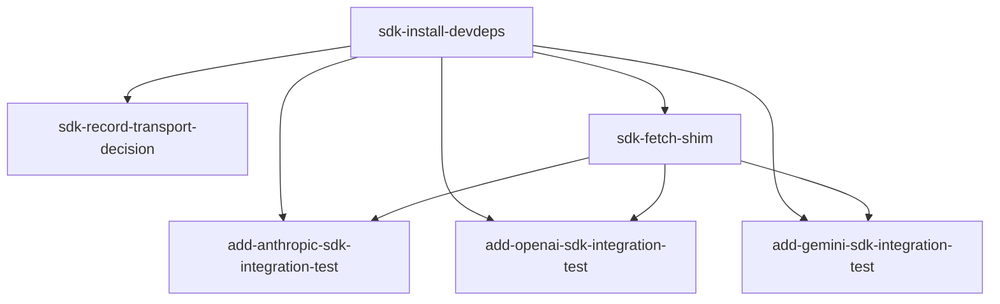

# Horizon 08 — AI SDK integration tests roadmap

## 🎯 What are we trying to achieve?

Add three opt-in integration tests that prove the in-process interceptor captures real provider HTTPS calls when driven through the **Vercel AI SDK** (`ai` + `@ai-sdk/anthropic` / `@ai-sdk/openai` / `@ai-sdk/google`) — not just raw `node:https.request` calls. The package's default `npm test` must still skip every new suite with zero network egress; with each provider's API-key env var set, the corresponding SDK suite runs one real `generateText` and asserts the captured `LlmLogEntry` matches the expected provider shape, with no apiKey leaked.

This is one indirection higher than horizon-7's raw-HTTPS integration tests: instead of the test code calling `https.request()` directly, the test code calls `await generateText({ model: anthropic(model, { fetch: createNodeHttpsFetch() }), prompt: 'hi' })` — i.e. the SDK's documented `fetch` option is overridden with our shim, so SDK traffic routes through `node:https.request` and lands on the interceptor's patch surface.

## 🧠 Why does this change need to happen?

The current package proves the interceptor captures **raw** HTTPS calls to the three providers. Real consumers do not call `node:https` directly — they use an SDK like Vercel's `ai`. Without SDK-level coverage, the package's documented "works with Anthropic/OpenAI/Google" surface is unverified at the abstraction consumers actually use. The 3 SDK integration tests close that gap end-to-end.

This is **not** a feature add for end users (the SDK packages stay in `devDependencies` — consumers of `llm-http-proxy` never need them installed). It's the package's own test surface maturing to match the way its consumers call it.

## At a glance

| | |
|---|---|
| **Phases** | 6 (install deps + record decision + fetch shim + 3 per-provider SDK tests) |
| **Complexity** | Medium — 3 SDK tests share a shim helper; one transport-decision moment locks the architecture for the whole horizon |
| **Main risk** | The Vercel AI SDK's default transport uses global fetch (undici-backed in Node 18+), which bypasses the interceptor's `http.ClientRequest.prototype` patch — without the shim approach (chosen as option B), every SDK suite would silently emit zero entries. See Discovery Finding **load-bearing-bypass-risk**. |
| **Testing focus** | Live SDK-issued HTTPS calls land in `entries[]` with correct provider fields, no apiKey leak in `JSON.stringify(entries[0])`, two-setImmediate flush honored, try/finally install/restore discipline, default `npm test` skips every suite with zero network egress |
| **Domain shape** | technical — adding test machinery to an HTTP interceptor library; no business rules |

---

## Order of work

The 6 phases execute in this order; arrows show the dependency:

```
0. Install SDK packages as devDependencies
       ↓
1. Record SDK transport decision in decisions log
       ↓
       ├─→ 2. Add SDK fetch shim helper ──────────────�
       ↓                                             ↓
3. Add SDK Anthropic integration test      ←──┐    │
4. Add SDK OpenAI integration test         ←──┤    │
5. Add SDK Gemini integration test        ←──┴────┘
```

Phases 3, 4, 5 depend on both Phase 0 (so `node:https` types resolve and `ai` / `@ai-sdk/*` are importable) and Phase 2 (so `createNodeHttpsFetch()` is defined). Phase 1 depends on Phase 0 only.



---

## Phase 0 — Install SDK packages as devDependencies

**Technical ID:** `sdk-install-devdeps` · bounded context: SDK test plumbing foundation · layer: infrastructure · blast radius: medium

**Goal:** `packages/llm-http-proxy/package.json` lists `ai` plus `@ai-sdk/anthropic`, `@ai-sdk/openai`, and `@ai-sdk/google` in `devDependencies`. `dependencies` and `peerDependencies` remain unchanged from their current empty/OTEL-only state.

**Why:** Without installing the SDK, none of the later per-provider test phases can run. Adding the SDK packages as devDependencies only preserves the zero-hard-deps public surface invariant — the published tarball still ships with `dependencies: {}` so consumers of `llm-http-proxy` never need the SDK installed.

**Changes:**
- Add `ai`, `@ai-sdk/anthropic`, `@ai-sdk/openai`, and `@ai-sdk/google` (v5.x stable) to `devDependencies` of `packages/llm-http-proxy/package.json`; do NOT add to `dependencies` or `peerDependencies`.
- Run the install with the package manager whose lockfile is committed at the repo root; confirm any generated `package-lock.json` is gitignored at the package level.

**Files / areas:**
- `packages/llm-http-proxy/package.json`

**How to verify:**
- (minScore 8) `devDependencies` block lists all four keys with v5.x version strings; `dependencies` and `peerDependencies` contain none of them
- (minScore 9) `dependencies` is `{}` or byte-identical to the pre-phase baseline; `peerDependencies` unchanged
- (minScore 8) No new `package-lock.json` is committed (`git check-ignore -v packages/llm-http-proxy/package-lock.json` shows the ignoring rule)
- (minScore 7) `npm install` exits 0; `node -e "require('@ai-sdk/anthropic')..."` exits 0; `npx tsc --noEmit -p packages/llm-http-proxy/tsconfig.json` exits 0
- (minScore 7) No unrelated `package.json` fields mutated (`scripts.test`, `exports`, `main`, etc.)

**Done when:** `packages/llm-http-proxy/package.json` lists the four SDK packages in `devDependencies`, no `dependencies` or `peerDependencies` entries added, `package-lock.json` is gitignored, `tsc` still exits 0.

**Depends on:** nothing — can start immediately.

**Rollback:** remove the four entries from `package.json` devDependencies and uninstall the npm packages.

---

## Phase 1 — Record SDK transport decision in decisions log

**Technical ID:** `sdk-record-transport-decision` · bounded context: SDK test plumbing foundation · layer: cross-cutting · blast radius: small

**Goal:** A new dated `horizon 7` entry appended to `docs/roadmaps/llm-http-proxy/decisions.md` titled `SDK integration test transport strategy` that records option (b) as the chosen transport strategy.

**Why:** Without a recorded decision, future maintainers would re-derive the same Node 18+ fetch-vs-ClientRequest question and might silently revert to the broken default. A dated decision entry makes the binding choice visible to every later horizon's planner.

**Changes:**
- Append a dated bullet to `decisions.md` stating: option (b) chosen (wrap the SDK's `fetch` option with a `node:https.request` shim); option (a) bare global fetch is empirically broken for interception; option (c) undici Dispatcher patching is out of scope for this horizon because it would change the public interceptor surface. The `— because` clause must name the bypass-risk and the option (c) deferral.

**Files / areas:**
- `docs/roadmaps/llm-http-proxy/decisions.md`

**How to verify:**
- (minScore 8) New entry begins with `- ` and contains the literal sequence ` | horizon 7 | ` followed by ` — because ` (matches the project's binding-decision bullet format)
- (minScore 9) ISO date equals `2026-08-30`; horizon segment equals `horizon 7`; no other entry in the file has this date
- (minScore 9) Entry contains literal token `option (b)`; names both the SDK's `fetch` option and the `node:https.request` shim; presents option (b) as chosen
- (minScore 8) Entry mentions option (a) as "empirically broken for interception" and option (c) as "out of scope for this horizon"; both in the same entry
- (minScore 8) `— because` clause contains `bypass-risk` and references option (c) deferral
- (minScore 9) Exactly one new bullet appended at the end of the file; all prior bullets byte-identical

**Done when:** `decisions.md` has exactly one new bullet at the end, dated `2026-08-30 | horizon 7 | ...` recording option (b) with the bypass-risk and option-(c) deferral named in the rationale.

**Depends on:** Phase 0 (sdk-install-devdeps).

**Rollback:** delete the new `decisions.md` entry; the rest of the file is untouched.

---

## Phase 2 — Add SDK fetch shim helper

**Technical ID:** `sdk-fetch-shim` · bounded context: SDK test plumbing foundation · layer: infrastructure · blast radius: small

**Goal:** `packages/llm-http-proxy/src/sdk-fetch-shim.ts` exports a `createNodeHttpsFetch()` factory returning a `(input: RequestInfo | URL, init?: RequestInit) => Promise<Response>` implementation backed by `node:https.request`. The shim is NOT re-exported from `src/index.ts`.

**Why:** The Vercel AI SDK exposes a documented `fetch` option on each provider factory (`anthropic`, `openai`, `google`) that accepts a custom fetch implementation. Passing our shim as that option makes the SDK's HTTPS calls flow through `node:https.request`, which IS captured by the interceptor's `http.ClientRequest.prototype` patch — solving the bypass-risk discovered in Stage 1.5.

**Changes:**
- Create `src/sdk-fetch-shim.ts` exporting `createNodeHttpsFetch()` — accepts string/URL/Request input, forwards `init.method`/`init.body`/`init.headers` (normalizing Headers instances), collects IncomingMessage chunks into a Buffer, resolves `new Response(buf, { status, statusText, headers })` for every status code (never rejects on non-2xx), rejects only on `req.on('error', ...)`.
- Type the return value against the SDK's `fetch` option shape so `tsc --noEmit` validates it (use a `satisfies FetchFunction = createNodeHttpsFetch()` typed const as a compile-time assignability proof).
- Add a file-header comment citing the load-bearing bypass-risk and stating the shim is test-only surface NOT re-exported from `src/index.ts`.

**Files / areas:**
- `packages/llm-http-proxy/src/sdk-fetch-shim.ts` (new file)

**How to verify:**
- (minScore 8) Shim's returned function accepts string/URL/Request input via `new URL(...)`; `init.body` written to request; `init.headers` normalized via `new Headers(init.headers)`; response body fully collected from IncomingMessage chunks
- (minScore 8) Transport is `node:https.request` only (no global fetch, no undici); no conditional fallback branch
- (minScore 7) No module-level mutable state; `req.on('error', ...)` rejects the promise; `npm test` run twice back-to-back passes both times with no open-handle warnings
- (minScore 7) Not exported from `src/index.ts`; `dependencies` still `{}`; no new `package-lock.json`; file begins with a header comment naming the bypass-risk
- (minScore 8) Explicit return type on `createNodeHttpsFetch()`; `satisfies` or typed const compile-time proof present; `npm run typecheck` exits 0; `npm run lint` exits 0; no `@ts-ignore`/`as any` suppressions

**Done when:** `src/sdk-fetch-shim.ts` exists, exports `createNodeHttpsFetch()` typed against the SDK's fetch option, transport is `node:https.request`, not re-exported from `index.ts`, `tsc` and `eslint` pass.

**Depends on:** Phase 0 (sdk-install-devdeps).

**Rollback:** delete `src/sdk-fetch-shim.ts`.

---

## Phase 3 — Add SDK Anthropic integration test

**Technical ID:** `add-anthropic-sdk-integration-test` · bounded context: SDK Anthropic integration test · layer: cross-cutting · blast radius: medium

**Goal:** `packages/llm-http-proxy/src/anthropic.sdk.integration.test.ts` exists and, when `ANTHROPIC_API_KEY` is exported, runs a single `generateText` through `@ai-sdk/anthropic` with the shim as the `fetch` option and asserts `entries.length === 1` with captured model containing `claude`, URL fragment matching `ANTHROPIC_BASE_URL`, non-negative token counts, and no apiKey anywhere in `JSON.stringify(entries[0])`. Without the key, the suite resolves to `describe.skip`.

**Why:** Horizon 7's raw-HTTPS tests prove the interceptor captures a direct `node:https.request` to `api.anthropic.com`, but real consumers use the SDK. This phase closes that gap end-to-end through `@ai-sdk/anthropic`'s `generateText`.

**Changes:** create `src/anthropic.sdk.integration.test.ts` — top-level `const apiKey = process.env.ANTHROPIC_API_KEY`, `hasKey` computed with `length > 0` check, gate as `if (hasKey) describe(...) else describe.skip(...)` mirroring `src/benchmark.test.ts:359-366`. Read `ANTHROPIC_API_KEY`/`ANTHROPIC_BASE_URL`/`ANTHROPIC_MODEL` with defaults `https://api.anthropic.com/v1/messages` and `claude-3-5-haiku-20241022`. Build `Interceptor({ providers: [parsedUrl.hostname], logger: ... })`, `install()`, then `anthropic(model, { fetch: createNodeHttpsFetch() })`, `await generateText({ model, prompt: 'hi' })`, await two `setImmediate` ticks, then assert `entries.length === 1`, URL fragment, model contains `claude`, both token counts `>= 0`, `JSON.stringify(entries[0])` does NOT contain the apiKey. Wrap in `try/finally` with `interceptor.restore()`.

**Files / areas:** `packages/llm-http-proxy/src/anthropic.sdk.integration.test.ts` (new file)

**How to verify:**
- (minScore 8) Gate uses `apiKey !== undefined && apiKey.length > 0`; resolves to `describe.skip` with empty key; live describe uses `(hasKey ? describe : describe.skip)` or `if/else`
- (minScore 9) `createNodeHttpsFetch` imported from `./sdk-fetch-shim`; provider built as `anthropic(model, { fetch: createNodeHttpsFetch() })`; no raw `https.request`/`http.request`/`fetch(..., { agent })` calls in the file
- (minScore 7) `interceptor.restore()` inside `finally`; `install()` before `await generateText`; fresh Interceptor instance per test; exactly one `restore()` per install
- (minScore 8) Two `setImmediate` awaits sequential before any `entries[...]` access; no synchronous read after generateText
- (minScore 9) `expect(JSON.stringify(entries[0])).not.toContain(apiKey)` runs after the flush; `apiKey` is the same variable passed to the SDK
- (minScore 8) `entries.length === 1` (not `>= 1`); URL contains parsed hostname; model contains `claude`; both token counts `>= 0`

**Done when:** the file exists, gates + grading pass under `npm run typecheck` / `npm run lint` / `npm test` (suite skipped by default) / `npm run build`, and the suite runs end-to-end when `ANTHROPIC_API_KEY` is set.

**Depends on:** Phase 0, Phase 2.

**Rollback:** delete `src/anthropic.sdk.integration.test.ts`.

---

## Phase 4 — Add SDK OpenAI integration test

**Technical ID:** `add-openai-sdk-integration-test` · bounded context: SDK OpenAI integration test · layer: cross-cutting · blast radius: medium

**Goal:** `src/openai.sdk.integration.test.ts` exists and, when `OPENAI_API_KEY` is exported, runs a single `generateText` through `@ai-sdk/openai` with the shim as the `fetch` option and asserts `entries.length === 1` with the same shape as the Anthropic SDK test. Without the key, the suite resolves to `describe.skip`.

**Why:** Same shape as the Anthropic SDK test but for the second of three named providers; closes the SDK-gap proof for OpenAI.

**Changes:** mirror the Anthropic SDK test, using `OPENAI_API_KEY` / `OPENAI_BASE_URL` / `OPENAI_MODEL` (default `https://api.openai.com/v1`, `gpt-4o-mini`), `openai()` from `@ai-sdk/openai`. Same try/finally install/restore, same two-setImmediate flush, same JSON.stringify no-key safety assertion.

**Files / areas:** `packages/llm-http-proxy/src/openai.sdk.integration.test.ts` (new file)

**How to verify:** same 6 dimensions as Phase 3, with `OPENAI_*` env vars and `openai` provider. The model substring check uses `'gpt'` (substring) so any `gpt-*` model from `OPENAI_MODEL` satisfies.

**Done when:** file exists, gates pass, suite skipped by default, suite runs end-to-end when `OPENAI_API_KEY` is set.

**Depends on:** Phase 0, Phase 2.

**Rollback:** delete `src/openai.sdk.integration.test.ts`.

---

## Phase 5 — Add SDK Gemini integration test

**Technical ID:** `add-gemini-sdk-integration-test` · bounded context: SDK Gemini integration test · layer: cross-cutting · blast radius: medium

**Goal:** `src/gemini.sdk.integration.test.ts` exists and, when `GEMINI_API_KEY` (or `GOOGLE_API_KEY`) is exported, runs a single `generateText` through `@ai-sdk/google` with the shim as the `fetch` option and asserts `entries.length === 1`, model contains `gemini`, URL fragment matches `GEMINI_BASE_URL` AND does NOT contain the apiKey (header-auth rubric), non-negative token counts, no apiKey in `JSON.stringify(entries[0])`. Without either key, the suite resolves to `describe.skip`.

**Why:** Closes the SDK-gap proof for the third named provider. Gemini's `@ai-sdk/google` provider uses header auth (`x-goog-api-key`) by default rather than URL-query auth, so the URL-key-safety rubric carries over from horizon 7 unchanged. Token assertions are non-negative only (the default parser does not recognize Gemini's `usageMetadata` camelCase fields and falls back to `chars/4`).

**Changes:** mirror the OpenAI SDK test using `GEMINI_API_KEY` with `GOOGLE_API_KEY` fallback, default `GEMINI_BASE_URL=https://generativelanguage.googleapis.com/v1beta/models`, `GEMINI_MODEL=gemini-2.0-flash`. The provider is constructed as `google(model, { fetch: createNodeHttpsFetch() })`. The model is interpolated into the URL path: `${baseUrl}/${model}:generateContent`. URL assertion: `entries[0].url` contains `${parsedUrl.hostname}${parsedUrl.pathname}` AND does NOT contain the apiKey.

**Files / areas:** `packages/llm-http-proxy/src/gemini.sdk.integration.test.ts` (new file)

**How to verify:**
- (minScore 9) Two truthiness checks (GEMINI_API_KEY, GOOGLE_API_KEY) reject empty strings; gate resolves to `describe.skip` when both unset/empty
- (minScore 10) `entries[0].url` contains the parsed hostname AND does NOT contain the apiKey; both assertions run AFTER the two-setImmediate flush
- (minScore 10) `expect(JSON.stringify(entries[0])).not.toContain(apiKey)` after the flush; uses the same non-empty value passed to the SDK
- (minScore 9) Imports `google` from `@ai-sdk/google`, `generateText` from `ai`, `createNodeHttpsFetch` from `./sdk-fetch-shim`; model built as `google(model, { fetch: createNodeHttpsFetch() })`
- (minScore 8) Two `setImmediate` awaits sequential before any `entries[...]` access
- (minScore 9) Fresh Interceptor instance per test; `restore()` exactly once in `finally`; no `beforeAll`/`afterAll`

**Done when:** file exists, gates pass, suite skipped by default, suite runs end-to-end when `GEMINI_API_KEY` (or `GOOGLE_API_KEY`) is set, header auth means URL-key safety holds.

**Depends on:** Phase 0, Phase 2.

**Rollback:** delete `src/gemini.sdk.integration.test.ts`.

---

## Discovery Findings

| Area | Finding | File path | Implication |
|---|---|---|---|
| load-bearing-bypass-risk | Node 18+ global fetch is undici-backed and bypasses `http.ClientRequest.prototype`; the SDK's `fetch` option is the seam. | `src/interceptor.ts` | Horizon wraps SDK fetch via a `node:https.request` shim (option B), so the SDK's default global fetch does NOT silently bypass capture. |
| horizon-7-discovery-contradiction | The horizon-7 claim "global fetch routes through http.ClientRequest under Node 18+" is empirically wrong; fetch is undici. | `docs/roadmaps/llm-http-proxy/discoveries.md` | Fetch-baseline was rewritten to use `node:https.request`, not fetch; future fetch-interception work must NOT trust that unverified entry. |
| interceptor-patch-surface | The patch is `http.ClientRequest.prototype` at lines 225-228; covers node:http and node:https only, not undici. | `src/interceptor.ts` | Any SDK test shim must transport via `node:https.request`, never global fetch. |
| existing-integration-test-gate-shape | Horizon-7 raw-HTTPS tests use `if(hasKey) describe/else describe.skip` with length>0 check + two-setImmediate flush + JSON.stringify no-key safety. | `src/anthropic.integration.test.ts` | SDK tests copy verbatim; gate shape is portable. |
| ai-sdk-npm-package-structure | `ai` + `@ai-sdk/anthropic/openai/google` are v5.x; each provider factory exposes `fetch: (input, init) => Promise<Response>` as documented interception seam. | npm package docs | Shim wires into `fetch:` option, not a global fetch patch. |
| tsconfig-typecheck-surface | `tsconfig` has `types:['node','jest']` with `@types/node@22` + `@types/jest@29`; SDK packages ship own types. | `tsconfig.json` | No tsconfig changes or extra `@types` packages required to make SDK compile. |
| existing-install-state | Vercel AI SDK NOT installed anywhere; no entry for `ai` or `@ai-sdk/*` in package.json, node_modules, or lockfile. | `package.json` | Green-field install with no existing surface to reconcile against. |
| zero-lockfile-convention | Package-level `.gitignore` contains `package-lock.json`; pnpm-lock.yaml is the committed lockfile. | `.gitignore` | Any new `package-lock.json` from npm install is gitignored at package level; install with the same package manager as the committed lockfile. |
| gemini-sdk-key-leak-safety | Horizon-7 gemini raw-HTTPS test uses `x-goog-api-key` header + asserts URL and `JSON.stringify` don't contain apiKey; `deriveUrl` passes `req.path` verbatim. | `src/gemini.integration.test.ts` | SDK gemini test must use `@ai-sdk/google`'s default header auth, not query-param. |
| default-parser-coverage | Default parser extracts via `usage.completion_tokens/output_tokens`; Gemini's `usageMetadata`/camelCase not recognized, outputTokens falls back to chars/4. | `src/provider-parser.ts` | SDK gemini test uses >=0 assertion shape only, not authoritative token-count checks. |
| test-file-discovery | `testRegex` matches `*.integration.test.ts` and `*.sdk.integration.test.ts`; no `testPathIgnorePatterns`. | `package.json` | No jest config change needed for SDK tests; ms-scale skip overhead budget unchanged. |
| index-public-surface-invariance | `src/index.ts` exports fixed public surface; SDK packages not re-exported. | `src/index.ts` | SDK tests must import directly from `ai`, `@ai-sdk/*`, never via `index.ts`; preserves zero-hard-deps public surface invariant. |

## Out of Scope

- Real `npm publish` execution — deferred; user redirected horizon 8 away from the publish-focused Stage 3.5 brief.
- Semver-freeze call / VERSION bump from 0.2.0 to 0.3.0 — deferred; publish-side.
- ESM dist lazy-require inertness proof under a real ESM consumer — deferred; publish-side.
- `prepack` / `prepublishOnly` / `prepare` auto-build scripts — deferred; publish-side.
- `repository` / `homepage` / `bugs` / `publishConfig` fields in `package.json` — deferred; publish-side.
- Consumer-facing OTEL README docs / `index.ts` doc comments — deferred; publish-side.
- Resolving the horizon-5 p99 latency-budget FAIL — deferred; the SDK integration tests are not the latency bar.
- OTLP/HTTP wire export of OTEL spans to a real collector — deferred; horizon-6's `InMemorySpanExporter` round-trip is the closed form.
- Trace propagation / context injection beyond what horizon 6 already shipped — deferred.
- Adding SDK tests for additional providers (Mistral, Cohere, DeepSeek, Bedrock, etc.) — YAGNI gate 1 (not asked for).
- Extracting a shared `liveTestHarness` factory from the SDK tests — YAGNI gate 3 (speculative abstraction).
- Switching the SDK test gate from `describe.skip` per file to `testPathIgnorePatterns` in jest config — rejected per horizon-7 fetch-baseline-contract-shift discovery.
- Streaming-mode / auth-error-path / rate-limit-backoff coverage for SDK calls — deferred; single generation per provider.
- Re-executing horizon-7's unexecuted phases 3 and 4 (OpenAI + Gemini raw-HTTPS source files already on disk).
- Bumping the package's runtime API surface (new exports from `src/index.ts`, version bump, dist rebuild).
- Empirical probe test asserting global fetch bypasses the interceptor — rejected at user Stage 3.4 redirect.
- Extending the interceptor to monkey-patch undici's Dispatcher via `setGlobalDispatcher` (option C) — rejected per CRITICAL CONTEXT; deferred to a future horizon with its own decision record.

## Required Materials

| Name | Kind | Why needed | Acquisition |
|---|---|---|---|
| `src/interceptor.ts` source | document | Defines patch surface (`http.ClientRequest.prototype`) and install/restore API the SDK tests must drive | read directly from disk |
| `src/options.ts` LlmLogEntry type | document | `successDefinition` asserts on `LlmLogEntry` fields (model, url, token counts) | read directly |
| `src/interceptor.ts:924-963` deriveUrl | document | `deriveUrl` passes `req.path` verbatim; gemini key-leak-safety rubric depends on this | read directly |
| `src/provider-parser.ts:141-152` default parser | document | Gemini's `usageMetadata`/camelCase fields not recognized; outputTokens falls back to chars/4 | read directly |
| horizon-7 raw-HTTPS test templates | document | The three horizon-7 test files are authoritative templates for gate + flush + assertion shape | read from `src/{anthropic,openai,gemini}.integration.test.ts` |
| `src/benchmark.test.ts:359-366` gate shape | document | Verbatim `if (hasKey) describe(...) else describe.skip(...)` reference | read directly |
| `src/interceptor.test.ts:75-91` withEntries helper | document | Two-setImmediate flush helper the new tests must replicate | read directly |
| `package.json` current state | document | Confirms zero existing `ai`/`@ai-sdk/*` entries; exposes jest testRegex, scripts, dependencies/devDependencies/peerDependencies layout | read directly |
| `.gitignore` (package level) | document | `package-lock.json` is gitignored at package level — must verify this still holds after install | read directly |
| Vercel AI SDK fetch option API per provider | knowledge | Shim must type-against the SDK's `fetch` option signature so `tsc` validates assignability | look up `@ai-sdk/*` types in `node_modules` after install |
| ANTHROPIC_API_KEY | credential | Required for the Anthropic SDK suite to run live | user supplies via shell export |
| OPENAI_API_KEY | credential | Required for the OpenAI SDK suite to run live | user supplies via shell export |
| GEMINI_API_KEY or GOOGLE_API_KEY | credential | Required for the Gemini SDK suite (gate uses GEMINI_API_KEY with GOOGLE_API_KEY fallback) | user supplies via shell export |

## Success Criteria

1. Done and correct iff: (a) `packages/llm-http-proxy/package.json` lists `ai`, `@ai-sdk/anthropic`, `@ai-sdk/openai`, and `@ai-sdk/google` in `devDependencies`; (b) `docs/roadmaps/llm-http-proxy/decisions.md` has a new dated `horizon 7` entry recording option (b) as the chosen SDK transport strategy; (c) `packages/llm-http-proxy/src/sdk-fetch-shim.ts` exports `createNodeHttpsFetch()` typed against the SDK's fetch option and is NOT re-exported from `src/index.ts`; (d) `packages/llm-http-proxy/src/{anthropic,openai,gemini}.sdk.integration.test.ts` exist and pass default `npm test` with all suites skipped and zero network egress; (e) when each provider's API-key env var is set, the corresponding SDK suite runs one real `generateText` through the SDK with the shim as the `fetch` option and asserts `entries.length === 1` + captured model/url/token fields + `JSON.stringify(entries[0])` does not contain the apiKey; (f) `npm run typecheck`, `npm run lint`, `npm run build` all stay green.
2. **Add SDK Anthropic integration test:** `packages/llm-http-proxy/src/anthropic.sdk.integration.test.ts` exists; runs a single `generateText` through `@ai-sdk/anthropic` with the shim as the `fetch` option and asserts `entries.length === 1` + model contains `claude` + URL fragment matches `ANTHROPIC_BASE_URL` + non-negative token counts + `JSON.stringify(entries[0])` does not contain apiKey; resolves to `describe.skip` when `ANTHROPIC_API_KEY` is unset.
3. **Add SDK OpenAI integration test:** `packages/llm-http-proxy/src/openai.sdk.integration.test.ts` exists; runs a single `generateText` through `@ai-sdk/openai` with the shim as the `fetch` option and asserts `entries.length === 1` + model contains `gpt` + URL fragment matches `OPENAI_BASE_URL` + non-negative token counts + `JSON.stringify(entries[0])` does not contain apiKey; resolves to `describe.skip` when `OPENAI_API_KEY` is unset.
4. **Add SDK Gemini integration test:** `packages/llm-http-proxy/src/gemini.sdk.integration.test.ts` exists; runs a single `generateText` through `@ai-sdk/google` with the shim as the `fetch` option and asserts `entries.length === 1` + model contains `gemini` + URL fragment matches `GEMINI_BASE_URL` and does NOT contain apiKey (header-auth rubric) + non-negative token counts + `JSON.stringify(entries[0])` does not contain apiKey; resolves to `describe.skip` when `GEMINI_API_KEY` and `GOOGLE_API_KEY` are both unset/empty.
5. **Add SDK fetch shim helper:** `packages/llm-http-proxy/src/sdk-fetch-shim.ts` exports `createNodeHttpsFetch()` backed by `node:https.request`; types as `RequestInfo | URL` input, `RequestInit` opts, `Promise<Response>` result; not re-exported from `src/index.ts`; `tsc` and `eslint` pass.
6. **Install SDK packages as devDependencies:** `ai` + `@ai-sdk/anthropic` + `@ai-sdk/openai` + `@ai-sdk/google` appear in `packages/llm-http-proxy/package.json` devDependencies; `dependencies` and `peerDependencies` remain empty/OTEL-only; no `package-lock.json` committed.
7. **Record SDK transport decision in decisions log:** `docs/roadmaps/llm-http-proxy/decisions.md` has a dated `horizon 7` entry recording option (b) (fetch shim) as chosen, option (a) as empirically broken, option (c) as deferred; rationale names bypass-risk and option (c) deferral.

## Alignment Preview

The user was shown the preview after Stage 3 decomposed phases. The Preview Concerns critique raised 2 issues:

1. **(other)** The empirical probe that would confirm "bare Vercel AI SDK calls produce zero captured entries" was rejected for YAGNI — recording the decision is not the same as verifying the premise. *cheapest fix:* restore the probe as the first phase.
2. **(scope-doubling)** Phase 0 bundled two distinct deliverables — `package.json` install and `decisions.md` record entry — for different files with different audiences. *cheapest fix:* split Phase 0 into one install phase and one record-decision phase.

The user redirected once at the preview: **"Split install from decision record"** — addressing concern 2 (kept the split into Phases 0 and 1) but NOT addressing concern 1 (the empirical probe stays out of scope per the user's choice; the recorded decision in `decisions.md` is treated as sufficient evidence). Phase count is now 6, still under the 7-phase hard ceiling.

## Quality Gate

**Path taken:** Full (multiple providers, external SDK + npm registry materials, multi-bounded-context coverage).

**Iterations run:** 1.

**Issues raised → verified (blockers only) → healed:**
- 1 minor issue raised by the critic (severity: `minor`, dimension: `valid-dependencies`): Phase 2 (sdk-record-transport-decision) declares `dependsOn` on Phase 1 (sdk-install-devdeps) but does not consume Phase 1's output in its inputs — the dependency is structurally valid but semantically unnecessary. **Accepted as debt, no healing applied** (per the v5 routing rules: minor issues become debt, not healing work).

**Accepted debt count:** 1.

**Final verdict:** **PASSED.** No surviving blocker or major issues; the gate's healing loop was not triggered. The minor `valid-dependencies` cosmetic dependency is recorded as accepted debt and does not block execution.

## Full analysis

**Domain shape:** technical (objective is adding integration-test machinery — test files, dependency placement in `package.json`, opt-in gate patterns, install/restore discipline — for an in-process HTTP interceptor library; no business entities, workflows, or domain rules; the prior 7 horizons have consistently classified llm-http-proxy as technical machinery per decision 2026-08-28 horizon 1).

**Ubiquitous language:**

| Term | Meaning |
|---|---|
| SDK-level integration test | An integration test that exercises the in-process interceptor by driving real provider HTTPS calls through the Vercel AI SDK (`ai` + per-provider SDK packages) instead of through raw `node:https` `request()` as horizon 7 did; the new surface is one indirection higher but the same gate + flush + capture discipline applies. |
| opt-in gate | The per-file `if (hasKey) describe(...) else describe.skip(...)` pattern that keys suite execution on the presence of the per-provider API-key env var (ANTHROPIC_API_KEY / OPENAI_API_KEY / GEMINI_API_KEY with GOOGLE_API_KEY fallback), with no separate LIVE flag and with empty-string env vars treated as unset. |
| Vercel AI SDK | The npm `ai` package plus its per-provider companion packages (`@ai-sdk/anthropic`, `@ai-sdk/openai`, `@ai-sdk/google`); installed as devDependencies only, never as dependencies or peerDependencies, never re-exported from `src/index.ts`. |
| two-setImmediate flush | The emission discipline in `src/interceptor.ts` where capture/parse/redact/emit run inside a `setImmediate`, so test assertions on the captured `entries` array must await two `setImmediate` ticks before reading it. |
| install/restore try/finally discipline | Per-test construction of a fresh `Interceptor`, calling `install()` before the SDK call and `restore()` after, structured so a thrown assertion or SDK error still restores the global http/https prototype patch. |
| zero-hard-deps public surface | The package's invariant that `dependencies: {}` stays empty and any optional runtime surface lives in `peerDependencies` with `peerDependenciesMeta.optional:true`; SDK test packages live in `devDependencies` only. |
| zero-lockfile convention | The repo-wide rule that no `package-lock.json` is committed anywhere; the new devDependency install produces a lockfile that must be gitignored, not added to the repo. |
| key-leak safety rubric | The defense-in-depth assertion `JSON.stringify(entries[0])` does NOT contain the literal apiKey value, applied to every SDK integration test. |

**Assumptions (verbatim from Stage 1 analysis):**

- The Vercel AI SDK exposes a documented `fetch` option on each provider factory (anthropic, openai, google) that accepts a custom fetch implementation; passing a node:https.request-backed shim as this option makes SDK traffic flow through http.ClientRequest.prototype, which the interceptor already patches.
- The horizon-7 raw-HTTPS integration test files are the authoritative templates.
- Empty-string env vars (e.g. `ANTHROPIC_API_KEY=`) are treated as unset and resolve to `describe.skip`.
- Gemini's SDK call uses header auth (`x-goog-api-key`) rather than URL-query `?key=`.
- `ai` + `@ai-sdk/*` are installable as plain devDependencies with no tsconfig changes required.
- The package's zero-lockfile convention is preserved.
- The post-horizon-8 baseline wall-clock stays within ms-scale skip-overhead of horizon-7's recorded time.
- The new SDK integration test files do NOT add exports to `src/index.ts` and do NOT bump the package version.
- The user has redirected horizon 8 from the publish-focused Stage 3.5 brief.
- Horizon 7's source files for raw-HTTPS tests already exist on disk; this horizon does NOT re-execute them.

**Risks (verbatim from Stage 1 analysis, abbreviated):**

- If the SDK's `fetch` option signature changes in a future major version, the shim's type compatibility with `FetchFunction` could break typecheck — the `typed-and-gates-green` rubric dimension enforces a `satisfies` clause so a future drift surfaces as a compile error.
- `ai` and the per-provider SDK packages pull large transitive dependency trees; the devDependency install may produce a sizable `package-lock.json` whose gitignore status must be re-verified.
- Conflict check against horizon-7 discovery `no-new-exported-symbols`: the shim's header comment documents this, and the `test-only-containment` rubric dimension enforces it.
- Conflict check against horizon-7 `gemini-must-use-header-auth` discovery: if a future SDK version switches Gemini auth to URL-query `?key=`, the URL-key safety rubric would fail.
- The SDK's per-provider model-name defaults may drift (e.g. a new Gemini model replacing `gemini-2.0-flash`); the SDK default constructor must accept an override via `process.env.{PROVIDER}_MODEL`.
- The horizon-5 p99 FAIL is not addressed by this horizon.
