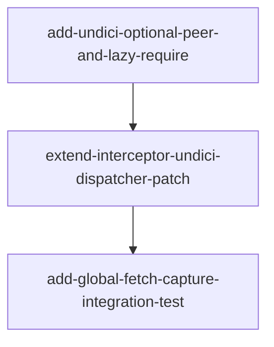

# Horizon 09 — undici dual-patch roadmap

## 🎯 What are we trying to achieve?

Extend `Interceptor.install()` so it patches **both** `http.ClientRequest.prototype` (existing, covers `node:http`/`node:https`) **and** undici's global dispatcher via `setGlobalDispatcher()` (new, covers `globalThis.fetch`). When SDKs like Vercel's `@ai-sdk/anthropic`/`@ai-sdk/openai`/`@ai-sdk/google` issue HTTPS calls through global `fetch`, those calls now land in the captured `entries[]` array with the same `LlmLogEntry` shape as raw `https.request` traffic — no per-file shim wiring required.

This is the answer to the bypass-risk horizon-7 + horizon-8 surfaced: the SDK's default transport is `globalThis.fetch` (undici-backed in Node 18+), which bypasses the interceptor's prototype patch. The dual-patch closes the gap transparently at the interceptor layer.

## 🧠 Why does this change need to happen?

Horizon-7 proved the interceptor captures **raw** `https.request` to the three providers. Horizon-8 was planned to add SDK-level coverage via a `createNodeHttpsFetch()` shim passed as the SDK's `fetch` option — but shimming per file is awkward and doesn't match how consumers actually wire up the package (they call `interceptor.install()` and expect everything to be captured). Without the dual-patch, the documented "captures Anthropic/OpenAI/Google HTTPS traffic" surface is half-proven: raw calls yes, SDK-driven calls no. The dual-patch is the architectural fix — once `install()` patches both surfaces, consumers get capture-completeness for free.

## At a glance

| | |
|---|---|
| **Phases** | 3 (add `undici` optional peer dep + lazy-require; extend Interceptor with undici `WrappingDispatcher`; add single global-fetch integration test) |
| **Complexity** | Medium — touches the interceptor core (`install()`/`restore()`), introduces a `WrappingDispatcher` class with synthetic-`ClientRequest` dispatch, requires careful idempotency and restore-round-trip semantics |
| **Main risk** | `undici` is bundled inside Node 18+ as `globalThis.fetch`'s implementation but NOT reachable as a user-importable module — `require('undici')` throws `MODULE_NOT_FOUND`. Mitigated by adding `undici` as an OPTIONAL peer dep (peerDependenciesMeta.undici.optional: true) so install() lazy-requires and gracefully degrades when absent. |
| **Testing focus** | Single new test using `globalThis.fetch` against a localhost mock HTTP server; existing fetch-baseline + 3 raw-HTTPS tests still pass without modification; round-trip invariant: after `restore()`, `getGlobalDispatcher() === <original>` |
| **Domain shape** | technical — extending monkey-patch infrastructure; no business rules |

---

## Order of work

```
0. Add undici optional peer dep and lazy-require
       ↓
1. Extend Interceptor with undici global dispatcher patch
       ↓
2. Add global fetch capture integration test
```



---

## Phase 0 — Add undici optional peer dep and lazy-require

**Technical ID:** `add-undici-optional-peer-and-lazy-require` · bounded context: packages-llm-http-proxy · layer: infrastructure · blast radius: small

**Goal:** `packages/llm-http-proxy/package.json` declares `undici ^6.0.0 || ^7.0.0` in `peerDependencies` with `peerDependenciesMeta.undici.optional: true`; `src/interceptor.ts` has a module-top lazy-require that resolves undici into a `let` binding or to `undefined` on failure; `dependencies` stays `{}`.

**Why:** Node 22.14.0 bundles undici 6.21.1 as `globalThis.fetch`'s implementation but it is NOT reachable as a user-importable module — `require('undici')` throws `MODULE_NOT_FOUND` unless the npm package is installed. The dual-patch needs `undici` require()-able at runtime while still working when a consumer's package manager does not install the peer. We follow the same lazy-require pattern already in `src/otel.ts`.

**Changes:**
- Add `"undici": "^6.0.0 || ^7.0.0"` to `peerDependencies` in `packages/llm-http-proxy/package.json`.
- Add `"undici": { "optional": true }` to `peerDependenciesMeta`.
- Add `import type { Dispatcher, DispatchOptions, DispatchHandlers } from 'undici-types'` at the top of `src/interceptor.ts` (types-only; `@types/node@22.20.1` already re-exports `undici-types`).
- Add module-top `let undici: typeof import('undici') | undefined; try { undici = require('undici'); } catch { undici = undefined; }` to `src/interceptor.ts` (mirroring `src/otel.ts`).
- Confirm `dependencies` remains `{}` after the change.

**Files / areas:**
- `packages/llm-http-proxy/package.json`
- `packages/llm-http-proxy/src/interceptor.ts`

**How to verify:**
- (minScore 9) `peerDependencies.undici` is a non-empty semver range matching BOTH `6.21.1` and `7.0.0`; `peerDependenciesMeta.undici.optional === true`; `dependencies` prints `{}`; pre-existing `@opentelemetry/*` optional-peer entries are still present
- (minScore 9) ABSENT state (current default): `npx jest` exits 0 with no MODULE_NOT_FOUND; `npm run build && node -e "require('./dist/cjs/index.js')"` prints 'loaded'. PRESENT state (after `npm i -D undici`): `require('undici').setGlobalDispatcher` is a function; `npx jest` still exits 0
- (minScore 8) All undici typings via type-only imports; `grep "undici-types" dist/` returns 0; only runtime `require('undici')` is inside the guarded try/catch block
- (minScore 8) Exactly one `require('undici')` in `src/interceptor.ts`; it's above all declarations (module scope); shape mirrors `src/otel.ts` lines 36-44
- (minScore 8) No `setGlobalDispatcher`/`getGlobalDispatcher`/`Agent(` references in `src/interceptor.ts`; `git diff` lists only `package.json` + `src/interceptor.ts` (+ lockfile); `npx jest` test count unchanged from baseline

**Done when:** `package.json` declares the optional peer; `src/interceptor.ts` has the lazy-require with try/catch; `dependencies` stays `{}`; tests pass in both ABSENT and PRESENT states.

**Depends on:** nothing — can start immediately.

**Rollback:** remove the `undici` entries from `peerDependencies` and `peerDependenciesMeta`; remove the type-only import and module-top lazy-require from `src/interceptor.ts`.

---

## Phase 1 — Extend Interceptor with undici global dispatcher patch

**Technical ID:** `extend-interceptor-undici-dispatcher-patch` · bounded context: packages-llm-http-proxy · layer: application · blast radius: medium

**Goal:** `Interceptor.install()` patches both `http.ClientRequest.prototype` AND undici's global dispatcher (via `setGlobalDispatcher`) using the existing `emitLogEntry` builder; `Interceptor.restore()` reinstates the original dispatcher by reference identity; both `install()` and `restore()` are idempotent; the in-source comment at lines 225-228 is rewritten to describe dual-surface coverage.

**Why:** This is the core task: extend the existing `http.ClientRequest.prototype` patch with undici Dispatcher coverage so global fetch traffic is captured with the same `LlmLogEntry` shape. The undici-patch surface receives a plain `DispatchOptions` object — fundamentally different from a stateful `ClientRequest` — so the horizon builds a synthetic `ClientRequest` from `DispatchOptions` (duck-typed via the existing `as unknown as { ... }` view-cast discipline at `interceptor.ts:905-921`) and routes it through the existing `emitLogEntry` builder verbatim. Idempotency mirrors the existing `kWriteWrapper`/`kEndWrapper` Symbol-tag pattern; `restore()` checks the current global dispatcher is still our wrapper before reinstating the original.

**Changes:**
- Add `const kDispatcherWrapper = Symbol('llm-http-proxy.dispatcherWrapper')` alongside the existing `kWriteWrapper`/`kEndWrapper`/`kOnWrapper` Symbols.
- Define `class WrappingDispatcher implements Dispatcher`: its `dispatch(options, handler)` constructs a synthetic `ClientRequest` from `options.origin/path/method/headers/body` via view-casts, routes through `attachCapture` and `emitLogEntry` verbatim, forwards to `original.dispatch(options, wrappedHandler)`. Pass-throughs for `connect`/`compose`/`request`/`pipeline`/`stream`/`upgrade`/`close`/`destroy`.
- Extend `Interceptor.install()`: when `undici !== undefined`, capture `original = undici.getGlobalDispatcher()`, build `wrapper = new WrappingDispatcher(original)`, tag with `kDispatcherWrapper`, store on instance, call `undici.setGlobalDispatcher(wrapper)`. Idempotency guard via `kDispatcherWrapper` tag check.
- Extend `Interceptor.restore()`: if `undici !== undefined` and `undici.getGlobalDispatcher() === wrapper`, call `undici.setGlobalDispatcher(original)`; clear stored refs.
- Rewrite the comment at `packages/llm-http-proxy/src/interceptor.ts` lines 225-228 to describe dual-surface coverage (keep the http-path fact, add undici Dispatcher wrapping paragraph).
- Confirm `Interceptor.install()` signature is unchanged (no new option, per the user's Step-0 answer) and no new export is added to `packages/llm-http-proxy/src/index.ts`.

**Files / areas:**
- `packages/llm-http-proxy/src/interceptor.ts`

**How to verify:**
- (minScore 8) Capture `original = undici.getGlobalDispatcher()`; call `Interceptor.install()`; assert `getGlobalDispatcher() !== original`; assert new dispatcher is the wrapper (instanceof `WrappingDispatcher` or carries `kDispatcherWrapper` Symbol tag); assert existing http-patch tags (`kWriteWrapper`/`kEndWrapper`/`kOnWrapper`) are still present on the prototype
- (minScore 8) install() called twice → second call is a no-op (assert `wrapper1 === wrapper2` after two install calls); restore() once → `getGlobalDispatcher() === original`
- (minScore 9) Capture `original`, install, restore; assert `getGlobalDispatcher() === original` via strict `===` (not `toEqual`); if external code swapped the global dispatcher, restore() leaves the external dispatcher in place
- (minScore 8) install(); restore(); restore() — second restore() doesn't throw; restore() on a fresh Interceptor with no prior install() doesn't throw
- (minScore 9) End-to-end test: bind an `http.Server` to 127.0.0.1 on an OS-assigned port; install(); call `await fetch('http://127.0.0.1:<port>/v1/chat/completions', { method: 'POST', headers, body })`; assert captured LlmLogEntry has timestamp set, model matching request body, url === mock URL, callerTrace present; restore(); follow-up fetch produces NO new entry
- (minScore 7) Comment at lines 220-235 explicitly mentions BOTH `http.ClientRequest.prototype` AND the undici global dispatcher; does NOT contain a misleading claim that the interceptor only patches the http surface

**Done when:** `src/interceptor.ts` has the `WrappingDispatcher` class; `install()` captures original + sets wrapper + is idempotent; `restore()` reinstates original by reference identity + is idempotent; the comment at lines 225-228 describes dual-surface coverage.

**Depends on:** Phase 0 (sdk-install-and-record).

**Rollback:** Remove the `kDispatcherWrapper` Symbol, the `WrappingDispatcher` class, the install() and restore() extensions, and the comment rewrite from `src/interceptor.ts`.

---

## Phase 2 — Add global fetch capture integration test

**Technical ID:** `add-global-fetch-capture-integration-test` · bounded context: packages-llm-http-proxy · layer: cross-cutting · blast radius: small

**Goal:** `packages/llm-http-proxy/src/global-fetch-capture.integration.test.ts` exists and proves `globalThis.fetch` is captured via the undici-patch surface using a localhost mock HTTP server.

**Why:** Per the user's success criterion #6 and the Step-0 redirect (SDK test files do not exist on disk and are not in scope), the horizon's primary proof surface is a single new integration test that fires `globalThis.fetch(...)` against a localhost mock server and asserts the captured `LlmLogEntry` shape. Test isolation is handled with `beforeEach`/`afterEach` so the global dispatcher mutation does not leak between test files.

**Changes:**
- Create `packages/llm-http-proxy/src/global-fetch-capture.integration.test.ts` modeled on `src/fetch-baseline.integration.test.ts`: spin up a localhost HTTP mock server with a known URL, call `globalThis.fetch(url, { method: 'POST', headers, body })`, assert `entries.length === 1` with expected LlmLogEntry fields (timestamp populated, url matches mock URL, model derived from request body via `src/logger.ts`, callerTrace present).
- Wrap install + restore in `beforeEach` / `afterEach` so the global dispatcher mutation does not leak between test files or test cases; explicitly assert after restore that `getGlobalDispatcher() === <original>` to lock in the round-trip invariant.
- Confirm the new test runs under `npm test` (no `testPathIgnorePatterns` change needed — the existing testRegex picks up `.integration.test.ts` automatically) and the existing `src/fetch-baseline.integration.test.ts` plus the 3 raw-HTTPS integration tests still pass without modification.

**Files / areas:**
- `packages/llm-http-proxy/src/global-fetch-capture.integration.test.ts` (new file)

**How to verify:**
- (minScore 8) File exists at the path and contains exactly one focused `it`/`test` (or one describe with one `it`/`test`)
- (minScore 9) After two setImmediate ticks, `entries.length === 1`; entry has timestamp populated, url strictly equal to the mock server URL, callerTrace present, model derived from request body, inputTokens/outputTokens defined
- (minScore 10) Captures `const original = getGlobalDispatcher()` before install; in afterEach calls `interceptor.restore()` and asserts `expect(getGlobalDispatcher()).toBe(original)` (strict `===`, not `toEqual`)
- (minScore 9) `beforeEach` calls `interceptor.install()`; `afterEach` calls `interceptor.restore()`; `npm test` exits 0 with all pre-existing tests passing
- (minScore 10) `git diff` shows exactly one new file (the new test); no existing test files modified; `package.json` unchanged

**Done when:** the file exists, runs under `npm test`, and asserts `entries.length === 1` with the expected LlmLogEntry fields after a single `globalThis.fetch()` against the localhost mock server.

**Depends on:** Phase 1.

**Rollback:** delete `packages/llm-http-proxy/src/global-fetch-capture.integration.test.ts`.

---

## Discovery Findings

| Area | Finding | File path | Implication |
|---|---|---|---|
| undici runtime availability | Node 22.14.0 bundles undici 6.21.1 as `globalThis.fetch`'s implementation but NOT reachable as a user-importable module: `require('undici')` throws MODULE_NOT_FOUND. Only `undici-types@6.21.0` (types-only) is on disk transitively. | `node_modules/undici-types/package.json` | Add `undici` as OPTIONAL peer dep; `install()` lazy-requires and gracefully degrades. |
| undici Dispatcher types | `dispatch(options, handler): boolean` plus `connect`/`compose`/`request`/etc.; DispatchOptions has `origin`/`path`/`method`/`body`/`headers`; DispatchHandlers has `onConnect`/`onError`/`onHeaders`/`onData`/`onComplete`. | `node_modules/undici-types/dispatcher.d.ts` | Build a synthetic `ClientRequest` from `DispatchOptions` (via view-casts) so the existing `emitLogEntry` can be reused verbatim. |
| setGlobalDispatcher signatures | `setGlobalDispatcher<D>(dispatcher: D): void` and `getGlobalDispatcher(): Dispatcher`; type does NOT include null; null throws TypeError at runtime. | `node_modules/undici-types/global-dispatcher.d.ts` | restore() must capture and reinstate the original by reference identity; passing null is not an option. |
| Existing emitLogEntry input shape | `emitLogEntry(req: ClientRequest, state: CaptureState, error?: Error)`. Reads `hostname`/`port`/`path`/`scheme`/`getHeader('host')` from req via view-casts. Does NOT depend on the request being in flight. | `src/interceptor.ts` | Synthetic-`ClientRequest` construction is straightforward: hostname from `opts.origin`, path from `opts.path`, scheme from origin startsWith `'https://'`. |
| Idempotency guard pattern | Existing install uses `kWriteWrapper`/`kEndWrapper`/`kOnWrapper` Symbols on the prototype. Mirror with `kDispatcherWrapper` on the wrapper instance. | `src/interceptor.ts` | install() guard via `kDispatcherWrapper` tag; restore() guard via `getGlobalDispatcher() === wrapper`. |
| state.md horizon-8 status | state.md records horizon 8 as `planned`, not `completed`. SDK test files do not exist on disk. | `state.md` | User's Step-0 redirect: drop SDK test migration; horizon 9 scope shrinks to dual-patch + single new test. |
| testRegex coverage | `testRegex` matches `*.test.ts`/`*.spec.ts`; no `testPathIgnorePatterns`; lint + tsc globs include new files automatically. | `package.json` | New test file discovered automatically; no jest/tsconfig change needed. |
| Double-emission risk | global fetch and https.request both fire; no de-dup hook. | `src/interceptor.ts` | Test discipline: the new test uses global fetch ONLY; existing tests use https.request ONLY. |
| Latency discipline | Header doc says emission is deferred to response listeners/setImmediate, never on the synchronous request path. | `src/interceptor.ts` | The dual-patch keeps the off-request-path discipline; horizon-5 p99 miss not re-opened. |
| Lazy-require pattern | `let undici = undefined; try { undici = require('undici') } catch { undici = undefined }` at module top, mirroring `src/otel.ts`. | `src/otel.ts`, `src/interceptor.ts` | install() skips undici side when peer absent; zero-hard-deps invariant preserved. |
| Comment at lines 225-228 | Reads "Patching once covers both" — misleading after horizon-7 discovery. | `src/interceptor.ts` | Rewrite to ADD undici coverage; do NOT delete the http-path fact. |

## Out of Scope

- Real `npm publish` — explicitly deferred past horizon 8 per next-horizon-brief; this horizon is internal-only.
- Semver-freeze call from 0.2.0 to 0.3.0 — the dual-patch is internal and additive.
- Streaming-mode SDK calls — deferred per next-horizon-brief.
- ESM dist lazy-require inertness proof — deferred.
- `prepack` / `prepare` / `prepublishOnly` — publishing-hygiene work.
- `repository` / `homepage` / `bugs` / `publishConfig` fields — publishing metadata.
- Consumer-facing OTEL README docs — out of scope.
- Additional provider SDK tests — only the 3 named providers (when horizon-8 lands).
- Shared live-test-harness extraction — deferred.
- Jest `testPathIgnorePatterns` config migration — deferred.
- Clean re-run of the horizon-5 p99 latency bar — deferred.
- Migration of any SDK integration test files — they don't exist on disk; nothing to migrate.
- Deletion of `src/sdk-fetch-shim.ts` — the file doesn't exist yet.
- Adding `undici` to `dependencies` — would break zero-hard-deps.
- Any new option on `Interceptor.install()` — user explicitly required no new option.
- Any new exported symbol from `src/index.ts` — user explicitly required no new export.
- README.md updates — out of scope.
- Adding a dedicated unit test for the `WrappingDispatcher` class in isolation.
- Restructuring the interceptor's provider-parser / redaction / logger seams.
- A dynamic dispatcher disable flag — user explicitly required no new option.
- Re-running the horizon-5 p99 latency benchmark — out of scope.
- Landing horizon-8's deliverables — those files don't exist; landing them is a separate horizon.
- End-to-end SDK capture proof — requires horizon-8's SDK test files to land first.

## Required Materials

| Name | Kind | Why needed | Acquisition |
|---|---|---|---|
| `src/interceptor.ts` source | document | Defines emitLogEntry signature and the existing http.ClientRequest.prototype patch the dual-patch extends | read from disk |
| `src/otel.ts` source | document | The established lazy-require pattern for optional peer deps | read from disk |
| `src/fetch-baseline.integration.test.ts` | document | Template for the new global-fetch test (localhost mock server, entries assertion shape) | read from disk |
| `undici-types` types | knowledge | Type-only imports for `Dispatcher`, `DispatchOptions`, `DispatchHandlers` — no runtime code | re-exported transitively by `@types/node@22.20.1` |
| `undici` npm package (v6 or v7) | tool | Provides `setGlobalDispatcher`, `getGlobalDispatcher`, `Dispatcher` class at runtime | install as devDependency during development; declared as optional peer dep for consumers |
| Current `packages/llm-http-proxy/package.json` | document | Confirms `dependencies` remains `{}`, `peerDependencies` has the existing OTEL optional peers | read from disk |

## Success Criteria

1. Done and correct iff: (a) `packages/llm-http-proxy/package.json` declares `undici` in `peerDependencies` (range covering both undici 6.x and 7.x) with `peerDependenciesMeta.undici.optional: true`; (b) `src/interceptor.ts` `Interceptor.install()` unconditionally patches both `http.ClientRequest.prototype` and the undici global dispatcher via `setGlobalDispatcher`, invoking the existing `emitLogEntry` builder for both surfaces so the captured `LlmLogEntry` shape is byte-identical between transports; (c) `Interceptor.restore()` reinstates the original undici dispatcher by reference identity (`===`) and is idempotent; (d) `install()` called twice on the same instance is a no-op (`kDispatcherWrapper` Symbol-tag guard); (e) when the `undici` peer is absent at runtime, `install()` still patches the http surface and silently skips the undici side; (f) `packages/llm-http-proxy/src/global-fetch-capture.integration.test.ts` exists and, when run under `npm test`, fires a single `globalThis.fetch()` against a localhost mock HTTP server and asserts `entries.length === 1` with the expected `LlmLogEntry` fields; (g) `src/index.ts` public surface is unchanged (no new export, no version bump); (h) the in-source comment at lines 225-228 is rewritten to describe dual-surface coverage; (i) the package's `dependencies` block remains `{}`; (j) the existing `src/fetch-baseline.integration.test.ts` and the 3 raw-HTTPS integration tests still pass without modification.
2. **Add undici optional peer dep and lazy-require:** `packages/llm-http-proxy/package.json` declares `undici` as optional peer dep; `src/interceptor.ts` module-top has the lazy-require with try/catch and the `undici-types` type-only import; `dependencies` stays `{}`.
3. **Extend Interceptor with undici global dispatcher patch:** `packages/llm-http-proxy/src/interceptor.ts` has a `WrappingDispatcher` class whose `dispatch()` builds a synthetic `ClientRequest` from `DispatchOptions` and routes through the existing `emitLogEntry` builder; `Interceptor.install()` captures the original dispatcher, sets the wrapper as global, is idempotent via `kDispatcherWrapper` tag; `Interceptor.restore()` reinstates the original by reference identity and is idempotent; the comment at lines 225-228 describes the dual-surface coverage.
4. **Add global fetch capture integration test:** `packages/llm-http-proxy/src/global-fetch-capture.integration.test.ts` exists, runs under `npm test`, and asserts `entries.length === 1` with the expected `LlmLogEntry` fields after a single `globalThis.fetch()` against the localhost mock server.

## Alignment Preview

The user was shown the preview after Stage 3 decomposed phases. The Preview Concerns critique returned an empty list — no concerns raised. The user then chose the v5.3 "Build the full roadmap from this (Recommended)" option at the Stage 3.4 checkpoint, confirming the preview matches the intent.

## Quality Gate

**Path taken:** Full (touches the interceptor core, multiple files, cross-cutting concern of process-global `setGlobalDispatcher`).

**Iterations run:** 1.

**Issues raised → verified (blockers only) → healed:**
- 1 issue raised by the critic (severity: `blocker`, dimension: `phase-blast-radius`): Phase 1's `expectedResult` enumerates 4 distinct artifacts in one phase (WrappingDispatcher class + install extension + restore extension + comment rewrite). The Verifier REFUTED this issue and downgraded it to `minor` on the grounds that (a) no rubric dimension has a "v5.1 artifact-count rule" — rubric items are behavior-focused, not count-focused; (b) items 1-3 (WrappingDispatcher + install/restore) are functionally inseparable as one coherent change, and item 4 (comment) is small documentation of the same change; (c) the author intentionally treated them as one deliverable per the deferred[] entry.
- 1 issue raised by the critic (severity: `minor`, dimension: `testable-rubrics`): success criterion #7 (`src/index.ts` public surface unchanged) has no explicit rubric dimension. **Accepted as debt, no healing applied** (per the v5 routing rules: minor issues become debt, not healing work).

**Accepted debt count:** 2.

**Final verdict:** **PASSED.** The blocker's REFUTE-with-downgrade left no surviving blocker or major issues; the gate's healing loop was not triggered. Both minor issues are recorded as accepted debt and do not block execution.

## Full analysis

**Domain shape:** technical (objective is extending an HTTP monkey-patch in a TypeScript package to cover a second transport — undici Dispatcher — and adding a unit test that exercises it; no business entities, rules, or workflows a domain expert would recognize; the vision classifies llm-http-proxy as technical machinery).

**Ubiquitous language:**

| Term | Meaning |
|---|---|
| `ClientRequest.prototype` | The Node http prototype the existing interceptor patch targets via write/end/on; the http patch's source of truth. |
| undici `Dispatcher` | The interface undici exposes for plugging custom request handling into the global fetch path; the new patch surface the dual-patch installs a wrapping `Dispatcher` into via `setGlobalDispatcher()`. |
| `setGlobalDispatcher` | The undici function that swaps the process-wide dispatcher used by global fetch; `install()` must call it with a wrapping dispatcher and `restore()` must reinstate the original by reference identity. |
| `getGlobalDispatcher` | The undici function that returns the currently-installed process-wide dispatcher; `install()` captures it at install time so `restore()` can reinstate the original by reference identity (round-trip invariant). |
| `emitLogEntry` | The existing builder inside `src/interceptor.ts` that produces the captured `LlmLogEntry` from a `ClientRequest` state; the dual-patch must reuse this same builder. |
| `LlmLogEntry` shape | The fixed shape `{ timestamp, model, inputTokens, outputTokens, callerTrace, url, optional maskedRequestBody/maskedResponseBody/error }` the dual-patch must emit identically regardless of source transport. |
| `global fetch` | Node 18+'s `globalThis.fetch`, implemented on top of undici. |
| synthetic `ClientRequest` | The duck-typed `http.ClientRequest`-shaped object the undici-patch wrapper constructs from `DispatchOptions` so `emitLogEntry` can be reused without refactor. |
| `restore()` round-trip | The invariant that `Interceptor.restore()` reinstalls the original undici dispatcher (captured via `getGlobalDispatcher()` at install time). |
| optional peer dependency | A `peerDependencies` entry with `peerDependenciesMeta.X.optional: true` — npm warns but does not error when the peer is absent; `install()` lazy-requires and gracefully degrades when the peer is missing. |

**Assumptions (verbatim from Stage 1 analysis):**

- The horizon's primary proof surface is a single new test using global fetch against a localhost mock HTTP server; SDK test files do not exist on disk (horizon-8 is `planned`, not `completed`).
- undici is bundled inside Node 18+ as `globalThis.fetch`'s implementation, but is NOT reachable as a user-importable module; `require('undici')` throws `MODULE_NOT_FOUND` unless the `undici` npm package is explicitly installed.
- When `undici` is declared as an optional peer dep and installed, the lazy-require returns a non-undefined `undici` object; `install()` then performs the dual-patch.
- When `undici` is NOT installed, the lazy-require returns undefined; `install()` silently skips the undici side and still patches `http.ClientRequest.prototype` — preserving horizon-7/8 behavior.
- `setGlobalDispatcher(original)` is the documented undici round-trip; passing `null` throws `TypeError`. Restore must reinstate by reference identity.
- `Interceptor.install()` gains no new option — the dual-patch is unconditional, per the user's Step-0 answer.
- `src/index.ts` is not touched — no new export, no version bump.
- The undici-patch surface is fundamentally different from the `http.ClientRequest.prototype` surface; the horizon builds a synthetic `ClientRequest` from `DispatchOptions` (duck-typed via the existing `as unknown as { ... }` view-cast discipline) so the existing `emitLogEntry` builder can be reused verbatim.
- The capture-decision gate (`shouldCapture` by hostname against `this.providers`) applies to BOTH surfaces.
- The fetch-baseline integration test remains unchanged.
- The new test uses plain HTTP because global fetch over loopback works fine without TLS setup.

**Risks (verbatim from Stage 1 analysis, abbreviated):**

- undici npm package version may drift; a future major release could change the `Dispatcher` interface.
- `setGlobalDispatcher()` is process-global; tests could leak state between files if not isolated.
- The synthetic `ClientRequest` must satisfy every field `emitLogEntry`/`deriveUrl`/`resolveScheme` probe via view-casts.
- The `kDispatcherWrapper` Symbol-tag idempotency guard must match the existing pattern.
- Double-emission if a test fires both `httpsRequest()` and `globalThis.fetch()` for the same logical request.
- The horizon's test surface does NOT prove SDK-driven fetch traffic is captured (requires horizon-8 SDK files).
- If a consumer's package manager doesn't install the undici peer, `install()` silently degrades with no diagnostic.
- The horizon's "graceful degradation" depends on the lazy-require NOT throwing on Node 18+.
- The misleading-comment update must not delete the existing `https.ClientRequest IS http.ClientRequest` fact.
