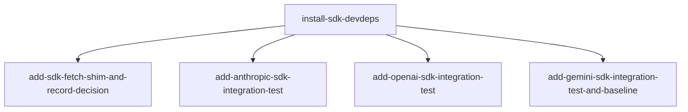

# Horizon 10 — SDK integration verification roadmap

## 🎯 What are we trying to achieve?

Land horizon-8's deferred SDK deliverables (Vercel AI SDK devDependencies + a `createSdkFetchShim()` factory + three `*.sdk.integration.test.ts` files) and end-to-end verify that the horizon-9 undici dual-patch captures real SDK-issued fetch traffic per provider — **without** each test passing a per-file `fetch:` shim option to the SDK. The horizon also captures a post-horizon-10 baseline: test count, default `npm test` wall-clock, and all three gates (tsc, lint, build) green.

This is the answer to the question horizon-9 left open: the dual-patch (`http.ClientRequest.prototype` + `setGlobalDispatcher(WrappingDispatcher)`) was proven against a localhost mock server, but real consumers use the SDK — so the dual-patch must capture SDK-issued fetch traffic too, and the three SDK suites prove it per provider.

## 🧠 Why does this change need to happen?

The horizon-7 raw-HTTPS integration tests proved the interceptor captures direct `https.request()` calls. Real consumers don't call `node:https` directly — they use the Vercel AI SDK (`ai` + `@ai-sdk/{anthropic,openai,google}`). Without SDK-level coverage, the package's documented "works with the three named providers" surface is unverified at the abstraction consumers actually use. The three SDK integration tests close that gap end-to-end.

The SDK fetch shim is shipped as **test-only surface with zero current consumers** — the user explicitly chose option (A) at Step 0, which listed the shim among the deliverables even though the SDK tests rely on the dual-patch alone. The shim is a future escape hatch, not a current capture seam.

This is **not** a feature add for end users (the SDK packages stay in `devDependencies` — consumers of `llm-http-proxy` never need them installed). It's the package's own test surface maturing to match the way its consumers call it.

## At a glance

| | |
|---|---|
| **Phases** | 5 (install SDK devDeps + shim + ratify decision + 3 per-provider SDK tests + baseline capture) |
| **Complexity** | Medium — each SDK suite copies the horizon-7 raw-HTTPS gate verbatim and uses horizon-9's undici dispatcher round-trip; the no-shim invariant is the load-bearing check for the whole horizon |
| **Main risk** | Jest 29.7.0 + Node 22.14.0 + `testEnvironment: 'node'` lazy-loads `globalThis.fetch` through Node's bootstrap path, which may NOT share `globalDispatcher` state with the user-installed `require('undici')` — a silent dual-patch bypass would let the SDK tests pass without proving the capture. Mitigated by `expect(ud.getGlobalDispatcher()).toBe(originalDispatcher)` in `afterEach` per the horizon-9 global-fetch-capture template. |
| **Testing focus** | Each SDK suite asserts `entries.length === 1` (NOT `>= 1`) to surface the dual-patch double-fire regression; JSON.stringify key-leak safety; two sequential `setImmediate` flushes after `await generateText`; gate shape (hasKey via length>0, `if (hasKey) describe(...) else describe.skip(...)`) copied from horizon-7 verbatim. |
| **Domain shape** | technical — extending interception-test machinery; no business rules |

---

## Order of work

```
0. Install Vercel AI SDK devDependencies
       ↓
       ├──→ 1. Add SDK fetch shim + ratify transport decision (parallel with 2/3/4)
       ↓
       ├──→ 2. Add Anthropic SDK integration test (parallel with 1, 3, 4)
       ├──→ 3. Add OpenAI SDK integration test (parallel with 1, 2, 4)
       └──→ 4. Add Gemini SDK integration test + capture baseline (parallel with 1, 2, 3)
```

After Phase 0 finishes, Phases 1, 2, 3, and 4 can run in any order — the SDK tests' no-shim invariant explicitly forbids them from depending on Phase 1's shim output.



---

## Phase 0 — Install Vercel AI SDK devDependencies

**Technical ID:** `install-sdk-devdeps` · bounded context: package-management / devDependency surface · layer: infrastructure · blast radius: small

**Goal:** `packages/llm-http-proxy/package.json` lists `ai`, `@ai-sdk/anthropic`, `@ai-sdk/openai`, and `@ai-sdk/google` in `devDependencies` with `dependencies` and `peerDependencies` unchanged from their pre-phase state (zero-hard-deps invariant); `pnpm-lock.yaml` at the repo root has the four new entries; any regenerated `package-lock.json` stays gitignored.

**Why:** Without installing the SDK, none of the later phases can run — the shim's `satisfies` clause needs the SDK's `FetchFunction` type, and the three SDK integration tests import `@ai-sdk/{anthropic,openai,google}`. Installing as devDependencies only (not regular dependencies or peerDependencies) preserves the zero-hard-deps public surface invariant so consumers of `llm-http-proxy` never need the SDK installed.

**Changes:**
- From `packages/llm-http-proxy/`, run `pnpm add -D ai @ai-sdk/anthropic @ai-sdk/openai @ai-sdk/google` (NOT `npm install`, which would regenerate the stale gitignored `package-lock.json`).
- Verify `package.json` shows the four new entries under `devDependencies`; `dependencies` stays `{}`; `peerDependencies` is unchanged from the pre-phase state (still only the existing OTEL optional peers).
- Verify `pnpm-lock.yaml` at the repo root has new entries for `ai` and the three `@ai-sdk/*` packages.
- Run `npm run typecheck` (`tsc --noEmit`) to confirm the new types resolve cleanly.

**Files / areas:**
- `packages/llm-http-proxy/package.json`
- `pnpm-lock.yaml` (repo root)
- `packages/llm-http-proxy/.gitignore` (verified only — `package-lock.json` line 5 unchanged)

**How to verify:**
- (minScore 7) `devDependencies` lists all four keys (`ai`, `@ai-sdk/anthropic`, `@ai-sdk/openai`, `@ai-sdk/google`); `dependencies` has no entry whose name starts with `@ai-sdk/` or equals `ai`; each entry has a non-empty version string
- (minScore 7) `dependencies` is exactly `{}`; `peerDependencies` has no SDK entry; `git diff packages/llm-http-proxy/package.json` against the pre-phase commit shows additions only under `devDependencies`
- (minScore 7) `pnpm-lock.yaml` at the repo root has the four new entries; `git ls-files packages/llm-http-proxy/package-lock.json` is empty; `.gitignore` line 5 still reads `package-lock.json`
- (minScore 7) `cd packages/llm-http-proxy && npm run typecheck` exits 0; `ls packages/llm-http-proxy/node_modules/@ai-sdk/` shows `anthropic`, `openai`, `google` subdirectories

**Done when:** `package.json` lists the four SDK packages in `devDependencies`, no `dependencies` or `peerDependencies` entries added, `pnpm-lock.yaml` updated at the repo root, `package-lock.json` stays gitignored, `tsc --noEmit` stays green.

**Depends on:** nothing — can start immediately.

**Rollback:** `pnpm remove ai @ai-sdk/anthropic @ai-sdk/openai @ai-sdk/google` and `git checkout pnpm-lock.yaml packages/llm-http-proxy/package.json`. The dependency surface is local to `packages/llm-http-proxy` with no external consumers, so removal is a clean git revert.

---

## Phase 1 — Add SDK fetch shim and ratify transport decision

**Technical ID:** `add-sdk-fetch-shim-and-record-decision` · bounded context: SDK-transport surface (shim) + decisions ledger · layer: cross-cutting · blast radius: medium

**Goal:** `packages/llm-http-proxy/src/sdk-fetch-shim.ts` exports `createSdkFetchShim()` — a factory returning `(input: RequestInfo | URL, init?: RequestInit) => Promise<Response>` typed against the installed `@ai-sdk/*` provider `FetchFunction` types — that translates the SDK Web Request shape into a `node:https.request` call and the `IncomingMessage` response back into a Web `Response`. `docs/roadmaps/llm-http-proxy/decisions.md` has a new `2026-08-30 | horizon 10 |` bullet recording option B (per-call fetch shim on `node:https.request`) as the SDK transport strategy.

**Why:** The shim is the test-time escape hatch the horizon-8 plan deferred; writing it now closes horizon-8's deliverables even though the SDK integration tests in this horizon do NOT pass it to the providers (the horizon-9 dual-patch is the verification surface, not the shim). Ratifying the transport decision in `decisions.md` turns an implicit horizon-8 call into a written, dated constraint so the next horizon does not re-derive it.

**Changes:**
- Create `packages/llm-http-proxy/src/sdk-fetch-shim.ts` exporting `createSdkFetchShim()`. Use top-level `import { request as httpsRequest } from 'node:https'` (no lazy-require needed — the SDK packages are in `devDependencies`, so test runs resolve them).
- Translate the Web Request to `node:https.request`: copy method, headers (lowercased), and body (`string | Buffer | undefined` from `init.body`); collect response body chunks from the `IncomingMessage` and return a Web `Response` with `status`, `statusText`, headers (Headers object), and a `ReadableStream` body built from the buffered chunks.
- Add a file-header comment block asserting the shim is test-only surface, NOT re-exported from `src/index.ts` (zero-hard-deps + no-new-exported-symbols invariant).
- Type the return value with a `satisfies` clause (or explicit cast) against each installed `@ai-sdk/*` provider's `FetchFunction` type so `tsc --noEmit` locks the contract at compile time.
- Append one dated bullet to `decisions.md` per the existing `- YYYY-MM-DD | horizon N | <summary> — because <rationale>` format: `- 2026-08-30 | horizon 10 | SDK transport uses option B (per-call fetch shim on node:https.request, factory createSdkFetchShim) — because horizon-8 named this as the bypass-risk hedge against the SDK lazy-loading its own undici under Jest 29+Node 22, and horizon-9's setGlobalDispatcher dual-patch now makes the shim a test-only escape hatch rather than a per-call capture seam; the SDK tests in horizon-10 rely on the dual-patch surface alone and do not pass the shim to the providers.`
- Run `npm run typecheck && npm run lint && npm run build` — all three must stay green.

**Files / areas:**
- `packages/llm-http-proxy/src/sdk-fetch-shim.ts` (new)
- `docs/roadmaps/llm-http-proxy/decisions.md` (append one dated bullet)

**How to verify:**
- (minScore 7) `sdk-fetch-shim.ts` exists; exports exactly one named export `createSdkFetchShim`; signature is `(input: RequestInfo | URL, init?: RequestInit) => Promise<Response>`; importable as `import { createSdkFetchShim } from './sdk-fetch-shim'`
- (minScore 8) The factory's return type uses a `satisfies ...FetchFunction` clause against at least one installed `@ai-sdk/*` provider; no `: any` / `as any` / `@ts-expect-error` in the file; `npm run typecheck` exits 0 with the new file present
- (minScore 7) Header copy lowercases via `new Headers(...)` or explicit `.toLowerCase()`; `IncomingMessage` body collected via `on('data'` / `on('end'` and wrapped in `new ReadableStream` (not Node Readable); `Response` carries `status` and `statusText`; body branches cover at least `string` and `undefined`
- (minScore 8) `git diff src/index.ts` is empty; `sdk-fetch-shim.ts` opens with a comment containing `test-only` (or equivalent); `grep -R "sdk-fetch-shim" packages/llm-http-proxy/src --include="*.ts"` returns hits only inside test files; no new dependency added to `package.json`
- (minScore 7) `decisions.md` line count is exactly the previous count + 1; new bullet starts with `- 2026-08-30 | horizon 10 |`; mentions both `option B` and `node:https`; includes `— because` clause naming horizon-8 and horizon-9; all 14 pre-existing bullets byte-identical

**Done when:** `src/sdk-fetch-shim.ts` exists and exports `createSdkFetchShim()` typed against the SDK fetch option, NOT re-exported from `src/index.ts`, `tsc --noEmit` and `eslint` pass; `decisions.md` has one new `2026-08-30 | horizon 10 |` bullet recording option B.

**Depends on:** Phase 0 (`install-sdk-devdeps`).

**Rollback:** `git rm packages/llm-http-proxy/src/sdk-fetch-shim.ts` and revert the appended `decisions.md` bullet. No external consumers (test-only surface, not re-exported from the public API).

---

## Phase 2 — Add Anthropic SDK integration test

**Technical ID:** `add-anthropic-sdk-integration-test` · bounded context: SDK integration test set (anthropic provider) · layer: cross-cutting · blast radius: small

**Goal:** `packages/llm-http-proxy/src/anthropic.sdk.integration.test.ts` exists; with `ANTHROPIC_API_KEY` unset, `npm test` skips the suite (zero network egress); with `ANTHROPIC_API_KEY` set, the suite runs one real `generateText` through `@ai-sdk/anthropic`'s `anthropic()` factory (without a per-file `fetch: createSdkFetchShim()` override) and asserts `entries.length === 1` with the dual-patch engaged.

**Why:** This is the first end-to-end verification that horizon-9's dual-patch actually engages when the Anthropic SDK issues its default fetch under Jest 29 + Node 22. Discovery flagged a risk that Node's bootstrap lazy-loader may spawn a fresh bundled undici for `globalThis.fetch` that does not share `globalDispatcher` state with the user-installed `require('undici')` — the assertions in this test surface that risk as a clear test fail (getGlobalDispatcher round-trip mismatches, `entries.length !== 1`) rather than a silently-skipped capture. The dual-patch verification is the bound work for this horizon; the shim from Phase 1 stays unused here on purpose.

**Changes:**
- Copy horizon-7's raw-HTTPS gate shape verbatim: top-level `const apiKey = process.env.ANTHROPIC_API_KEY` + `const envBaseUrl = process.env.ANTHROPIC_BASE_URL` + `const envModel = process.env.ANTHROPIC_MODEL`; `hasKey = apiKey !== undefined && apiKey.length > 0`; gate as `if (hasKey) describe(...) else describe.skip('anthropic SDK suite (skip: ANTHROPIC_API_KEY unset)', placeholderFn)`.
- Import `undici` at top of file via try/require into a typed slot (per horizon-9 `src/global-fetch-capture.integration.test.ts` lines 74-82); capture `originalDispatcher = ud.getGlobalDispatcher()` in `beforeEach`; restore in `afterEach` with `expect(ud.getGlobalDispatcher()).toBe(originalDispatcher)` so a dual-patch leak fails the suite.
- Test body: try { `const interceptor = new Interceptor({ logger: makePushingLogger(entries) }); interceptor.install(); const anthropic = createAnthropic({ /* no fetch: option — the dual-patch alone must capture */ }); const result = await generateText({ model: anthropic(modelId), prompt: 'Reply with the single word: ok' }); await new Promise(r => setImmediate(r)); await new Promise(r => setImmediate(r)); expect(entries.length).toBe(1); expect(entries[0].model).toContain('claude'); expect(entries[0].url).toContain(expectedUrlFragment); expect(entries[0].inputTokens).toBeGreaterThanOrEqual(0); expect(entries[0].outputTokens).toBeGreaterThanOrEqual(0); expect(JSON.stringify(entries[0])).not.toContain(apiKey ?? '__unset__'); } finally { `interceptor.restore();` }
- File-header comment block: state that this suite verifies the horizon-9 dual-patch end-to-end on Anthropic SDK-issued traffic, that the shim from Phase 1 is intentionally NOT passed to the provider, and that the Jest 29+Node 22 lazy-loader bypass risk is the load-bearing check.
- Do NOT pass `fetch: createSdkFetchShim()` to the SDK provider anywhere — this is the no-shim invariant.
- Verify `tsc --noEmit` passes; verify default `npm test` (env unset) skips the suite with zero network egress; verify with `ANTHROPIC_API_KEY` set the suite runs one `generateText` and `entries.length === 1`.

**Files / areas:**
- `packages/llm-http-proxy/src/anthropic.sdk.integration.test.ts` (new)

**How to verify:**
- (minScore 8) `grep -nE "fetch\s*:"` on the file returns no match on the `createAnthropic(...)` line; the options object contains zero `fetch:` keys; `createSdkFetchShim` and `createNodeHttpsFetch` are not imported (or never appear as `fetch:` values)
- (minScore 7) Top-level `const apiKey = process.env.ANTHROPIC_API_KEY`; `hasKey = apiKey !== undefined && apiKey.length > 0`; `if (hasKey) describe(...) else describe.skip('...', placeholderFn)` at the top of the file
- (minScore 7) Top-of-file try/require of undici into a typed slot; `beforeEach` captures `originalDispatcher = ud.getGlobalDispatcher()` BEFORE install; `afterEach` runs `expect(ud.getGlobalDispatcher()).toBe(originalDispatcher)` AFTER `interceptor.restore()`; test body wraps install/generateText/assertions in `try { ... } finally { interceptor.restore(); }`
- (minScore 8) Exactly two `await new Promise(r => setImmediate(r))` calls in sequence, AFTER `await generateText`, BEFORE any entries assertion; `expect(entries.length).toBe(1)` with literal `1` (NOT `toBeGreaterThan`); `entries[0].model` contains `'claude'`; `entries[0].url` contains the Anthropic host fragment; both token counts `>= 0`
- (minScore 7) `expect(JSON.stringify(entries[0])).not.toContain(apiKey ?? '__unset__')` runs inside the hasKey branch; `__unset__` sentinel used only here; apiKey captured before try block
- (minScore 7) The else branch passes a no-op / placeholder function to `describe.skip`; `interceptor.install()` is NOT called inside the skip branch; `npm test` with `ANTHROPIC_API_KEY` unset produces no outbound HTTPS

**Done when:** the file exists, gates + grading pass under `npm run typecheck` / `npm run lint` / `npm test` (suite skipped by default) / `npm run build`, and the suite runs end-to-end when `ANTHROPIC_API_KEY` is set.

**Depends on:** Phase 0 (`install-sdk-devdeps`). [Healed: deliberately NOT depending on Phase 1 — the no-shim invariant forbids importing `createSdkFetchShim` into this file.]

**Rollback:** `git rm packages/llm-http-proxy/src/anthropic.sdk.integration.test.ts`. New file with no consumers outside Jest; no external effect.

---

## Phase 3 — Add OpenAI SDK integration test

**Technical ID:** `add-openai-sdk-integration-test` · bounded context: SDK integration test set (openai provider) · layer: cross-cutting · blast radius: small

**Goal:** `packages/llm-http-proxy/src/openai.sdk.integration.test.ts` exists; with `OPENAI_API_KEY` unset, `npm test` skips the suite; with `OPENAI_API_KEY` set, the suite runs one real `generateText` through `@ai-sdk/openai`'s `openai()` factory (without a per-file shim) and asserts `entries.length === 1` with the dual-patch engaged.

**Why:** Same dual-patch end-to-end verification rationale as the Anthropic suite, scoped to OpenAI's SDK provider. The OpenAI default parser path (`usage.completion_tokens`) is already covered by horizon-7; this suite only needs to assert non-negative token counts and the url/model/url-substring shape.

**Changes:**
- Copy horizon-7's raw-HTTPS gate shape verbatim with `OPENAI_API_KEY` env var: `hasKey = apiKey !== undefined && apiKey.length > 0`; gate as `if (hasKey) describe(...) else describe.skip('openai SDK suite (skip: OPENAI_API_KEY unset)', placeholderFn)`. Read `OPENAI_BASE_URL` and `OPENAI_MODEL` env vars.
- Import `undici` at top via try/require; capture `originalDispatcher = ud.getGlobalDispatcher()` in `beforeEach`; restore in `afterEach` with `expect(ud.getGlobalDispatcher()).toBe(originalDispatcher)` per horizon-9 template.
- Test body: try { `const interceptor = new Interceptor({ logger: makePushingLogger(entries) }); interceptor.install(); const openai = createOpenAI({ /* no fetch: option */ }); const result = await generateText({ model: openai(modelId), prompt: 'Reply with the single word: ok' }); await new Promise(r => setImmediate(r)); await new Promise(r => setImmediate(r)); expect(entries.length).toBe(1); expect(entries[0].model).toContain('gpt'); expect(entries[0].url).toContain(expectedUrlFragment); expect(entries[0].inputTokens).toBeGreaterThanOrEqual(0); expect(entries[0].outputTokens).toBeGreaterThanOrEqual(0); expect(JSON.stringify(entries[0])).not.toContain(apiKey ?? '__unset__'); } finally { `interceptor.restore();` }
- File-header comment block: state the no-shim invariant, the dual-patch end-to-end verification purpose, and the Jest 29+Node 22 lazy-loader risk.
- Do NOT pass `fetch: createSdkFetchShim()` to the SDK provider.
- Verify `tsc --noEmit` passes; verify default `npm test` (env unset) skips the suite with zero network egress; verify with `OPENAI_API_KEY` set the suite runs one `generateText` and `entries.length === 1`.

**Files / areas:**
- `packages/llm-http-proxy/src/openai.sdk.integration.test.ts` (new)

**How to verify:**
- (minScore 8) Top-level `const hasKey = apiKey !== undefined && apiKey.length > 0`; gate as `if (hasKey) describe(...) else describe.skip('openai SDK suite (skip: OPENAI_API_KEY unset)', placeholderFn)` — both branches and the `placeholderFn` argument present; `OPENAI_API_KEY` read once at the top of the file; `npm test` with `OPENAI_API_KEY` unset prints the skip placeholder label and makes zero outbound network calls
- (minScore 10) `grep` for `createSdkFetchShim` returns zero matches; `fetch:` inside the `createOpenAI` options object is absent; a top-of-file comment block explicitly names the no-shim invariant and the dual-patch end-to-end purpose
- (minScore 8) After the two-setImmediate flush: `expect(entries.length).toBe(1)`, `expect(entries[0].model).toContain('gpt')`, `expect(entries[0].url).toContain(expectedUrlFragment)`, both token counts `>= 0`; `OPENAI_BASE_URL` and `OPENAI_MODEL` env vars read for the baseurl/model extension pattern
- (minScore 7) Top-of-file `import * as undici from 'undici'` (or try/require lazy-load pattern) + captured `originalDispatcher` in `beforeEach`; `afterEach` runs `expect(undici.getGlobalDispatcher()).toBe(originalDispatcher)`; `interceptor.install()` runs before the generateText call; `interceptor.restore()` runs in a `finally` block
- (minScore 7) `expect(JSON.stringify(entries[0])).not.toContain(apiKey ?? '__unset__')` inside the hasKey branch; `apiKey` captured in a local const BEFORE entering the try block; running with a fake key produces zero matches in test output
- (minScore 8) Two distinct `await new Promise(r => setImmediate(r))` lines, sequentially, after the generateText await and before any entries assertion; no `setTimeout` substitutes; ten consecutive runs all pass `entries.length === 1`

**Done when:** file exists, gates pass, suite skipped by default, suite runs end-to-end when `OPENAI_API_KEY` is set.

**Depends on:** Phase 0 (`install-sdk-devdeps`). [Healed: deliberately NOT depending on Phase 1 — the no-shim invariant forbids importing `createSdkFetchShim` into this file.]

**Rollback:** `git rm packages/llm-http-proxy/src/openai.sdk.integration.test.ts`. New file with no external consumers; clean deletion.

---

## Phase 4 — Add Gemini SDK integration test and capture baseline

**Technical ID:** `add-gemini-sdk-integration-test-and-baseline` · bounded context: SDK integration test set (gemini provider) + post-horizon baseline capture · layer: cross-cutting · blast radius: small

**Goal:** `packages/llm-http-proxy/src/gemini.sdk.integration.test.ts` exists; with the Gemini API key env var unset, `npm test` skips the suite; with it set, the suite runs one real `generateText` through `@ai-sdk/google`'s `google()` factory (without a per-file shim) and asserts `entries.length === 1` with non-negative token counts. After the file lands, the post-horizon-10 baseline is captured: `npx jest --listTests | wc -l` count, default `npm test` wall-clock (env vars unset, all three SDK suites skip), and all three gates (`tsc`, `lint`, `build`) green.

**Why:** Closes the third SDK provider's dual-patch verification with the non-negative token count assertion shape (the default parser in `src/provider-parser.ts` lines 86-102 only inspects `usage.completion_tokens` and `usage.output_tokens`, never `usageMetadata`'s camelCase fields — the `>= 0` shape matches horizon-7's gemini suite). Folding the baseline capture here keeps the post-horizon-10 numbers anchored to the moment the full SDK test set is in place.

**Changes:**
- Copy horizon-7's raw-HTTPS gate shape verbatim with Gemini fallback: `const apiKey = process.env.GEMINI_API_KEY ?? process.env.GOOGLE_API_KEY`; `hasKey = apiKey !== undefined && apiKey.length > 0`; gate as `if (hasKey) describe(...) else describe.skip('gemini SDK suite (skip: GEMINI_API_KEY unset)', placeholderFn)`. Read `GEMINI_BASE_URL` and `GEMINI_MODEL` env vars.
- Import `undici` at top via try/require; capture `originalDispatcher = ud.getGlobalDispatcher()` in `beforeEach`; restore in `afterEach` with `expect(ud.getGlobalDispatcher()).toBe(originalDispatcher)` per horizon-9 template.
- Test body: try { `const interceptor = new Interceptor({ logger: makePushingLogger(entries) }); interceptor.install(); const google = createGoogle({ /* no fetch: option */ }); const result = await generateText({ model: google(modelId), prompt: 'Reply with the single word: ok' }); await new Promise(r => setImmediate(r)); await new Promise(r => setImmediate(r)); expect(entries.length).toBe(1); expect(entries[0].model).toContain('gemini'); expect(entries[0].url).toContain(expectedUrlFragment); expect(entries[0].inputTokens).toBeGreaterThanOrEqual(0); expect(entries[0].outputTokens).toBeGreaterThanOrEqual(0); expect(JSON.stringify(entries[0])).not.toContain(apiKey ?? '__unset__'); } finally { `interceptor.restore();` }
- File-header comment block: state the no-shim invariant, the dual-patch end-to-end verification purpose, the default parser's `usageMetadata`-not-recognized caveat, and the Jest 29+Node 22 lazy-loader risk.
- Do NOT pass `fetch: createSdkFetchShim()` to the SDK provider.
- After file lands, run `npx jest --listTests | wc -l` — record the post-horizon-10 count (expect pre + 3, i.e. horizon-9 baseline count + 3 new SDK integration test files).
- Run `time npm test` with all API key env vars unset — record wall-clock; must stay within ms-scale skip-overhead of horizon-9 baseline (127 passed / 5 skipped, or 128 / 5 with undici present).
- Run `npm run typecheck && npm run lint && npm run build` — all three must stay green.

**Files / areas:**
- `packages/llm-http-proxy/src/gemini.sdk.integration.test.ts` (new)

**How to verify:**
- (minScore 7) File path matches `*.sdk.integration.test.ts`; `const apiKey = process.env.GEMINI_API_KEY ?? process.env.GOOGLE_API_KEY`; `hasKey = apiKey !== undefined && apiKey.length > 0`; top-level `if (hasKey) describe(...) else describe.skip('...', placeholderFn)`; exactly two consecutive `await new Promise(r => setImmediate(r))` calls between `generateText` and the entries assertion; `new Interceptor({...}).install()` wrapped in `try { ... } finally { interceptor.restore(); }`
- (minScore 9) `grep -nE 'createSdkFetchShim|createNodeHttpsFetch'` returns no lines outside comment blocks; the `createGoogle({...})` options object contains no `fetch:` property; the only interception setup is `new Interceptor({...}).install()` (with try/require undici for `setGlobalDispatcher` round-tripping)
- (minScore 7) `expect(entries.length).toBe(1)` (using `toBe`, not `toBeGreaterThan`); `entries[0].model` contains `'gemini'`; `entries[0].url` contains the expected Gemini URL fragment; both `inputTokens` and `outputTokens` satisfy `toBeGreaterThanOrEqual(0)` (NOT `toBeGreaterThan(0)` — Gemini's `usageMetadata` camelCase is not recognized by the default parser)
- (minScore 8) `expect(JSON.stringify(entries[0])).not.toContain(apiKey)` (using the live env var value, not a constant); runs inside the hasKey branch; executes after `generateText` resolves and before `interceptor.restore()`
- (minScore 7) Post-horizon-10 baseline recorded: `npx jest --listTests | wc -l` count = horizon-9 count + 3; default `npm test` wall-clock with all env vars unset within ms-scale skip-overhead of horizon-9 baseline; `npm run typecheck`, `npm run lint`, `npm run build` each green

**Done when:** the file exists, gates pass, suite skipped by default, suite runs end-to-end when the Gemini API key env var is set, post-horizon-10 baseline recorded (test count = horizon-9 count + 3, default `npm test` wall-clock within ms-scale skip-overhead of horizon-9 baseline, all three gates green).

**Depends on:** Phase 0 (`install-sdk-devdeps`). [Healed: deliberately NOT depending on Phase 1 — the no-shim invariant forbids importing `createSdkFetchShim` into this file.]

**Rollback:** `git rm packages/llm-http-proxy/src/gemini.sdk.integration.test.ts`. New file with no external consumers; baseline numbers are recorded in the status ledger and can be re-captured by re-running the same commands after deletion.

---

## Discovery Findings

| Area | Finding | File path | Implication |
|---|---|---|---|
| package devDependencies + lockfile baseline | SDK not installed anywhere; both `pnpm-lock.yaml` and `package-lock.json` exist; pnpm is the package manager whose lockfile is committed | `packages/llm-http-proxy/package.json` | Phase 0 is a true green-field install with pnpm (NOT `npm install`) |
| horizon-9 dual-patch is committed and intact | `src/interceptor.ts` has `WrappingDispatcher` + `installUndiciDispatcher` + `setGlobalDispatcher(getGlobalDispatcher())` round-trip; comment at top describes dual-surface coverage | `src/interceptor.ts` | The dual-patch is the load-bearing capture surface for SDK-issued fetch traffic in Node 22 |
| horizon-9 integration test template | `global-fetch-capture.integration.test.ts` has the proven dual-patch shape (top-level try/require undici, `originalDispatcher` capture in `beforeEach`, `.toBe(originalDispatcher)` in `afterEach`) | `src/global-fetch-capture.integration.test.ts` | SDK suites copy this template for the round-trip assertion |
| horizon-7 raw-HTTPS gate template | `*.integration.test.ts` share identical gate shape: `hasKey` via length>0, `if (hasKey) describe(...) else describe.skip(...)`, two NESTED `setImmediate` flushes, JSON.stringify no-key safety, try/finally install/restore | `src/anthropic.integration.test.ts` | SDK suites MUST copy this template verbatim |
| jest testRegex picks up `*.sdk.integration.test.ts` | `testRegex: '(/__tests__/.*\|(\\.\|/)(test\|spec))\\.ts$'`; no `testPathIgnorePatterns` | `package.json` | No jest config change needed for SDK tests |
| tsconfig + @types/node@22 covers SDK Request type | `types: ['node', 'jest']`, `@types/node@22` re-exports `undici-types`; SDK packages ship their own types | `tsconfig.json` | No new @types/* package install needed |
| undici-types type signatures match horizon-9 use | `setGlobalDispatcher<D extends Dispatcher>(dispatcher: D): void` and `getGlobalDispatcher(): Dispatcher` | `node_modules/undici-types/global-dispatcher.d.ts` | horizon-10 has no typing work on the dual-patch side |
| zero-hard-deps + no-new-exported-symbols invariant | `src/index.ts` exports fixed public surface (no SDK); SDK packages stay in devDependencies only | `src/index.ts` | The shim must NOT be re-exported from `index.ts`; SDK tests import from internal paths only |
| default parser does NOT recognize Gemini usageMetadata camelCase | Only checks `usage.completion_tokens` and `usage.output_tokens`; never `usageMetadata` camelCase | `src/provider-parser.ts` | Gemini suite uses `>= 0` token assertions (matching horizon-7) |
| decisions.md existing entries — format | 14 dated bullet entries in `- YYYY-MM-DD | horizon N | <summary> — because <rationale>` format | `decisions.md` | horizon-10 entry dated `2026-08-30 | horizon 10 |` |
| horizon-09 status filename mismatch | `horizon-09-undici-dual-patch.status.json` was missing the `-roadmap` infix | `horizons/horizon-09-undici-dual-patch.status.json` | Already renamed at Step 0 housekeeping (now `horizon-09-undici-dual-patch-roadmap.status.json`) |
| lazy-require pattern precedent | `src/otel.ts` lines 29-44 and `src/interceptor.ts` lines 76-87 establish lazy-require pattern for optional peer deps | `src/otel.ts`, `src/interceptor.ts` | The shim is test-only surface and uses top-level `import { request as httpsRequest } from 'node:https'` (no lazy-require needed) |
| withEntries helper + RUN_BENCH opt-in gate | `src/interceptor.test.ts:75-91` defines `withEntries`; `src/benchmark.test.ts:317, 359-366` defines RUN_BENCH gate | `src/interceptor.test.ts`, `src/benchmark.test.ts` | SDK suites should NOT use `withEntries` (unit-test helper); need two NESTED `setImmediate` flushes in the live HTTPS flow |

## Out of Scope

- **Real `npm publish`** — publish bar is consistently deferred across horizons 7, 8, and 9 and the user redirected horizon 10 away from it; `npm publish --dry-run` was proven green in horizon 6.
- **Semver-freeze call / VERSION bump from 0.2.0 to 0.3.0** — publish-side work; horizon-10 changes are test-only surface so the public API stays 0.2.0 with no version bump.
- **ESM dist lazy-require inertness proof under a real ESM consumer** — publish-side work; horizon-6's InMemorySpanExporter demo + horizon-9's lazy-require for undici is the closed form.
- **`prepack` / `prepare` / `prepublishOnly` auto-build scripts** — publish-side work; `package.json` currently has no such scripts.
- **`repository` / `homepage` / `bugs` / `publishConfig` fields** — publish-side metadata.
- **Consumer-facing OTEL README docs** — publish-side work; horizon-6 closed the InMemorySpanExporter round-trip.
- **Additional provider SDK tests beyond anthropic / openai / gemini** — YAGNI gate 1 (not asked for).
- **Streaming-mode / auth-error-path / rate-limit-backoff deepening for SDK calls** — out of scope for a dual-patch verification horizon; each suite runs exactly one `generateText`.
- **Jest `testPathIgnorePatterns` migration** — rejected per horizon-7 fetch-baseline-contract-shift discovery; `testRegex` picks up `*.sdk.integration.test.ts` without config changes.
- **Clean re-run of the horizon-5 p99 latency bar** — SDK integration tests are not the latency bar; horizon-5 p99 FAIL stays closed as a recorded environmental miss.
- **Removing or further restricting the horizon-9 `undici` peer** — would invalidate the dual-patch verification itself.
- **Horizon-09 status.json rename** — already executed at Step 0 housekeeping of this PLAN run.
- **User-mandated inclusion of `createSdkFetchShim` as test-only surface despite zero current consumers** — the shim is shipped per user-mandated option (A); not a YAGNI violation.

## Required Materials

| Name | Kind | Why needed | Acquisition |
|---|---|---|---|
| npm registry access for Vercel AI SDK v5.x packages | api | Phase 0 must install `ai`, `@ai-sdk/anthropic`, `@ai-sdk/openai`, `@ai-sdk/google` into `devDependencies` | `pnpm add -D ...` from `packages/llm-http-proxy`; preserves committed `pnpm-lock.yaml` at the repo root |
| Per-provider API key credentials (`ANTHROPIC_API_KEY`, `OPENAI_API_KEY`, `GEMINI_API_KEY` with `GOOGLE_API_KEY` fallback) | credential | Success criteria (d) and (e) require each SDK suite to be gated on its API key env var | User-supplied via shell export only; empty-string values treated as unset |
| Vercel AI SDK v5 FetchFunction type signature snapshot per provider | knowledge | `createSdkFetchShim()`'s return type must satisfy the per-provider `fetch` option type at `tsc` time | Reachable post-install from `node_modules/@ai-sdk/*/dist/index.d.ts`; the install step is what makes this material exist on disk |
| pnpm binary at the matching lockfile-protocol version | tool | Committed `pnpm-lock.yaml` is the lockfile of record; `package-lock.json` must not be regenerated | `corepack enable && corepack prepare pnpm@<version> --activate` or `npm install -g pnpm`; run `pnpm add -D ...` (lockfile churn within `pnpm-lock.yaml`) |

## Success Criteria

1. **Done and correct iff:** (a) `packages/llm-http-proxy/package.json` lists `ai + @ai-sdk/anthropic + @ai-sdk/openai + @ai-sdk/google` in `devDependencies` with `dependencies` and `peerDependencies` unchanged (zero-hard-deps invariant preserved) and any generated `package-lock.json` is gitignored; (b) `docs/roadmaps/llm-http-proxy/decisions.md` has a new dated entry recording option B (per-call fetch shim built on `node:https.request`) as the chosen SDK transport strategy; (c) `packages/llm-http-proxy/src/sdk-fetch-shim.ts` exists exporting `createSdkFetchShim()` (a factory returning a fetch function typed against the SDK providers' fetch option, translating the SDK Request shape to `node:https.request` and the response body back to a Web Response, not re-exported from `src/index.ts`); (d) three new `*.sdk.integration.test.ts` files exist (one per provider: anthropic, openai, gemini), each gated on its per-provider API key env var using the horizon-7 raw-HTTPS gate shape verbatim (hasKey via length>0 check, if/else describe/describe.skip, two-setImmediate flush, JSON.stringify no-key safety, try/finally install/restore), none passing a per-file `fetch:` shim option to the SDK provider; (e) with each provider's API key env var set, the corresponding SDK suite runs one real `generateText` through the SDK (without per-file fetch override) and asserts `entries.length === 1` with the expected `LlmLogEntry` shape; (f) default `npm test` (no env vars) skips every SDK suite with zero network egress; (g) `npm run typecheck`, `npm run lint`, `npm run build` stay green; (h) post-horizon-10 baseline recorded: `npx jest --listTests | wc -l` count, default `npm test` wall-clock, all gates green.
2. **Install Vercel AI SDK devDependencies:** `packages/llm-http-proxy/package.json` lists `ai + @ai-sdk/anthropic + @ai-sdk/openai + @ai-sdk/google` in `devDependencies` with `dependencies` and `peerDependencies` unchanged; `pnpm-lock.yaml` at the repo root has the four new entries; `tsc --noEmit` stays green; any regenerated `package-lock.json` stays gitignored.
3. **Add SDK fetch shim and ratify transport decision:** `packages/llm-http-proxy/src/sdk-fetch-shim.ts` exists, exports `createSdkFetchShim()` with a return type compatible with the `@ai-sdk/*` provider fetch option, compiles under `tsc --noEmit`, and is NOT re-exported from `src/index.ts`; `docs/roadmaps/llm-http-proxy/decisions.md` has a new `2026-08-30 | horizon 10 |` bullet recording option B.
4. **Add Anthropic SDK integration test:** `packages/llm-http-proxy/src/anthropic.sdk.integration.test.ts` exists; with `ANTHROPIC_API_KEY` unset, `npm test` skips the suite (zero network egress); with `ANTHROPIC_API_KEY` set, the suite runs one real `generateText` and asserts `entries.length === 1` with the dual-patch engaged (no per-file fetch shim passed to the provider); `tsc --noEmit` passes.
5. **Add OpenAI SDK integration test:** `packages/llm-http-proxy/src/openai.sdk.integration.test.ts` exists; with `OPENAI_API_KEY` unset, `npm test` skips the suite; with `OPENAI_API_KEY` set, the suite runs one real `generateText` and asserts `entries.length === 1` with the dual-patch engaged; `tsc --noEmit` passes.
6. **Add Gemini SDK integration test and capture baseline:** `packages/llm-http-proxy/src/gemini.sdk.integration.test.ts` exists; with the Gemini API key env var unset, `npm test` skips the suite; with it set, the suite runs one real `generateText` and asserts `entries.length === 1` with the dual-patch engaged; `tsc --noEmit` passes; post-horizon-10 baseline recorded (test count = horizon-9 count + 3, default `npm test` wall-clock within ms-scale skip-overhead of the horizon-9 baseline, all three gates green).

## Alignment Preview

The user was shown the preview after Stage 3 decomposed phases. The Preview Concerns critique raised 4 concerns:

1. **(over-engineered)** `createSdkFetchShim()` ships with zero consumers in this horizon — the SDK tests explicitly do NOT pass it to the providers. *cheapest fix:* drop the shim and keep only the `decisions.md` bullet, OR keep the shim as a future-horizon handoff.
2. **(phase-count)** Phases 3, 4, 5 are three near-identical "add one SDK test file" phases. *cheapest fix:* collapse into one phase. *(My read: each test file has its own gate and fails independently, so 3 phases is right, not over-counted — but worth flagging.)*
3. **(scope-doubling)** Phase 5 folds baseline capture into the Gemini test phase. *cheapest fix:* strip baseline capture and treat as horizon-closeout housekeeping. *(My read: baseline capture is verification of the new test surface, not a separate deliverable — folding is correct.)*
4. **(acceptance-conflict)** Success criterion (i) — the horizon-09 status.json rename — was already done at Step 0. *Fixed:* removed from `successDefinition`.

The user chose "**Build the full roadmap from this (Recommended)**" at the Stage 3.4 checkpoint — accepting concern 1 (the shim is shipped per user-mandated option A) and noting concerns 2 and 3 are defensible as-is. The Stage 5 critic later independently raised the same valid-dependencies concern about the SDK test phases' non-load-bearing dependsOn edge on the shim phase — the healer removed that edge.

## Quality Gate

**Path taken:** Full (touches the interceptor core, multiple files, SDK integration tests with opt-in live-network gates).

**Iterations run:** 1.

**Issues raised → verified (blockers only, none here) → healed:**
- 1 issue raised by the critic (severity: `major`, dimension: `valid-dependencies`): Phases 2, 3, 4 (the three SDK integration tests) each declared `dependsOn: ['install-sdk-devdeps', 'add-sdk-fetch-shim-and-record-decision']`. The second edge was not load-bearing — the no-shim-invariant rubric dimension in each SDK suite enforces that `createSdkFetchShim` is NOT imported into the test file, and the rationale explicitly states "the shim from Phase 1 stays unused here on purpose". Major issues bypass adversarial verification per the v5 routing rules. **Healer applied** the fix: removed `add-sdk-fetch-shim-and-record-decision` from phases 2/3/4 `dependsOn`, and replaced the `createSdkFetchShim from Phase 1 (test-only surface; intentionally NOT passed to the provider)` input with a `deliberate non-use note` documenting the no-shim invariant. Result: `revision: 1`.

**Accepted debt count:** 0 (none flagged).

**Final verdict:** **PASSED.** No surviving blocker or major issues; the gate's healing loop was triggered once (one major issue healed). All other dimensions (phase-blast-radius, phase-measurable-result, ddd-boundaries, domain-shape-fit, yagni-scope, testable-rubrics, resources-gathered, grounded-in-discovery, success-coverage) passed in iteration 0.

## Full analysis

**Domain shape:** technical (objective is interception/SDK-integration machinery — patching `http.ClientRequest.prototype`, wrapping undici's global dispatcher, translating SDK Request shapes, gate-shaped opt-in integration tests — with no business entities, rules, or workflows a domain expert would recognize; this classification was locked at horizon 1 in `decisions.md` (2026-08-28 | horizon 1 | domain-shape-fit for llm-http-proxy is 'technical') and the horizon-10 objective does not introduce any business-noun surface that would re-open it).

**Ubiquitous language:**

| Term | Meaning |
|---|---|
| dual-patch | The horizon-9 interception surface that wraps BOTH `http.ClientRequest.prototype` (legacy `node:http` + `node:https` path) AND undici's global dispatcher via `setGlobalDispatcher` (`globalThis.fetch` + SDK-routed fetch path), sharing one `emitLogEntry` builder; `restore()` round-trips both surfaces via captured references. |
| fetch shim | A factory function (`createSdkFetchShim` in this horizon) returning a fetch implementation backed by `node:https.request` that translates a Web Request into a `node:https.request` call and the IncomingMessage response back into a Web Response; in horizon-8's design it was the per-file capture seam, in horizon-10 it becomes available as test-only surface but is NOT required by the SDK verification because the dual-patch is sufficient. |
| SDK provider | A per-vendor Vercel AI SDK factory (`anthropic` from `@ai-sdk/anthropic`, `openai` from `@ai-sdk/openai`, `google` from `@ai-sdk/google`) that exposes a fetch option and accepts a model identifier; in horizon-10 it is the unit of capture verification (one `*.sdk.integration.test.ts` per provider) and its default transport is the surface the dual-patch must capture. |
| undici peer | The horizon-9 optional `peerDependency ^6.0.0 \|\| ^7.0.0` with `peerDependenciesMeta.undici.optional = true`; allows the dual-patch's `install()` to lazy-require undici and gracefully degrade when absent, while remaining zero-hard-deps. |
| interceptor | The `packages/llm-http-proxy/src/interceptor.ts` `Interceptor` class with `install()`/`restore()` methods; in horizon-10 each new SDK suite drives the same install/restore try/finally discipline that horizon-7's raw-HTTPS tests use, and the dual-patch is engaged through the same `install()` entry point. |
| dispatcher | The undici `Dispatcher` interface (`DispatchOptions` / `DispatchHandlers`) that the horizon-9 `WrappingDispatcher` structurally types against; `install()` captures `getGlobalDispatcher()` into `this.dispatcherOriginal` and replaces it with a `WrappingDispatcher` that routes `onError`/`onHeaders`/`onData`/`onComplete` through the synthetic `ClientRequest` view. |
| LlmLogEntry | The public shape from `src/options.ts` (`{timestamp, model, inputTokens, outputTokens, callerTrace, url, optional maskedRequestBody/maskedResponseBody}`) that every SDK suite's `entries.length === 1` assertion ultimately reads; the dual-patch's `emitLogEntry` builder is the single producer. |
| integration test | A `*.integration.test.ts` file (or `*.sdk.integration.test.ts`) discovered by Jest's `testRegex`, gated on an env var (per-provider API key for SDK suites, undici presence for the global-fetch suite), running real network traffic against a real provider endpoint or a localhost mock server; in horizon-10 the three new SDK suites join the existing horizon-7 raw-HTTPS + horizon-9 global-fetch integration-test set. |

**Assumptions:**
- The horizon-9 dual-patch path is the load-bearing capture surface for SDK-issued fetch traffic in Node 22 once SDK providers are routed through `globalThis.fetch` via the SDK's own internal default.
- The horizon-7 raw-HTTPS integration test files are the authoritative templates for the gate + flush + assertion shape and are copied verbatim into the new SDK suites.
- The Vercel AI SDK v5 provider factories accept a fetch option that defaults to `globalThis.fetch` (undici-backed in Node 22).
- Empty-string env vars are treated as unset and resolve to `describe.skip`.
- Gemini's `@ai-sdk/google` provider uses header auth (`x-goog-api-key`) by default.
- The package's zero-lockfile convention (`package-lock.json` gitignored at package level) is preserved when the SDK devDependencies install runs.
- The horizon-9 deriveUrl hostHeader-priority fix preserves port-bearing URL capture for both `globalThis.fetch` and SDK-routed fetch traffic.
- The dual-patch's `setGlobalDispatcher` wrapping is global process state; the existing `restore()` round-trip via identity check is sufficient to keep test isolation intact.
- Default `npm test` wall-clock stays within ms-scale skip-overhead of horizon-9's recorded 127 passed / 5 skipped (or 128 passed / 5 skipped with undici present) baseline.
- The SDK deliverable shim name from horizon-8 was `createNodeHttpsFetch()`; horizon-10 uses `createSdkFetchShim()` to match the user's horizon-10 wording while preserving the same transport and SDK-option-typing contract.

**Risks:**
- Dual-patch double emission: both the `http.ClientRequest.prototype` patch AND the undici `setGlobalDispatcher` patch can fire for the same logical request when an SDK call routes through `node:https.request` indirectly (mitigation: SDK tests assert `entries.length === 1`, not `>= 1`).
- SDK test gate-shape parity risk: must copy horizon-7 raw-HTTPS gate shape verbatim; any drift reintroduces horizon-7 gotchas into the SDK surface.
- Jest 29 + Node 22 + `testEnvironment: 'node'` does not intercept `globalThis.fetch` per horizon-9 `jest-29-node-22-fetch-bridge-broken` discovery; SDK tests must rely on the SDK's internal default fetch routing through the same global dispatcher surface, not on `globalThis.fetch` being literally identical.
- Dual-patch install/restore cross-test contamination: three new SDK suites + horizon-7 raw-HTTPS + horizon-9 global-fetch all share global http.ClientRequest.prototype and undici dispatcher state; if any SDK suite forgets `interceptor.restore()` in finally, subsequent tests across the same jest run see a stale wrapper.
- SDK version drift: `@ai-sdk/*` v5.x exposes the fetch option in the documented shape today; a future v6 major could rename or remove it.
- SDK default model name drift: a future SDK release may rename `claude-3-5-haiku-20241022` / `gpt-4o-mini` / `gemini-2.0-flash`, causing model-substring assertions to fail.
- Rate limit / network firewall: live SDK calls against real provider endpoints can fail with 429 / network errors that are not capture bugs.
- The horizon-5 p99 latency-budget FAIL is not addressed by this horizon; adding 3 SDK suites may shift the wall-clock but is not a latency-budget re-run.

**Accepted debt:** 0.